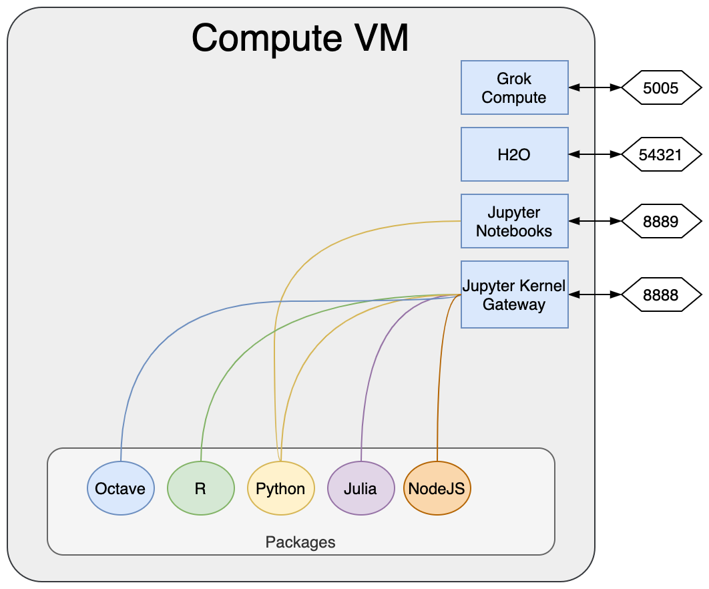

<!-- TITLE: Compute VM -->
<!-- SUBTITLE: -->

# Compute VM

Compute VM is [docker container](https://www.docker.com/) that includes all Grok platform computational services. 
Server is easy scalable using [Amazon ECS](https://aws.amazon.com/ecs/) or [Kubernetes](https://kubernetes.io/) services.

## Services 

| Service                                                             | Version  | Port  |
|---------------------------------------------------------------------|----------|-------|
| [GrokCompute](grok-compute.md)                                      | 0.1.5    | 5005  |
| [OpenCPU](https://www.opencpu.org)                                  | 2.1.4    | 8004  |
| [Jupyter Notebooks](https://jupyter.org)                            | 5.7.2    | 8889  |
| [Jupyter Kernel Gateway](https://github.com/jupyter/kernel_gateway) | 2.1.0    | 8888  |
| [H2O](https://www.h2o.ai/products/h2o/)                             | 3.26.0.5 | 54321 |

## Programming Languages

| Service                                      | Version  |
|----------------------------------------------|----------|
| [Python](https://www.python.org)             | 3.7.4    |
| [R](https://www.r-project.org)               | 3.6.1    |
| [Julia](https://julialang.org)               | 1.1.1    |
| [NodeJS](https://nodejs.org)                 | 10.15.0  |
| [Octave](https://octave.sourceforge.io/)     | 5.2.0    |

## Installation 

* [Compute VM regular deploy](deploy-regular.md#setup-compute-virtual-machine)
* [Compute VM Amazon EC2 deploy](deploy-amazon-ec2.md#setup-compute-virtual-machine)
* [Compute VM Amazon ECS deploy](deploy-amazon-ecs.md#setup-compute-virtual-machine)

## Scalability

Compute VM is easy scalable in horizontal direction. For example: in case of setup in 
[AWS ECS](https://aws.amazon.com/ecs/) cluster [Elastic Load Balancer](https://aws.amazon.com/elasticloadbalancing/) 
can be used ("Application mode" as main option).

At the moment some limitations are exists:
    * "Substructure search" and "Descriptors" API in [GrokCompute](grok-compute.md) should not be used 
      in cache mode.  

See also:

  * [GrokCompute](grok-compute.md)
