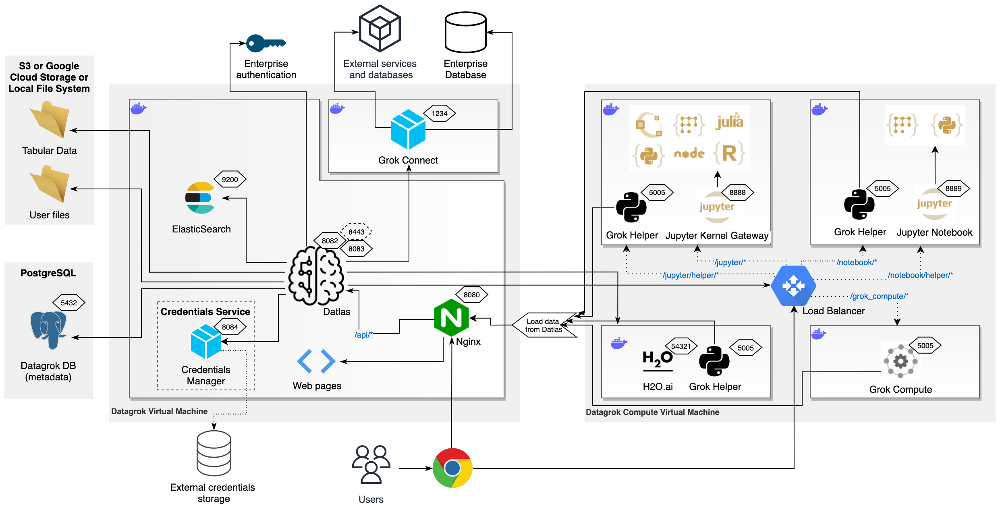

<!-- TITLE: Infrastructure -->
<!-- SUBTITLE: -->

# Infrastructure

Datagrok server installation consists of two big blocks:

* [Datagrok](#datagrok-components)
  * [Web application](#web-application) - Datagrok application client
  * [Datlas](#datlas) - Datagrok application server
  * [Database](#database)
  * [Persistent file storage](#storage)
  * [ElasticSearch](#elasticsearch)
  * [Credentials Management Service](../../govern/security.md#credentials)
  * [Grok Connect](../../access/data-connection.md)
  * [Nginx](https://www.nginx.com/) server
* [Compute](#compute-components)
  * [Load balancer](#load-balancer)
  * [Grok Helper](#grok-helper)
  * [Jupyter Kernel Gateway](#jupyter-kernel-gateway)
  * [Jupyter Notebook](#jupyter-notebook)
  * [H2O](#h2o)
  * [GrokCompute](#grok-compute)

All Docker containers are based on Ubuntu 20.04 and use the latest software available. It can be deployed in any cloud
or on a regular machine.

## Resources

There are different requirements for every application. In general:

* Datagrok components require 2 vCPU and 4 GB RAM.
  * For the active usage of Datagrok we would recommend: 4 vCPU and 8 GB RAM
* Compute components require 4 vCPU and 8 GB RAM.
  * For the active usage of Datagrok we would recommend: 8 vCPU and 32 GB RAM

## Deployment

Datagrok is a web application, which means no deployment efforts per user once the server is set up. All following
administration tasks could be performed via the web interface as well.

Enterprises typically prefer on-premise deployment for multiple reasons, such as security, ability to easily access
internal data, and other features such as integration with the enterprise
[authentication](../../govern/authentication.md) methods. Regarding Datagrok infrastructure it can be easily done. For
more information check [Enterprise Evaluation FAQ](enterprise-evaluation-faq.md)
page.

Datagrok consist of [Docker containers](https://hub.docker.com/u/datagrok) which can be installed on any platform
including but not limited to bare-metal
machine, on-premise virtual machine or virtual machine in cloud provider, for
example [AWS EC2](https://aws.amazon.com/ec2/), on-premise Kubernetes cluster or Kubernetes service in cloud provider,
for example [AWS EKS](https://aws.amazon.com/eks/), and container services in cloud provides, for
example [AWS ECS](https://aws.amazon.com/ecs/).

As [database](#database) Datagrok supports any PostgreSQL database out-of-the-box, including cloud solutions for
PostgreSQL database, for example [AWS RDS](https://aws.amazon.com/rds/). We recommend to use scalable and highly
reliable solutions for database and avoid single database instance setup to prevent datagrok internal information loss
such as created users, created connections, etc. User data won't be affected anyhow on Datagrok database crash.

For [persistent file storage](#storage) Datagrok supports Local File System, Network shares or cloud solutions, for
example [AWS S3](https://aws.amazon.com/s3/) or [Google Cloud Storage](https://cloud.google.com/storage). We recommend
to use scalable and highly reliable solutions for storage and avoid local file system setup to prevent datagrok internal
information loss, such as projects, settings, etc. User data won't be affected anyhow on Datagrok storage loss.

Check [How to deploy datagrok?](deploy.md) for details.

## Scalability

All components are easy scalable using cloud container services, for example [Amazon ECS](https://aws.amazon.com/ecs/),
or [Kubernetes](https://kubernetes.io/) services. Load balancer will take care of dispatching computations. We provide
full support to make application work stable under concurrent user load.

## Datagrok components

This is the heart of the platform and is required for all activities.

Datagrok components are:

* [Web application](#web-application) - Datagrok application client
* [Datlas](#datlas) - Datagrok application server
* [Database](#database)
* [Persistent file storage](#storage)
* [ElasticSearch](#elasticsearch)
* [Credentials Management Service](../../govern/security.md#credentials). Can be installed as a separate service in
  separate container with a separate database.
* [Grok Connect](../../access/data-connection.md). Separate container with Java-based data connectors to 20+ databases.
* Nginx server

### Web Application

Application client integrates our [data engine](#in-memory-database), [viewers](#viewers),
and [server-based capabilities](#datlas).

#### In-memory database

At the heart of the platform is the proprietary, unique technology that lets us efficiently work with massive datasets
in the browser. Essentially, it is a columnar in-memory database engineered from scratch and optimized for exploratory
data analysis, interactive visualizations, and machine learning.

* Efficient in-memory storage
  * Column-based data store
  * High-performance bitsets
  * Versionable tables, columns, and bitsets
  * Adaptive bit storage for ints
  * Out-of-box support for big integers
  * All strings are categories
  * Backed by typed arrays
    * Cache locality
    * SIMD instructions
    * Lightweight cloning (which enables multithreading via isolates)
* Custom binary serialization with compression - fast persistence
  * Adaptive bit storage
  * Automatic pattern recognition
  * RLE, Huffman
  * FCP encoding for floating-point data
  * Designed to be extended with the domain-specific compression algorithms
* Support for user-defined types and extending existing types
  * Parsing
  * Formatting
  * Aggregation
  * Comparison and sorting
  * Persistence
* Built-in intelligent CSV parser
  * Automatically handles delimiters and comments
  * Adaptive reading: makes one speedy pass to find out some features about the file (whether it has quotes,
    multi-lines, etc.) and chooses the strategy accordingly
  * Adjusts strategy for performance/memory as it reads
  * Smart parsing of dates
  * Multithreaded parsing
    * Does not block the main UI thread
    * 10x faster compared to the competition (coming soon)
  * Preview (isolates)
* Flexible sorting
  * Simple API for sorting by simple/multiple columns
  * Default natural sorting for strings (“study2” comes before “study10”)
  * Built-in custom category sorting (ex: Mon, Tue, Wed, Thurs, Fri, Sat, Sun)
  * Ability to pass custom comparison function that will also be used by the rest of the engine (
    sorting, aggregations, grouping, etc.)
* Built-in high-performance descriptive statistics
  * Counts, min, max, sum, avg, med, avg, stdev, q1, q2, q3
  * All stats calculated in one pass where possible
  * Auto-cacheable (client code should not worry about calculating it twice)
* Joins
  * Joined table have metadata that helps to link it back to the source tables easily
* Aggregations
  * Uses the same set of high-perf statistical routines
  * Fluent API:
  * t.groupBy(["race", "sex"]).avg("height").count("subjId").aggregate();
  * Pivoting
  * Supports user-defined aggregations
  * Free-text, SQL-like queries
* Metadata on column and data frame levels (units, quality, auto-formatting, etc.)
* Change notifications
  * A custom eventing mechanism used across the whole platform allows for easy listening to, aggregation, filtering,
    routing, and logging events.

#### Viewers

Just like the in-memory database, our [viewers](../../visualize/viewers.md)
were built from scratch to be able to work with millions of data points at once interactively. All of them make heavy
use of the in-memory database. The ability to use that engine unlocks unique possibilities for viewers, such as easy
data aggregations or passing data to web workers for multithreaded rendering. All viewers access the same data, so no
copies are made, they all share certain statistics and cached calculations, have the same look and feel and usage
patterns, and cooperate on certain tasks.

* Fast, slick, relevant.
* Engineered to take full advantage of DDT
  * Uses DDT’s data frames - super-fast and no additional memory overhead
  * Uses the same cached descriptive statistics, sorted orders, etc
  * Many viewers use lightweight, calculated on-the-fly dataframes as an aggregate data source
  * Picking up column metadata (formats, etc.)
  * Fast, extensible, annotated aggregation functions that work across all viewers
* High-performance rendering
  * Choosing the best option for rendering (HTML / canvas / SVG / WebGL) based on the viewer’s distinctive features,
    without compromising performance. The stretch goal is for all viewers to be able to visualize a billion rows (
    certain viewers will resort to auto-sampling in order to still be interactive during the data exploration stage).
    Many viewers utilize hybrid rendering systems, i.e., SVG for high-level controls and canvas for performance and
    memory consumption reasons
  * Immediate-mode canvas rendering
  * Renders millions of primitives quickly
    * Adaptive marker rendering - switches between drawing directly on the canvas, rendering from the cache, or
      rendering into an array of bytes. This is transparent to viewers’ code.
  * Multithreaded rendering
  * WebGL-accelerated rendering with custom shaders (coming soon)
  * Adaptive rendering behavior - the system keeps track of how long it took each viewer to render and optimizes
    accordingly - for instance, “fast” viewers are rendered first, and “slow” viewers are not re-rendered while a
    slider is being dragged.
* Interactivity and synchronization
  * Current row, mouse-over row, current column, mouse-over column, mouse-over row group
* Viewers as first-class citizens
  * Register, query, instantiate, attach to a data source, add to view, use as a tooltip for row groups, render
    viewers dynamically. Usage example: a full-screen mode that applies to all viewers.
  * Viewer descriptors: name, tooltip, best size/position, type of accepted data
* Properties infrastructure
  * Persistence
  * Consistent names enforced by conventions
  * Discoverability
  * Easy UI bindings (property grid, menu, dialogs)
  * out-of-box automatic validation
  * Minimum overhead (convention over configuration)
  * Automatic, seamless code generation at build time (small code size)
  * Change notification
  * Support for categories
  * Applies to both visual and non-visual objects (such as tables or columns)
  * The same infrastructure is used for editing, property notification, and serialization
  * Minimizing serialized side by comparing to the default value
  * Automatic JSON and binary serialization
* Clean, functional decomposition
  * Clean separation between settings and viewer fields
  * Each viewer consists of three main classes - core, look, and meta. Each of them can be accessed dynamically, which
    allows operating on categories of entities. This dramatically increases code reuse and allows for complex
    customizations to be implemented very easily.
* Share common base, utilize the same tricks, same naming conventions
  * Dense, straight-to-business, and easy-to-understand code
  * Data-aware axes across all viewers (adaptive resolution for time series)
  * One-liners for zooming/selecting (including selection rectangle)
  * Generalized support for viewer extensions (micro-plugins)
* A number of convenience helpers (Rect, Color)
* Harmonized UX across all viewers. Hand-crafted widgets with clean, expressive API
  * Tooltips
  * Notifications
  * Popup menus
  * Main menus
  * In-viewer interactive help system
  * Progress indicators
  * Color pickers
  * Sliders
  * Column selectors (lightweight, searchable, sortable, draggable, extensible, customizable)
* Drag-n-drop
  * Drag files right into the browser (import)
  * Drag columns
    * from anywhere (column manager, grid, column selectors)
    * to anywhere (dialogs, column selectors, viewer settings)
    * very slick and interactive
  * Drag rows (extract rows, etc.)
  * Drag any objects (users, scripts, tables, statistics, viewers, etc.)
* Composable rendering
  * Many controls, such as histogram, are capable of rendering themselves on a canvas that another viewer owns. That
    allows for a lightweight, memory-efficient rendering of complex scenes (ex:
    histograms on a line chart)
* Event bus for common viewer events for decoupling and easier event handling
* Filters
  * Collaborative - each filter has a say in determining whether the row passes the filter
  * Interpretable - a string description of what is filtered in or out
* Easy orchestration - making viewers work together as a team
  * Complementing each other
  * Passing information between viewers (current, mouse-over record)
  * Filter-viewer relationship
* Dialogs
  * Fluent API for easy programmatic construction of dialogs
  * Standard validation across all UI
  * Out-of-box, opt-in persistence
  * Out-of-box, opt-in logging
* Standard (but extensible) editors for data types used across dialogs/grids
* Flex tooltips
  * Row tooltips: Ability to select columns to show on a tooltip (including row viewers)
  * Row group tooltip: Use any viewer as a tooltip (for example, when the mouse is over a particular histogram bin,
    the tooltip contains a scatterplot with values that fall in that bin)
  * Object tooltip (users, etc.)

### Datlas

Grok server (also referred to as “Datlas”) is a Dart stand-alone application that creates REST endpoints that the client
consumes. The same API can also be used by other parties (for instance, by the IT department).

* Implemented in Dart, shares much code with the client
* Exposes REST API
* Extendable via server plugins
* Exposes some services
* Works on either Windows or Linux
* Built-in support for server configuration and deployment schemas
* Secured data transfer system, based on asymmetric keys
* Customizable storage
* Supports SSL

Ports:

* `8082` for default mode
* `8443` for SSL mode
* `8083` for CLI

Resources:

* 4GB RAM
* 2 CPU

#### ORM

To efficiently work with the database, we have built a custom object-relational mapper library (ORM). It takes advantage
of our coding conventions, is fit and tuned for our goals, and lets us do the following:

* Rapidly develop new classes and bind them to database tables
* Use either SQL or API for working with DB entities
* Avoid all boilerplate code for CRUD operations
* Use the same models on both server-side and client-side
* Work with property metadata and use it to optimize queries in runtime
* Free-text filtering (SQL-like language)
* ORM can extract object fields from a database without mapping them to objects

### ElasticSearch

[ElasticSearch](https://www.elastic.co/) provides Datagrok's full-text search. It searches in Wiki, forums, and
datasets.

ElasticSearch is configured with default settings. The Datlas application is the only one that uses it, so ElasticSearch
does not need to be exposed outside the Datagrok docker container.

## Compute components

Compute components forms Compute Virtual Machine (CVM). It is used for performing on-server computations. All components
can work separately and can be installed based on your needs. You might not need it if your use cases do not involve
scripting, training and applying predictive models, and cheminformatics.

Compute Virtual machine components are:

* [Load balancer](#load-balancer) in front of the components to manage the routing and balancing
* [Grok Helper](#grok-helper) in every container
* [Jupyter Kernel Gateway](#jupyter-kernel-gateway)
* [Jupyter Notebook](#jupyter-notebook)
* [H2O](#h2o)
* [GrokCompute](#grok-compute)

All components work in separate docker containers. To scale computations, you might want to spin out multiple instances
of some component, and our load balancer will take care of dispatching computations.

See also:

* [Compute](../../compute/compute.md)

### Load Balancer

A load balancer provides a single entry point to the Compute Virtual Machine services. Also, Load Balancer allows us to
scale containers by the needs of the project. To speed up code execution Compute Virtual Machine uses local cache files.
To avoid loss of the context, Load Balancer uses sticky sessions, which route all of the user's requests to a specific
server for the duration of the session.

Compute Virtual Machine supports any Load Balancer, including AWS Application Load Balancer. To run ComputeVM locally
[cvm_nginx](https://hub.docker.com/r/datagrok/cvm_nginx) docker image can be used.

Load Balancer routes traffic to containers by location

* `/grok_connect/` -> Grok Connect
* `/notebook/` -> Jupyter Notebook
* `/notebook/helper/` -> Jupyter Notebook Grok Helper
* `/jupyter/` -> Jupyter Kernel Gateway
* `/jupyter/helper/` -> Jupyter Kernel Gateway Grok Helper
* `/` - returns 204 No Content

### Grok Helper

Grok Helper is a small Python-based HTTP daemon that provides REST API endpoints for the Datagrok application. It is
located in every container except Grok Compute, which already has the functionality.

Grok Helper exposes API for the following features:

* Jupyter Notebooks converter (HTML, PDF, etc.)
* Utilities
  * Cache entities managing
  * Python environments managing

### Jupyter Kernel Gateway

[Jupyter Kernel Gateway](https://github.com/jupyter/kernel_gateway) provides the scripting feature for the platform. It
includes standard libraries for development.

Available languages are: Python, R, JS, Octave, Julia.

Ports:

* `8889` - Jupyter Kernel Gateway
* `5005` - Grok Helper

Resources(differs based on your needs):

* 4GB RAM
* 4 CPU

See also:

* [Scripting](../../compute/scripting.md)

### Jupyter Notebook

[Jupyter Notebooks](https://jupyter.org) works in the docker container along with other applications. It includes
standard libraries for development. Grok Helper in Jupyter Notebook container converts notebooks to HTML or PDF by
request.

Available languages are: Python. Optional: R, JS, Octave, Julia.

Ports:

* `8888` - Jupyter Notebook
* `5005` - Grok Helper

Resources(differs based on your needs):

* 4GB RAM
* 2 CPU

See also:

* [Jupyter Notebook](../../compute/jupyter-notebook.md)

### H2O

[H2O](https://www.h2o.ai/products/h2o/) is a Java fully open-source application, which supports the most widely used
statistical and machine learning algorithms.

H2O is accessed by Datlas directly, bypassing the load balancer. The ending user can use H2O through the Datagrok
platform.

Ports:

* `54321` - H2O
* `5005` - Grok Helper

Resources (differs based on your needs):

* 2GB RAM
* 2 CPU

See also:

* [Predictive Modeling](../../learn/predictive-modeling.md)

### Grok Compute

GrokCompute is a Python-based server for scientific computations which exposes API for Cheminformatics (RDKit-based) and
Modeling.

At the moment some limitations are exists:

* "Substructure search" and "Descriptors" API in Grok Compute should not be used in cache mode.

See also:

* [Cheminformatics](../../domains/chem/cheminformatics.md)

## Storage

The actual tabular data (which can be uploaded or created via other means) is stored externally, in the highly
optimized [d42 format](#in-memory-database), on file storage chosen by the company. Datagrok supports the following
storages:

* Local File System
* Network shares
* S3
* Google Cloud

Storage location is managed through [Datagrok configuration](configuration.md) and can be easily transferred to other
location.

## Database

Metadata associated with users, datasets, algorithms, predictive models, etc., are kept in a Postgres relational
database. Having the data stored in a relational database brings well-defined relations and data consistency, enables us
to work efficiently with complex queries, and adds transactional support.

Postgres is free and can easily be deployed locally for development. Also, Postgres data protocol is prevalent and is
used in many big data solutions, as well as in cloud databases. If necessary, we can switch to a scalable solution like
Aurora or CocroachDB without changing much code.

Datagrok can use any PostgreSQL instance, including Amazon RDS out-of-the-box. For security reasons, Datagrok supports a
TLS connection to connect to the database.

Database parameters is managed through [Datagrok configuration](configuration.md).

The schema has the following tables:

| Table                      | Comments                                                    |
|----------------------------|-------------------------------------------------------------|
| chats                      | Chats                                                       |
| chats_reads                | Topics read by users                                        |
| chats_watch                | Topics watched by users                                     |
| comment_votes              | Upvoted comments                                            |
| comments                   | Chat comments                                               |
| connections                | Data connections                                            |
| db_queries                 | History of the database queries                             |
| db_ups                     | History of database upgrades                                |
| email_history              | Sent emails                                                 |
| entities                   | System entities (base table)                                |
| entities_chats             | Entity-related chats                                        |
| entities_types             | Descriptions of entity classes                              |
| entities_types_permissions | Sets of permissions specific to entity classes              |
| event_parameter_values     | Parameter values                                            |
| event_parameters           | Event parameters                                            |
| event_types                | Event types                                                 |
| events                     | Events                                                      |
| favorites                  | Entities marked as favorites                                |
| files                      | Files indexed by the platform                               |
| groups                     | User groups                                                 |
| groups_relations           | Nested groups                                               |
| groups_requests            | Requests to join groups                                     |
| jobs                       | Jobs                                                        |
| keys                       | Key for encrypted data connections passwords                |
| meta_params                | Dynamic entity parameters                                   |
| models                     | Predictive models                                           |
| notebooks                  | Jupyter notebooks                                           |
| notebooks_tables           | Notebooks applied to tables                                 |
| notification_preferences   | User notification preferences                               |
| notification_types         | Notification types                                          |
| notifications              | Notifications                                               |
| permissions                | Permissions, that set to objects                            |
| pm_input_columns           | Predictive model inputs                                     |
| pm_output_columns          | Predictive model outputs                                    |
| project_layouts            | View layouts in projects                                    |
| project_relations          | Projects and entities relations                             |
| projects                   | Projects                                                    |
| queries                    | Database queries                                            |
| scripts                    | Scripts                                                     |
| table_columns              | Columns in a table                                          |
| table_queries              | Structured table queries                                    |
| tables                     | Table infos (note that the data resides externally)         |
| tags                       | Entity tags                                                 |
| users                      | Users                                                       |
| users_sessions             | User sessions                                               |
| view_layouts               | View layouts                                                |
| view_layouts_columns       | Columns referenced by layouts (used for layout suggestions) |

## Useful links

* [Deployment](deploy.md)
* [Configuration](configuration.md)
* [Continuous integration](continuous-integration.png)
* [Versioning policy](releases/versioning-policy.md)
* [Try Datagrok locally](docker-compose.md)
