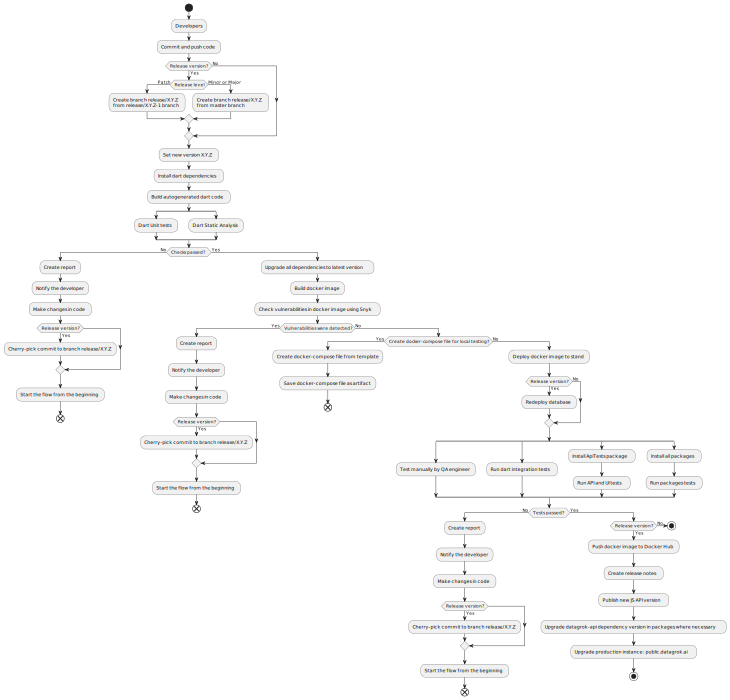
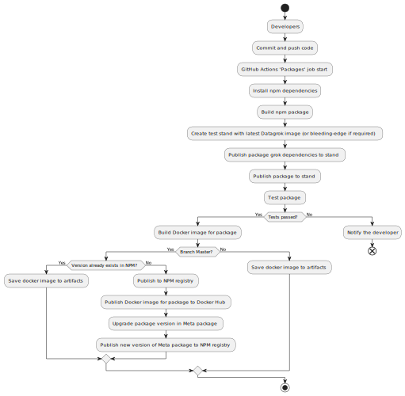
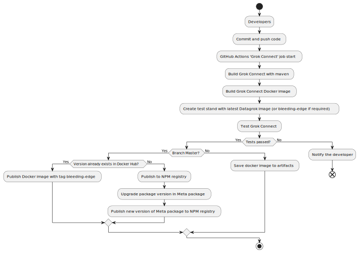

```mdx-code-block
import Tabs from '@theme/Tabs';
import TabItem from '@theme/TabItem';
```

Datagrok application is an incredibly powerful platform. With great power comes great responsibility. Which is why we
created an automated flow to build, scan, test and publish our application. This way we prevent any vulnerable or broken
code to be published.

The generalized CI/CD scheme consists of 4 steps: analyze, build, test, publish. More information can be found below in
specific topics: [release flow](#release-cicd-flow), [public repository flow](#public-repository-cicd-flows).

## Release CI/CD flow



## Public repository CI/CD flows

```mdx-code-block
<Tabs>
<TabItem value="packages" label="Packages" default>
```



```mdx-code-block
</TabItem>
<TabItem value="libraries" label="Libraries">
```


```mdx-code-block
</TabItem>
<TabItem value="grok_connect" label="Grok Connect">
```



```mdx-code-block
</TabItem>
<TabItem value="help" label="Docusaurus Help">
```


```mdx-code-block
</TabItem>
<TabItem value="tools" label="Tools Package">
```


```mdx-code-block
</TabItem>
</Tabs>
```

## More information

* [Versioning policy](versioning-policy.md)
