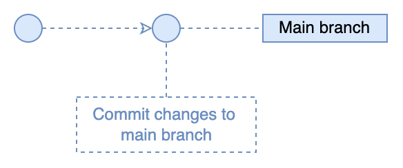
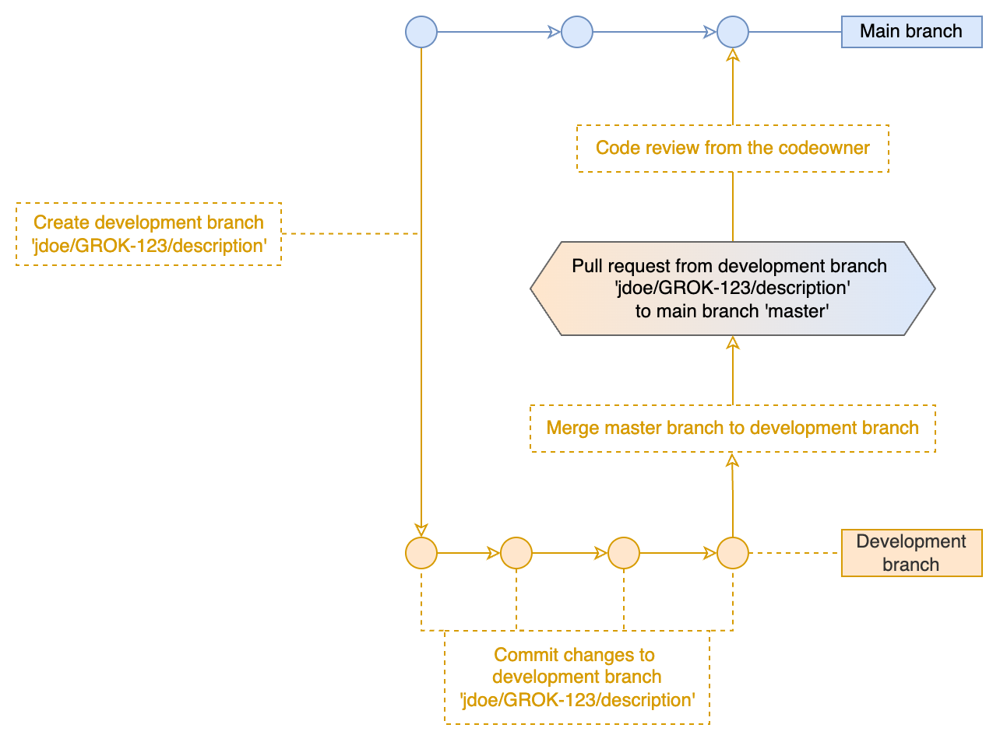
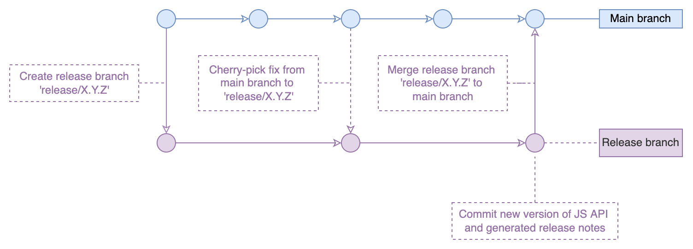

# Proposal

## Versioning policy

For our products, we follow one of the most common versioning strategies : [Semantic Versioning](https://semver.org/).
This convention helps to

1. Understand the severity of changes in each new distribution
2. Avoid ["dependency hell"](https://en.wikipedia.org/wiki/Dependency_hell)

Semantic versioning has a defined structure and rules that dictate how the version changes. It consists of
**MAJOR.MINOR.PATCH**

1. **MAJOR** version increments when you make incompatible changes
2. **MINOR** version increments when you add functionality in a backward compatible manner
3. **PATCH** version increments when you make backward compatible bug fixes

The Semantic versioning scheme is fully documented on the [official website](https://semver.org/); below are our little
cheat sheet to help you understand the basics of versioning for our products.

The keywords "MUST", "MUST NOT", "REQUIRED", "SHALL", "SHALL NOT", "SHOULD", "SHOULD NOT", "RECOMMENDED", "MAY", and
"OPTIONAL" in this document are to be interpreted as described in [RFC 2119](https://www.rfc-editor.org/rfc/rfc2119).

The software in the below instruction can be either package, library, or JS API.

### Versioning rules

1. You SHOULD use the **major** version zero (0.y.z) for initial development. In this case, the software won't be
   released to public repositories, such as NPM. The versions won't be publicly available on the
   Datagrok platform until it is intentionally manually published. At this stage, anything MAY change at
   any time. The software SHOULD NOT be considered stable.
2. You MUST upgrade the software to the **major version first** (1.0.0) as soon as the software is used in
   production. The major version greater than zero indicates that users can rely on the software. The software is
   stable. You MUST follow the versioning policy described in the document after the first **major** version is
   released.
3. If the software (hereinafter dependent) requires a new version of any other datagrok software (hereinafter
   dependency), for example, JS API or datagrok library, you MUST change
   the minimum required version of the dependency. If the dependent depends on the new dependency version that is not
   yet released, you MUST set the dependency version to the value **"bleeding-edge"**. Then you MUST bump the
   dependent version according to
   the [versioning rules](#versioning-rules).
4. Suppose the requirements for the dependent cannot be satisfied yet, or the dependent requires a **"bleeding-edge"**
   version dependency. In that case, the dependent won't be released until a new dependency version is released. Then
   the CI system takes care of the rest.
5. You MUST use the **patch** version increment for backward compatible bug fixes, refactoring, and security updates.
   You MAY use the **patch** version increment for little improvements on performance, little additions to existing
   features, etc.
6. **Minor** version MUST be incremented if new functionality is introduced in the software
7. If you redesigned a feature in the software, you MUST use a **minor** release level
8. If you mark any functionality in the software as deprecated, you MUST release a new **minor** version. You MUST
   announce the deprecation through the available communication channel with other users.
9. You SHOULD avoid breaking compatibility in the software if any _users rely_ on the software functionality,
   including but not limited to a complete change in the software behavior or a breaking change in the software public
   API. If you need to break the behavior of the existing _used_ functionality in the software:
   1. Create a copy of the existing method
   2. Make changes to the new method
   3. Mark the old method as deprecated
   4. Announce that the old method is deprecated and ask other users to use the new one
   5. Release the **minor** version
   6. After every user make compatibility changes in the projects, we can safely remove the old method and release a
     **major** version.
10. You MAY break compatibility in the software if _nobody uses_ the software functionality, including but not limited
    to
    a complete change in the software behavior or a breaking change in the software public
    API. If you need to break the behavior of the existing _unused_ functionality in the software:
    1. Double-check the impact of the change. Check that nobody from the users relies on the functionality you will
       change.
    2. Make changes in the method
    3. Announce that the method changed its behavior in a breaking manner
    4. Release the **minor** version
11. If the new version of the software can not be installed on the old versions of the Datagrok platform because it
    requires a newer version of JS API, you MUST change the minimum required version of JS API and perform **major**
    release for the software
12. If breaking changes were introduced in the software, the **major** version MUST be released.
13. If you removed a feature from the software, which _users used_, you MUST use **major** release level.
14. The **major** release MUST NOT be released more often than every six months. The **major** version upgrades MUST be
    carefully planned and scheduled.
15. If a **major** release of the dependency is required for your software, ask the owner/author of the dependency
    about the upcoming dependency **major** release.
16. If you could not find any examples neither in the [versioning rules](#versioning-rules) nor
    the [official SemVer documentation](https://semver.org/), use your common sense. And do not forget to update the
    dependencies if needed.

## Git Flow

In Datagrok, we think the project's development should be efficient and straightforward. Based on this approach, we
created a Git flow that enables a time-effective development without losing end product quality.
We separated the Git Flow into two types: flow for experienced contributors and flow for general contributors.

### Codeowners flow

The codeowners are a small group of people with good knowledge of the code base, excellent development skills, and
attention to detail.
They have a right to push to the main branch skipping the creation of development branches, pull requests, code review,
and all other steps required for the general development. This way, codeowners can contribute directly to the project
and get the profits of the accelerated development.



However, with great power comes great responsibility. The codeowners are responsible for the code review on pull
requests to the main branch. They are the owners of the code quality of the project.

Productivity tips for the codeowners flow:

1. Configure the commit authorship. Set your name and email address correctly.

   ```shell
   git config user.name "<Name> <Surname>"
   git config user.email "<email@address>"
   ```

2. Write descriptive and meaningful commit messages according to the [commit message rules](#commit-message-rules).
   Changelogs include all commit messages.
3. [Lint](https://github.com/datagrok-ai/public/blob/master/CONTRIB.md#using-a-linter)
   and [test](https://datagrok.ai/help/develop/how-to/test-packages#local-testing)
   your changes
   before pushing. You have great power to make immediate
   changes to the project, and it is crucial to preserve the main branch stable and avoid broken code in the
   repository.
4. Do not mix refactoring with a new feature on one commit.
5. Keep your local main branch up to date by frequently fetching changes from the remote server. It will prevent bugs,
   rework, and the tiresome resolution of conflicts. Start your work from fetching changes.
6. Do not create unnecessary merge loops. To pull changes from the main branch, use `git pull --rebase`.
7. OPTIONAL. Run the following commands to make the work more straightforward with the main branch and rebased pull.
   Beware, it will
   make it more challenging to work with the other branches.

   ```shell
   git config --global pull.rebase true
   git config --global rebase.autoStash true
   ```

   > Warning. After this change, do NOT merge the main branch into the development branches. Use rebase
   > instead: `git rebase origin/master`.
   > Otherwise, every time you pull the changes to the branch, you will get a bunch of duplicated commits and a lot of
   > conflicts that are impossible to resolve.
   > Be extra careful using the rebase, resolve the conflicts wisely and double-check everything. You won't be able to
   > restore the previous state of the branch after the rebase.
   > After the rebase, the force push has to be used: `git push --force`.
8. Push the commit right after the creation. Pushing one commit at a time helps to avoid unexpected GitHub Actions
   behavior

### General flow

The general contributors first push code to the branches and get a code review from the code owner. Then the code owner
merges the changes to the main branch. Pushing straight to the main branch is forbidden for general contributors. They
have to follow the full git-flow, which is quite similar to the
[trunk-based development flow](https://www.atlassian.com/continuous-delivery/continuous-integration/trunk-based-development)
.



Productivity tips for the general flow:

1. Configure the commit authorship. Set your name and email address correctly.

   ```shell
   git config user.name "<Name> <Surname>"
   git config user.email "<email@address>"
   ```

2. Name of branches should be meaningful. Please, use the agreed
   standard: `<first letter of your name><you surname>/<task ID if task exists>/<meaningful short description>`. If
   there is no task for the branch, omit the task id,
   use `<first letter of your name><you surname>/<meaningful short description>`
   format. Task ID should be a full ID from any task tracking system. For example `jdoe/GROK-123/description` for Jira
   issues or `jdoe/#123/description` for GitHub issues.
3. [Lint](https://github.com/datagrok-ai/public/blob/master/CONTRIB.md#using-a-linter)
   and [test](https://datagrok.ai/help/develop/how-to/test-packages#local-testing) your changes
   before pushing.
4. We recommend not mixing refactoring with a new feature on one branch.
5. Keep your local development branch up to date by frequently fetching changes from the remote server and merging them
   to the development branch. It will prevent bugs,
   rework, and the tiresome resolution of conflicts. Start your work from fetching changes.

   ```shell
   git pull
   git merge origin/master
   ```

6. Push the commit right after the creation. Pushing one commit at a time helps to avoid unexpected GitHub Actions
   behavior.
7. Write descriptive and meaningful commit messages according to the [commit message rules](#commit-message-rules).
   Changelogs include all commit messages. If all the commits have descriptive messages, there will be no need
   in rewriting the message during a merge.
8. Merge pull requests from the development branch to the main branch using the 'Squash and merge' option. All changes
   from
   the development branch will be merged into the main branch as one squashed commit. Check and rewrite the commit
   message if needed. The commit message must meet
   our [commit message rules](#commit-message-rules). Changelogs include all commit messages.

### Release flow

The new branch `release/X.Y.Z` is created during the release of the latest version of the platform. The release branch
is
required to create a stable and reliable release of public JS API. After the tests and approvals, the CI/CD tool bumps
the version of JS API and generates the release notes for JS API. These changes are merged from the release
branch to the main branch. All the operations are performed automatically by CI/CD tool.



> Note. For now, there is no need in the release branch for any software other than JS API.
> Release notes for other software are generated during the publishing of software from the main branch to the NPM
> registry.

## Commit message policy

In the repositories, we follow the convention which is very close
to [Conventional Commits specification](https://www.conventionalcommits.org/) and based
on [Angular Commit Message Guidelines](https://github.com/angular/angular/blob/22b96b9/CONTRIBUTING.md#-commit-message-guidelines)
. It provides an easy set of rules for creating an explicit commit history which is easier to follow. Also, we built
automation on top of commit messages which generates release notes based on tickets from task trackers and commit
messages. The most important part of a commit message is that it should be clear, meaningful, and descriptive. Use your
common sense for controversial aspects which are uncovered in the documentation.

The Conventional Commits scheme is fully documented on the [official website](https://www.conventionalcommits.org/);
below are our cheat sheet to help you understand the basics of committing to our products.

The keywords "MUST", "MUST NOT", "REQUIRED", "SHALL", "SHALL NOT", "SHOULD", "SHOULD NOT", "RECOMMENDED", "MAY", and
"OPTIONAL" in this document are to be interpreted as described in [RFC 2119](https://www.rfc-editor.org/rfc/rfc2119).

The software in the below instruction can be either package, library, or JS API.

### Commit message rules

Each commit message MAY consist of a header, a body, and a footer. The commit message MUST be structured as follows:

```
<scope>: <optional type>[<optional ticket ID>]: <subject>

[optional description]

[optional footer(s)]
```

Samples:

```
JS API: Fix[GROK-123]: Update rxjs dependency version

Fix the CVE-0000-99999 vulnerability of old version rxjs in JS API package.json
```

```
Chem: [GROK-123]: New super incredible feature release

UNSAFE CHANGE: deleted the method superCool in chem.ts
```

```
GitHub Actions: CI: Change in the release notes generation flow

Move the generation of released notes to a new mechanism based on conventional commits

BREAKING CHANGE: Remove old proprietary script to bump versions and generate release notes 
```

```
Bio: Docs: Create documentation for package usage

WIP
```

#### Commit header

The header is REQUIRED in the commit message.

```
<scope>: <optional type>[<optional ticket ID>]: <subject>
```

Example:

```
Grok Connect: Fix[GROK-321]: Fix vulnerability in Postgres provider
```

1. The header of the commit SHOULD be 70 chars or less.
2. The header MUST contain the scope of the commit.
3. The header SHOULD contain a complete ticket ID from a task tracker such as Jira or GitHub issues. The change type is
   REQUIRED
   if the ticket ID is not defined. The header MAY contain both type and ticket ID. The type in the commit message takes
   precedence over the ticket type in the task tracker.

##### Scope

The scope is REQUIRED in the commit message.
The scope MUST be the name of the software changed in the commit.
For example:

* JS API
* Bio
* Chem
* Library Bio
* Grok Tools
* Grok Connect
* etc.

##### Type

The type is OPTIONAL in the commit message. It can be omitted in case the ticket ID is defined.
The type MUST be one of the following:

* Fix: A bug or security fix
* Feat: A new feature
* Perf: A code change that improves performance
* Refactor: A code change that neither fixes a bug nor adds a feature, including changes that do not affect the meaning
  of the code (white space, formatting, missing semi-colons, etc.)
* Docs: Documentation only changes
* Test: Adding missing tests or correcting existing tests
* Build: Changes that affect the build system or external dependencies (for example, changes in package-lock.json)
* CI: Changes to our CI configuration files and scripts (example scopes: Jenkins, GitHub Actions)
* Revert: Reverts a previous commit

##### Ticket ID

The type SHOULD be in the commit message. It MAY be omitted in case the ticket does not exist. In this case, the type
is REQUIRED. The ticket ID MUST be a complete id from the task tracker, for example, Jira or GitHub. Jira's issues are
always
preferred.
For example:

* GROK-1234: Jira issue in GROK project
* NEO-1234: Jira issue in NEO project
* #1093: GitHub issue

##### Subject

The subject is REQUIRED in the commit message.
The subject MUST contain a succinct description of the change:

* Use the imperative mood, present tense: "change" not "changed" nor "changes"
* Capitalize the first letter
* no dot (.) at the end

#### Commit body

The body is OPTIONAL in the commit message.

```
<BLANK LINE>
<optional description>
<BLANK LINE>
```

Example:

```

Fix the Uncontrolled Resource Consumption vulnerability in log4j 
dependency for Grok Connect (CVE-2021-44228)

```

1. The body MUST be separated from the header and the footer by blank lines
2. Every line in the body of the commit MUST be 70 chars or less.
3. The body MUST be in the imperative mood and present tense: "change" not "changed" nor "changes".
4. You SHOULD capitalize each body paragraph.
5. The body SHOULD include the motivation for the change: explain what changes you have made and why you made them.
6. The body SHOULD contain the original problem for the fix.

#### Commit footer

The footer is OPTIONAL in the commit message.

```
<BLANK LINE>
<optional footer(s)>
```

Example:

```

Community forum: https://community.datagrok.ai/t/culnerability-fixes/999
```

1. The footer MUST be separated from the header or body by a blank line.
2. Every line in the footer of the commit MUST be 70 chars or less.
3. The footer MAY contain the information about the community forum topic, issue, question, etc., and a link to it
4. We do not recommend it, but you MAY push the code to the repository, which is still in development. In
   this case, you MUST add the `WIP` keyword to the footer.
5. You SHOULD avoid breaking compatibility in the software if any _users rely_ on the software functionality,
   including but not limited to a complete change in the software behavior or a breaking change in the software public
   API. If you need to break the behavior of the existing _used_ functionality in the software, you MUST
   add `BREAKING CHANGE: <description what change breaks>` to the footer.
6. You MAY break compatibility in the software if _nobody uses_ the software functionality, including but not limited
   to a complete change in the software behavior or a breaking change in the software public
   API. If you need to break the behavior of the existing _unused_ functionality in the software, you MUST
   add `UNSAFE CHANGE: <description why the change is unsafe, what change breaks>` to the footer.

### Commit linting

Every commit MUST be checked by [commitlint](https://commitlint.js.org/#/)
on [pre-commit hook](https://typicode.github.io/husky/#/).

#### Installation

```shell
npm install --location=global @commitlint/config-conventional @commitlint/cli husky
husky install
```

### More information

* [A Note About Git Commit Messages](https://tbaggery.com/2008/04/19/a-note-about-git-commit-messages.html)
* [Imperative mood of commit messages](https://365git.tumblr.com/post/3308646748/writing-git-commit-messages)
* [Angular Commit Message Guidelines](https://github.com/angular/angular/blob/22b96b9/CONTRIBUTING.md#-commit-message-guidelines)
* [Conventional Commits Specification](https://www.conventionalcommits.org/en/v1.0.0/#specification)
* [VSCode Conventional Commits plugin](https://marketplace.visualstudio.com/items?itemName=vivaxy.vscode-conventional-commits)
* [IntelliJ-based IDEs Conventional Commits plugin](https://plugins.jetbrains.com/plugin/13389-conventional-commit)
* [Commit Linting](https://commitlint.js.org/#/)
* [Git Hooks](https://git-scm.com/book/en/v2/Customizing-Git-Git-Hooks)
* [Git pre-commit hooks](https://typicode.github.io/husky/#/)

### TBD

* [Create commit message from command line based on inputs](https://commitizen.github.io/cz-cli/)
