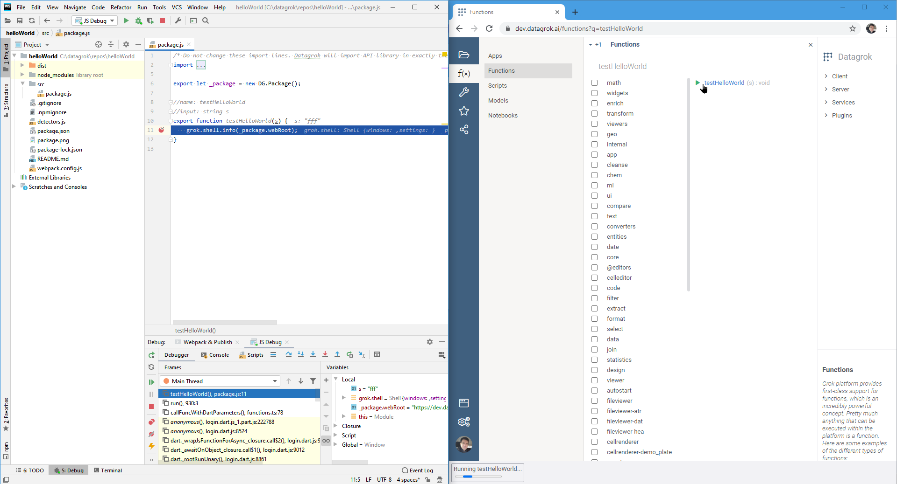

This article will guide you through the process of debugging your Datagrok packages. In most cases, these packages are
TypeScript projects that utilize the `webpack` module bundler. However, if your package is based on a non-standard
template, you may need to configure it differently for debugging.

Here are the main points that we will cover:

* [Recommendations for IDE](#recommendations-for-ides):
  * [Visual Studio Code](#one-click-debugging-with-visual-studio-code)
  * [JetBrains IDEs](#one-click-debugging-with-jetbrains-ides)
* Additional tools:
  * Logger
  * Inspector

## Recommendations for IDEs

While the `Sources` tab in a browser's developer tools provides essential debugging features, more complex tasks often
require a robust IDE. Below you can find instructions for package debugging in popular IDEs such as [Visual Studio
Code](https://code.visualstudio.com) and [JetBrains IDEs](https://www.jetbrains.com/webstorm).

### One-click debugging with Visual Studio Code

To set up a `.vscode` debugging configuration for your package, use `grok create <package-name> --ide=vscode` when
creating a package, or `grok init --ide=vscode` in the directory of an existing package (see [datagrok-tools
docs](https://github.com/datagrok-ai/public/tree/master/tools#datagrok-tools) for details):

```shell
# For new packages
grok create <package-name\> --ide=vscode

# For existing packages
cd <package-name\>
grok init --ide=vscode
```

As a result, there will be a `.vscode` folder with two files in your package folder: `launch.json` and `tasks.json`.
Once you are ready to launch your code, open `Run and Debug` in the sidebar (`Ctrl+Shift+D`) and hit "Run" to start
debugging (`F5` or `Ctrl+F5`). Wait for your application to "compile" (in our case — go through webpack, and potentially
through linters, etc.), then start it in Datagrok and explore your runtime state through breakpoints, variable watches,
call stacks etc.

Below we explain how this debugging works under the hood. As of today, you'd also need to repeat these steps for VS Code
on Linux and macOS, as we don't support automatically created configurations for them yet.

The first file, `launch.json`, has contents similar to the below:

```
{
  "version": "0.2.0",
  "configurations": [
    {
      "preLaunchTask": "rebuild",
      "type": "chrome",
      "request": "launch",
      "name": "Launch Chrome against Dev",
      "url": "https://dev.datagrok.ai/",
      "webRoot": "${workspaceFolder}"
    }
  ]
}
```

It allows VS Code to launch an isolated Chrome session in debugging mode linked to IDE, targeting the desired
web-address from `url`. In case an application is being developed, it may be useful to target the application's URL.

The second file, `tasks.json`, contains the following (for Windows):

```
{
  "version": "2.0.0",
  "tasks": [
    {
      "type": "shell",
      "command": "cmd.exe /c \"webpack && grok publish dev\"",
      "label": "rebuild"
    }
  ]
}
```

This command builds your package with webpack. The webpack step helps track some syntactic errors before they occur in
runtime, and consequently ship the package to your Datagrok server. In this example, a default server would be chosen to
deploy to. The server configurations are pre-created by you with `grok config` eariler and stored
in `%USERPROFILE%/.grok/config.yaml`, where you can modify them, and choose the default configuration. To override the
default configuration, call `grok publish`
with an explicit configuration name: i.e. `grok publish dev`.

After these two files are provided in the working folder, what is left is to set up VS Code internally.

* Open `Run → Install additional debuggers...`, find `Debugger for Chrome` in the appeared list and install it; restart
  VS Code.

* Activate `View → Appearance → Show activity bar`. This will bring the `Run` button into the view. You can also
  use `Ctrl+Shift+D` to run the application.

Make sure the `.vscode` folder is inside the folder you open with VS Code via `File → Open Folder`.

Now open the folder with your package with `File → Open Folder`, add some breakpoint to your code, and hit the `Run`
button. You should see a view with a left-side pane and a green "Run" (play) button on top of it, with the neightbour
dropdown repeating the name of the configuration from `launch.json`. If this is not the case, and you see some other
names or an invitation to create a configuration, it means the pre-made `.vscode` folder isn't recognized by VS Code. In
such case, check that you do `File → Open Folder` on the folder which *contains* the pre-made `.vscode` folder.

First time you hit run, you'll need to enter your Datagrok credentials into the newly appeared Chrome window. After you
have done this, close Chrome, stop debugging from VS Code and start debugging same way again. This time your breakpoints
should work, and you'd see locals and stack traces as usual.

This [video](https://youtu.be/zVVmlRorpjg?list=PLIRnAn2pMh3kvsE5apYXqX0I9bk257_eY&t=871) gives an overview of setting up
the debugging in VS Code.

### One-click debugging with JetBrains IDEs

Below we use WebStorm IDE on Windows as an example, this practice should extrapolate to IntelliJ IDEA, and to other OS.

Open the `Edit Configurations...` dialog in WebStorm:


In this dialog, add a new `Shell Script` configuration by the `+` button:


Fill this configuration with the following:


*Note.* This configuration looks controversial, but this is so only to overcome the known problems in WebStorm. It turns
out both interpreter and script parameters have to be specified. Omitting the script parameter will work if you run
the `Webpack & Publish` configuration standalone, but *won't*
work as part of the other's configuration build step, which we'd need later. As for the trailing `echo`, it is simply
due to the way this build step works in WebStorm:
it concatenates the interpreter line with the script call line, and we use it to suppress the redundant script call
line.

This `Webpack & Publish` configuration shall become a step running a webpack on your package and publishing it to a
configuration of your choice. In the above screenshot we've chosen a `dev`
configuration, declared in your grok config file at `%USERPROFILE%/.grok/config.yaml`:


Use the configuration of your choice in the `Shell Script` configuration instead of `dev`.

Proceed to creating the actual JavaScript debug configuration. Using the same `+` button, add a `JavaScript Debug`
configuration, and fill it with the following:


Basically, you need to add the previously created `Shell Script` configuration as a `Before Launch`
step. After this step is executed on hitting the `Debug` button and displaying the `webpack` log and errors in the
WebStorm tool output window, WebStorm will launch the browser in the debugging mode and let you hit your breakpoints:



*Troubleshooting.* Many users reported inability to employ any kind of JavaScript debugging from the WebStorm IDE after
it initially worked. As of 2021, this is
a [known issue](https://intellij-support.jetbrains.com/hc/en-us/community/posts/360009567459-Webstorm-2020-2-1-Remote-Debugging-do-not-work)
of WebStorm IDEs. To fix it, remove these two files and restart the IDE (replace the IDE version with yours):

* `%USERPROFILE%\AppData\Roaming\JetBrains\WebStorm2020.1\options\web-browsers.xml`
* `%USERPROFILE%\AppData\Roaming\JetBrains\WebStorm2020.1\options\other.xml`

*Note 1.* You may notice there's an option to add a `Run External tool` step, which could serve us
this `Webpack & Publish`
step. Unfortunately, this step won't work due to a [known issue](https://youtrack.jetbrains.com/issue/IDEA-229467)
in WebStorm IDEs. We broke the run step into two steps intentionally to alleviate this problem.

*Note 2.* Since 2017 the JetBrains IDE Support plugin is
[no longer required](https://intellij-support.jetbrains.com/hc/en-us/community/posts/360010507240-where-is-JETBRAINS-IDE-SUPPORT-chrome-extension-it-cant-be-found-anywhere-now-on-the-internet)
to debug JavaScript from JetBrains IDEs. In February 2021 JetBrains has removed this plugin from the Chrome store.

*See also:*

* Debugging JavaScript in WebStorm ([1](https://www.youtube.com/watch?v=Qcqnmle6Wu8),
  [2](https://www.youtube.com/watch?v=YNNDMpoGV0w))
* IntelliJ IJEA JavaScript debugging ([link](https://www.jetbrains.com/help/idea/debugging-javascript-in-chrome.html))

### Debugging through the browser

Open Chrome Developers Console (hit `F12`) and go to `Sources` tab.
