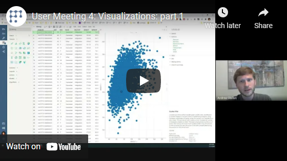

<!-- TITLE: Performance -->
<!-- SUBTITLE: -->

# Performance

The importance of performance cannot be overstated. A modern system should be capable of working with hundreds of
millions of data points, and every bit of performance counts. Memory consumption and latency fall in the same category.

## In-memory database

At the heart of the platform is the proprietary, unique technology that lets us efficiently work with huge datasets in
the browser. Essentially, it is a columnar in-memory database that was engineered from scratch and optimized for the
purpose of exploratory data analysis, interactive visualizations, and machine learning.

* Efficient in-memory storage
    * Column-based data store
    * High-performance bitsets
    * Versionable tables, columns, and bitsets
    * Adaptive bit storage for integers
    * Out-of-box support for big integers
    * All strings are categories
    * Backed by typed arrays
        * Cache locality
        * SIMD instructions
        * Lightweight cloning (which enables multithreading via isolates)
* Custom binary serialization with compression - fast persistence
    * Adaptive bit storage
    * Automatic pattern recognition
    * RLE, Huffman
    * FCP encoding for floating point data
    * Designed to be extended with the domain-specific compression algorithms
* Support for user-defined types and extending existing types
    * Parsing
    * Formatting
    * Aggregation
    * Comparison and sorting
    * Persistence
* Built-in intelligent CSV parser
    * Automatically handles delimiters and comments
    * Adaptive reading: makes one very fast pass to find out some features about the file (whether or not it has quotes,
      multilines, etc.) and chooses the strategy accordingly
    * Adjusts strategy for performance/memory as it reads
    * Smart parsing of dates
    * Multithreaded parsing
        * Does not block main UI thread
        * 10x faster compared to competition (coming soon)
    * Preview (isolates)
* Flexible sorting
    * Simple API for sorting by simple/multiple columns
    * Default natural sorting for strings (“study2” comes before “study10”)
    * Built-in custom category sorting (ex: Mon, Tue, Wed, Thurs, Fri, Sat, Sun)
    * Ability to pass custom comparison function that will also be used by the rest of the engine (
      sorting, aggregations, grouping, etc.)
* Built-in high-performance descriptive statistics
    * Counts, min, max, sum, avg, med, avg, stdev, q1, q2, q3
    * All stats calculated in one pass where possible
    * Auto-cacheable (client code shouldn’t worry about calculating it twice)
* Joins
    * Joined table have metadata that helps to easily link it back to the source tables
* Aggregations
    * Uses the same set of high-perf statistical routines
    * Fluent API:
    * t.groupBy(["race", "sex"]).avg("height").count("subjId").aggregate();
    * Pivoting
    * Supports user-defined aggregations
    * Free-text, SQL-like queries
* Metadata on column and data frame levels (units, quality, auto-formatting, etc.)
* Change notifications
    * A custom eventing mechanism used across the whole platform allows for easy listening to, aggregation, filtering,
      routing, and logging events.

## Viewers

Just like the in-memory database, our [viewers](../../visualize/viewers.md) were built from scratch for the purpose of
being able to interactively work with millions of data points at once. All of them make heavy use of the in-memory
database. The ability to use that engine unlocks unique possibilities for viewers, such as easy data aggregations or
passing data to web workers for multithreaded rendering. All viewers access the same data, so no copies are made, they
all share certain statistics and cached calculations, have the same look and feel and usage patterns, and cooperate in
certain tasks.

* Fast, slick, relevant.
* Engineered to take full advantage of DDT
    * Uses DDT’s data frames - super fast and no additional memory overhead
    * Uses the same cached descriptive statistics, sorted orders, etc.
    * Many viewers use lightweight, calculated on-the-fly dataframes as an aggregate data source
    * Picking up column metadata (formats, etc.)
    * Fast, extensible, annotated aggregation functions that work across all viewers
* High-performance rendering
    * Choosing the best option for rendering (HTML / canvas / svg / WebGL) based on the viewer’s distinctive features,
      without compromising performance. The stretch goal is for all viewers to be able to visualize billion rows (
      certain viewers will resort to auto-sampling in order to still be interactive during the data exploration stage).
      Many viewers utilize hybrid rendering systems, i.e. svg for high-level controls and canvas for performance and
      memory consumption reasons
    * Immediate-mode canvas rendering
    * Renders millions of primitives quickly
        * Adaptive marker rendering - switches between drawing directly on canvas, rendering from cache, or rendering
          into array of bytes. This is transparent to viewers’ code.
    * Multi-threaded rendering
    * WebGL-accelerated rendering with custom shaders (coming soon)
    * Adaptive rendering behavior - the system keeps track of how long it took each viewer to render and optimizes
      accordingly - for instance, “fast” viewers are rendered first, and “slow” viewers are not re-rendered while a
      slider is being dragged.
* Interactivity and synchronization
    * Current row, mouse-over row, current column, mouse-over column, mouse-over row group
* Viewers as first-class citizens
    * Register, query, instantiate, attach to data source, add to view, use as a tooltip for row groups, render viewers
      dynamically. Usage example: full-screen mode that applies to all viewers.
    * Viewer descriptors: name, tooltip, best size/position, type of accepted data
* Properties infrastructure
    * Persistence
    * Consistent names enforced by conventions
    * Discoverability
    * Easy UI bindings (property grid, menu, dialogs)
    * Out-of-box automatic validation
    * Minimum overhead (convention over configuration)
    * Automatic, seamless code generation at build time (small code size)
    * Change notification
    * Support for categories
    * Applies to both visual and non-visual objects (such as tables or columns)
    * Same infrastructure is used for editing, property notification, and serialization
    * Minimizing serialized side by comparing to the default value
    * Automatic JSON and binary serialization
* Clean functional decomposition
    * Clean separation between settings and viewer fields
    * Each viewer consists of three main classes - core, look, and meta. Each of them can be accessed dynamically, which
      allows to operate on categories of entities. This dramatically increases code reuse and allows for complex
      customizations to be implemented very easily.
* Share common base, utilize the same tricks, same naming conventions
    * Dense, straight-to-business, and easy-to-understand code
    * Data-aware axes across all viewers (adaptive resolution for time series)
    * One-liners for zooming/selecting (including selection rectangle)
    * Generalized support for viewer extensions (micro-plugins)
* A number of convenience helpers (Rect, Color)
* Harmonized UX across all viewers. Hand-crafted widgets with clean, expressive API
    * Tooltips
    * Notifications
    * Popup menus
    * Main menus
    * In-viewer interactive help system
    * Progress indicators
    * Color pickers
    * Sliders
    * Column selectors (lightweight, searchable, sortable, draggable, extensible, customizable)
* Drag-and-drop
    * Drag files right into the browser (import)
    * Drag columns
        * from anywhere (column manager, grid, column selectors)
        * to anywhere (dialogs, column selectors, viewer settings)
        * very slick and interactive
    * Drag rows (extract rows, etc.)
    * Drag any objects (users, scripts, tables, statistics, viewers, etc.)
* Composable rendering
    * Many controls, such as histogram, are capable on rendering themselves on a canvas that is owned by another viewer.
      That allows for a lightweight, memory-efficient rendering of complex scenes (
      ex: histograms on line chart)
* Event bus for common viewer events for decoupling and easier event handling
* Filters
    * Collaborative - each filter has a say in determining whether the row passes filter
    * Interpretable - a string description of what is filtered in or out
* Easy orchestration - making viewers work together as a team
    * Complementing each other
    * Passing information between viewers (current, mouse-over record)
    * Filter-viewer relationship
* Dialogs
    * Fluent API for easy programmatic construction of dialogs
    * Standard validation across all UIs
    * Out-of-box, opt-in persistence
    * Out-of-box, opt-in logging
* Standard (but extensible) editors for data types used across dialogs/grids
* Flex tooltips
    * Row tooltips: Ability to select columns to show on a tooltip (including row viewers)
    * Row group tooltip: Use any viewer as a tooltip (for example, when mouse is over a particular histogram bin, the
      tooltip contains a scatter plot with values that fall in that bin)
    * Object tooltip (users, etc.)

### Videos

See also:

* [Exploratory data analysis](../../explore/exploratory-data-analysis.md)
* [Viewers](../../visualize/viewers.md)
