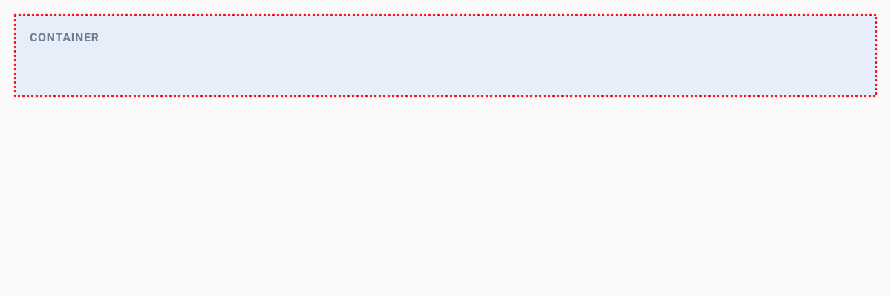
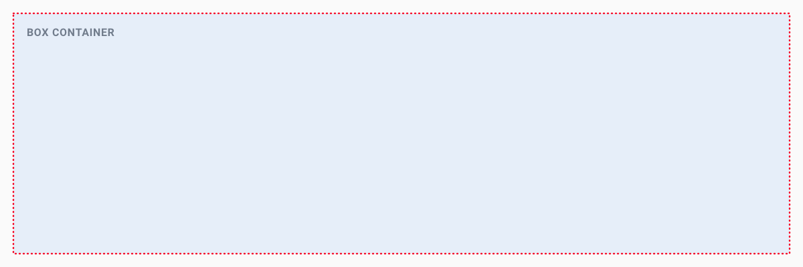
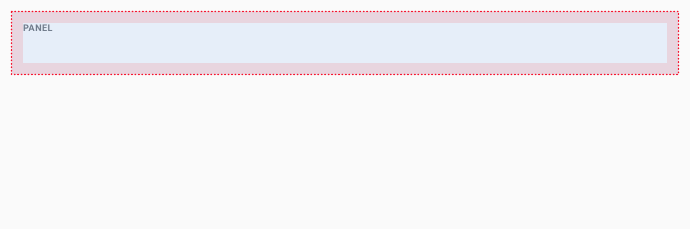
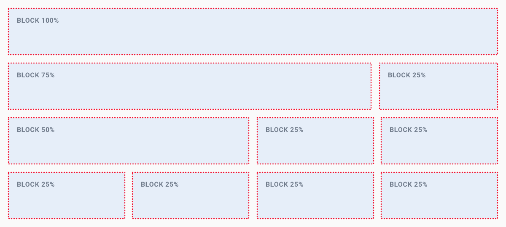
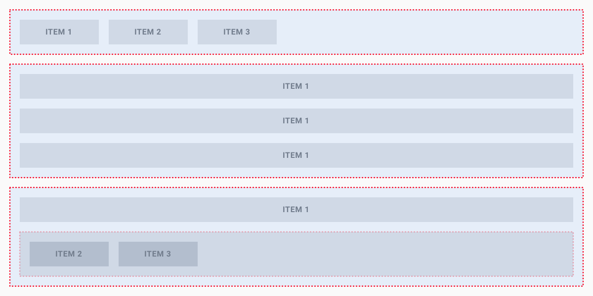
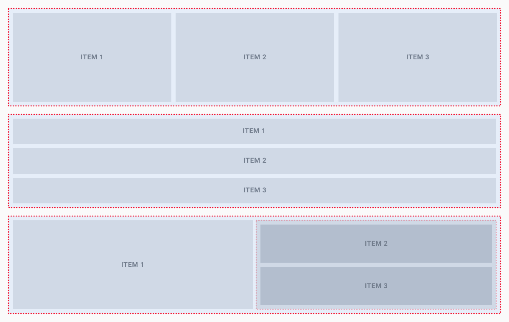

<!-- TITLE: Datagrok UI -->
<!-- SUBTITLE: -->

# Datagrok UI

This article describes the routines for building a user interface in Datagrok.
See [JS API class reference](https://datagrok.ai/js-api/modules/ui) for details.

The UI library provides primitives (buttons, dialogs, accordions, popups, etc), as well as
[input controls](ui.md),
[spreadsheets](ui.md#grid), and viewers such as [scatter plots](../../visualize/viewers/scatter-plot.md).
See [UI class reference](https://datagrok.ai/js-api/modules/ui) for details.

## Live examples

The following code examples are available from the code editor within
Datagrok. [See API Examples](https://public.datagrok.ai/js/samples/ui)

## Design toolkit

Figma Datagrok UIKit available on [Figma Community](https://www.figma.com/@datagrok)

## Table of contents

<details>
<summary>Layouts</summary>

* [Containers](#containers)
* [Boxes](#boxes)
* [Panels](#panels)
* [Blocks](#blocks)
* [Flexbox Gird](#flexbox-grid)
* [Splitters](#splitters)

</details>

<details>
<summary>Views</summary>

* [Table View](#table-view)
* [Simple View](#simple-view)
* [Viewers](#viewers)
  * [Bar Chart](#bar-chart)
  * [Box Plot](#box-plot)
  * [Calendar](#calendar)
  * [Correlation Plot](#correlation-plot)
  * [Density Plot](#density-plot)
  * [Filters](#filters)
  * [Form](#form)
  * [Globe](#globe)
  * [Google Map Viewer](#google-map-viewer)
  * [Grid](#grid)
  * [Heat Map](#heat-map)
  * [Histogram](#histogram)
  * [Line Chart](#line-chart)
  * [Markup Viewer](#markup-viewer)
  * [Matrix Plot](#matrix-plot)
  * [Network Diagram](#network-diagram)
  * [Parallel Coordinates Plot](#parallel-coordinates-plot)
  * [Scatter Plot 3D](#scatter-plot-3d)
  * [Scatter Plot](#scatter-plot)
  * [Shape Map](#shape-map)
  * [Statistics](#statistics)
  * [Tile Viewer](#tile-viewer)
  * [Tree Map](#tree-map)
  * [Word Cloud](#word-cloud)
* [Ribbon](#ribbon)
* [Toolbox](#toolbox)

</details>

<details>
<summary>Dialogs</summary>

* [Dialogs](#dialogs)
  * [Standard Dialog](#standard-dialog)
  * [Modal Dialog](#modal-dialog)
  * [Fullscreen Modal Dialog](#fullscreen-modal-dialog)

</details>

<details>
<summary>Elements</summary>

* [Colors](#colors)
* [Typography](#typography)
  * [Headers](#headers)
  * [Paragraphs](#paragraphs)
  * [Spans](#spans)
  * [Label](#label)
  * [Link](#link)
  * [Inline text](#inline-text)
  * [Text blocks](#text-blocks)
* [Tables](#tables)
* [Lists](#lists)
* [Buttons](#buttons)
* [Forms](#forms)
  * [Inputs](#inputs)
  * [Text area](#text-area)
  * [Dropdown selection](#dropdown-selection)
  * [Selection](#selection)
  * [Group selection](#group-selection)
  * [Switch](#group-selection)
  * [Range slider](#range-slider)
* [Icons](#icons)
* [Image](#image)

</details>

<details>
<summary>Components</summary>

* [Accordions](#accordions)
* [Await (Loading Indicator)](#await-loading-indicator)
* [Drag and drop](#drag-and-drop)
* [Cards](#cards)
* [Combo Popup](#combo-popup)
* [Markdown](#markdown)
* [Property Panel](#property-panel)
* [Sidebar](#sidebar)
* [Tabs](#tabs)
* [Tag Editor](#tag-editor)
* [Taskbar progress](#taskbar-progress)
* [Toasts](#toasts)
* [Tooltips](#tooltips)
* [Tree View](#tree-view)
* [Iframe](#iframe)
* [Info Bars](#info-bars)
* [Update indicator](#update-indicator)

</details>

# Layouts

## Starting point

To start building a layout you need either a [View](#simple-view) (in most cases) or a [Dialog](#dialogs). Every View or
Dialog is a [panel container](#panels).

```javascript
let v = grok.shell.newView('Demo View');
v.append(ui.h1('Hello World'));
let d = ui.dialog('Demo Dialog');
d.add(ui.h1('Hello World'));
d.show();
```

## Containers

This is a simple container. It can contain any elements, such as inputs, images, text, etc. It doesn't have own height.
The container height depends on its children.



```javascript
ui.div([ui.h1('Header'), ui.p('Paragraph text'), 'just text', DG.Viewer.scatterPlot(grok.data.demo.demog())])
```

If you place a container within a [box container](#boxes) , it will inherit the box size and show scroll bars
automatically.

## Boxes

This is a fixed-size container. It doesn't depend on children element sizes, but shrinks them to certain size.



```javascript
let d = ui.div();
for (let i = 0; i < 100; i++)
    d.append(ui.p('More Text'));
var box = ui.box(d);
$(box).css('border', 'solid');
ui.div([ui.h1('Header'), box])
```

## Panels

The panel is a simple container similar to the [Containers](#containers). It has full available wide and its height
depends on its children. Also, panels have 10px paddings for all sides.



 ```javascript
 ui.panel([ui.h1('Header'), ui.p('Paragraph text'), 'just text', DG.Viewer.scatterPlot(grok.data.demo.demog())])
 ```

## Blocks

The block layout is divided into horizontal sections, which take on the full width of the available screen. Their screen
height is determined by their inner content. The width of sections can also be set to the following predefined ratios:

* 1 block: 100%
* 2 blocks:
  * 50% and 50%
  * 75% and 25%
  * 25% and 75%
* 3 blocks:
  * 2 x 25% and 50%
  * 50% and 2 x 25%
* 4 blocks: 4 x 25%

Use the block layout if you want to display section-based content by placing elements next to each other.



 ```javascript
 ui.block([ui.h1('Block 100%')]);

 // 2 blocks next to each other
 ui.block75([ui.h1('Block 75%')]);
 ui.block25([ui.h1('Block 25%')]);

 // 3 blocks next ot each other
 ui.block50([ui.h1('Block 50%')]);
 ui.block25([ui.h1('Block 25%')]);
 ui.block25([ui.h1('Block 25%')]);

 // 4 blocks next ot each other
 ui.block25([ui.h1('Block 25%')]);
 ui.block25([ui.h1('Block 25%')]);
 ui.block25([ui.h1('Block 25%')]);
 ui.block25([ui.h1('Block 25%')]);
 ```

## Flexbox grid

Flexbox grid allow to divide a layout into multiple columns and rows. The Flexbox container take the full available
width, and their height is determined by their inner content. A Flexbox layout has a direction in which child elements
are laid out. The main axis is defined by rows or columns.



 ```javascript
 ui.divH([ui.span('Item 1'), ui.span('Item 2'), ui.span('Item 3')]); // One row
 ui.divV([ui.span('Item 1'), ui.span('Item 2'), ui.span('Item 3')]); // One column
 ui.divV([ui.span('Item'), ui.divH([ui.span('Item 2'), ui.span('Item 3')])]); // Combined row and column
 ```

## Splitters

Splitters - help to build the layout that contains several content areas. Each splitter contains
the [box container](#boxes) which shrinks the content to a certain size.

The splitters can specify by the horizontal or vertical orientation. In order to split vertically and horizontally at
the same time, splitters need to be nested.



 ```javascript
 ui.splitH([ui.h1('Left'), ui.h1('Center'),  ui.h1('Right')])
 ui.splitV([ui.h1('Top'), ui.h1('Middle'), ui.h1('Bottom')])
 ui.splitH([ui.h1('Left'), ui.splitV([
   ui.h1('Right top'),
   ui.h1('Right bottom')
   ])
 ])
 ```

# Views

## Table view

Table view - a view container with a grid table that contains a set of data that is structured in rows and columns. It
allows the user to scroll in both directions and can contain large numbers of items and columns.

```javascript
let table = grok.data.demo.demog();
let view = grok.shell.addTableView(table);
```

## Simple view

Simple view is an empty view container that can contain any kind of elements.

```javascript
let view = grok.shell.newView('Simple View');
```

## Viewers

A viewer is a visual component associated with a table.Viewers belonging to the same view all share the same row
selection and filter. Viewers are saved as part of the project. Also, it is possible to save viewers and views
individually, and reuse them.

### Bar chart

A bar chart presents grouped data as rectangular bars with lengths proportional to the values that they represent.
Unlike histograms which you can apply to display the distribution of numerical data, bar charts are primarily designed
for categorical values.

```javascript
let view = grok.shell.addTableView(grok.data.demo.demog());
view.barChart({
split: 'race',
value: 'age',
valueAggrType: 'avg'
});
```

### Box plot

The box plot (a.k.a. box and whisker diagram) is a standardized way of displaying the distribution of data based on the
five number summary: minimum, first quartile, median, third quartile, and maximum.

```javascript
let view = grok.shell.addTableView(grok.data.demo.demog());
view.boxPlot();
```

### Calendar

Calendar lets you analyze longitudinal data. It needs at least one column of type DateTime.

```javascript
let view = grok.shell.addTableView(grok.data.demo.demog());
view.calendar();
```

### Correlation plot

A quick way to assess correlations between all columns at once. Cells are color-coded by the Pearson correlation
coefficient. Histograms along the diagonal show the corresponding distribution. Hover over the cell to see the
corresponding scatter plot. The grid is sortable. Select columns in the view by selecting corresponding rows.

```javascript
let view = grok.shell.addTableView(grok.data.demo.demog());
view.corrPlot({
  xs: ['age', 'weight', 'height'],
  ys: ['age', 'weight', 'height'],
});
```

### Density plot

Unlike [Scatter plot](#scatter-plot) that visualizes each individual data point, density plot splits 2D area by bins,
and color-codes it depending on the number of points that fall within this bin. The darker the color, the more points it
contains.

```javascript
let view = grok.shell.addTableView(grok.data.demo.demog());
view.densityPlot();
```

### Filters

A set of controls for quick filtering, selection, and visual assessment of column values.

```javascript
let view = grok.shell.addTableView(grok.data.demo.demog());
view.filters();
```

### Form

Form allows you to customize the appearance of the row by manually positioning the fields, and adding other visual
elements, such as pictures or panels. A form can be used either as a stand-alone viewer, or as a row template of
the [Tile viewer](#tile-viewer).

```javascript
let view = grok.shell.addTableView(grok.data.demo.demog());
view.form();
```

### Globe

Visualizes magnitude and color for data on a 3D globe using latitude and longitude.

```javascript
grok.data.getDemoTable('geo/world_pop_1990.csv').then((t) => {
  grok.shell.addTableView(t).addViewer('Globe');
});
```

### Google map viewer

Google Map Viewer overlays latitude/longitude data from the corresponding table on top of the Google Map.

```javascript
let view = grok.shell.addTableView(grok.data.demo.geo());
view.googleMap();
```

### Grid

A grid table contains a set of data that is structured in rows and columns. It allows the user to scroll in both
directions and can handle large numbers of items and columns.

```javascript
let view = grok.shell.addTableView(grok.data.demo.demog());
view.grid.setOptions({
    colHeaderHeight: 80,
});
```

### Heat map

A Heat Map is a graphical representation of table where each cell value is represented as color. It is based on grid, so
all of the grid's features are applicable to the heat map as well.

```javascript
let view = grok.shell.addTableView(grok.data.demo.demog());
view.heatMap();
});
```

### Histogram

A histogram is a graphical representation of the distribution of numerical data.

```javascript
let view = grok.shell.addTableView(grok.data.demo.demog());
view.histogram({
    value: 'age'
});
```

### Line chart

Line chart displays information as a series of data points connected by a line.

```javascript
let view = grok.shell.addTableView(grok.data.demo.demog());
view.lineChart();
```

### Markup viewer

Use this viewer to host any text, arbitrary HTML content, or markdown-formatted text. In most cases, the viewer will
auto-detect content type. Use the "mode" property to explicitly specify it.

```javascript
let table = grok.data.testData('demog', 10000);
let view = grok.shell.addTableView(table);

let markup = `<div style="padding:0px 20px">
<h2>HTML Markup</h2>
Markup Viewer lets you combine HTML markup with the properties that are dynamically evaluated against
the current dataset. This is useful for creating custom dashboards, or telling stories with data. Here are some
examples that illustrate most important concepts:
`;

view.markup({content: markup});
```

### Matrix plot

Use Matrix Plot to assess the relationship among many pairs of columns at the same time.

```javascript
let view = grok.shell.addTableView(grok.data.demo.demog());
view.matrixPlot();
```

### Network diagram

Network diagram is used to visualize graphs, where values of the specified two columns become nodes, and rows become
edges. It is possible to color-code and size-code nodes and columns by choosing the aggregate function that would apply
to the values that represent an edge or a Node.js.

```javascript
let view = grok.shell.addTableView(grok.data.demo.demog());
view.networkDiagram();
```

### Parallel coordinates plot

Parallel coordinates is a common way of visualizing high-dimensional geometry and analyzing multivariate data.

To show a set of points in an n-dimensional space, a backdrop is drawn consisting of n parallel lines, typically
vertical and equally spaced. A point in n-dimensional space is represented as a polyline with vertices on the parallel
axes; the position of the vertex on the i-th axis corresponds to the i-th coordinate of the point.

This visualization is closely related to time series visualization, except that it is applied to data where the axes do
not correspond to points in time, and therefore do not have a natural order. Therefore, different axis arrangements may
be of interest.

```javascript
let view = grok.shell.addTableView(grok.data.demo.demog());
view.pcPlot();
```

### Scatter plot 3D

Use 3D scatter plot to plot data points on three axes to show the relationship between three variables. Each row in the
data table is represented by a marker whose position depends on its values in the columns set on the X, Y, and Z axes.
Additionally, you can color-code and size-code points, as well as display labels next to markers.

```javascript
let view = grok.shell.addTableView(grok.data.demo.demog());
view.scatterPlot3d();
```

### Scatter plot

A scatter plot (also called a scatter graph, scatter chart, scattergram, or scatter diagram) is a type of plot or
mathematical diagram using Cartesian coordinates to display values for typically two variables for a set of data. If the
points are color-coded you can increase the number of displayed variables to three. The data is displayed as a
collection of points, each having the value of one variable determining the position on the horizontal axis and the
value of the other variable determining the position on the vertical axis.

```javascript
let view = grok.shell.addTableView(grok.data.demo.demog());
let plot = view.scatterPlot({
    x: 'height',
    y: 'weight',
    size: 'age',
    color: 'race',
});

plot.setOptions({
    showRegressionLine: true,
    markerType: 'square'
});
```

### Shape map

Shows a map that is applicable for the specified dataset. Typically, it would represent a geographical area (countries,
states, counties, etc), but it also supports arbitrary shapes (such as a store floor plan, brain regions, or EEG
electrodes).

When opened, a viewer automatically determines the best map that is applicable to the current dataset.

```javascript
grok.data.loadTable('https://public.datagrok.ai/demo//earnings-by-state.csv').then((t) => {
  let view = grok.shell.addTableView(t);
  view.shapeMap();
});
```

### Statistics

Provides specified descriptive statistics for the chosen columns.

```javascript
let view = grok.shell.addTableView(grok.data.demo.demog());
view.statistics();
```

### Tile viewer

Visualizes rows as a collection of forms that are positioned as tiles.

```javascript
let view = grok.shell.addTableView(grok.data.demo.demog());
view.tileViewer();
```

### Tree map

Tree maps display hierarchical (tree-structured) data as a set of nested rectangles. Each branch of the tree is given a
rectangle, which is then tiled with smaller rectangles representing sub- branches. A leaf node's rectangle has an area
proportional to a specified dimension of the data.

```javascript
let view = grok.shell.addTableView(grok.data.demo.demog());
view.treeMap();
```

### Word cloud

A word cloud is a graphical representation of word frequency. Any other aggregation function can be used as well for
representing size or color of the particular word. On the example of the demographics dataset, to visualize races by
indicating size as number of subjects, and color as average age.

```javascript
let view = grok.shell.addTableView(grok.data.demo.demog());
view.wordCloud();
```

## Ribbon

Ribbon is a layout container that appears in the header of the view.

The ribbon panel can include text links and buttons, icons, dropdown menus, and Combobox, or any combination of those
elements. Each collection with elements will be divided by a separator and evenly distributed in the container.

 ```javascript
 // Ribbon panel
 let view = DG.View.create();
 view.setRibbonPanels([
  [
  ui.divText('Custom panel')
  ],
  [
    ui.iconFA('search', () => grok.shell.info("clicked")),
    ui.iconFA('plus', () => grok.shell.info("plus"))
  ]
 ]);

 // Ribbon dropdown menu
 view.ribbonMenu = DG.Menu.create()
  .group('Menu')
  .item('element 1');
 ```

## Toolbox

The toolbox is a container that appears in the left side of the view. It mostly used as a placement for UI controls and
can contain any kind of elements such as buttons, fields, icons, links, dropdown menus, accordions, etc.

 ```javascript
 let view = grok.shell.newView('toolbox demo');
 let acc = ui.accordion();
 acc.addPane('header 1', () => ui.divText('Dynamic content'));
 view.toolbox = acc.root;
 ```

# Dialogs

The dialog is a control that informs about the task or contain some necessary information and requires decisions. The
dialog contains the following sections and options:

* Title: Title text appears in the dialog header.
* Content: This area contains the actual content of the dialog.
* Footer with actions: The footer can contain optional buttons and a context menu. If no buttons are defined, the
  default Close button is shown.

There are three types of dialogs:

* standard dialog
* modal dialog
* fullscreen modal dialog

For each dialog, you can set the position by viewport by the X and Y axes.

## Standard dialog

```javascript
// Standard dialog
ui.dialog('Standard dialog')
  .add(ui.span(['Some content...']))
  .onOK(() => {})
  .addContextAction('My Action', () => {})
  .addButton('Optional button')
  .show({x: 300, y: 300});
```

## Modal dialog

```javascript
// Modal dialog
ui.dialog('Modal dialog')
  .add(ui.span(['Some content...']))
  .onOK(() => {})
  .showModal();
```

## Fullscreen modal dialog

```javascript
// Fullscreen modal dialog
ui.dialog('Modal dialog')
  .add(ui.span(['Some content...']))
  .onOK(() => {})
  .showModal(true);
```

# Elements

## Colors

Color palette is a predefined set of colors. The colors are fixed and do not change.

```javascript
let v = grok.shell.newView('palettes');

function getBlock(c) {
  let block = ui.divText(DG.Color.toRgb(c));
  block.style.backgroundColor = DG.Color.toRgb(c);
  block.style.color = DG.Color.toRgb(DG.Color.getContrastColor(c));
  return block;
}

v.appendAll([
  ui.h1('Categorical palette with contrast text color'),
  ui.div(DG.Color.categoricalPalette.map(getBlock)),
  ui.h1('Category colors (looping over the palette)'),
  ui.div(DG.utils.identity(30).map(DG.Color.getCategoricalColor).map(getBlock))
]);
```

## Typography

Typography sets default styles for headings, paragraphs, spans, and divs elements.

### Headers

```javascript
ui.h1('Header 1');
ui.h2('Header 2');
ui.h3('Header 3');
```

### Paragraphs

```javascript
ui.p('Lorem Ipsum is simply dummy text of the printing and typesetting industry. Lorem Ipsum has been the industrys standard dummy text ever since the 1500s, when an unknown printer took a galley of type and scrambled it to make a type specimen book.');
```

### Spans

```javascript
ui.span(['span element']);
```

### Label

A label is the name or title of a control or group of related controls.

```javascript
ui.label('label text');
```

### Link

Link is a clickable text element than can be used for navigation or to trigger an event.

```javascript
ui.link('datagrok','https://datagrok.ai','tooltip message'),
ui.link('Hello',()=>{grok.shell.info('hello')},'tooltip message')
```

### Inline text

```javascript
  ui.inlineText(['Inline ',ui.link('text',()=>{grok.shell.info('')},'click me','')])
```

### Text blocks

```javascript
ui.divText('Lorem Ipsum is simply dummy text of the printing and typesetting industry. Lorem Ipsum has been the industrys standard dummy text ever since the 1500s, when an unknown printer took a galley of type and scrambled it to make a type specimen book.');
```

## Tables

Table - display information in a grid-like format of rows and columns. Table can contain interactive components such as
buttons.

```javascript
// Creates a visual table based on [items] and [renderer]
var myList = [
{key: 'first object', value: ui.button('button')},
{key: 'second object', value: false},
];
let table = DG.HtmlTable.create(myList, (item, idx) => [item.key, item.value]);

// Creates a visual table based on [map]
ui.tableFromMap({
  project: grok.shell.project.toMarkup(),
  time: new Date(),
})
```

## Lists

```javascript
ui.list([
        'element 1',
        grok.shell.user,
        'element 3',
      ])
```

## Buttons

Buttons allow users to trigger an action. There are 2 button types:

* Regular button
* Icon button
* Big button (Use big button for make focus on main or single action)

```javascript
ui.button('Regular button');
ui.button(ui.iconFA('info'));
ui.bigButton('Big button');
```

## Forms

A form is used to present UI controls and allow to enter data in a structured way.

```javascript
ui.inputs([
  ui.stringInput('Name'),
  ui.intInput('Age'),
  ui.buttonsInput([
    ui.bigButton('Apply'),
    ui.button('Cancel')
  ])
]);
```

### Inputs

Input field allows users to enter and edit text or numeric values in one line. There are two types of input fields:

* **Int input** allows to enter or edit numeric value.
* **String input** allows to enter or edit text value.
* **Search input** is a string input with predefined parameters. It has the text "Search" as a placeholder, search-icon
  to the left side and hover-clear-icon to the right side of the input field. Also pressing Esc or the clear-icon
  clears the input.

```javascript
ui.intInput('Age', 30);
ui.stringInput('Name', 'Arthur Dent');
ui.searchInput('');
```

You can also customize string input like this. Parameters in curly braces are optional.

```javascript
// You can just set the string name for the icon:
ui.stringInput('', '', null, {icon: 'filter', clearIcon: true, escClears: true, placeholder: 'Filter models'});

// Or you can set icon with the ui-element:
let myIcon = ui.iconFA('');
ui.stringInput('', '', null, {icon: myIcon, clearIcon: true});
```

### Text area

The text area is an input control that allows the user to enter several lines of text.

```javascript
ui.textInput('Label', 'Text area text data');
```

### Dropdown selection

The select control is used to select an item from a predefined list.

```javascript
ui.choiceInput('Label', 'Value 1', ['Value 1', 'Value 2']);
```

### Selection

The select control let's option to set a binary value (true/false). When the user clicks the selection control, it
toggles between checked and unchecked.

```javascript
ui.boolInput('Name', false);
```

### Group selection

Group selection is commonly used to select one or more option from the predefined list.

```javascript
ui.multiChoiceInput('Group label', ['Value 1', 'Value 2'], ['Value 3', 'Value 4']);
```

### Switch

The toggle switch allows users to set individual features to either active or inactive.

```javascript
ui.switchInput('Active', true);
```

### Range slider

Range slider is a UI control that enables to select a value range within a predefined interval.

```javascript
ui.rangeSlider(0, 10, 2, 5);
```

### Color picker

UI element that lets a user specify a color, either by using a visual color picker interface or by entering the color
into a text field in hexadecimal format.

```javascript
ui.colorInput('Hair color', '#ff0000');
```

## Icons

The icon control displays the icon from the FontAwesome library. Icon can used as a button control. Use FontAwesome
without 'fa' prefix.

```javascript
ui.iconFA('question',()=>{})
```

## Image

Image control is a visual component that integrates images into your app. It could have an external link and a specific
size.

```javascript
ui.image('https://datagrok.ai/help/visualize/viewers-interaction-main.gif',400,200,{target:'https://datagrok.ai/help/visualize/viewers'});
```

# Components

## Accordions

The accordion control is a container for grouping elements into panes. Each pane can collapse or expand and can contain
any UI elements.

```javascript
let acc = ui.accordion();
acc.addPane('Pane label', () => ui.div([
  ui.h1('Header 1'),
  ui.button(' Button'),
  ui.textInput('multi\nline\ntext')])
);
```

## Await (loading indicator)

Await informs the user about an ongoing operation.

```javascript
ui.wait(async () => {
  let root = ui.div();
  return root;
})
```

## Drag and drop

Drag and drop is an option for elements in which the user selects the element by "grabbing" it and dragging it to a
droppable place.

```javascript
let dropElement = ui.stringInput('Drop here...', '');
let dragElement = ui.div('Drag it');
ui.makeDroppable(dropElement.input, {
    acceptDrop: (o) => true,
    doDrop: (o, _) => {
        dropElement.value = o.innerText;
    }
});
ui.makeDraggable(dragElement, {
    getDragObject: () => dragElement,
    getDragCaption: () => 'Caption when dragging'
});
```

## Cards

A card is used to display content composed of different elements whose size or supported actions can vary.

```javascript
ui.card(
  ui.div([
    ui.h1('header'),
    ui.divText('Some text'),
    ui.button('Regular')
  ]))
```

## Combo popup

The combo box control allows users to select an item from a predefined list.

```javascript
ui.div([ui.comboPopupItems('Combo popup label', {
      'Item 1': () => {},
      'Item 2': () => {},
  })]);
```

## Markdown

Markdown is a control that renders Markdown documents into your app.

```javascript
let document = `# Intro
Datagrok unlocks the value of the complex data by empowering non-technical users to: \n
  * [Discover](/help/discover/fair).
  * [Cleanse](/help/transform/data-wrangling).
  * [Visualize](/help/visualize/viewers).
  * [Explore data](/help/#explore).
  * [Build and deploy predictive models](/help/learn/predictive-modeling).
  * [Collaborate with others](/help/collaborate/sharing).
`;

grok.shell.newView('Markdown example',[
  ui.markdown(document)
]);
```

## Popup menu (context menu)

Menus appear upon interaction with a button, action, or other control. They display a list of choices, with one choice
per lin. Menu can also have a multilevel list of choices.

```javascript
let showMenu = () => {
  let showBalloon = (item) => grok.shell.info(item);
  DG.Menu.popup()
      .item("Show info", () => {}))
      .separator()
      .items(["First", "Second"], showBalloon)
      .show();
};
let text = ui.divText("Clickable element");
text.addEventListener("click", showMenu);
```

## Property panel

Property panel is the right sidebar panel that used for showing the active item properties.

```javascript
grok.shell.o = ui.h1('Property panel');
```

## Sidebar

Sidebar control is a left side container that can contain items with toolbox pane.

```javascript
grok.shell.sidebar.addPane('FIRST', () => ui.divText('A panel'), ui.iconFA('smile'));
```

## Tabs

Tab control organize and allow navigation between a different content area or view.

```javascript
ui.tabControl({
      'First Tab': ui.panel('First panel'),
      'Second Tab': () => ui.panel('Second panel')
  })
```

## Tag editor

Tag editor is control that are small tag items that mainly serve to visualize selected items. Tags can be added,
removed.

```javascript
let editor = DG.TagEditor.create();
editor.addTag('demo');
editor.addTag('test');
editor.addTag(1234);
```

## Taskbar progress

Taskbar informs the user about loading progress at the bottom bar.

```javascript
let pi = DG.TaskBarProgressIndicator.create('Progress...');
setTimeout(() => {
  pi.close();
}, 3000);
```

## Toasts

A message toast is a small popup for success or error messages that disappears automatically after a few seconds. There
are two types of message toast:

* Success message
* Error message

```javascript
grok.shell.info('Success message');
grok.shell.warning('Warning message');
grok.shell.error('Error message');
```

## Top menu (ribbon menu)

```javascript
let view = grok.shell.newView('Demo View');
view.ribbonMenu = DG.Menu.create()
  .group('Menu label')
  .item('Item label', () => {});
```

## Tooltips

Tooltip control display informative text when user hover over an element.

```javascript
ui.tooltip.bind(ui.label('Label'), 'Tooltip message');
```

## Tree view

A tree view control presents a hierarchical view of information. Each item can have a number of subitems. One of the
main use case is to display the hierarchically structured and to selecting one or more items out of a set of
hierarchically structured items.

```javascript
let tree = ui.tree();

let group1 = tree.group('group 1', 1);
group1.enableCheckBox(true);
group1.item('item 1.1');
group1.item('item 1.2');

let subGroup1 = group1.group('group 1.1', 1.1, false);
subGroup1.item('item 1.1.1');
subGroup1.item('item 1.1.2');

let group2 = tree.group('group 2', 2);
group2.enableCheckBox();
group2.item('item 2.1');
group2.item('item 2.2').enableCheckBox();

let groups = [group1, subGroup1, group2];
let items = group1.items.slice()
  .concat(subGroup1.items)
  .concat(group2.items);
```

## Iframe

Iframe a nested browsing context embedding another HTML page into the current one.

```javascript
ui.iframe( { src: 'https://en.m.wikipedia.org/wiki', width: '400', height: '200' });
```

## Info bars

Info bar allows adding assisting information to views, typically at their top area.

```javascript
grok.shell.newView('View', [
  ui.info('Info text', 'Optional header', false)
]);
```

## Update indicator

Update indicator allow to show the updating state for each UI or View.

```javascript
let view = grok.shell.newView('Update indicator demo');
ui.setUpdateIndicator(view.root, true);
```
