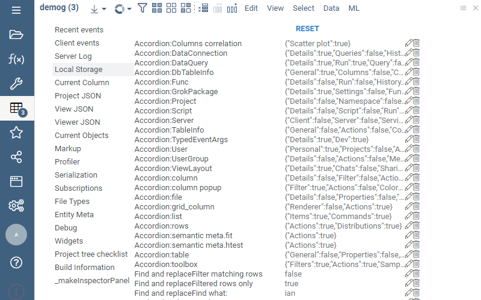
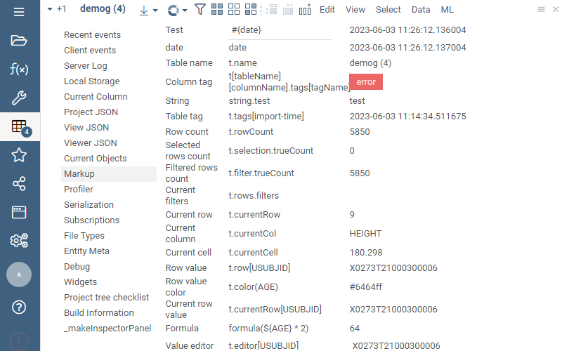
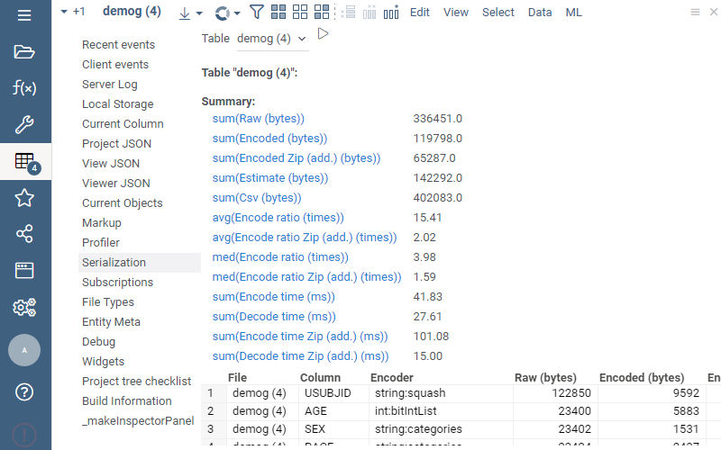
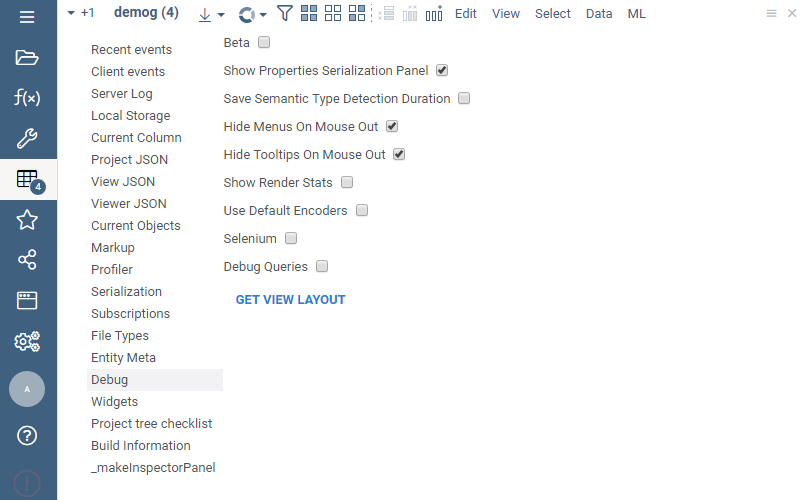
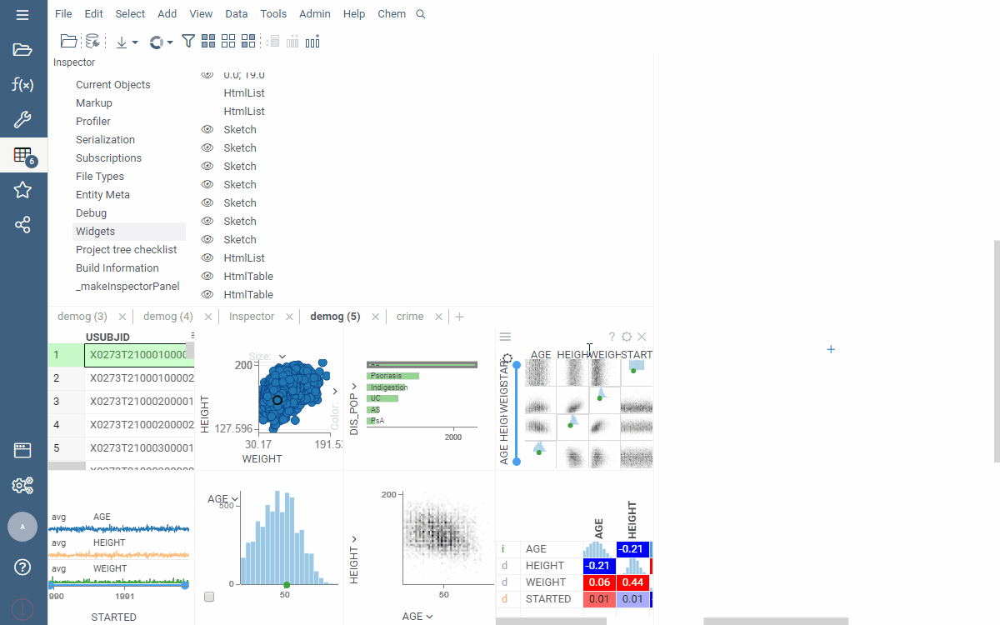

Inspector is a tool for developers that lets you see and interact with the platform internals. 

To activate, press **Alt+I**. It consists of the following panels:

# Recent events

Useful to understand the flow of events. Shows the total count of events by category, 
and highlights most recent events.

# Client events

Shows individual events in the order as they come. Click on the event to see its 
details in the context panel. See how to handle such event in JavaScript in the
"Dev" panel.

# Local storage

See and edit the data stored in the local storage. The same information is also available
in the Chrome Dev Tools.

# Current column

Shows internal data for the current column.

# Project JSON

JSON-serialized project (views, viewers, additional information).

# View JSON

JSON representation of the current view (layout + viewers).

# Viewer JSON

JSON representation of the current viewer (viewer type, properties)

# Markup

Different kind of data bindings supported in the [Markup Viewer](../../../visualize/viewers/markup.md),
evaluated against the current table.

# Serialization

Detailed information on how the table is serialized in the binary format, including compression
ratios and performance characteristics for all applicable codecs for all columns.

# File types

Registered tabular data file types.

# Entity meta

Registered metadata descriptors.

# Debug

Lets you configure a set of debugging options.

# Widgets

Lets you inspect all widgets that are currently alive. Use it for finding memory leaks.

