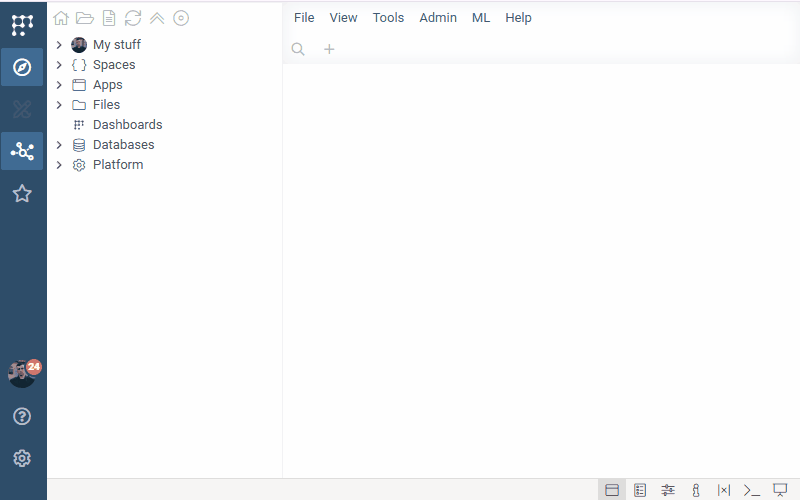
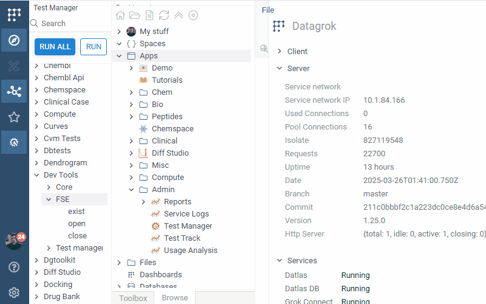
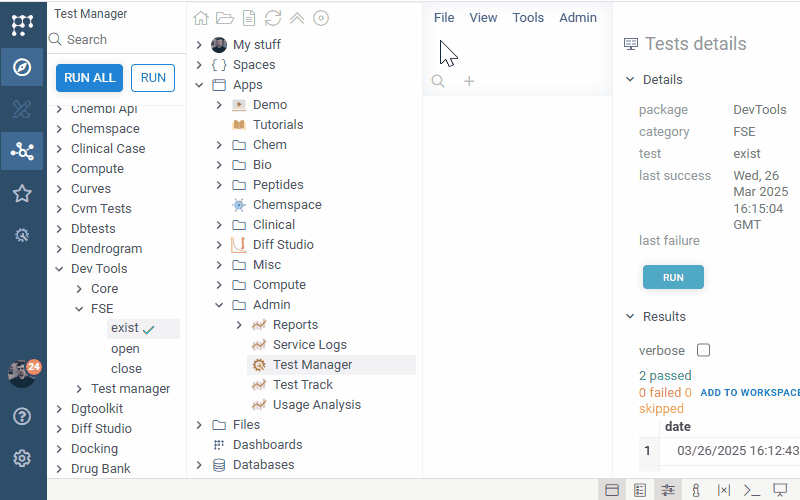
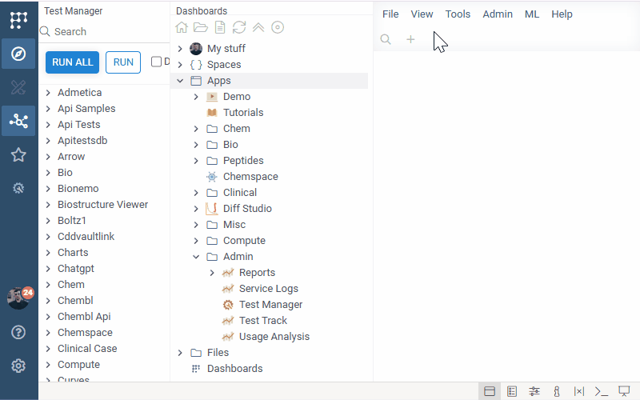

# Test Manager Tour

## Overview

The **Test Manager** is a powerful tool designed to assist in test reproduction, debugging, and profiling. It enables you to execute any package test efficiently. 

To access **Test Manager**, navigate through the following path in the **Browser**:

**Apps** > **Admin** > **Test Manager**

---

### Test Manager Options

Test Manager options:
| Option          | Description                                                                                   |
|-----------------|-----------------------------------------------------------------------------------------------|
| **Debug**       | Enables debug point before Test execution (Useless without **Browser Inspector (F12)**)       |
| **Benchmark**   | Runs test in Benchmark mode                                                                   |
| **Run Skipped** | Enables skipped test execution                                                                |

Context Menu options:
| Option                | Description                                                                             |
|-----------------------|-----------------------------------------------------------------------------------------|
| **Run**               | Execute test                                                                            |
| **Profile**           | Profile test                                                                            |
| **Copy**              | Copy name to the clipboard                                                              |
| **Copy URL**          | Copy the test's link to the clipboard                                                   |
| **Copy URL(running)** | Copy the test's link to the clipboard. Opening this link would invoke test              |
| **Run Force**         | Execute test even if it is marked as skipped                                            |

---

## Test Execution

With **Test Manager**, you can easily navigate the hierarchical structure of tests to execute individual tests or categories. To run a test, use one of the following methods:

- Click the **Run** button.
- **Right-click** on the test or category and select **Run**.

Once a test has executed, the results will be displayed in the **Context Panel**, where you can review:

- **Test Status** (Success, Failure, etc.)
- **Memory Usage (`memoryDelta`)**
- **Execution Time (`ms`)**
- **UI Impact (`widgetsDelta`)**
- **Test Owner (`owner`)**

---

## Test Debugging

**Test Manager** makes debugging simple and efficient. Follow these steps to debug a test:

1. Select **Debug** under the **Search** input.
2. Open the **Browser Inspector (F12)**.
3. Execute the test—execution will pause at the test invocation point.
4. Use **Step Into** to debug the test step by step.

This method allows you to pinpoint issues and verify test behavior effectively.

---

## Test Profiling

For deeper insights into test execution, **Test Manager** provides a profiling feature. Follow these steps to profile a test:

1. Open the **Browser Inspector (F12)**.
2. **Right-click** on the test and select **Profile**.
3. Navigate to the **Performance** tab in the Inspector.
4. Analyze the test execution timeline and performance metrics.

Profiling helps identify performance bottlenecks and optimize test execution times.

