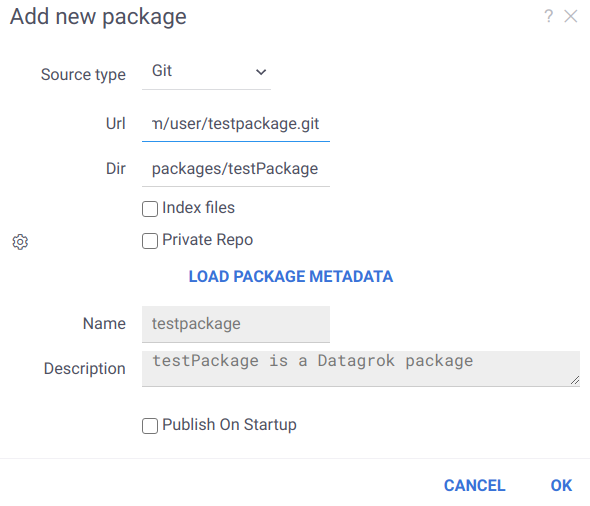

<!-- TITLE: JavaScript Development -->
<!-- SUBTITLE: -->

# JavaScript Development

Datagrok was designed to be as extensible as possible, so naturally JavaScript-based development
is the preferred way to develop user-facing applications on top of the platform. 
Use [Grok API](js-api.md) to control pretty much anything within Datagrok,
including [data manipulation](js-api.md#data-manipulation), 
adding [views](js-api.md#views) or [viewers](js-api.md#pre-defined-viewers), 
[developing custom viewers](js-api.md#custom-viewers),
[registering functions](js-api.md#registering-functions),
training and applying [predictive models](../learn/predictive-modeling.md), 
and even [building custom apps](#applications).

There are two options to run custom JavaScript code. For ad-hoc [scripts](scripting.md), use the built-in
JavaScript editor (`Functions | Scripts | New JavaScript Script`). For reusable functions, viewers, 
and applications, use the packaging mechanism, which is the focus of this article.

Table of contents

  * [Packages](#packages)
  * [Getting Started](#getting-started)
  * [Package Structure](#package-structure)
  * [Development](#development)
  * [Publishing](#publishing)
  * [Applications](#applications)
  * [Documentation](#documentation)

## Packages

A package is a versionable unit of content distribution within Datagrok. Essentially, it is 
a folder with files in it. A package might contain different things:

  * JavaScript [functions](../overview/functions/function.md), [viewers](../visualize/viewers.md), [widgets](../visualize/widgets.md), [applications](#applications)
  * [Scripts](scripting.md) written in R, Python, Octave, Grok, Julia, JavaScript, NodeJS, or Java
  * [Queries](../access/data-query.md) and [connections](../access/data-connection.md)
  * [Tables](../access/connectors/files.md#supported-tabular-formats)

See our [GitHub repository](https://github.com/datagrok-ai/public/tree/master/packages) for examples.

## Getting Started

To develop a package on the Datagrok platform, you will need [Node.js](https://nodejs.org/en/) and [npm](https://www.npmjs.com/get-npm) installed. Also, install [Webpack](https://webpack.js.org/guides/installation/) to be able to build your package locally and debug it using `Webpack DevServer`. Optionally, you can use `Babel`, `React` as well as other advanced JavaScript frameworks.

Here are the first steps to get you started:

1. Install `datagrok-tools` utility for managing packages:
   ```
   npm install datagrok-tools -g
   ```
   To avoid permission issues when installing packages globally (`-g`), use a version manager to install both `Node.js` and `npm` (here are the [instructions](https://docs.npmjs.com/downloading-and-installing-node-js-and-npm)).
2. Configure your environment with the following command:
   ```
   grok config
   ```
   Enter developer keys and set the default server. Your credentials will be stored locally in `config.yaml`. Once created, this file will be used for publishing all your packages. The developer key can be retrieved by opening your user profile (see it on public: [https://public.datagrok.ai/u](https://public.datagrok.ai/u)) and clicking on `Developer key`. Administrators can manage existing keys and grant or revoke privileges.
3. Create a new package by running this command:
   ```
   grok create <packageName>
   ```
   A new folder `MyPackage` will be created automatically as well as its contents.
4. Once you've completed the work on your package, upload it by running:
   ```
   grok publish
   ```

Run `grok` for instructions and `grok <command> --help` to get help on a particular command.

## Package Structure

A simplest JavaScript package consists of the following files:

| file                                    | description           |
|-----------------------------------------|-----------------------|
| [package.json](#package.json)           | metadata              |
| [package.js](#package.js)               | entry point           |
| [detectors.js](#detectors.js)           | detectors file        |
| [webpack.config.js](#webpack.config.js) | webpack configuration |
| README.md                               | package summary       |
| package.png                             | package icon          |

### <a href="#" id="package.json"></a>package.json

`package.json` contains metadata, such as name, version, and dependencies: 

```json
{
  "name": "sequence",
  "fullName": "Sequence",
  "version": "0.0.1",
  "description": "Support for DNA sequences",
  "dependencies": {
    "datagrok-api": "latest"
  },
  "scripts": {
    "debug-sequence": "grok publish --rebuild",
    "release-sequence": "grok publish --rebuild --release",
    "build-sequence": "webpack",
    "build": "webpack"
  }
}
```

The package template first includes only one dependency — `datagrok-api`. You can add more packages to the dependencies list and install them via `npm install`.

The file `package.json` also contains `scripts` for [debugging and publishing your package](#publishing).

### <a href="#" id="package.js"></a>package.js

Next, let's take a look at the `src/package.js` file:

```js
import * as grok from 'datagrok-api/grok';
import * as ui from 'datagrok-api/ui';
import * as DG from "datagrok-api/dg";

export let _package = new DG.Package();

//name: test
export function test() {
  grok.shell.info(_package.webRoot);
}
```

Note that `Datagrok API` modules are already imported. They are also set as external modules, so that `Webpack` will not include them to the output. You can include other libraries or packages, as all of them will be built in a single bundle file. If you choose to include other files, such as CSS, in your package, import them into `package.js` as well.

During the [publishing step](#publishing), the contents of `package.js` get parsed, and functions with the properly formatted
[headers](scripting.md#header) are registered as Grok [functions](../overview/functions/function.md). By annotating
functions in a specific way, it is possible to register custom viewers, widgets, renderers, 
converters, validators, suggestions, info panels, and semantic type detectors. 

### <a href="#" id="detectors.js"></a>detectors.js

`detectors.js` is a JavaScript file.  It should define a class named `<package_name>PackageDetectors` that subclasses `DG.Package`.
It is similar to `package.js` but intended for smaller functions — semantic type detectors. Datagrok calls these functions each time the
user opens a table. Detectors will be uploaded separately from the rest of the package and used to quickly inspect the data and determine the semantic type of the columns. Semantic type tagging allows the platform to offer specific functions for data of a particular type.

Below, there is an example of a package `Sequence` containing a single detector `detectNucleotides`:

```js
class SequencePackageDetectors extends DG.Package {
    
    //tags: semTypeDetector
    //input: column col
    //output: string semType
    detectNucleotides(col) {
        if (col.name.startsWith('nuc')) {
            col.semType = 'nucleotides';
            return 'nucleotides';
        }
        return null;
    }
}
```

Once registered, this function is now available across the whole platform, and can be used for semantic type detection.

### <a href="#" id="webpack.config.js"></a>webpack.config.js

The package is built according to its configuration file, which typically has the following content:

```javascript
const path = require("path");

module.exports = {
    mode: "development",  // set to "production" to minify the output and enable optimizations for production builds
    entry: {
        package: "./src/package.js"  // the package is limited to exactly one entry point
    },
    devtool: "inline-source-map",   // enhances package debugging in the browser devtools
    externals: {                    // external modules won't be loaded to the output, but taken from the environment
        "datagrok-api/dg": "DG",
        "datagrok-api/grok": "grok",
        "datagrok-api/ui": "ui",
        "openchemlib/full.js": "OCL",
        "rxjs": "rxjs",
        "rxjs/operators": "rxjs.operators"
    },
    output: {
        filename: "[name].js",
        library: "sequence",     // the name of the package in lower case
        libraryTarget: "var",    // the results will be assigned to a variable `sequence`
        path: path.resolve(__dirname, "dist"),
    },
};
```

Have a look at the [Webpack documentation](https://webpack.js.org/configuration/) in case you need to modify or extend the provided options. For instance, you can add CSS and other file [loaders](https://webpack.js.org/loaders/) to `module.rules`. When the package is loaded, the output gets assigned to a variable (type `window.<package_name>`, e.g. `window.sequence`, in the browser's console just to check). Finally, note that the package name have reoccurred in multiple files, including this one. This might become important if you are going to introduce changes to the code or, for example, rename the package without creating it from scratch. In this case, make sure the name is accurately substituted: set the `name` field in `package.json` and `library` in `webpack.config.js` to the desired name in lower case, and rename a class `<package_name>PackageDetectors` using camel case in `detectors.js`.

### Naming Conventions

Continuing the topic we have just touched on, here are naming guidelines and general recommendations that you might consider:

  * Use upper camel case for package names, for example, `ApiSamples` and `OctaveScripts`. Package names that comply with the [rules](https://docs.npmjs.com/cli/v6/configuring-npm/package-json#name) for `npm` packages, e.g. `api-samples` and `octave-scripts`, are accepted as well. That being said, you can still write the desired name in the `fullName` field of `package.json`
  * When defining new [views](how-to/custom-views.md) and [viewers](how-to/develop-custom-viewer.md), we recommend postfixing your classes with `View` and `Viewer` respectively
  * The names of semantic type detectors typically start with the `detect` prefix, e.g., `detectNucleotides` or `detectRDSmiles`
  * File names can be written in lower case, with dashes between words: `tika-extractor.py` and `chord-viewer.js`

### Structuring Package Sources

Apart from the files included in the standard template, let's briefly consider what else can be distributed as part of a package. Depending on your needs, the package may contain some of the following additional folders:

  * `environments`: [environment configurations](scripting.md#environments) for [scripts](scripting.md). Examples: [PythonScripts](https://github.com/datagrok-ai/public/tree/master/packages/PythonScripts)
  * `scripts`: a collection of [scripts](scripting.md) used for computations. Examples: [ChemScripts](https://github.com/datagrok-ai/public/tree/master/packages/ChemScripts), [RScripts](https://github.com/datagrok-ai/public/tree/master/packages/RScripts), [Impute](https://github.com/datagrok-ai/public/tree/master/packages/Impute)
  * `swaggers`: REST APIs in [Swagger/OpenAPI](../access/open-api.md) format. Examples: [EnamineStore](https://github.com/datagrok-ai/public/tree/master/packages/EnamineStore), [Swaggers](https://github.com/datagrok-ai/public/tree/master/packages/Swaggers)
  * `connections` and `queries`: [connections](../access/data-connection.md) and [queries](../access/data-query.md) for data retrieval. Examples: [Chembl](https://github.com/datagrok-ai/public/tree/master/packages/Chembl), [UsageAnalysis](https://github.com/datagrok-ai/public/tree/master/packages/UsageAnalysis)
  * `css`: CSS files for custom styling. Examples: [Notebooks](https://github.com/datagrok-ai/public/tree/master/packages/Notebooks), [Discovery](https://github.com/datagrok-ai/public/tree/master/packages/Discovery)
  * `data-samples`: data for demonstration and testing. Examples: [Chem](https://github.com/datagrok-ai/public/tree/master/packages/Chem), [Sunburst](https://github.com/datagrok-ai/public/tree/master/packages/Sunburst)

## Development

A JavaScript package runs inside the Datagrok platform, which makes the development and
debugging experience different compared to the more traditional web applications. Essentially, the packages
are developed locally, but the platform runs remotely. To enable the best possible experience for
developers, we established a workflow where the package is uploaded to the remote server at startup, and
then gets served from the server. By associating local JavaScript files with the remote sources in your favorite IDE, 
it is possible to hide the complexity of that scenario. For instance, you can set breakpoints, do 
step-by-step execution and generally debug the program in the regular way. Of course, you can always
use the debugger that comes with the browser.

To develop Datagrok packages, we recommend that you start with creating a package template.
Then, set up your IDE in such a way that when starting a project, it would [publish](#publishing) the package,
and then start the platform.

Packages deployed in the development mode are visible only to the authors. This ensures that multiple
people can simultaneously work on the same package.    

### General Notes on Package Development

Our approach to extending the system is providing one canonical, convenient way for 
developers to achieve the task, at the same time exposing enough extension points
to enable deep customization. Same concepts apply to JavaScript development. 
We do not impose any requirements on the UI frameworks or technologies used for 
the JavaScript plugins, although we encourage developers to keep it simple.

To simplify development, Datagrok provides an `Inspector` tool (`Alt + I`) that lets developers peek
under the hood of the platform. Use it for understanding which events get fired and when,
how views and viewers are serialized, what is getting stored locally, what widgets are
currently registered by the system, etc. 

### Environments

In order to isolate packages being debugged from the production instance, we recommend running 
them against the `dev` instance, if possible. To change Datagrok's server, add a new developer key to your local `config.yaml` and edit the `scripts` section in the `package.json` file.

## Publishing

### Version Control

Each package has a version number. All objects inside the package are being deployed according to the package version. 
When a package gets published, a "published package" entity gets created. It is associated with the 
package, and has additional metadata (such as publication date). Typically, only one version of a package
is visible to a user. Administrators can manage published packages and decide which versions
should be used. It is possible to roll back to an older version, or assign a particular version to
a particular group of users.

Importantly, if the version changes, there will be an independent instance of each package asset.  
Multiple versions of a package can be deployed at one moment, and the administrator can switch between them. All users 
will only see objects that belong to the current package version.

There is a special `debug` version that can be deployed for each package. If the developer applies it, it becomes 
active for the current package until the developer deletes it or changes their developer key. In this case, the developer can see objects from their version of package, and changes will not affect other users package representation. 

### Deployment Modes

You can use the following flags to specify who can access your package:

  * In `--debug` mode, packages are accessible by the developer only (default).
  * In `--release` mode, packages are accessible by everyone who has the privilege.

To publish a package, open the `package.json` file in your IDE. Typically, the `scripts` section would contain several scripts generated for your package based on the contents of `config.yaml`. For development purposes, use the scripts having the `debug` word in their name. For production, use the alternative scripts starting with `deploy` instead.

```json
"scripts": {
  "debug-sequence": "grok publish --rebuild",
  "release-sequence": "grok publish --rebuild --release",
  "build-sequence": "webpack",
  "build": "webpack",
  "debug-sequence-dev": "grok publish dev --rebuild",
  "release-sequence-dev": "grok publish dev --rebuild --release",
  "debug-sequence-local": "grok publish local --rebuild",
  "release-sequence-local": "grok publish local --rebuild --release"
}
```

Alternatively, you can run these scripts with `npm run`. If you have any questions, type `grok` for instructions or `grok publish --help` to get help on this particular command.

In addition, you can pass another server either as URL or server alias from the `config.yaml` file:

```
grok publish dev
grok publish https://dev.datagrok.ai/api --key <dev-key>
```

Make sure to specify the developer key for a new server.

### Source Control

Packages can be deployed from `Git` as well as other resources, which allows for convenient team collaboration and version management. See the full list of source types in the [Package Browser](https://public.datagrok.ai/packages) (`Manage | Packages | Add new package`).

When developing a package with your team, it's a good idea to commit code to the repository first and then publish your package from there. Our [public GitHub repository](https://github.com/datagrok-ai/public/tree/master/packages) is a telling example of this workflow. We also welcome contributions, which you can learn more about in [this article](https://datagrok.ai/help/develop/public-repository).

To publish a package from the repository, you need to open `Manage | Packages | Add new package` first. Once the window appears, choose `Git` as the source type, enter the URL to your repository, and specify the package directory relative to its root. Click on `LOAD PACKAGE METADATA` to get the package name and description.



If necessary, you can specify additional settings and then publish the package.

### Continuous Integration

`Webpack` is required for your package source code to work successfully in the browser. The Datagrok platform can build a package on the server side, in which case, you need to specify `--rebuild` option in scripts from `package.json`. The script `"build": "webpack"` is reserved for server build.

Alternatively, it's possible to build your package on the client side using `Webpack`. To do that, run the script `"build": "webpack"` before publishing.

Package publication is compatible with automation tools. You can pass your server URL and developer key explicitly without configuring:

```
grok publish <url> -k <dev-key>
```

### Sharing

Just like other entities on the platform, packages are subject to [privileges](../govern/security.md#privileges). When sharing with users and groups of users, you can specify the rights (for viewing and editing) and choose if you want to notify the person in question. These privileges can be managed not only from the user interface, but also directly from the package. To do that, you should specify the eligible user groups in the `package.json` file:

```json
{
  "canEdit": [
    "Developers"
  ],
  "canView": [
    "All users"
  ]
}
```

To see packages available to you, click on `Manage | Packages`, or follow [this link](https://public.datagrok.ai/packages) from outside the platform.

## Debugging

Essentially, Datagrok packages are either regular webpack packages, or JS source files.

There are good practices described below which we recommend you to follow with debugging package code.

### Debugging with Visual Studio Code

Use a `--ide=vscode` key of [grok tools](#Getting-Started) to set up a `.vscode` debugging integration with Datagrok.

This command coupled with `grok create` adds an additional `.vscode` folder with two files to a package folder.
The idea behind these files is to bring you development experience close to developing native apps, where you
modify the code, hit the "Run", wait for application to "compile" (in our case — go through webpack, and potentially
through linters), start it and then explore your runtime state through breakpoints, variable watches, call stacks etc.

The first file, `launch.json`, has contents similar to the below:

```
{
  "version": "0.2.0",
  "configurations": [
    {
      "preLaunchTask": "rebuild",
      "type": "chrome",
      "request": "launch",
      "name": "Launch Chrome against Dev",
      "url": "https://dev.datagrok.ai/",
      "webRoot": "${workspaceFolder}"
    }
  ]
}
```

It allows VS Code to launch an isolated Chrome session under debugging, targeting the desired web-address from `url`.
In case an application is being developed, it may be useful to target this address directly to the application's URL.

The second file, `tasks.json`, contains the following (for Windows):

```
{
  "version": "2.0.0",
  "tasks": [
    {
      "type": "shell",
      "command": "cmd.exe /c 'call webpack && call grok publish'",
      "label": "rebuild"
    }
  ]
}
```

This command provides for building your package with webpack (this helps track some syntactic errors before
they occur in runtime), and consequently ship the package to your Datagrok server.

After these two files are provided in the working folder, what is left is to set up VS Code internally.

* Open `Run → Install additional debuggers...`, find `Debugger for Chrome` in the appeared list and install it; restart VS Code.

* Activate `View → Appearance → Show activity bar`. This will bring the `Run` button into the view.
You can also use `Ctrl+Shift+D` to run the application.

Make sure the `.vscode` folder is inside the folder you open with VS Code via `File → Open Folder`.

Now open the folder with your package, add some breakpoint to your code, and hit the `Run` button.
You should see a view with a left-side pane and a green "Run" (play) button on top of it, with the neightbour
dropdown repeating the name of the configuration from `launch.json`. If this is not the case, and you see some
other names or an invitation to create a configuration, it means the pre-made `.vscode` folder isn't recognized by VS
Code. In such case, check that you do `File → Open Folder` on the folder which contains the pre-made `.vscode` folder.

First time you hit run, you'll need to enter your Datagrok credentials into the newly appeared Chrome window.
After you have done this, close Chrome, stop debugging from VS Code and start debugging same way again.
This time your breakpoint should work, and you'd see locals and stack traces as usual.

This [video](https://youtu.be/zVVmlRorpjg?list=PLIRnAn2pMh3kvsE5apYXqX0I9bk257_eY&t=871) gives an overview of
setting up the debugging in VS Code.

### Debugging through the browser

Open Chrome Developers Console (hit `F12`) and go to `Sources` tab. 

#### Webpack-based packages

If you deploy package in debug mode (`--release` isn't passed to `grok publish`) and source maps are properly
generated (thus, the setting `` of `module.exports =` section in `webpack.config.js` is present), you'd find your
package sources in the `top` (root) section of the source tree by its decapitalized name.

#### Source-code based packages

Deploying such package locates it to the Datagrok host URI (such as `https://dev.datagrok.ai`) under
`api → packages/published/flies → <PACKAGE_NAME>/<VERSION>/_/<DIGIT>`, where you'd set breakpoints. 

### Debugging through other IDEs

We've noticed that for some of our users native debugging (using a Chrome plugin) from JetBrains
IDEs (ItelliJ IDEA, WebStorm) didn't work out of the box. This doesn't seem to be related to Datagrok,
but has to do with the general environment. We are figuring out a recommendation for these encountering
problems with WebStorm. If you've been through this yourself and found a cause, please let us know
how you had it resolved, by posting to our Community Forums: https://community.datagrok.ai/.

### Troubleshooting debugging

1. For webpack-based packages, make sure there is `devtool: 'inline-source-map'` in `module.exports =` section of
`webpack.config.js`. Otherwise, source maps aren't generated and the IDE won't get source code locations.

2. Make sure the required plugins / debuggers for Chrome debugging are installed in your IDE.

## Applications

Applications are [functions](../overview/functions/function.md) tagged with the `#app` tag. A package might contain zero, one, or more apps. See our [GitHub repository](https://github.com/datagrok-ai/public/tree/master/packages) for application examples, such as [Enamine Store application](https://github.com/datagrok-ai/public/tree/master/packages/EnamineStore).

To open the application launcher, click on `Functions | Apps`, or follow [this link](https://public.datagrok.ai/apps)
from outside the platform. To launch a particular app automatically, open the following URL: `https://public.datagrok.ai/apps/<APP_NAME>`.

## Documentation

According to [this study](http://sigdoc.acm.org/wp-content/uploads/2019/01/CDQ18002_Meng_Steinhardt_Schubert.pdf),
in terms of the strategies used for understanding API documentation, different developers fall into several groups:
systematic, opportunistic and pragmatic. These findings are consistent with our experience. 
For Datagrok's documentation, we have established an approach that enables developers from either of the
above-mentioned groups to be productive. 

  * [Sample browser](https://public.datagrok.ai/js) (`Functions | Scripts | New JavaScript Script`) is an interactive tool
    for browsing, editing, and running JavaScript samples that come with the platform. Samples are grouped by
    domain, such as data manipulation, visualization, or cheminformatics. They are short, clean examples
    of the working code using [Grok API](js-api.md) that can be copy-and-pasted into the existing solution.
    The samples are also cross-linked with the [help](https://datagrok.ai/help) system. 
  * [Grok API](js-api.md) provides complete control over the platform. 
    [JS documentation](https://public.datagrok.ai/js) is available.
  * [Platform help](https://datagrok.ai/help/) explains the functionality from the user's point of view. Where
    appropriate, it is hyper-linked to samples and demo projects. In the near future, we plan to turn it
    into the community wiki, where users will be contributing to the content. The same web pages
    are used as an interactive help within the platform (you see help on the currently selected object).
  
Additionally, there are a few ways to connect with fellow developers:    
  * [Datagrok community](https://community.datagrok.ai/)
  * [Slack space](https://datagrok.slack.com) 

See also: 

  * [Grok API](js-api.md)
  * [Scripting](scripting.md)
  * [Packages from our GitHub repository](https://github.com/datagrok-ai/public/tree/master/packages)
  * [How Developers Use API Documentation: An Observation Study](http://sigdoc.acm.org/wp-content/uploads/2019/01/CDQ18002_Meng_Steinhardt_Schubert.pdf)
