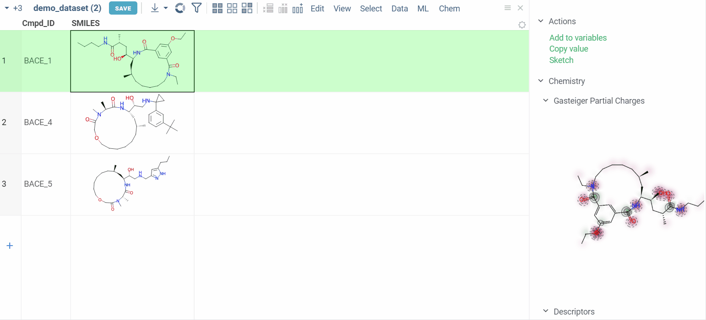
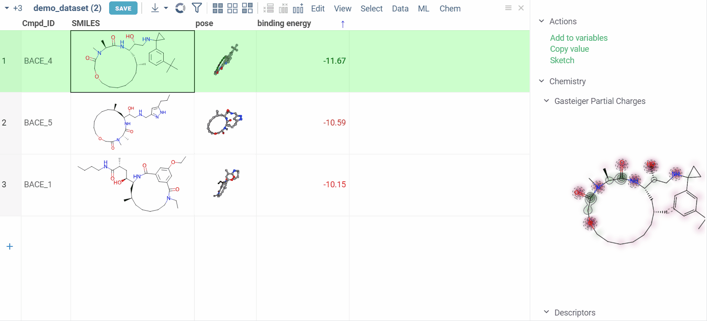
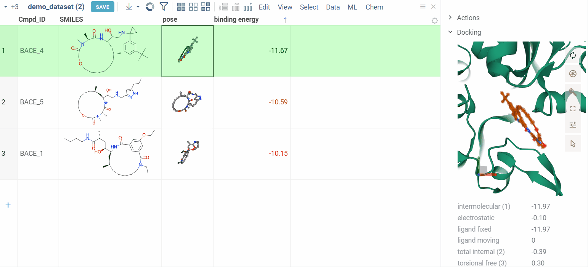

The Docking package is a plugin that seamlessly integrates the [AutoDock GPU](https://catalog.ngc.nvidia.com/orgs/hpc/containers/autodock) 
utility with the [Datagrok](https://datagrok.ai) platform.

## Getting started

Setting up docking configurations can be challenging, but we've streamlined this process.
In this section, we'll cover everything from preparing configurations to storing them.

### Prepare macromolecule (target)

Autodock plugin contains several pre-created [targets](https://github.com/datagrok-ai/public/tree/master/packages/Docking/files/targets). To add your own:

- Prepare the macromolecule and AutoDock grid parameter file using [AutoDock tools](https://ccsb.scripps.edu/mgltools/downloads/).
- Ensure that the macromolecule is in the `PDBQT` format.

For detailed instructions, review the Autodock tutorials:

- [First tutorial](https://www.chem.uwec.edu/chem491_w01/Chem491-Molecules%20and%20Medicine%202008/AutoDock%20Tutorial.pdf)
- [Second tutorial](https://omicstutorials.com/a-comprehensive-bioinformatics-tutorial-mastering-ligand-protein-docking-with-autodock/)

Put these files to the folder under **System:AppData/Docking/targets**. The name of the folder will appear as the target name in the Datagrok plugin UI.

> **Atomic maps:**
> 
> The AutoDock calculation fails if for a particular ligand corresponding atomic maps are not available. To run docking on a big ligand dataset, we suggest including all available atomic map types: `A C HD N NA OA SA CL`.

### Prepare data

Create or load a dataframe that contains ligands to be docked. 
For demonstration purposes, consider using the provided [demo data](https://github.com/datagrok-ai/public/blob/master/packages/Docking/files/demo_files/demo_dataset.csv).

### Run docking simulations

* Navigate to **Chem > Autodock**. A dialog appears.
* Configure the parameters:
  * **Ligands**: Specify the column that contains small molecules to be docked.
  * **Target**: Choose the folder that contains the macromolecule and grid parameter file.
  * **Conformations**: Define the number of conformations.
* Run the calculations.

> **Performance note:**
> 
> During the first run for a target Autodock calculates the macromolecule grids. Grid calculation works on a single CPU core, so it can take about a minute. Datagrok caches calculated grids, so subsequent runs with the same target will be much faster.

## Features

After docking simulations are finished, various features become available. This section will guide you through them.

### View docking results

Users can review the results: **docking poses** and **binding energy** values.

The column for binding energy shows how strong the connections are between ligands and receptors. 
Green indicates strong connections with low numbers, while red indicates weaker connections with higher numbers.

  

### Zoom into binding pocket

Clicking on a pose activates a Molstar viewer in the context panel. It automatically zooms to the binding pocket.

### Explore additional properties

We also show additional Autodock properties. Click the plus icon to add them to the whole dataframe.

### Download pose in PDB and CIF formats

To download the pose within the protein context, right-click to open the menu. Choose "Download" and then select either **as CIF** or **as PDB**.

