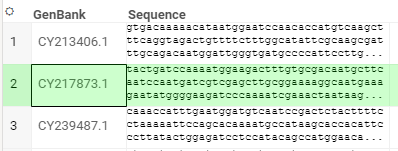

<!-- TITLE: &#65279;Exercises -->
<!-- SUBTITLE: -->

# Exercises

This is a set of programming exercises designed to make developers proficient with the
Datagrok platform. The exercises are organized as progressive steps, with tasks
of increasing complexity built on top of the previously completed steps.

During this course, we will be building support for
handling DNA nucleotide sequences. Let that not scare you, think of them as regular
strings that can only contain characters G, A, C, and T (and now you know the origins
of the "Gattaca" movie name). We will start with writing stand-alone functions, then 
automatically recognizing nucleotide sequences in the imported data, and then 
going all the way to custom visualizations, querying relational databases, 
predictive models, integration with the external utilities, data augmentation, and 
custom applications. 

## Table of contents

  * [Setting up the environment](#setting-up-the-environment)
  * [Semantic types](#semantic-types)
  * [Scripting and functions](#scripting-and-functions)
      * [Scripting with server functions](#scripting-with-server-functions)
      * [Scripting with client functions](#scripting-with-client-functions)
  * [Composing functions](#composing-functions)
      * [Composing a JavaScript and a Python function](#composing-a-javascript-and-a-python-function)
      * [Composing two JavaScript functions](#composing-two-javascript-functions)
      <!---
      * Composing functions in the package
      --->
  * [Querying databases](#querying-databases)
  * [Creating a scripting viewer](#creating-a-scripting-viewer)
  * [Transforming dataframes](#transforming-dataframes)
  * [Custom cell renderers with 3-rd party JS libraries](#custom-cell-renderers-with-3-rd-party-js-libraries)
  * [Accessing Web services with OpenAPI](#accessing-web-services-with-openapi)
  * [Creating an info panel with a REST web service](#creating-an-info-panel-with-a-rest-web-service)
  * [Enhancing Datagrok with dialog-based functions](#enhancing-datagrok-with-dialog-based-functions)
  <!---
  * Creating an application
  * Accessing Web services in JavaScript with REST
  * Creating a custom JavaScript viewer
  * Optimizing a custom cell renderer with a cache
  * Extending Datagrok with info panels
  * Customize packages with properties
  * Persisting user sessions and tables
  * Using WebAssembly with Datagrok functions
  * Webpack packages with WebAssembly
  * Using Web Workers for background computations
  --->

## Setting up the environment

Prerequisites: basic JavaScript knowledge

1. Install the necessary tools (Node.js, npm, webpack, datagrok-tools) following [these instructions](develop.md#getting-started)
2. Get a dev key for https://dev.datagrok.ai (you will work with this server) and add it by running `grok config`
3. Create a default package [called](https://datagrok.ai/help/develop/develop#naming-conventions) `<yourFirstName>-sequence` using datagrok-tools: `grok create <yourFirstName>-sequence`
4. Upload it to the server: `grok publish dev --rebuild` (see other options [here](develop.md#deployment-modes))
5. Launch the platform and run the package's `test` function using different methods: 
    * via the [Functions](https://dev.datagrok.ai/functions?q=test) view
    * via the [Packages](https://dev.datagrok.ai/packages?) menu (find your package and run `test` from the 'Content' pane in the property panel)
    * via the [console](): press `~` key anywhere inside Datagrok, the Console will appear to the right; execute `<yourFirstName>Sequence:test()` there

## Semantic types

Prerequisites: basic JavaScript knowledge

Details: [How to Create a Semantic Type Detector](how-to/semantic-type-detector.md),
[How to Add an Info Panel](how-to/add-info-panel.md)

You will learn: how to write semantic type detectors, how to develop context-specific data augmentation.  

1. Create a `complement` function in `src/package.js` which takes a nucleotide string and returns its complement:
   ```javascript
    //name: complement
    //input: string nucleotides
    //output: string result
    export function complement(nucleotides) {
        // your code goes here
    }
    ```
   Essentially, change each character to the complementary one: A<=>T, G<=>C. 
   Run it and check whether everything works fine. 

2. Now, let's specify that this function is meant to accept not any string, but nucleotides only,
   and to return a nucleotide string as well. In order to do that, let's annotate both input and output parameters
   with the `dna_nucleotide` semantic type:
   ```javascript
    //input: string nucleotides {semType: dna_nucleotide}
    //output: string result {semType: dna_nucleotide}
   ```
   At this point, `dna_nucleotide` string does not have any meaning, but we will connect the dots later.

3. <a name="detectors"></a> Define a `detectNucleotides` semantic type detector function as part of the special
   `detectors.js` file. 
    ```javascript
   class <yourFirstName>SequencePackageDetectors extends DG.Package {

     //tags: semTypeDetector
     //input: column col
     //output: string semType
     detectNucleotides(col) {
         // your code goes here
     }
   }
    ```   
   It should check whether a column is a string column, and whether each string represents a nucleotide (hint: for best 
   performance, don't iterate over all column values, instead iterate on `column.categories`). 
   When everything is done correctly, the `detectors.js` file will get loaded by the platform automatically, and the 
   `detectNucleotides` function will be executed against every column in a newly added table.

4. Test your implementation by opening the following CSV or TXT file (or go `Data | Text`, and paste it there):
   ```
   sequence, id
   GATTACA, 1997
   ATTCGGA, 1984
   TTTAGGC, 2021 
   ```
   Hover over the `sequence` column header after the data is imported — if everything is done correctly,
   you will see `quality: dna_nucleotide` in the bottom of the tooltip. Alternatively, you can 
   find this information if you click on the column and expand the 'Details' pane in the property panel on the right.
   
5. Now transform the previously created `complement` function into an [info panel](): tag it with `panel` and `widgets` tags
   and change the output type to `widget` (see an example [here](how-to/add-info-panel.md#functions)).
   This will instruct the platform to use the `complement` function for providing additional information for string values
   of the `dna_nucleotide` semantic type. To test it, simply open our test file, click on any cell
   in the `sequence` column, and find the `complement` property in the panel on the right.
   
## Scripting and functions

### Scripting with server functions

_Prerequisites:_ basic Python knowledge.

_Details:_ [Scripting](develop/scripting.md), [Dev Meeting 1 | First-class functions](https://youtu.be/p7_qOU_IzLM?t=724)

_You will learn:_ how to create and invoke Datagrok scripts in data science languages like R and Python.

In this exercise, we will count occurrences of a given subsequence in a nucleotide sequence, using Python.

1. Open Datagrok and navigate to `Functions | Scripts | Actions | New Python Script`.
2. Observe a default script created for you. All script attributes are specified in the beginning in comments.
   There we have the script name, language, one input value of type [`dataframe`](),
   and one output value of type `int`. The script simply computes number of cells in the dataframe.  
   [Dataframe](develop/how-to/build-an-app.md) is a high-performance, easy to use tabular structure
   with strongly-typed columns of different types (supported types are: `string`, `bool`, `int`, `bigint`,
   `double`, `qnum` and `datetime`). In this exercise, we only see a dataframe as is in the default script;
   there is [another exercise]() to learn manipulating dataframes in JavaScript.
3. Run the script to get a hint for creating an input file. An attribute `#sample: cars.csv`
   is responsible for it. To open a default input file `cars`, click the `Star` icon in the top menu.
4. Run the script again and proceed to the Datagrok's console. As in Quake, it's available
   by pressing a `~` button anywhere inside Datagrok. In the console, you would see the script
   execution result. Just one line above the result you could see the console's command to execute
   the script. Enter it again to the console to get the same result.
5. Let's modify the script to solve the task of counting sequence occurrences. Add a new preamble:
   (use any `#description` you like):
   ```python
   #name: CountSubsequencePython
   #language: python
   #input: string sequence
   #input: string subsequence
   #output: int count
   ```
   In the body, implement a Python function counting all occurrences of a given `subsequence` in a `sequence`.
   Return a `count` the same way as in the default script from p. 2.
6. Run the script function, provide input values in the dialog and get to the console to see the result.
   Now run the script function again through the console completely, passing different arguments values:
   ```<yourLogin>:CountSubsequencePython('ATGATC', 'A')```.
   You can find your login inside the profile page between name and email (under avatar), or in the profile URL: 
   `https://dev.datagrok.ai/u/<yourLogin>/summary`.

### Scripting with client functions

_Prerequisites:_ basic JavaScript knowledge.

_You will learn:_ how to create and invoke Datagrok JavaScript scripts.

7. Go to `Functions | Scripts` and hit `New JavaScript Script`.
8. Implement the function `CountSubsequenceJS` in JavaScript, which does the same as
   [`CountSubsequencePython`](#scripting-with-server-functions). Follow the same conventions on
   the parameters in the comments block and returning a result via a variable.
9. Run `CountSubsequenceJS` using the `Play` button; using the console. From same console,
   run `CountSubsequencePython` yet again.  You can notice that both Python and JS versions of
   our function, implemented as scripts, are homogeneous functions in Datagrok.
   It's also possible to call them in a uniform fashion
   [using our JavaScript API](scripting.md#running-a-script). This is also shown
   in the ["Composing functions and dataframes"](#composing-functions-and-dataframes) exercise.
10. Don't forget to save these two scripts. We would re-use parts of them in the following exercises.

The difference between the two scripts is that the first, `CountSubsequencePython`, runs on
our server by a [compute virtual machine](develop/admin/architecture.md#compute-virtual-machine),
whereas the second, `CountSubsequenceJS`, runs directly in the browser. To run `CountSubsequencePython`,
Datagrok passes the script arguments over the network and fetches back the result to the browser.

## Composing functions

### Composing a JavaScript and a Python function

_Prerequisites:_ basic Python knowledge, basic JavaScript knowledge.

_You will learn:_ how to invoke arbitrary Datagrok functions in JavaScript and augment tables.

1. Open Datagrok and navigate to `Functions | Scripts | New Python Script`.
2. Implement a script `CountSubsequencePython` that takes as an input:

   * a dataframe with a column containing nucleotide sequences,
   * a name of that nucleotide sequences column,
   * a nucleotide subsequence being sought,
   
   and outputs a dataframe containing a column with numbers of subsequence occurrences
   in the sequences from the nucleotide column. Say, for a table, where we are only interested
   in the column `Sequence` (on the left), the following table (on the right) should be produced
   for a subsequence `ACC` being sought:  
   <table>
   <tr><td>
   
   | Sequence     | A's |
   |--------------|-----|
   | AACCTCACCCAT | 4   |
   | CCTTCTCCTCCT | 0   |
   | CTGGAAGACCTA | 3   |
   
   </td><td>
   
   | N(ACC) |
   |--------|
   | 2      |
   | 0      |
   | 1      |
   
   </td></tr>
   </table>  
   Equip your Python script with the following header:
   
   ```python
   #name: CountSubsequenceTablePython
   #language: python
   #input: dataframe inputDf
   #input: column inputColName
   #input: string outputColName
   #input: string subseq
   #output: dataframe outputDf
   ```
   
   In contrast to a simple script from the exercise ["Scripting and functions"](#scripting-and-functions),
   we will now operate with dataframes:
   * Use Pandas dataframes to access the input dataframe and create an output dataframe
   * Use `outputDf = pd.DataFrame()` to initialize the output Pandas dataframe which you would
     fill in with the occurrence counts
   * You don't need to import `pandas`, Datagrok does this automatically
   * Note that the `column inputColName` is just a column name, but not a data in some column
   
   You may want to borrow some code from the ["Scripting and functions"](#scripting-and-functions) exercise.
   
3. Let's create a wrapping function `CountSubsequenceTableAugment` in JavaScript which would do all the technical
   job. We would use it to give the new column with counts a proper name, and to _augment_ the input dataframe
   with the newly computed column. Make it look like this:
   
    ```javascript
    //name: CountSubsequenceTablePythonAugment
    //language: javascript
    //input: dataframe df
    //input: column colName
    //input: string subseq = ATG
    
    grok.functions.call(
      "<yourLogin>:CountSubsequenceTablePython", {
        'inputDf': df,
        'inputColName': colName,
        'outputColName': `N(${subseq})`,
        'subseq': subseq 
      }).then((resultDf) => {
        df.columns.insert(resultDf.columns.byIndex(0));
      });
    ```
   
   Follow how we match input parameters to their values in `grok.functions.call` using a JSON object.
   In the `.then` [continuation]() we manipulate the original dataframe by inserting a new column which
   we get as a result of the script's execution.
   
4. Let' prepare a visual layout before running our script. Navigate to `Data | Files` and open
   `Demo Files / bio / sequences.csv`. Then click on `Windows` and activate `Menu`, this will let
   you move windows around. Stick the `Sequences` table to the side of the `CountSubsequenceTable`
   window and leave enough space in the table to see the new column coming when running the script.
   
5. Run the script and check the new column appears in the grid.

6. Add `CountSubsequenceTablePythonAugment` and `CountSubsequenceTablePython` as part of the package
   `<yourFirstName>-sequence` prepared in ["Semantic types"](#semantic-types) exercise. Deploy the package,
   reload Datagrok and run `CountSubsequenceTablePythonAugment` from the package.

7. Notice that we don't need the entire input dataframe to run the script, just one column.
   Optimize the 2 scripts of this exercise to only take this one column as an input, and thus
   optimizing the data network roundtrip.

### Composing two JavaScript functions

8. Let's repeat this augmentation for a JavaScript function. First, delete the newly created
   `N(ATG)` column by clicking with a right mouse button on it and selecting `Remove`.

9. Create a function `CountSubsequenceTableJS`, which has the following structure:
    ```javascript
    //name: CountSubsequenceTableJS
    //language: javascript
    //input: dataframe inputDf
    //input: column inputColName
    //input: string outputColName
    //input: string subseq
    //output: dataframe outputDf
    
    let newCol = DG.Column.fromType(
      DG.COLUMN_TYPE.INT, outputColName, inputDf.rowCount);
    for (let i = 0; i < newCol.length; ++i) { 
      const seq = inputDf.get(inputColName, i);
      const count = ...; // your subsequence counting here
      newCol.set(i, count);
    }
    outputDf = DG.DataFrame.fromColumns([newCol]);
    ```
   Grasp a number of techniques with Datagrok JS API:
   * creating a new column of a given type
   * iterating through a dataframe by a row index
   * crearing a dataframe from an array of columns
   
10. In `CountSubsequenceTablePythonAugment`, replace `CountSubsequenceTablePython` to `CountSubsequenceTableJS`,
    rename itself to `CountSubsequenceTableJSAugment` and run it. Check that the exact same new column is produced
    as it was for a Python version.
  
11. Add `CountSubsequenceTableJS` and `CountSubsequenceTableJSAugment` as part of the
    package `<yourFirstName>-sequence` prepared in ["Semantic types"](#semantic-types) exercise.
    Deploy the package, reload Datagrok and run `CountSubsequenceTableJSAugment` from the package.
 
12. In contrast to `CountSubsequenceTablePythonAugment` running in the browser and `CountSubsequenceTablePython`
    running on the server, now both `CountSubsequenceTableJSAugment` and `CountSubsequenceTableJS` run
    in the same browser tab. Also, the dataframe-typed arguments passed from one JS function to another
    are just references to one JS object. Would it make sense to optimize the 2 functions in the same fashion
    as in p.6 of the previous exercise? If not, show a suitable optimization.
   
In these two exercises, we could try another approach. Instead of passing the column to
and forming the new column in the function being called, we could just populate the new column
in a loop inside the `CountSubsequenceTable` by calls to a function operating on row data, such as
the one created in ["Scripting and functions"](#scripting-and-functions):
`CountSubsequencePython(seq, subseq)`.

However, this incurs a substantial overhead in a Python version.
For a table of 10 rows we'd have to call the server scripting 10 times with a network roundtrip
to deliver parameters to [compute virtual machine](). This will be less overhead for a JavaScript version,
as all will happen in the browser, but still not as optimal as the case where we do just one call to a
nested script.

## Querying databases

_Prerequisites:_ basic SQL knowledge

_Details:_ [Connecting to Databases](https://www.youtube.com/watch?v=dKrCk38A1m8&t=1048s),
[How to Access Data](how-to/access-data.md)

_Note:_ Editing an existing data query requires the respective access permission. You might need to request one.

In this exercise, we will work with a `northwind` PostgreSQL database (in case the name sounds 
familiar, this is a demo database that Microsoft often uses for showcasing its technology).
The database is already deployed and is accessible from our server.

1. Navigate to the `Data | Databases | PostgreSQL | northwind | Tables | orders` table
2. Make this table current by left-clicking on it, and explore its property panels on the right. The 
   `Content` pane should be showing first 50 rows of that table.  
3. Right-click on the table, and choose `New SQL Query...`
4. Execute the query and make sure it returns results.   
5. Modify the query to accept a `country` parameter, and return the sum of freights for the specified 
   country, grouped by `customerid`:
   ```sql
   --input: string country
   select customerid, sum(freight)
   from public.orders
   where shipcountry = @country
   group by customerid
   ```
6. Run the query, enter one of the countries in the input box (such as `USA`, without quotation marks or apostrophes).
   Run it the second time, notice that previously entered parameters could be quickly reused by clicking
   on the watch icon in the left bottom corner of the dialog window.
7. Rename this query from your name to `ordersByCountry`, and save it.
8. Try different ways to execute it:
    * Right-click on `Data | Databases | PostgreSQL | northwind | ordersByCountry`, select `Run` from the context
      menu, enter the country name, and run it
    * Click on `Data | Databases | PostgreSQL | northwind | ordersByCountry`, expand the `Run` pane on the right, enter the country name and run it
    * Open console by pressing `~` key, see the results of the previous invocations. Copy-paste the corresponding
      command and run it from the console.
9. Now, let's add this query to our package. Create a connection by running `grok add connection <yourFirstName>`, then, as instructed [here](how-to/access-data.md#creating-queries), create the '.sql' file under the `queries` folder, and paste our query there. Give it a name by adding the `--name: ordersByCountry` line on top of it.
10. Deploy the package, launch the platform, find the query in the package, and run it.
11. Create a JavaScript function (in `src/package.js`) that has no parameters and returns a dataframe with 
    the results of the `ordersByCountry('USA')` call:
    ```javascript
    //name: getOrders
    //output: dataframe df
    export async function getOrders() {
      return await grok.data.query(`${packageName}:${queryName}`, { country: 'USA'});
    }
    ```
    There is another way to pass a country name to the query: you can provide a default value for the input parameter (see examples in the article [Parameterized Queries](../access/parameterized-queries.md)).

## Creating a Scripting Viewer

_Prerequisites:_ basic Python knowledge, [matplotlib](https://matplotlib.org/) or a similar library

_Details:_ [Scripting](develop/scripting.md), [Scripting Viewer](visualize/viewers/scripting-viewer.md),
[Creating a scripting viewer (video)](https://www.youtube.com/embed/jHRpOnhBAz4).

*Amino acids counting task.* In this exercise, we'd use a Python script to generate a histogram
(a distribution plot) for amino acids occurring in a column of nucleotide sequences. Amino acids are simply triples
of nucleotides from which the nucleotide DNA sequence is made of. These are also called triplets, or codon-codes.
As there are 4 letters `G`, `A`, `T`, `C`, there are 4 to power 3 protein amino acids: `GTA`, `AGC`, `TTT`, and so forth.

We don't know at which starting point each nucleotide sequence was cut: it could either be a junction of two triplets,
or one-third or two-third of a triplet. Therefore, we'd count in our statistics for all three possible cuts, starting
the reading frame off at offsets 0, 1, and 2 from the beginning of the nucleotide sequence.

Say, we are given a sequence `TTTAATTACAGACCTGAA`. We start to count triplets _without overlap_ from an offset 0 first,
getting: `TTT`, `AAT`, `TAC`, `...`, `GAA`. Then we move to the offset 1, getting: `TTA`, `...`, `CTG`. Lastly,
we move to the offset 2 and get: `TAA`, `...`, `TGA`. In the histogram we'd count for all these triplets.

First, let's explore how scripting viewer works.

1. Open a `demog` demo file with demographic data. It is located at `Data | Files | Demo Files | demog.csv`.
`Data` corresponds to the first button from the top of the Datagrok [sidebar]().
Make sure the table view with the data appears.
2. Activate the top menu from the sidebar, using a `Windows | Menu` switch.
3. In this menu, hit `Add | Scripting Viewers | Python | Scatter Plot`.
4. See that the viewer appeared on the right, telling though it is "Unable to plot with current settings".
5. Proceed to the viewer properties by hitting on the gear icon in the viewer's title.
6. Make sure the chosen values for "Data" are `HEIGHT` for `X`, `WEIGHT` for `Y`, and `AGE` for `Color`.
After checking this you should see a nice scatter plot for `WEIGHT` and `HEIGHT` with the color corresponding to `AGE`:

7. In the property panel, proceed to modify the value of the "Script" field by clicking on a "..." icon in the text field.
8. The Python code you see is what renders the scatter plot form p.6 on the Datagrok server. Let's walk through this code.
   * The script takes as inputs the original dataframe and the three columns. Remember form p.6 there were
     selectors for `X`, `Y`, and `Color` in the property panel. In fact, these three property names are
     declared with the notation `<yourFirstName>ColumnName` in the names of the three `#input` columns.
   * The script produces an `#output` of type `graphics`. It is important the graphics appear in the end
     of the Python script. This is exactly what happens with the `plt.show()` in the last line of the script.
9. Modify the name of `colorColumnName` to a `temperatureColumnName`, hit `Apply` in the bottom of the window,
   and check what happens to the `Color` field in the property panel.
10. Add another input parameter to the script with a name `Title`. Hit `Apply` and check what appears in the 
    property panel.
11. Add another input column to the script with a name `SEX`. Hit `Apply` and check what appears in the property panel.
12. Now there's all you need to create a Python scripting viewer for our amino acid histogram task.
    Open a demo file with nucleotide sequences. It is located at `Data | Files | Demo Files | bio | sequences.csv`.
`Data` corresponds to the first button from the top on the Datagrok sidebar.
13. In the top menu you've activated at p.2, hit `Add | Scripting Viewers | New Scripting Viewer`.
14. Follow what you've learned in the points 1 to 11 to create a scripting viewer taking a column of strings,
    expecting to have nucleotide sequences in them, and plotting a Matplotlib's [histogram](https://matplotlib.org/api/_as_gen/matplotlib.pyplot.hist.html) with all amino acid triplets
    occurred within all of these sequences.  
    As you may notice, `numpy` and `matplotlib` are already available for your Python scripting in Datagrok.
Reuse them to finish this exercise.

## Transforming dataframes

_Prerequisites:_ exercises ["Setting up the environment"](#setting-up-the-environment),
["Semantic types"](#semantic-types).
 
_You will learn:_ how to join and union dataframes using the knowledge of semantic types, and display the result. 

1. Make sure the [prerequisites](#setting-up-the-environment) are prepared on your machine, including
   the package called `<yourFirstName>-sequence` Assure the package carries a relevant semantic type detector
   from the exercise ["Semantic Types"](#semantic-types).
2. Add a function to the package as follows:
   ```javascript
    //name: fuzzyJoin
    //input: dataframe df1 
    //input: dataframe df2
   //input: int N
   ...
   ```
3. Implement a `fuzzyJoin` function which takes two dataframes `df1` and `df2`, and does the following:
   * takes a first column in `df1` which has a semantic type of `dna_nucleotide`, let's say it is `col1`
   * takes a first column in `df2` which has a semantic type of `dna_nucleotide`, let's say it is `col2`
   * creates a dataframe `df` out of `df1` and `df2` in the following way:
     * the content of `df2` goes after `df1`, and all columns of `df1` and `df2` are preserved  
       — this is a UNION operation for dataframes, [as in SQL]();
       use the dataframe's [`.add`](https://public.datagrok.ai/js/samples/data-frame/append) method
     * a new column `Counts` appears in `df`, which contains:
       * for each row `R` from `df1`, `R.counts` is a number of matches of all the subsequences in `R.col1` of length `N`
         in _all_ the sequences of `col2`
       * symmetrically, same for each row from `df2`  
         — consider this as a fuzzy, programmatic JOIN of the two dataframes; use
         [`df.columns.addNew`](https://public.datagrok.ai/js/samples/data-frame/manipulate),
         [`col.set(i, value)`](https://public.datagrok.ai/js/samples/data-frame/advanced/data-frames-in-columns) on
         a newly created column
   * displays `df` with [`grok.shell.addTableView`](https://public.datagrok.ai/js/samples/data-frame/test-tables)
6. Deploy the package with `webpack` and `grok publish dev`. Unlike with the [first excercise](), where the package
   was built on the Datagrok server, in this one we locally build the package before sending it. In addition, Webpack
   output helps find some syntactic errors in JavaScript.
7. Launch the platform, open the two files from `"Demo files"`: `sars-cov-2.csv` and `a-h1n1.csv`,
   and run the package's `fuzzyJoin` function using one of the methods you've learned.
8. Read more about joining dataframes through the case reviewed at our
   [Community Forum](https://community.datagrok.ai/t/table-to-table-augmentation/493/4), and with
   [a sample](https://public.datagrok.ai/js/samples/data-frame/join-tables).

<!--- TODO: add linked dataframes demo here --->

## Custom cell renderers with 3-rd party JS libraries

_You will learn:_ reuse 3-rd party JavaScript libraries in your Datagrok packages; render cells by semantic types.

_Prerequisites:_ exercises ["Setting up the environment"](#setting-up-the-environment),
["Semantic types"](#semantic-types).

1. Navigate into the folder with your `<yourFirstName>-sequence` package created in
   ["Setting up the environment"](#setting-up-the-environment).
2. Let's add a custom cell renderer for a _nucleotide sequence box_ to represent our sequences
   in high density on the screen.
   We need to render each nucleotide sequence with a monospace font in small letter sizing, fitting  
   into a rectangular cell area and adding ellipsis to the end of the string if it won't fit.
   This is a basis for a very useful nucleotide sequence representation in bioscience applications.  
   Let's use a 3-rd party JavaScript library [`fusioncharts-smartlabel`]() to compute the text fit.
   Add it to your package by navigating in its folder and calling:  
   `npm install fusioncharts-smartlabel --save`  
   The `--save` key updates `package.json` to add this library to your package dependencies.
3. Add a class to `src/package.js` for the new cell renderer:
   * use `fusioncharts-smartlabel` to break the original sequence in the current cell into lines which fit into
     a cell's canvas rectangle; learn [here](https://medium.com/@priyanjit.dey/text-wrapping-and-ellipsis-overflow-a-platform-independent-solution-30fb737ff609)
     how to do it, consider `SmartLabel.textToLines(...).lines` as a target array of lines to render
   * Datagrok [grid]() is rendered through an [HTML5 Canvas](). The grid's canvas is `g.canvas`.
     Iterate through the resulting lines and bring them to a `g.canvas` in the `render` method with
     `g.canvas.getContext("2d").fillText`; learn [more]() about HTML Canvas if it's new for you
   * Hint: pay attention to managing `line-height` both at computing the box and rendering text lines
    ```javascript
    class NucleotideBoxCellRenderer extends DG.GridCellRenderer {
      get name() { return 'Nucleotide cell renderer'; }
      get cellType() { return 'dna_sequence'; }
      render(g, x, y, w, h, gridCell, cellStyle) {
        let seq = gridCell.cell.value;
        const sl = new SmartLabel('id', true);
        sl.setStyle({/* ... */});
        // ...
        let ctx = g.canvas.getContext("2d");
        ctx.font = '11px courier';
        // ...
        const lines = labelObj.lines;
        for (let i = 0; i < lines.length; i++)
          ctx.fillText(/* ... */);
      }
    }
    ```
4. Add the below to `src/package.js` to make the new cell renderer part of the package:
    ```javascript
    //name: nucleotideBoxCellRenderer
    //tags: cellRenderer, cellRenderer-dna_sequence
    //output: grid_cell_renderer result
    export function nucleotideBoxCellRenderer() {
      return new NucleotideBoxCellRenderer();
    }
    ```
5. Deploy the package as usual with `grok publish dev --rebuild`. In [Datagrok](https://public.datagrok.ai),
   navigate to a file with nucleotide sequences from `"Demo files"`, such as `sars-cov-2.csv`.
   Verify you get the desired result, it should look similar to this:  
     
   Change the "Sequence" column width and rows heights with a mouse to see how things adujst.
6. (*) Implement a colored nucleotide sequence box where backgrounds of `A`, `G`, `C`, `T` vary.
   Choose one of the popular coloring conventions, following [this link](https://www.biostars.org/p/171056/).
   
   
## Accessing web services with OpenAPI

_Details:_ [OpenAPI access](access/open-api.md)

Web services often provide their API specs in an [OpenAPI (Swagger)]() format in a JSON or a yaml file.
Because OpenAPI spec file is standardized, the API may now be directly loaded and later queried.
Datagrok provides for connecting to API data sources and fetching API querying results as dataframes.
In this lesson we will connect to the [European Nucleotide Archive (ENA)](https://www.ebi.ac.uk/ena/) and
fetch some nucleotide data regarding coronavirus.

1. Obtain a ENA's Swagger file for the [ENA Browser](https://www.ebi.ac.uk/ena/browser),
   following [this link](https://www.ebi.ac.uk/ena/browser/api/).
   It would take you some effort to reach the JSON Swagger at the link.
   It's also possible to understand the API through its [Swagger API tester](https://www.ebi.ac.uk/ena/browser/api/).
   Follow recommendations [here](access/open-api.md#Troubleshooting). In particular,
   modify the connection's `Name` to `ENA`, `Url` to `https://www.ebi.ac.uk/ena/browser/api/`.
   Save this file to a desktop with a name, say, `ENA.json`.
3. Load the Swagger into Datarok by drag and drop into the platform window.
5. Check the connection is valid with the `Test` button, and hit `Ok` to save the edit.
6. In the expanded view of the `ENA` connection, locate `Perform a text search and download data in XML format` and hit `Run`
   or double-click it.
7. Enter the parameter values: set `Query` to `coronavirus`, `Result` to `assembly`. Hit `Ok`.
   As a result, you'd find a table, which was prepared from the received XML file by Datagrok.
8. Close the table, locate the saved query in the list and run it.
9. Bring the connection to the package:
   * Put the Swagger file in a `swaggers` folder of the package. Make sure it ships the `basePath` and `host`
   * Add the following function to `package.js`:
   ```
   //name: testENASwagger
   export async function testENASwagger() {
     let data = await grok.data.query('<yourFirstName>sequence:PerformATextSearchAndDownloadDataInXMLFormat',
       {'query': 'coronavirus', 'result': 'assembly'});
     grok.shell.addTableView(data);
   }
   ```
   * Note how the Swagger's query name translates into a package query name
   * You can obtain this query name with the Datagrok UI. Click on the query
     of interest, `"Perform a text search and download data in XML format"` in our
     case, and find a `Links...` section. Click it and copy a function's name from the URI.
   * Deploy the package and make sure `testENASwagger` function works in Datagrok.

We provide a handful of demo Swaggers, check their source JSON files
[here](https://github.com/datagrok-ai/public/tree/master/packages/Swaggers/swaggers)
and see in action in Datagrok at [`Web Services`](https://public.datagrok.ai/webservices).

## Creating an info panel with a REST web service

We will use the ENA REST API to output sequences and associated data in the info panel,
based on the ENA sequence ID contained in a currently selected grid cell.

1. Searching through [the ENA archive](https://www.ebi.ac.uk/ena/browser/text-search?query=coronavirus),
   you may notice the sequences' IDs have a format of `[A-Z]{2}[0-9]{6}` (two capital letters + six digits).
   Go to the [detectors file](#detectors) of your package and add a detector which recognizes a string
   of this form:
   
   ```javascript
   //input: string str
   //output: bool result
   isPotentialENAId(str) {
     // returns true, if name is of the form [A-Z]{2}[0-9]{6}
   }
   ```

2. Use [`fetchProxy`](develop/how-to/access-data.md#rest-endpoints) to get a sequence for the potential
   corresponding ENA ID in fasta format. For example, this GET fetches the sequence for the `ID=AA046425`:  
   [`https://www.ebi.ac.uk/ena/browser/api/fasta/AA046425`](https://www.ebi.ac.uk/ena/browser/api/fasta/AA046425)  
   Use the following structure for the into panel function in your `src/package.js`:
   
   ```javascript
    //name: ENA Sequence
    //tags: panel, widgets
    //input: string cellText
    //output: widget result
    //condition: isPotentialENAId(cellText)
    export async function enaSequence(cellText) {
      const url = `https://www.ebi.ac.uk/ena/browser/api/fasta/{$cellText}`;     
      const fasta = await grok.dapi.fetchProxy(url).text();
      return new DG.Widget(ui.box(
        // ... the widget controls are composed here
      ));
    }
   ```
   
   Incorporate a [`textarea`](https://github.com/datagrok-ai/public/packages/ApiSamples/scripts/ui/accordion.js)
   control to display a sequence in a scrollable fashion. Add a caption to that text area to display
   an ENA's name for this sequence, which also comes in the fasta file. Use a
   [`splitV`](https://github.com/datagrok-ai/public/packages/ApiSamples/scripts/ui/layouts/splitters.js)
   control to nicely locate the caption at the top and the text area at the bottom.
   
`fetchProxy` mimics the regular `fetch` method of ECMAScript, but solves a [CORS]() limitation of
JavaScript. In this panel, you'd query the external domain from your web page, whereas CORS prevents
you from querying anything outside a reach of your web page's domain. Thus Datagrok provides a proxy facility in the
neat `fetchProxy` wrapper.

## Enhancing Datagrok with dialog-based functions

In the previous exercises we've learned how the Datagrok function inputs are offered in a dialog window
automatically once you run the function. In this exercise we find how to expand these dialogs with the behaviour
beyond simple arguments-to-inputs mapping.

So, in some previous exercises we've used the files `a-h1n1.csv` and `sars-cov-2.csv` which we prepared
in advance. These files contain ENA sequence ID along with the first 60 letters of the sequence by ID.
Let's construct a dialog-based function which forms such files automatically by a given search input.
The search topic may be `coronavirus`, `influenza` etc.

1. This `GET` query performs a text search in the EMBL database, returning a `limit` first results (`10` in this case):  
    `
    https://www.ebi.ac.uk/ena/browser/api/embl/textsearch?result=sequence&query=coronavirus&limit=10
    `  
    By the way, you could discover this API endpoint via a Swagger API navigator [at this link](https://www.ebi.ac.uk/ena/browser/api/).
    Let's assume the result we want is always of type `sequence`. Create a function `_fetchENASequence` which takes
    as parameters a `query` ad a `limit` and returns a dataframe with two string columns `ID` and `Sequence`.
    Use this structure for dataframe construction:  
    ```javascript
    df = DG.DataFrame.fromColumns([
      DG.Column.fromList(DG.COLUMN_TYPE.STRING, 'ID', [ /* a list of IDs you've parsed from a ENA output */ ]),
      DG.Column.fromList(DG.COLUMN_TYPE.STRING, 'Sequence', [ /* corresponding list of sequences */ ])
    ]);
    ```  
   The output from `ebi.ac.uk` is a raw text, and you need to parse it to get the desired pieces.
   Trim the sequence so that isn't longer than 60 characters. Use your previous knowledge about
   [`fetchProxy`](#creating-an-info-panel-with-a-rest-web-service) to do the `GET` query.

2. Make a function `formENADataTable` which constructs a dialog giving the user a two-step process
   for constructing a dataframe with ENA sequence data in it.
   
   * First, the user can type in the query (`coronavirus` is the default setting) and see the first 10 results
     in the grid right in this window after clicking the "Search" button. Consider this as a preview before
     the actual dataframe is produced.
   * Second, when the user is happy with what's in the preview, he/she proceeds to the "Ok" button
     to get the actual dataframe with the ENA data on the screen in the Datagrok's grid view. This table
     shall consist of the number of rows the user chooses (`100` set as a default). 
   
   Here is the code scaffold for the `formENADataTable` function:
   
    ```javascript
    let grid = DG.Viewer.grid(df);
    let limitInput = ui.intInput('How many rows: ', 100);
    let queryInput = ui.stringInput('Query: ', 'coronavirus');
    let button = ui.button('Search');
    ui.dialog('Create sequences table')
      .add(ui.splitV([
        ui.splitH([
          ui.span([queryInput.root]),
          button
        ]),
        ui.div([grid]),
        ui.div([limitInput])
      ]))
      .onOK(_ => {
        /* Handle table creation */
        // Display the resulting table
        grok.shell.addTableView(df);
      })
      .show();
    ```  
    Re-use twice the `_fetchENASequence` function you've prepared previously.

3. In this first version we fetched `60` characters for a sequence. Add a new text field called `Sequece length`
  to let the user specify this trim length, set it `60` as a default.
  
4. Make your function set a proper [semantic type](#semantic-types) for the `Sequence` column.

5. (*) You may notice the sequences you get in this order are not too different. Add more diversity
  to these tables. For example, you can use the `offset` parameter of the `GET` query.

<!---


Search for a keyword to form a table with limits
https://www.ebi.ac.uk/ena/browser/api/

## Persisting user sessions and tables

Saving the search parameters

## Creating an application

A simple keyword search in the ENA database (with navigation)

-->