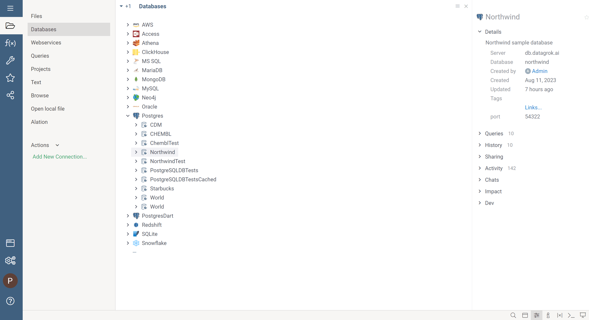

# Caching function results

Datagrok can cache the results of functions on both client and server sides.
Only those functions that have one or more output parameters can be cached.

## Client-side cache

Datagrok uses [IndexedDb](https://www.w3.org/TR/IndexedDB/) for client-side cache, and this type of cache has several limitations:

* Function output parameters should be scalar (integer, float or string) or of the following types - [dataframe](../datagrok/concepts/table.md), [graphics or datetime](../datagrok/concepts/functions/func-params-annotation.md).
* Maximum cache size for the function is 100 MB.
* Maximum record count in the **Client-side cache** is 100000.

### To enable Client-side cache

1. Go to **Settings** > **Cache**.
2. Toggle **Client-side cache** switch.
3. Press **Apply** button.

> Note: You can clear client-side cache by pressing **Clear client cache**.

## Server-side cache

Datagrok stores the results of functions in a relational database as server-side caching. It doesn't have any limitations on size or type of parameters 
and will be used when **Client-side cache** is not suitable.

### To enable Server-side cache

1. Go to **Settings** > **Cache**.
2. Toggle **Server-side cache** switch.
3. Press **Apply** button.

## Using cache

You can apply cache to almost all types of functions. But it really shines with [DataQueries](../access/access.md#data-query) and [Scripts](../compute/scripting.md).

### To apply cache for a particular function

1. Add `meta.cache` annotation parameter in a function header. This parameter can take several values:
   * `client` - to use only **Client-side cache**
   * `server` - to use only **Server-side cache**
   * `all` - to use both types of cache.

2. Optionally add `meta.cache.invalidateOn` to specify when the cache is invalidated. This parameter accepts valid cron expressions. If not specified, the cache will never be updated.

For example:

```
#name: Example
#language: python
#meta.cache: client
#meta.invalidateOn: 0 0 1 * * ?
#input: string table [Data table]
#output: int result

...
```

### To apply cache for all queries under the specific connection

1. Right-click the connection, select **Edit...** and toggle **Cache Results**. This will activate both client-side and server-side cache.
2. Optionally fill in the **Invalidate On** field.

>Note: Additionally you can toggle **Cache Schema**: to speed up building the database schema.



Also, you can configure the cache for connection programmatically in the connection JSON definition. For example:

```json
{
  "name": "Northwind",
  "parameters": {
    "server": "dev.datagrok.ai",
    "port": 23306,
    "db": "Northwind",
    "cacheSchema": false,
    "cacheResults": true,
    "ssl": false,
    "connString": ""
  }
}
```