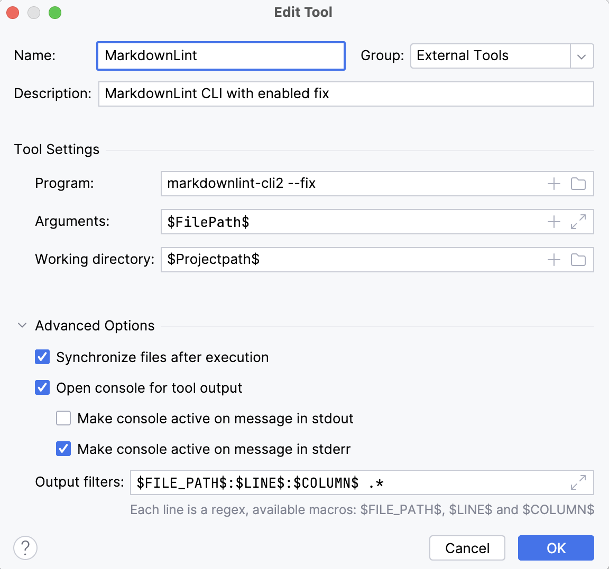

```mdx-code-block
import Tabs from '@theme/Tabs';
import TabItem from '@theme/TabItem';
```

## Install Docusaurus and linting tools

[Docusaurus](https://docusaurus.io/) is an optimized site generator. Docusaurus
is a project for building, deploying, and maintaining open source project
websites.

### 1. Install the latest stable NodeJS

Use instructions from the official
[Node JS](https://nodejs.org/en/download) installation page.
After installation, check that the npm version is at least `v9.x.x`:

```shell
npm --version
```

### 2. Install hyperlink checker and commit linting tools

To check for incorrect hyperlinks, we use the hyperlink checker:

```shell
npm install --global @untitaker/hyperlink
```

To lint and flag style issues in markdown files
we use [markdownlint](https://github.com/DavidAnson/markdownlint).

```mdx-code-block
<Tabs>
<TabItem value="vscode" label="VSCode" default>
```

1. Install [markdownlint-cli2](https://github.com/DavidAnson/markdownlint-cli2#install)

   ```bash
   npm install --global markdownlint-cli2
   ```

2. [Install](https://github.com/DavidAnson/vscode-markdownlint#install)
   Markdownlint [VSCode plugin](https://marketplace.visualstudio.com/items?itemName=DavidAnson.vscode-markdownlint)

3. [Configure autofix for issues](https://github.com/DavidAnson/vscode-markdownlint#fix)
4. Show markdownlint warnings using the shortcut: `Ctrl+Shift+M`/`⇧⌘M`

```mdx-code-block
</TabItem>
<TabItem value="idea" label="JetBrains IDE">
```

1. Install [markdownlint-cli2](https://github.com/DavidAnson/markdownlint-cli2#install)

   ```bash
   npm install --global markdownlint-cli2
   ```

2. Add MarkdownLint as [External Tool](https://www.jetbrains.com/help/idea/configuring-third-party-tools.html#local-ext-tools). `Preferences > Tools > External Tools > + (Add)`
   1. Name: `MarkdownLint`
   2. Description: `MarkdownLint CLI with the enabled fix.`
   3. Program: `markdownlint-cli2 --fix`
   4. Arguments: `$FilePath$`
   5. Working Directory: `$Projectpath$`
   6. Output filters: `$FILE_PATH$:$LINE$:$COLUMN$ .*`
   7. Enable `Make console active on message in stderr`

   

3. To run MarkdownLint on the current file, click `Tools > External Tools > MarkdownLint`.

4. _(Optional)_ To run MarkdownLint easier, [add an icon to the toolbar](https://www.jetbrains.com/help/idea/customize-actions-menus-and-toolbars.html#customize-menus-and-toolbars). 
   `Preferences > Appearance & Behavior > Menus and Toolbars > Main Toolbar > Toolbar Run Actions > + > Add Action... > External Tools > External Tools > MarkdownLint > OK`.    

5. _(Optional)_ To run MarkdownLint easier, [add a shortcut](https://www.jetbrains.com/help/idea/configuring-keyboard-and-mouse-shortcuts.html). 
   `Preferences > Keymap > External Tools > MarkdownLint > Right click > Add Keyboard Shortcut > Set the shortcut you like, for example, Ctrl+Shift+M/⌘⇧M`.    

```mdx-code-block
</TabItem>
<TabItem value="cli" label="CLI">
```

1. Install [markdownlint-cli2](https://github.com/DavidAnson/markdownlint-cli2#install)

   ```bash
   npm install --global markdownlint-cli2
   ```

2. Run MarkdownLint using the following command

   ```bash
   markdownlint-cli2 --fix "help/**/*.{md,mdx}"
   ```

```mdx-code-block
</TabItem>
<TabItem value="branch" label="Docker">
```

1. Pull the Docker image

   ```bash
   docker pull davidanson/markdownlint-cli2:v0.12.1
   ```

2. Run MarkdownLint using Docker

   ```mdx-code-block
   <Tabs>
   <TabItem value="win" label="Windows">
   ```

   ```cmd
   docker run -v %cd%:/workdir --entrypoint="markdownlint-cli2 --fix" davidanson/markdownlint-cli2:v0.12.1 "help/**/*.{md,mdx}"
   ```

   ```mdx-code-block
   </TabItem>
   <TabItem value="bash" label="Linux/MacOS" default>
   ```

   ```bash
   docker run -v "$(pwd):/workdir" --entrypoint="markdownlint-cli2 --fix" davidanson/markdownlint-cli2:v0.12.1 "help/**/*.{md,mdx}"
   ```

   ```mdx-code-block
   </TabItem>
   </Tabs>
   ```

```mdx-code-block
</TabItem>
</Tabs>
```

### 3. Prepare Datagrok repository and Docusaurus

The source code and READMEs are located in our
[public repository on GitHub](https://github.com/datagrok-ai/public/tree/master).
This section helps you to set up this repository and install all required packages.

1. Install commit linting tools as described in the [Git policy](../dev-process/git-policy#commit-linting)

1. Open the Docusaurus folder in the _Datagrok public_ repository:

    ```shell
    cd public/docusaurus
    ```

1. Install package dependencies:

    ```shell
    npm install
    ```

1. As we use Docusaurus to generate the API documentation,
you need to repeat the npm installation steps in the `js-api` folder:

```mdx-code-block
<Tabs>
<TabItem value="win" label="Windows">
```

```cmd
cd ..\js-api
npm install
```

```mdx-code-block
</TabItem>
<TabItem value="bash" label="Linux/MacOS" default>
```

```shell
cd ../js-api
npm install
```

```mdx-code-block
</TabItem>
</Tabs>
```

## Make changes

### 1. Create the branch

Create the branch for your changes following the [General flow](../dev-process/git-policy#general-flow) 
from the Git policy.

### 2. Run Docusaurus locally

```mdx-code-block
<Tabs>
<TabItem value="win" label="Windows">
```

```cmd
cd ..\docusaurus
npm run start-debug
```

```mdx-code-block
</TabItem>
<TabItem value="bash" label="Linux/MacOS" default>
```

```shell
cd ../docusaurus
npm run start-debug
```

```mdx-code-block
</TabItem>
</Tabs>
```

Docusaurus will be available at [http://localhost:3000](http://localhost:3000).

### 3. Make changes

Now, you can proceed with the documentation editing.
Docusaurus will recompile the documentation on every change you make,
so you will instantly see all the improvements you have made to the documentation.
If you don't see your changes immediately, reload the page.

### 4. Lint your changes

Before making a commit, check that the documentation builds without errors.

1. Run the markdown linter for all changed files from your IDE or via the command line:

    ```shell
    markdownlint-cli2-fix changed-documentation-file.md
    ```

1. To test internal links and anchors, convert markdown to HTML using [Docusaurus](https://docusaurus.io/)
and then check all links using [hyperlink](https://github.com/untitaker/hyperlink).
Stop Docusaurus by pressing `Ctrl+C` and run the following commands to build and check your documentation.
Note that the build step will take some time.

```mdx-code-block
<Tabs>
<TabItem value="win" label="Windows">
```

```cmd
cd docusaurus
npm run build

hyperlink --check-anchors build --sources ..\help
```

```mdx-code-block
</TabItem>
<TabItem value="bash" label="Linux/MacOS" default>
```

```bash
cd docusaurus
npm run build

hyperlink --check-anchors build/ --sources ../help/
```

```mdx-code-block
</TabItem>
</Tabs>
```

### 5. Commit and push your changes

Make and push a commit, following the [Commit message policy](../dev-process/git-policy#commit-message-policy)
to choose the correct commit naming.

Finally, create a pull request to merge your changes to the master branch.

## GitHub Actions Docusaurus workflow

[GitHub Actions Docusaurus workflow](https://github.com/datagrok-ai/public/actions/workflows/docusaurus.yaml) includes:

* Lint checks using [markdownlint](https://github.com/DavidAnson/markdownlint-cli2) linter.
* If the checks are finished successfully, GitHub will convert the markdown files to HTML
  using [Docusaurus](https://docusaurus.io/)
  * The result HTML help pages are also available as GitHub Actions artifact: `docusaurus`
* Then [Hyperlink](https://github.com/untitaker/hyperlink) checks the result HTML files.
* If the checks are finished successfully, and the changes are in the master branch,  GitHub Actions will deploy the documentation to the server.
  * 'Deploy to server' step contains detailed information about changes that are made on the server.
* Finally, GitHub Actions performs Typesense DocSearch Scrape to update indexes for search in the wiki

If any error occurs during checks, the deployment to the server will be canceled. Check for errors in the GitHub Actions log or in GitHub Actions run summary.

More information about flow can be found on the Docusaurus Help tab in [public repository CI/CD flows](../dev-process/ci-flow.mdx#public-repository-cicd-flows).

### Trigger GitHub Actions manually

If an error occurs for the action triggered by the commit, it is possible to trigger the action manually.

1. Use [Docusaurus workflow](https://github.com/datagrok-ai/public/actions/workflows/docusaurus.yaml).
2. Press `run workflow`. Choose the target branch. Then `Run workflow`. Note that deployment to the server is executed for the master branch only.
3. Check that the GitHub Actions workflow finished successfully.
