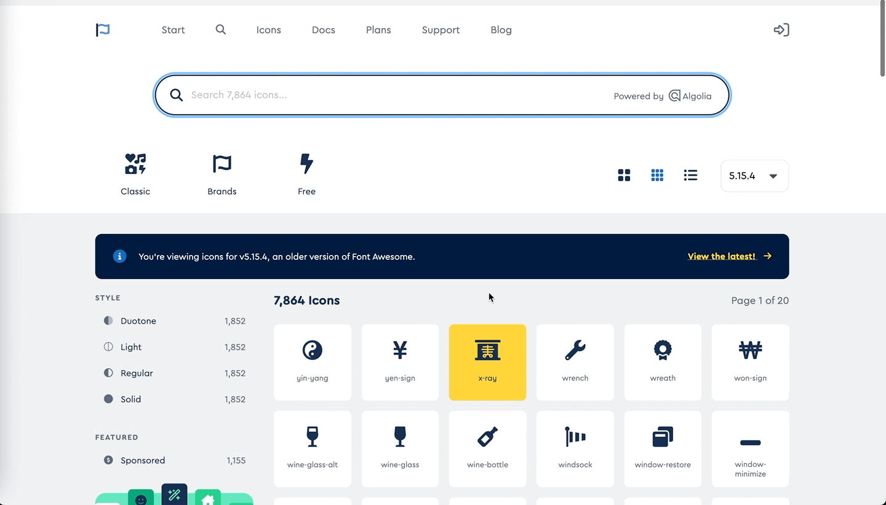

```mdx-code-block
import Tabs from '@theme/Tabs';
import TabItem from '@theme/TabItem';

```

This guide has basic information on how to write in MDX-compatible Markdown syntax. It is not intended to be exhaustive. Read the [Docusaurus Markdown features](https://docusaurus.io/docs/next/markdown-features), [Basic Markdown Syntax](https://www.markdownguide.org/basic-syntax), and [Extended Syntax](https://www.markdownguide.org/extended-syntax/) for more details and examples.

## File format and naming convention

When creating new files, keep the filename short. Don't use capital letters or spaces. When the filename of a Markdown file matches the name of a folder exactly, clicking the folder displays the contents of the Markdown file.

A Markdown file can have either an `.md` or `.mdx` extension but you can override the MD format with the [front matter](#metadata-front-matter) `format: mdx`. When choosing between the MD and MDX formats, use the MDX format only if you are using [JSX](https://docusaurus.io/docs/markdown-features/react). The MDX format is strict, and you may get compilation errors. 

## Sidebar position and label

By default, documents and folders displayed on the left sidebar are sorted alphabetically. You can specify custom labels and order:

* For documents, use the `sidebar_position` and `sidebar_label` [front matter](#metadata-front-matter):

  ```
  sidebar_position: 1
  sidebar_label: 'Custom document title'
  ```
* For folders, create a `_category_.yml` file within a folder and specify the `position` and `label` front matter in that file:

  ```
  position: 1 # float position is supported
  label: 'Custom folder title'
  ```

## Metadata (front matter)

Markdown documents have metadata at the top called _front matter_. At the very top of each wiki page, include the following:

| Parameter/Type  | Description|
|:--|:--|
| `title` (string) |**Required.** The `title` is automatically rendered using the H1 style at the top of the page and is used in navigation if a  `sidebar_label` is not included. Keep it short (1-3 words).|
| `sidebar_label`  (string) |**Optional.** Use a different title for the left sidebar navigation.|
| `sidebar_position` (number) |**Optional.** Overrides default position of a doc inside the sidebar directory.
| `description` (string) |**Optional.** This is what appears when the page is referenced in a Google search result.|
| `keywords` (string[ ]) |**Optional.** A list of meta tags for the document page and search engines.|
<!--
| `unlisted` (boolean) |**Optional.** A hidden document, which is not indexed and can only be accessed via a direct link.|
-->

To see the full list of available options, [visit the Docusaurus website](https://docusaurus.io/docs/next/api/plugins/@docusaurus/plugin-content-docs#markdown-front-matter).

## Introduction

In the first paragraph of the document, provide an overview of the topic and/or set the user's expectation for what they will find on this page.

## Table of contents. Headers

* For titles and headers, use `Sentence case like this`. This means only capitalizing the first word and any proper nouns.
* Don't end headers with a period.
* Don't include your own table of contents (TOC). Both GitHub and Docusaurus automatically generate TOC based on the document's headers.

* **H1 headers:** Never use in a document. The _title_ front matter is automatically generated as an H1.
* **H2 headers:** These headers are shown in the page's TOC. Ensure they concisely reflect the content of each section. Keep it short (1-3 words).
* **H3 headers:** These headers are also shown in the TOC. Ensure the headers represent the content that users may want to access directly. Keep it short (1-3 words).
* **H4 headers:** These headers emphasize things within a subsection of the page. They can be longer than the other headers because they aren't shown in the TOC.

## Content

Use only standard Markdown syntax and a limited set of the extended MDX features listed below for document text. 
Avoid complex formatting, additional MDX capabilities, or HTML tags, as these are not supported by Datagrok widgets.

<Tabs
  defaultValue="tabs"
  values={[
    {label: 'Tabs', value: 'tabs'},
    {label: 'Details', value: 'details'},
    {label: 'Admonitions', value: 'admonitions'},
    {label: 'Code', value: 'code'},
    {label: 'Emphasis', value: 'emphasis'},
    {label: 'Lists', value: 'lists'},
    {label: 'Links', value: 'links'},
    {label: 'Tables', value: 'tables'},
    {label: 'Images', value: 'images'},
    {label: 'Videos', value: 'videos'},
    {label: 'UI', value: 'ui'},
  ]}>

<TabItem value="tabs">

[Tabs](https://docusaurus.io/docs/next/markdown-features/tabs) are a great option for providing context-driven information. For example, you can use tabs to show code examples in different languages or instructions for different operating systems. 

To use tabs, add these lines right below the [front matter](#metadata-front-matter):

```
import Tabs from '@theme/Tabs';
import TabItem from '@theme/TabItem';
```

For each set of tabs, use this code:
     
     <Tabs groupID="my-group"
        defaultValue="alpha"
        values={[
          {label: 'Alpha', value: 'alpha'},
          {label: 'Beta', value: 'beta'},
        ]}>
      <TabItem value="alpha">Text for alpha.</TabItem>
     <TabItem value="beta">Text for beta.</TabItem>
     </Tabs>
     
To synchronize tabs of the same kind, assign a `groupId` parameter to all related tabs. This ensures that the chosen selection persists across all instances of tabs with the same `groupId`.

<details>
<summary>Example</summary>

<Tabs>
<TabItem value="markdown" label="Markdown">

     <Tabs groupId="operating-systems">
     <TabItem value="windows" label="Windows">Windows instructions.</TabItem>
     <TabItem value="linux" label="Linux">Linux instructions.</TabItem>
     </Tabs>

     <Tabs groupId="operating-systems">
     <TabItem value="windows" label="Windows">More Windows instructions.</TabItem>
     <TabItem value="linux" label="Linux">More Linux instructions.</TabItem>
     </Tabs>

</TabItem>
<TabItem value="result" label="Result">

<Tabs groupId="operating-systems">
  <TabItem value="windows" label="Windows">Windows instructions.</TabItem>
  <TabItem value="linux" label="Linux">Linux instructions.</TabItem>
</Tabs>

<Tabs groupId="operating-systems">
  <TabItem value="windows" label="Windows">More Windows instructions.</TabItem>
  <TabItem value="linux" label="Linux">More Linux instructions.</TabItem>
</Tabs>

</TabItem>
</Tabs>

</details>

<!--Using 5 indents inside the tabs achieves the same result as text code blocks-->

</TabItem>
<TabItem value="code">

To display lines of code, use code blocks. Specify which language you are using as Markdown highlights each language differently. You can also include a title with the code block as well.

     ```java title="Custom Title"
     RemoteWebDriver driver = new RemoteWebDriver(url, capabilities);
     ```

```java title="Custom Title"
RemoteWebDriver driver = new RemoteWebDriver(url, capabilities);
```

```mdx-code-block
</TabItem>
<TabItem value="details">
```

To hide content by default, wrap the content in a [details](https://docusaurus.io/docs/next/markdown-features#details) block. Make the summary brief and informative so users know what to expect: 

```
<details>
<summary>How to add a license path</summary>

Your instructions.
   
</details>
```
  
<details>
<summary>How to add a license path</summary>

Your instructions.

</details>

This is useful for content such as:

* An especially large code block.
* Information that users may need only occasionally. 

</TabItem>
<TabItem value="admonitions" label="Admonitions">

You can use different [admonitions](https://docusaurus.io/docs/next/markdown-features/admonitions). Use them sparingly to avoid visual overload:

<Tabs defaultValue="note"
   values={[
    {label: 'Note', value: 'note'},
    {label: 'Tip', value: 'tip'},
    {label: 'Important', value: 'important'},
    {label: 'Caution', value: 'caution'},
    {label: 'Warning', value: 'warning'},
    {label: 'Custom', value: 'custom'},
   ]}>

<TabItem value="note">

```
:::note

This is a note

:::
```

:::note

This is a note

:::

</TabItem>
<TabItem value="tip">

```
:::tip

This is a tip

:::
```

:::tip

This is a tip

:::

</TabItem>
<TabItem value="important">

```
:::important

This is a note

:::
```

:::important

This is a important

:::

</TabItem>
<TabItem value="caution">

```
:::caution

This is a caution

:::
```

:::caution

This is a caution

:::

</TabItem>
<TabItem value="warning">

```
:::warning

This is a warning

:::
```

:::warning

This is a warning

:::


</TabItem>
<TabItem value="custom">

```
:::note developers

This is a note with a custom title

:::
```

:::note developers

This is a note with a custom title

:::

</TabItem>
</Tabs>

</TabItem>

<TabItem value="emphasis">

Use:

* Double asterisks (`*`) for **bold** text.
* Single underscores (`_`) for _italics_.

<Tabs>
<TabItem value="italics" label="Italicize" default>

* To draw attention to a specific word or phrase.
* Explanatory or introductory text at the start of a list item (see the _Lists_ tab for more details).
* Mathematical variables and version variables. For example: _x_ + _y_ = 3, version 1.4._x_.
* The word "optional" for bulleted items in procedures 
  * Do X.
  * _Optional_. To do Y, open Z. 

</TabItem>
<TabItem value="bold-text" label="Make bold">

* UI elements, names of tools, apps, packages, etc.
* Explanatory or introductory text at the start of a list item (see the _Lists_ tab for more details).

</TabItem>
<TabItem value="no-emphasis" label="Don't add emphasis">

* To linked terms 
  * The **Query Editor** lets you edit queries. To learn more, see [Query Editor](link).
  * A query is a [function](link). Like other _functions_ in Datagrok,...

</TabItem>
</Tabs>

</TabItem>
<TabItem value="ui">

Capitalize the names and emphasize all user interface elements in **bold** text. When referring to specific UI text (such as a menu item), use the same capitalization that's displayed in the user interface.

<details>
<summary>UI naming conventions</summary>

* Context Panel
* Info Pane
* Sidebar
* Top Menu
* Table View
* Workspace
* Toolbox
* Status Ribbon

<!--[PNG PLACEHOLDER]-->

See the [word list](word-list.md) to write consistently about _dialogs_, _dropdowns_, _clearing checkboxes_, and more.

</details>

When documenting how to navigate through the Datagrok UI:

* Start with purpose, then location, then action. This helps users scan the information quickly. Use the arrow key (`>`) to break a series of cascading UI elements.
  * To open the **File Manager**, on the **Sidebar**, select **Data** > **Files**.

* When the UI text sufficiently explains the fields in a section, don't include a task step for every field. Instead, summarize multiple fields in a single task step. Use the phrase 'complete the fields' or an equivalent.
  * Right-click the query and select **Edit...** A dialog opens. In the dialog, set the parameters.

* If you are documenting multiple fields and only one field needs explanation, do it in the same step.
  * In the dialog, set the connection parameters. When connecting to public buckets in AWS S3, select the **Anonymous** checkbox.

* To describe multiple fields, use unordered list items.
  * Set the parameters.
    * When connecting to public buckets in AWS S3, select the **Anonymous** checkbox.
    * To change the connection credentials, click the **Gear** icon.

If you use icon images in addition to the text description, do it as follows:

* Click the **Add new connection** (**+**) icon...

<!--
<details>
<summary>Commonly used icons</summary>

| Icon | Description | HTML tag | 
|:----:|:-----|:---------|
| <i class="fa-solid fa-bars"></i>  |**Hamburger** icon| `<i class="fa-solid fa-bars"></i>`  |

Docusaurus supports [fontawesome](https://fontawesome.com/). 

To add an icon, copy the HTML tag from the fontawesome's page and paste it to your document:



</details>
-->

</TabItem>
<TabItem value="lists">

For unordered lists, use asterisks (`*`) or dashes (`-`). For numbered lists, use `1.` for all items. Markdown automatically numbers the items sequentially when building the site. 

If a list starts with an introductory word or phrase, do the following:

* Always capitalize the first word in a list.

  This is an introductory phrase:

  * Completed by this capitalized sentence.
  * Also completed by this capitalized sentence.

* Don't add commas (`,`) or semicolons (`;`) to the ends of list items. If a list item is a complete sentence (with a subject and a verb), add a period at the end. For individual items, add a period only an the end of your list.
* Be consistent. Don't mix complete sentences and individual items in a list. Each bulleted item should form a grammatically correct sentence with an introductory word or phrase. 
* Separate list items from explanatory text with a colon (`:`). Also, emphasize the list items to make them visually stand out. 

  This is a procedure:

  * _First item_: this explains the first item.
  * _Second item_: this explains the second item.  

</TabItem>
<TabItem value="links">

Use inline links within your document. Avoid titling links as "here" or "this page". Instead, write the sentence naturally, then wrap the most appropriate phrase with the link:

* For more information, see [Data Access](../../access/access.md).
* Visualize molecules using [chemically-aware viewers](../../datagrok/solutions/domains/chem/chemically-aware-viewers.md). 

For documents within the Datagrok help repository, all links should be relative to your Markdown file:

* Link to a `[section in my document](#section-header)`
* Link to another `[document in the same folder](other-doc.md)`
* Link to another `[document in a subfolder](subfolder/other-doc.md)`
* Link to another `[document in a parent folder](../parentFolder/other-doc.md)`

```mdx-code-block
</TabItem>
<TabItem value="images">
```

Capture screenshots or screen recording using [ScreenToGif](https://www.screentogif.com/) or a similar tool. Place the images or recordings to a separate directory named `img` in the same location as your Markdown file. Make sure that the path to the images or recordings is relative to your Markdown file:

```text

```

When you take screenshots/screen recordings:

* Capture only the relevant UI. Reduce the size of your browser window as much as possible to keep elements close together and reduce empty space. Exclude any areas of UI that don't illustrate the point.
* Capture screenshots and screen recordings at a browser viewport width of 800px and height of 500 pixels. This helps keep scaling consistent. You can use this [Chrome extension](https://chrome.google.com/webstore/detail/window-resizer/kkelicaakdanhinjdeammmilcgefonfh?hl=en) to quickly set your browser viewport to 800px by 500px.
* Don't zoom in or out.
* When displayed in the documentation, the text in the image of a screenshot should closely match the text size of the page itself.
* PNG and GIF are preferred file formats.

</TabItem>
<TabItem value="videos">

Any videos must be from the Datagrok's YouTube account. To embed a YouTube video on a wiki page:

1. Copy and paste this code to your page.

  ```
  <Iframe url="https://www.youtube.com/embed/<your_video_ID>?rel=0"
    width="800px"
    height="500px"
    className="video-container"
    display="initial"
    position="relative"
    allow="accelerometer; autoplay=1; clipboard-write; encrypted-media; gyroscope; picture-in-picture"
    allowfullscreen
    />

  import Iframe from 'react-iframe';
  ```

1. Replace `<your_video_ID>` with the specific video ID obtained from the YouTube link URL. Make sure to keep `?rel=0` at the end. This ensures that after viewers finish watching the embedded video, they will only be suggested videos from the Datagrok YouTube channel.

</TabItem>
<TabItem value="tables">

* Use Markdown rather than HTML as much as possible as MDX may not recognize it. For example, when constructing complex tables, do not use `<table>`.
* Use tags `<li><li/>` and `<br/>` when constructing complex tables, for example, creating a list or adding a blank line.

```text
| Column 1    | Column 2                            |
|:------------|:------------------------------------|
| Category    | <li>a</li><li>b</li><br/><li>c</li> |
```

| Column 1    | Column 2                            |
|:------------|:------------------------------------|
| Category    | <li>a</li><li>b</li><br/><li>c</li> |


</TabItem>
</Tabs>

## Troubleshooting

A common issue with Docusaurus is the sensitivity of MDX to the placement of code blocks and other text. If you've included a code block or text using common markdown syntax, and things aren't rendering as expected, try the following:

* Add an empty line after above and below each code block or text.
* When dealing with tabs, either indent the code by five spaces or wrap the MDX tags in an `mdx-code-block`:
  
  ```  
       ```mdx-code-block
       <Tabs>
       <TabItem value="tab" label="Tab">
       ```
    
       Tab contents.
  
       ```mdx-code-block
       </TabItem>
       </Tabs>
       ```
  ```

