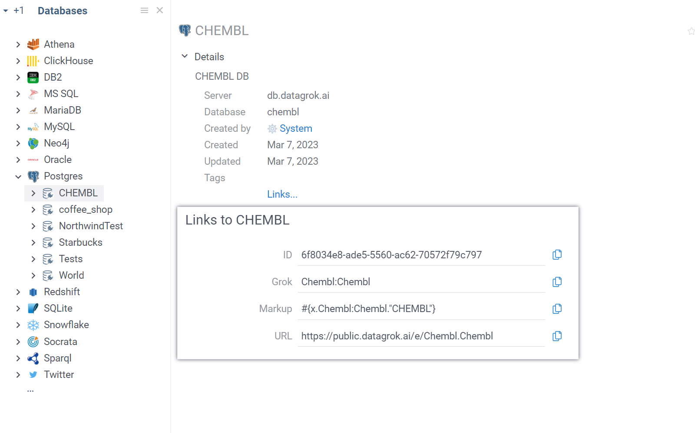

This article walks you through extracting data using various methods, such as:

* Creating connections to data sources and running queries
* Using REST APIs
* Reading files into dataframe objects in your application.

## Connections

With the Datagrok platform, you can programmatically retrieve data from different sources like files, databases, cloud, or webservices. Here's a general workflow for getting data:

1. Add a data connection to your package.
1. Specify the connection's parameters.
1. Transfer credentials.
1. Create a parameterized query and execute it in JavaScript code to return a dataframe.
1. Optional. Share a connection.

:::note

To learn how to create data connections from the UI, see documentation for the respective data source in the [Access section](../../access) of our documentation.

:::

### Creating a connection

To add a connection programmatically, first create a [package](../develop.md#packages). Packages can have multiple data connections in the `connections` folder. Create a separate JSON file with the required parameters for each connection.

<details>
<summary> Example </summary>

```json
{
  "name": "ChEMBL",
  "parameters": {
    "server": "$GROK_DB_SERVER",
    "db": "chembl_24"
  },
  "dataSource": "PostgresDart",
  "description": "CHEMBL db",
  "tags": [
    "demo",
    "chem"
  ]
}
```

</details>

The `name` field is optional. If omitted, the filename (without the extension) is used as the connection name. Keep in mind that connection names are not case-sensitive.

Giving connection parameters in `json` is equivalent to completing these steps from the UI. For example, to connect to a database:

1. Go to **Data** > **Databases**.
1. Right-click the data source you want (for example, PostgreSQL) and select the context action **Add new connection**.

Our package utilities provide a similar template when running the `grok add connection <name>` command. See examples in [Chembl](https://github.com/datagrok-ai/public/tree/master/packages/Chembl)
or [UsageAnalysis](https://github.com/datagrok-ai/public/tree/master/packages/UsageAnalysis)
packages.

Connection parameters are specific to a data source. Most data providers require common parameters, such as:

* Data source
* Server
* Port
* DB
* Cache schema
* Cache results
* SSL
* Connection string
* Login
* Password
* Other parameters.

See [Supported connectors](../../access/databases/connectors/connectors.md) for details.

When providing a connection string, you don't need to pass other parameters.

Parameters carrying sensitive data (such as **Login**/**Password** or **Access Key**/**Secret Key**) are handled in a special way.

Datagrok has a [built-in credentials management system](../../govern/access-control/access-control.md#credentials-storage) that protects sensitive data. Parameters regulating access to the data source are processed independently, so don't include them in a custom connection string.

<details>
<summary> Example: Specifying credentials for a data connection </summary>

```json
{
  "name": "Northwind",
  "parameters": {
    "server": "dev.datagrok.ai",
    "port": 23306,
    "db": "Northwind",
    "cacheSchema": false,
    "cacheResults": false,
    "ssl": false,
    "connString": ""
  },
  "credentials": {
    "parameters": {
      "login": "",
      "password": ""
    }
  },
  "dataSource": "MariaDB",
  "description": "Northwind Connection",
  "tags": [
    "demo"
  ]
}
```

</details>

 Instead, deploy a connection and send a POST request to `$(GROK_HOST)/api/credentials/for/$(PACKAGE_NAME).$(CONNECTION_NAME)` with the raw body containing JSON, like `{"login": "abc", "password": "123"}`, and headers `{"Authorization": $(API_KEY), "Content-Type": "application/json"}` (get the API key from your Datagrok profile page, for example [https://public.datagrok.ai/u](https://public.datagrok.ai/u)).

### Querying data

#### Creating queries

Once the connection is established, you can extract data by sending a [query](../../access/access.md#data-query) to the data source. In a package, queries are typically placed in the `queries` folder.

Similar to [scripts](../../compute/scripting/scripting.mdx), you can annotate SQL statements with comments as the underlying
mechanism is fundamentally the same ([learn more about functions](../../datagrok/concepts/functions/functions.md)). To use an existing connection in a query, provide its name along with the namespace in the `connection` parameter.

Here's an example for your `queries.sql` file:

<details>
<summary> SQL query </summary>

```sql
--name: protein classification
--connection: chembl
select * from protein_classification
--end
```

</details>

SQL statements are annotated with comments, just like [functions](../../datagrok/concepts/functions/func-params-annotation.md),
since the underlying mechanism is essentially the same (read more on the concept of
[functions](../../datagrok/concepts/functions/functions.md)). Here we have two header parameters: the query `name` and the
`connection` to use. In fact, this particular query could have been even simpler: there is no need to specify
`connection` if the package only has one. Similarly, the tag `end` is not required if there is only one query per file:
the parser needs it to understand where the current query ends and the next one begins. So safely omit the name of
`connection` and/or the `end` tag if these conditions are met.

To use an existing connection in a query, specify its name along with the namespace in the `connection` parameter. For
example, the above `chembl` connection that lives in the `Chembl` package has the following path: `chembl:chembl`. When
browsing connections on the platform, you can identify such path by opening `Links` in the tab `Details` of the context
panel.



If the package contains only one connection, the `connection` parameter can be omitted. Likewise, if there is just one query per file, the `end` tag isn't necessary, as the parser only needs it to differentiate between the end of one query and the beginning of another. Therefore, you can safely leave out the `connection` name and/or the `end` tag if these conditions are fulfilled.

:::tip

To quickly insert a
query template into your package, type `grok add query <name>` in the terminal.

:::

For a list of header parameters and further details related to query annotation, see [Parameterized queries](../../access/databases/databases.md#parameterized-queries) and [Parameter annotation](../../datagrok/concepts/functions/func-params-annotation.md). For examples of data queries, see the [Chembl package](https://github.com/datagrok-ai/public/tree/master/packages/Chembl/queries).

#### Running queries

There are several methods to execute queries. The most straightforward method is to run a query from
the UI, which corresponds to entering `$(PACKAGE_NAME):$(QUERY_NAME)()` in the console, for example, `Chembl:ProteinClassification()`.

In Datagrok, you can also call any function that can be executed in the console using Datagrok's JS API. This enables the use of corresponding methods in JavaScript:

```javascript
grok.functions.call('Chembl:ProteinClassification')
  .then(t => grok.shell.addTableView(t));
```

Additionally, there is a dedicated method for queries that take the query name as a required parameter and several additional parameters (such as query parameters, ad hoc status, and the polling interval):

```javascript
grok.data.query(`${PACKAGE_NAME}:${QUERY_NAME}`, {'parameter': 'value'}, true, 100);
```

To see how this method works, refer to [this example](https://public.datagrok.ai/js/samples/data-access/parameterized-query).

### Queries post-processing and layouts application

You can enhance your queries in the package by adding custom JavaScript scripts (see [Scripting](../../compute/scripting/scripting.mdx)) in the `queries` folder. These scripts allow you to manipulate and refine the data returned by your queries, providing more tailored and insightful results.
Additionally, if your query returns table data, you can apply [layouts](../../visualize/view-layout.md) to the results. Layouts help in organizing and presenting the data in a more readable and visually appealing manner to all users running your query. 
Each layout file should have a `.layout` extension. Script and layout files must be named identically to the corresponding query file.

:::note

Each query file should contain only one query. This ensures that the associated post-process script and layout are correctly applied to it.

:::

Here's an example of `queries` folder structure:

<details>
<summary> Example </summary>

```
.
├── ...
├── queries                 # Folder that contains all package queries
│   ├── dummy.sql           # SQL file that contains single query that returns table data
│   ├── dummy.js            # Post-processing script that accepts dataframe as input
│   ├── dummy.layout        # Layout for the query result
│   └── ...
└── ...
```

</details>

### Sharing connections

Data connections can be shared as part of a [project](../../datagrok/concepts/project/project.md)
, [package](../develop.md#packages) (and [repository](../../access/files/shares//git.md) containing this package), or as a
standalone [entity](../../datagrok/concepts/objects.md). The access rights of a database connection are inherited from the access rights of a
query. However, the access rights of a query don't inherit the access rights of the database connection. Consequently, when sharing a query, the associated database connection will be shared automatically. However, sharing a connection does not automatically share your queries. In the case of web queries, they are shared automatically when the corresponding connection is shared.

### Caching results

See [Caching data](../../access/databases/databases.md#caching-data).

## Rest endpoints

Webservices provide endpoints that you can programmatically connect to. You can use the [OpenAPI/Swagger](https://swagger.io/docs/specification/about/) format supported by Datagrok (see [OpenAPI](../../access/open-api.md) for details) or [the platform's server](https://dev.datagrok.ai/js/samples/dapi/fetch) to send a network request. The method used to proxy requests is similar to the standard `fetch` API:

```javascript
const url = 'https://jsonplaceholder.typicode.com/posts';
const data = {name: 'username', password: 'password'};

grok.dapi.fetchProxy(url, {
  method: 'POST',
  headers: {'Content-Type': 'application/json'},
  body: JSON.stringify(data)
}).then(response => grok.shell.info(response.ok));
```

## Reading files

In our [JavaScript API examples](https://public.datagrok.ai/js), you can find methods that provide data for
demonstration (`grok.data.demo` or `grok.data.getDemoTable`) and testing purposes (`grok.data.testData`). However, this section focuses on methods frequently used to deliver data to your applications.

### Package files

To access data within your package (e.g. open a `csv` table), load it from an URL, as you would with other [external files](https://public.datagrok.ai/js/samples/data-access/external/stock-prices). The package root
for client-side can be found with `webRoot` property. The example below retrieves the `test.csv` table from
the `data-samples` subdirectory and opens a table view for it:

```javascript
export let _package = new DG.Package();

grok.data.loadTable(`${_package.webRoot}data-samples/test.csv`)
  .then(t => grok.shell.addTableView(t));
```

### File shares

Here's a basic example on how to retrieve data from an existing file share:

```javascript
grok.functions.eval(`OpenServerFile("${USER}:Home/data.csv")`)
  .then(t => grok.shell.addTableView(t[0]));
```

In the example above, the script opens a dataframe using the file "data.csv" from a user's [**Home** directory](https://public.datagrok.ai/files), which is created by default for all users upon signup.

To create a new connection in your package, create a JSON file with these parameters:

```json
{
  "name": "New File Share",
  "parameters": {
    "dir": "/home/www/master/servergrok/data/demo",
    "indexFiles": true
  },
  "credentials": {
    "parameters": {
      "login": "",
      "password": ""
    }
  },
  "dataSource": "Files",
  "tags": [
    "demo"
  ]
}
```

Specify two parameters for the connection:

1. The directory you want to use
1. Whether you want to index files in that directory. If you do, an indexing data job will be created.

When referring to a file in your code, include the package and connection names before the file name. The path should be relative to what you previously specified in the `dir` parameter:

```javascript
grok.functions.eval(`OpenServerFile("${PACKAGE_NAME}:${CONNECTION_NAME}/data.csv")`)
  .then(t => grok.shell.addTableView(t[0]));
```

### Reading and writing files in file shares

The `grok.dapi` enables precise operations on files from file shares, such as writing, reading, checking existence, searching for presence by a pattern, renaming, moving, and deleting. For example, you can create a text file in your local file share like this:

`grok.dapi.files.writeAsText('<YOUR_NAME>:Home/testFile.txt', 'Hello, world!');`

All `dapi.files` methods accept three types of inputs:

* a fully specified file path, as seen
  in [these examples](https://github.com/datagrok-ai/public/blob/master/packages/ApiSamples/scripts/dapi/files.js)
* a variable of the `file` type (see [FileInfo](https://github.com/datagrok-ai/public/blob/14eb2acd6e36b33f64c4a0d108e940f7624af479/js-api/src/entities.js#L317)), which may come, for example, from info panels working on files
* a string containing a file share connection GUID

All `dapi.files` methods are asynchronous.

For a comprehensive understanding of the `files` API, see [this example](https://github.com/datagrok-ai/public/blob/master/packages/ApiSamples/scripts/dapi/files.js).

### Alternative methods for reading files

You can also use one of the following options to open files using JavaScript:

1. Define a function that takes an input of `file` type (see [FileInfo](https://github.com/datagrok-ai/public/blob/14eb2acd6e36b33f64c4a0d108e940f7624af479/js-api/src/entities.js#L317)): When you use this option, you can call `file.readAsBytes()`
  or `file.readAsString()` methods on this function. For example, by passing a string obtained from a file to `grok.data.parseCsv(csv, options)`, you can customize the construction of a dataframe from comma-separated values. Alternatively, you can pass a file to a [script](../../compute/scripting/scripting.mdx) to perform calculations and receive the results in your application's code.
1. Use `grok.data.openTable(id)`: This method is helpful when replicating a process where you need to open a specific table by its ID. See [this example](https://public.datagrok.ai/js/samples/data-access/open-table-by-id).

See also:

* [JavaScript Development](../develop.md)
* [Functions](../../datagrok/concepts/functions/functions.md)
