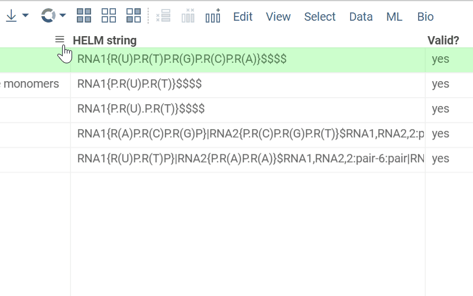

<!-- TITLE: Develop column tooltips -->

# Column tooltip

Developers can extend Datagrok with column tooltips. This could be done by defining a function annotated with special
comments. It should take a column with specified  `semType`,
return [DG.Widget](https://datagrok.ai/js-api/classes/dg.Widget) and have a tag `tooltip`. This is it!

The following example defines a tooltip for the column that has `semType: Macromolecule`.

```typescript
//name: sequenceTooltip
//tags: tooltip
//input: column col {semType: Macromolecule}
//output: widget result
export async function sequenceTooltip(col: DG.Column) {
  const tv = grok.shell.tv;
  let viewer = await tv.dataFrame.plot.fromType('WebLogo', {sequenceColumnName: col.name});
  return viewer;
}
```

Once a package containing that function is published, the platform will automatically create the corresponding tooltip
for the designated column. Here is how it looks:


