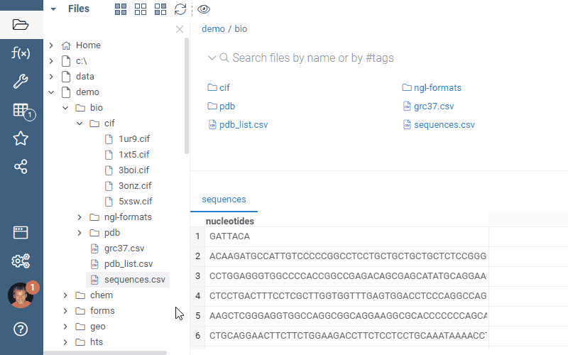

<!-- TITLE: Create custom file viewers -->

# Create custom file viewers

Datagrok provides a way to define custom file viewers that are used by the
[file share browser](../../access/connect-a-file-share.md). This could be done by defining a function annotated in a
special way. It should take a single argument of type `file`, return a `view`, and have at least two tags: `fileViewer`
and `fileViewer-<extension>` (specify the extension here). This is it!

The following example defines a file viewer for .mol, .sdf, and .cif files by visualizing them with the NglViewer.
<!--This
is real code from
the ["NglViewer" public package](https://github.com/datagrok-ai/public/blob/master/packages/NglViewer/package.js).-->

```js
//tags: fileViewer, fileViewer-mol, fileViewer-sdf, fileViewer-cif
//input: file file
//output: view v
nglStructureViewer(file) {
  let view = DG.View.create();
  var host = ui.div([], 'd4-ngl-viewer');
  var stage = new NGL.Stage(host);

  file
    .readAsBytes()
    .then(bytes => stage.loadFile(new Blob([bytes])));

  view.append(host);
  return view;
}

```

This is it! Once a [package](../develop.md#packages) containing that function is published, the platform will
automatically create the corresponding viewer when user selects the file with the specified extension. Here's how it
looks:



See also:

* [File shares](../../access/connect-a-file-share.md)
* [JavaScript development](../develop.md)
* [How to create file exporters](file-exporters.md)
