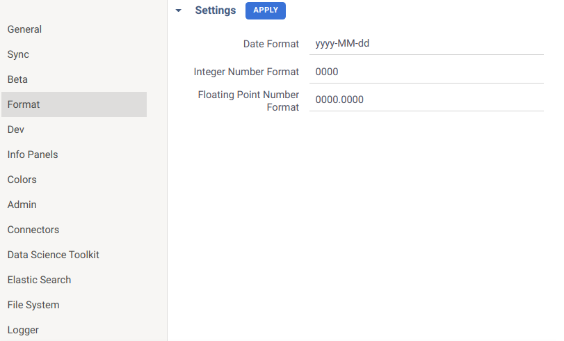

<!-- TITLE: Customize a grid -->

# Grid customization

Whenever users open a spreadsheet on the platform, they see it presented in a [grid](../../visualize/viewers/grid.md).
This view can be altered in many ways, both from the user interface and programmatically. The aspects subject to change
include:

* [formatting](#formatting) numbers and dates
* [ordering](#ordering) rows and columns
* controlling the [visibility](#column-visibility) of columns
* changing cell [size](#resizing)
* encoding categories with [colors](#color-coding) and many more

## Formatting

The Datagrok platform automatically sets the most appropriate format for numbers and dates in grid columns of a
particular dataset. However, the way such columns look may be changed. The global formatting settings allow users to
specify their default formats:



In addition to that, users may change the format directly
in [column properties](../../visualize/viewers/grid.md#formatting) of an open table. This is done by defining the value
of `format` tag. The syntax and standard formats are described in this [article](../../discover/tags.md#format) and
given for reference in the respective [code snippet](https://public.datagrok.ai/js/samples/grid/data-format). Here is a
brief example to illustrate how the representation of data can be changed:

```javascript
let view = grok.shell.addTableView(grok.data.demo.demog());

view.grid.col('height').format = 'scientific';
view.grid.col('weight').format = '#.0000';
view.grid.col('started').format = 'dd.MM.yyyy';
```

If a format is specified on a column level, it takes precedence over global settings. Another thing to keep in mind is
that the tag applies only to numeric and datetime columns. Columns of other data types will ignore the `format` tag. As
the actual values remain unchanged, sorting and filtering produce the same result regardless of selected data
representation.

## Ordering

The order of rows and columns is easy to adjust. Let's have a look at columns first:

```javascript
let view = grok.shell.addTableView(grok.data.demo.demog());
view.grid.columns.setOrder(['age', 'sex', 'race']);
```

The column names are not case-sensitive. If a dataset consists of more columns than specified in the `setOrder` method,
the unmentioned columns will appear after the given ones (this is shown in
the [example](https://public.datagrok.ai/js/samples/grid/order-columns)). A different logic applies when arranging rows:

```javascript
let view = grok.shell.addTableView(grok.data.demo.demog());
view.grid.setRowOrder([1, 56, 3, 6, 4]);
```

The `setRowOrder` method accepts an array of row indexes (starting at zero) and displays the corresponding rows
exclusively. This allows you to control which rows should be shown in the grid (
check out the [example](https://public.datagrok.ai/js/samples/grid/order-rows)). On the other hand, if you want to keep
all the rows and just sort them by a comparer function, you should use another method:

```javascript
let data = grok.data.demo.demog();
let view = grok.shell.addTableView(data);

let height = data.col('height');
let weight = data.col('weight');
let bmi = (i) => height.get(i) / weight.get(i);

view.grid.sortIndexes((i, j) => bmi(i) - bmi(j));
```

The `sortIndexes` method sorts in ascending order, run
this [code snippet](https://public.datagrok.ai/js/samples/grid/order-rows-by-comparer) to view the results. You can also
sort rows by values of a particular column like this:

```javascript
view.grid.sort(['age']);
```

The default sort order is ascending. Provide the second argument to specify the direction: `true`
stands for ascending and `false` for descending order:

```javascript
view.grid.sort(['disease', 'weight'], [true, false]);
```

A column may also have a custom value comparer associated with it. If you provide this function, it will be used for
sorting the column. For example, let's say we have a string column where values have some logical order. We can define a
comparison function that is used for its sorting later:

```javascript
let column = DG.Column.fromList(DG.TYPE.STRING, 'months', ['Feb', 'Jan', 'May', 'Mar']);

let months = { Jan: 1, Feb: 2, Mar: 3, Apr: 4, May: 5 };
column.valueComparer = (s1, s2) => months[s1] - months[s2];
```

It is possible to get the sorted order if needed:

```javascript
let order = column.getSortedOrder();
grok.shell.info(Array.from(order).map((i) => column.get(i)).join(', '));
let view = grok.shell.addTableView(DG.DataFrame.fromColumns([column]));
view.grid.setRowOrder(order);
```

Once a value comparer is defined for a column, it gets used by all visualizations, and for other purposes, such as
aggregation. Run the following
[script](https://public.datagrok.ai/js/samples/data-frame/sorting/custom-comparer)
and try attaching charts to the output table view paying attention to the properly sorted categories:


## Column visibility

It is possible to hide parts of data in a grid without actually removing them (see
an [example](https://public.datagrok.ai/js/samples/grid/hide-columns)). To achieve this, either explicitly specify the
columns you intend to show:

```javascript
let data = grok.data.demo.demog();
let view = grok.shell.addTableView(data);
view.grid.columns.setVisible(['age', 'sex', 'race']);
```

or hide the particular columns by adding `~` prefix to their names before creating a table view:

```javascript
let data = grok.data.demo.demog();
data.columns.byName('age').name = '~age';
let view = grok.shell.addTableView(data);
```

The approach largely depends on which columns are easier to list, but not only. Thus, to make the prefixed column
visible again, it is not enough to invoke `setVisible(['~columnName'])`, you have to invert the previous change first.
Besides, such renaming affects all table views derived from the data.

## Resizing

To change the size of a column in a grid, you need to set the `width` attribute of the column or row header:

```javascript
let data = grok.data.demo.demog();
let view = grok.shell.addTableView(data);

view.grid.columns.byName('age').width = 200;
view.grid.columns.byIndex(4).width = 300;
view.grid.columns.rowHeader.width = 100;
```

The row header counts as the first grid column, so calling `view.grid.columns.rowHeader` returns the same result
as `view.grid.columns.byIndex(0)`. You can test this by running the
above [example](https://public.datagrok.ai/js/samples/grid/resize-columns) on the platform.

## Color-coding

A grid can encode column categories with color. For instance, assigning custom category colors looks as follows:

```javascript
let view = grok.shell.addTableView(grok.data.demo.demog());

view.grid.col('sex').categoryColors = {
  'M': 0xFF0000FF,
  'F': 0xFF800080
};
```

This [example](https://public.datagrok.ai/js/samples/grid/category-colors) is also available on the platform. If the
object contains less categories than given in the corresponding column, the cells belonging to the unmentioned
categories will be filled with default colors. This might help in cases when you want to enable color-coding with
default colors, to do that, simply leave the object empty.

Colors can also be derived from column tags. Numerical columns have the options
`Off`, `Linear`, and `Conditional`, while categorical columns are limited to
`Off` and `Categorical`. Datetime columns support `Linear` encoding. Here is an
[example](https://public.datagrok.ai/js/samples/grid/color-coding-conditional)
of constructing a grid for a dataframe with these tags:

```javascript
let t = grok.data.demo.demog();

t.col('height').tags[DG.TAGS.COLOR_CODING_TYPE] = 'Conditional';
t.col('height').tags[DG.TAGS.COLOR_CODING_CONDITIONAL] = `{"20-170":"#00FF00","170-190":"#220505"}`;

t.col('age').tags[DG.TAGS.COLOR_CODING_TYPE] = 'Linear';
t.col('age').tags[DG.TAGS.COLOR_CODING_LINEAR] = `[${DG.Color.orange}, ${DG.Color.green}]`;

grok.shell.addTableView(t);
```

You should specify the `COLOR_CODING_TYPE` tag in all cases. The
`COLOR_CODING_CONDITIONAL` and `COLOR_CODING_LINEAR` tags take effect only when the corresponding coloring type is set.
For the conditional type, the value contains the rules for determining which color matches a number in the column. The
slight difference from the first example is that values that do not fall within the range, or otherwise are beyond the
scope of the given rules, are not colored at all. Note that the `COLOR_CODING_CONDITIONAL` tag is optional, when it is
not given and the type is set to conditional, the default coloring scheme will be applied to the column. The binning
rules in this case rely on the column's statistics, and are generated automatically. See
the [patterns](../../access/parameterized-queries.md#patterns)
section to learn the syntax for rules. The principle is mostly the same for the linear option:
when the desired color range is not specified, the cells are colored with standard shades. The missing values don't take
on any special coloring.

Dataframe columns have additional helper methods to set color-coding. So,
instead of modifying tags directly, you can use `column.meta.colors`:

```javascript
let t = grok.data.demo.demog();

grok.shell.info(`Column 'subj' color coding: ${t.col('subj').meta.colors.getType()}`);     // Off
grok.shell.info(`Column 'height' color coding: ${t.col('height').meta.colors.getType()}`); // Conditional
grok.shell.info(`Column 'age' color coding: ${t.col('age').meta.colors.getType()}`);       // Linear

t.col('site').meta.colors.setCategorical({'New York': DG.Color.orange});
t.col('started').meta.colors.setLinear([DG.Color.white, DG.Color.red]);
t.col('weight').meta.colors.setConditional({'<100': DG.Color.green, '100-200': '#ff0000'});
```

See also:

* [Grid](../../visualize/viewers/grid.md)
* [Table view](../../datagrok/table-view.md)
* [JavaScript API: Grid](https://datagrok.ai/js-api/classes/dg.Grid)
