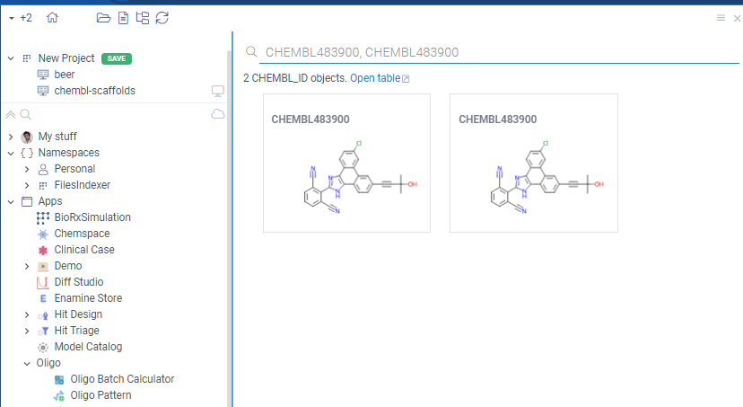
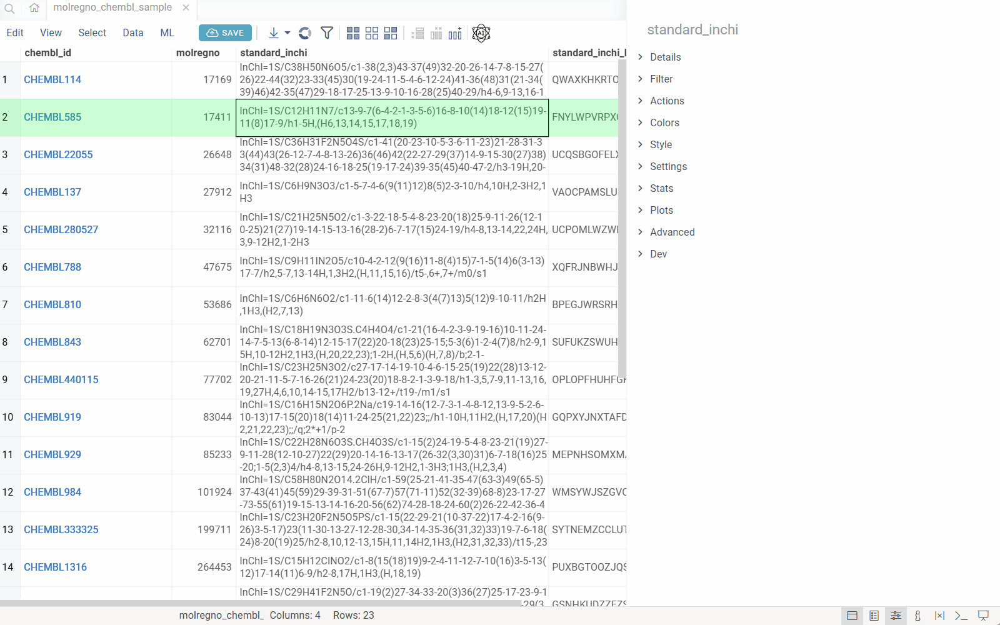
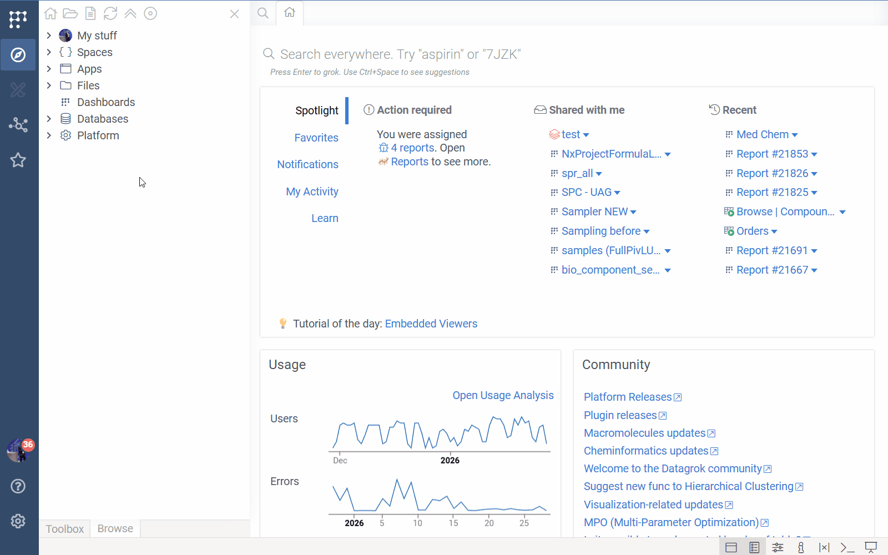
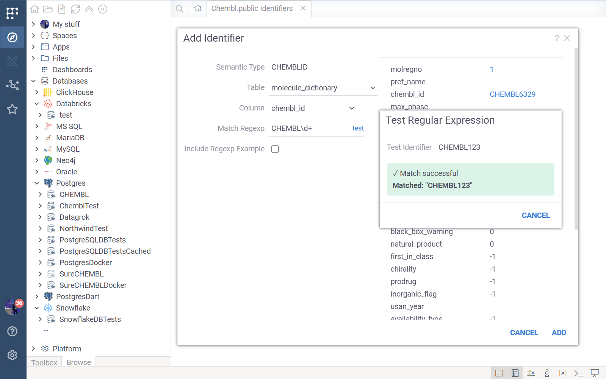
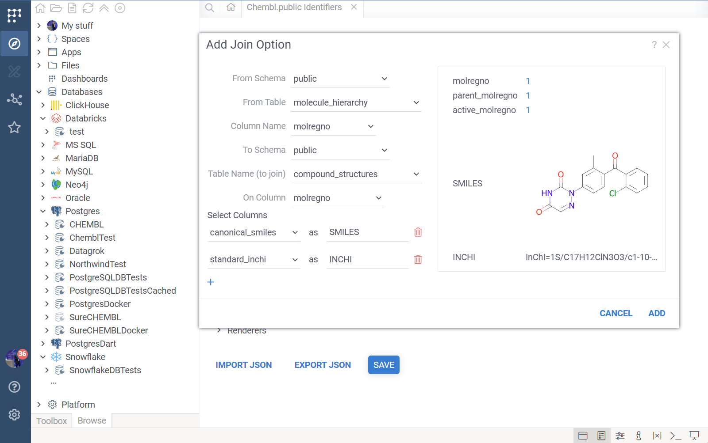
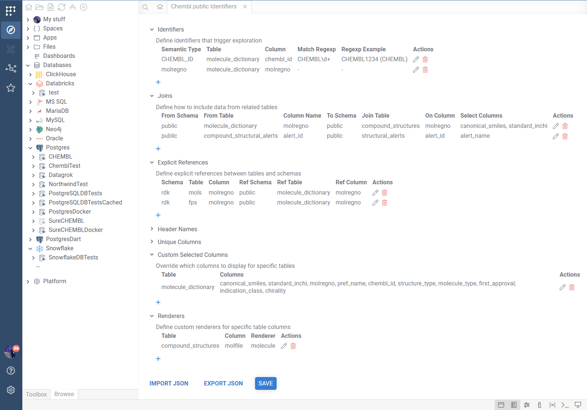

Datagrok allows you to easily register identifier patterns, attach handlers to them and detect them in text everywhere on the platform. For example, you can register a pattern for CHEMBL identifiers (`CHEMBL` followed by numbers), attach a handler to it that queries the database for the compound and retrieves its structure to display it in the tooltip or context panel.

## Basic approach

The traditional way to register identifier patterns involves manually configuring both the pattern detection and the handler logic. While this approach gives you full control, it requires more boilerplate code and manual setup.

To register an identifier pattern using the basic approach, you need to modify the `package.json` file of your package (you can use existing or [create a new package](../packages/create-package.md) ) by adding your semantic type metadata with corresponding pattern regex.

```json

{
  "name": "@datagrok/chembl",
  ... package data
  "meta": {
    "semanticTypes": [
      {
        "semType": "CHEMBL_ID",
        "description": "Compound id in the CHEMBL database",
        "parsers": [{
          "regexp": "CHEMBL\\d+"
        }]
      }
    ]
  }
}

```

After you registered the pattern in your package and deployed it, Datagrok will identify it in text anywhere on the platform and highlight it.


Now you can register and attach the handler to the semantic type (`CHEMBL_ID` defined in `package.json`) to for example retrieve the compound structure from the database. 

Create a class that extends `DG.ObjectHandler` and implement the following methods:

```typescript
export class ChemblIdHandler extends DG.ObjectHandler {
  get type(): string {return 'CHEMBL_ID';} // must return a semtype

  isApplicable(x: any): boolean {// gets called for each object to check if it's applicable to this handler
    return x instanceof DG.SemanticValue && x.semType == 'CHEMBL_ID';
  }

  renderInnerCard(x: any) {// inner function for querying the database and rendering the card
    const id = (x as SemanticValue).value;
    return ui.divV([
      ui.h3(id),
      ui.wait(async () =>
        ui.bind(x, grok.chem.drawMolecule(await grok.functions.call('Chembl:chemblIdToSmiles', {id: id})))),
    ], {style: {width: '220px', height: '150px'}});
  }
  // gets called when object is coming 'Search everywhere' search and renders card for it
  renderCard(x: any) { 
    return ui.card(this.renderInnerCard(x));
  }
  // gets called when object is hovered and renders tooltip for it
  renderTooltip(x: any, context?: any): HTMLElement { 
    return this.renderInnerCard(x);
  }
    
  // gets called when object is clicked and renders properties for it in context panel
  renderProperties(x: any, context?: any): HTMLElement { 
    return ui.panels.infoPanel(x).root; // retrieves property panels that are associated with the given semtype
  }
}

```

Then you need to register the handler in the `package.ts` file of your package, specifically in the function that autostarts the package:

```typescript
//tags: init, autostart
export function init() {
  //Register handlers
  DG.ObjectHandler.register(new ChemblIdHandler());
}
```

After deploying the package, Datagrok will use the handler to query the database and display the compound structure in the tooltip or context panel when you hover over or click on the CHEMBL identifier.


It also allows you to search for the CHEMBL identifier in the `Search Everywhere` bar and Datagrok will show the compound structure in the search results.




## DB-explorer library

For identifiers tied to database tables, the **DB-explorer library** provides a significantly easier and more powerful way to register identifiers and create rich, interactive exploration experiences. Instead of manually writing handler code, you simply configure the library with your database structure, and it automatically:

* Registers identifier patterns and semantic types
* Creates handlers that query your database
* Builds interactive drill-down views using foreign key relationships
* Renders context panels with all related data from connected tables

This declarative approach eliminates boilerplate code and enables complex database exploration with minimal configuration. It's the **recommended method** for any identifier that maps to a database entity.




### How it works

When you configure the DB-explorer library for your database, the system:

1. **Detects identifiers**: Automatically recognizes identifier patterns (e.g., `CHEMBL1234`, `DRUG_ID_5678`) in your data using regular expressions.
2. **Maps to semantic types**: Associates each identifier pattern with a semantic type and links it to a specific column in a specific table within your database.
3. **Leverages database relationships**: Uses the database's foreign key relationships and reference information to understand how tables connect.
4. **Enables drill-down exploration**: When you click an identifier anywhere in Datagrok, the system automatically:
   - Queries the database for the entity associated with that identifier
   - Displays all related information from the primary table
   - Shows all associated records from related tables (using foreign keys)
   - Renders custom visualizations (molecules, images, etc.) where applicable

This creates a seamless exploration experience where users can navigate complex database schemas without writing queries or understanding the underlying table relationships.

### Use cases

The DB-explorer library is particularly valuable for:

* **Life sciences**: Exploring compound IDs (like ChEMBL IDs), protein identifiers, or assay IDs across chemical databases
* **Enterprise systems**: Navigating customer IDs, order numbers, or product codes across multiple related tables
* **Research databases**: Drilling down through experiment IDs, sample codes, or publication references
* **Any domain**: Where data is spread across multiple related tables and users need to quickly explore connections

### No-code configuration (DB Explorer editor)

You can configure DB-explorer without writing code directly from the **Database Connection**.

1. Go to **Browse > Databases > Connection of choice**.
2. Right-click a database connection.
3. Select **Configure Identifiers...**.
4. In the dialog that appears, select the **Schema** where your identifiers are located (e.g., `public`) and click **OK**.



This opens the **Database Explorer editor** for that specific connection and schema. The editor allows you to define how Datagrok detects and displays identifiers for tables in this schema.

#### Main Interface

The editor lists all configuration categories in an accordion. You can expand each section to view, add, edit, or delete items.

* **Import / Export JSON**: Located at the bottom. Use these to backup your configuration or copy it to another environment.
* **Save**: Validates your configuration (checking for missing required fields) and saves it to the system.

#### Configuration Sections

##### Identifiers

This is the most important section. It defines the "Entry Points"—the semantic types that trigger DB Explorer.

* **Semantic Type**: The specific name used by Datagrok to tag this data (e.g., `CHEMBL_ID`). If you use an existing semantic type, Datagrok will use your configuration to display info panels for it.
* **Schema, Table & Column**: The specific database table and column where this identifier can be found.
* **Match Regexp**: (Optional) A JavaScript regular expression to automatically detect this semantic type in imported data (e.g., `^CHEMBL\d+$`).
    * **Test Regexp**: Click the "test" link to verify your regex against sample data.
* **Regexp Example**: (Optional) Provides metadata for the detector, helping with autodetection performance and showing user-friendly examples in the search UI.
    * **Example**: A valid ID (e.g., `CHEMBL1234`).
    * **Non-Variable Part**: The constant prefix (e.g., `CHEMBL`).
    * **Regexp Markup**: A display-friendly pattern (e.g., `CHEMBL[0-9]+`).



##### Joins

Joins allow you to pull in data from related tables when an identifier is clicked. This allows you to construct comprehensive "Cards" shown in tooltips without writing complex SQL queries.

* **From Schema/Table/Column**: The starting table (usually the one containing the identifier).
* **To Schema/Table/Column**: The related table to join.
* **Select Columns**: The most powerful part of the join configuration. You select which columns from the related table to include.
    * You can **alias** columns (e.g., select `canonical_smiles` and rename it to `structure`) to make the output friendlier.
    * These selected columns become available for display in the context panel and tooltips.



##### Explicit References

Datagrok automatically detects foreign key relationships defined in the database schema. However, if your database lacks foreign keys, or if you need to link tables across different schemas, you can define **Explicit References**.

* **Schema/Table/Column** (Source) -> **Ref Schema/Ref Table/Ref Column** (Target).
* These references are used to build the "Links" section in the context panel, allowing users to drill down from one entity to related records.

##### Presentation & Helpers

These sections refine how data is displayed:

* **Header Names**: When a query returns multiple rows for a single identifier, DB Explorer groups them in an accordion. By default, it names panes "Row 1", "Row 2". Mapping a **Header Name** (e.g., mapping table `orders` to column `order_date`) will label the panes with meaningful data.
* **Unique Columns**: If a table has no Primary Key defined in the database, DB Explorer might struggle to identify unique rows. Specify a unique column here to fix row selection and linking.
* **Custom Selected Columns**: By default, DB Explorer shows all columns from the main table plus joined columns. Use this to maintain a cleaner view by explicitly selecting exactly which columns to display for a specific table.
* **Renderers**: Tell Datagrok how to render specific columns.
    * `molecule`: Renders chemical structures (SMILES/Molfile).
    * `helm`: Renders macromolecule sequences.
    * `imageURL`: Renders an image from a URL string.
    * `rawImage`: Renders binary image data.



### Code-based configuration

While the No-code editor is sufficient for most use cases, creating a custom plugin gives you version control, advanced customization options like custom value converters, and the ability to bundle the configuration with your solution.

To set up the DB-explorer library using code, follow these steps:

#### Prerequisites

Before you begin, ensure you have:

* A database connection configured in Datagrok
* [Datagrok Tools](../../../develop/develop.md) installed for plugin development
* Basic knowledge of TypeScript/JavaScript

#### Step 1: Create a plugin

If you don't already have a plugin, create one:

1. Open a terminal and run:
   ```bash
   grok create <package-name>
   ```
2. Follow the prompts to set up your plugin structure.
3. For detailed instructions on plugin creation and publishing, see [Develop](../../../develop/develop.md) and [Creating a new package](../packages/create-package.md).

#### Step 2: Install the DB-explorer library

Add the DB-explorer library to your plugin:

1. Navigate to your plugin directory.
2. Install the library:
   ```bash
   npm install @datagrok-libraries/db-explorer
   ```

#### Step 3: Create the explorer configuration

Create a configuration file (e.g., `src/explorer-config.ts`) that defines your database structure and entry points. Here's an example configuration for a ChEMBL database:

```typescript
export const explorerConfig = {
  // Database connection details
  'connectionName': 'CHEMBL',          // Name of your database connection in Datagrok
  'schemaName': 'public',              // Database schema name where the identifiers are located
  'nqName': 'CHEMBL',                   // Optional: fully-qualified connection name (namespace-qualified)
  'dataSourceName': 'postgres',        // Data source type (postgres, oracle, mysql, etc.)
  
  // Entry points: Define identifiers that trigger exploration
  'entryPoints': {
    // Each entry point maps a semantic type to a table column, here, CHEMBL_ID is the name of the semantic type
    'CHEMBL_ID': {                     // Semantic type name
      'table': 'molecule_dictionary',  // Table containing this identifier
      'column': 'chembl_id',           // Column containing this identifier
      
      // Regular expression example for documentation and autosuggestions in the global search
      'regexpExample': {
        'example': 'CHEMBL1234',       // Example identifier
        'nonVariablePart': 'CHEMBL',   // Fixed prefix
        'regexpMarkup': 'CHEMBL[0-9]+' // Pattern for display
      },
      
      // Pattern to match identifiers (JavaScript RegExp syntax)
      'matchRegexp': 'CHEMBL\\d+'
    },
    
    // Numeric identifier example, without regexp detector (meaning that it is detected by some other means on the platform side)
    'molregno': {
      'table': 'molecule_dictionary',
      'column': 'molregno'
    }
  },
  
  // Join options: Define how to include data from related tables
  // This is useful to easily construct 'cards' for the identifiers that show up in tooltips and panels
  'joinOptions': [
    {
      'fromSchema': 'public',               // Optional: schema for the starting table
      'fromTable': 'molecule_dictionary',     // Starting table
      'columnName': 'molregno',               // Foreign key column in starting table
      'onSchema': 'public',                 // Optional: schema for the joined table
      'tableName': 'compound_structures',     // Related table to join
      'onColumn': 'molregno',                 // Key column in related table
      'select': ['canonical_smiles', 'standard_inchi']  // Columns to include from related table
    },
    {
      'fromSchema': 'public',
      'fromTable': 'compound_structural_alerts',
      'columnName': 'alert_id',
      'onSchema': 'public',
      'tableName': 'structural_alerts',
      'onColumn': 'alert_id',
      'select': ['alert_name']
    }
  ],

  // Explicit references: Add relationships missing from DB metadata
  'explicitReferences': [
    {
      'schema': 'public',
      'table': 'compound_records',
      'column': 'record_id',
      'refSchema': 'public',
      'refTable': 'molecule_dictionary',
      'refColumn': 'molregno'
    }
  ],
  
  // Header names: Customize column headers in the exploration view
  // each key is a table name, and the value is the column to use as the header if there are multiple entries
  'headerNames': {
    'action_type': 'action_type',
    'activities': 'type',
    'activity_properties': 'standard_type',
    'assays': 'tid',
    'chembl_id_lookup': 'chembl_id',
    'drug_indication': 'efo_term',
    'drug_mechanism': 'action_type',
    'drug_warning': 'warning_type',
    'molecule_synonyms': 'synonyms',
    'compound_records': 'record_id',
    'compound_structural_alerts': 'alert_name'
  },
  
  // Unique columns: Specify which column uniquely identifies rows in tables (fallback if db does not contain this information)
  'uniqueColumns': {
    'activities': 'activity_id',
    'compound_records': 'record_id',
    'molecule_synonyms': 'molsyn_id'
  },
  
  // Custom selected columns: Override which columns to display for specific tables
  // this allows showing more relevant information in tooltips and cards
  'customSelectedColumns': {
    'molecule_dictionary': [
      'canonical_smiles',
      'standard_inchi',
      'molregno',
      'pref_name',
      'chembl_id',
      'structure_type',
      'molecule_type',
      'first_approval',
      'indication_class',
      'chirality'
    ]
  },

  // Custom renderers: Override rendering for specific columns
  'customRenderers': [
    { 'table': 'compound_structures', 'column': 'canonical_smiles', 'renderer': 'molecule' }
  ]
};
```

**Configuration parameters explained:**

* **connectionName**: The exact name of your database connection as configured in Datagrok's Database Manager.
* **schemaName**: The database schema containing your tables (e.g., `public`, `dbo`,).
* **nqName**: Optional fully-qualified connection name (namespace-qualified). Useful when names collide.
* **dataSourceName**: The type of database (e.g., `postgres`, `oracle`, `mysql`, `mssql`).
* **entryPoints**: Defines the identifiers that trigger database exploration:
  * **Key**: The semantic type name (used internally by Datagrok to categorize data) (see [Semantic types](../../../govern/catalog/semantic-types.md)).
  * **table/column**: Specifies where this identifier lives in the database.
  * **regexpExample**: Human-readable documentation of the pattern.
  * **matchRegexp**: JavaScript regular expression to detect this identifier in data (optional if the semantic type is already registered elsewhere).
* **joinOptions**: Defines additional tables to automatically include when exploring an entity. This creates richer views by combining related data. Use **fromSchema** and **onSchema** when joining across schemas.
* **explicitReferences**: Defines relationships that are missing in database metadata (schema/table/column → referenced schema/table/column). These are used for building link panels and drill-downs.
* **headerNames**: Maps table names to user-friendly column names for display purposes.
* **uniqueColumns**: Tells the system which column uniquely identifies each row in tables that don't have obvious primary keys.
* **customSelectedColumns**: Overrides which columns to display for specific tables, allowing you to hide irrelevant columns.
* **customRenderers**: Forces a renderer for specific columns. Supported values include `rawImage`, `imageURL`, `molecule`, `helm`.

<!-- TODO: Add GIF or screenshot of a full DB-explorer configuration JSON (entry points + joins + explicit references) -->

#### Step 4: Create the registration handler

Create a handler file (e.g., `src/handlers.ts`) to register your configuration:

```typescript
import * as grok from 'datagrok-api/grok';
import * as ui from 'datagrok-api/ui';
import * as DG from 'datagrok-api/dg';
import {DBExplorer} from '@datagrok-libraries/db-explorer/src/db-explorer';
import {moleculeRenderer} from '@datagrok-libraries/db-explorer/src/renderer';
import {explorerConfig} from './explorer-config';

export async function registerChemblIdHandler() {
  // Initialize DB-explorer from configuration
  const exp = DBExplorer.initFromConfig(explorerConfig);
  
  if (!exp) {
    grok.shell.error('Failed to load db-explorer config');
    return;
  }
  
  // Optional: Add custom renderers for specific data types
  // This example adds a molecule renderer for SMILES columns
  exp.addCustomRenderer((_, colName, value) => {
    const lc = colName?.toLowerCase() || '';
    return (lc === 'structure' || lc.includes('smiles')) && 
           typeof value === 'string' && 
           grok.chem.checkSmiles(value);
  }, (value) => moleculeRenderer(value as string));
  
  console.log('Database object handlers registered');
}
```

**Handler explanation:**

* **DBExplorer.initFromConfig()**: Creates a DB-explorer instance from your configuration.
* **addCustomRenderer()**: Optionally adds custom visualization for specific data types (e.g., molecules, images, charts).
  * First parameter: A function that checks if the renderer should be used (based on column name and value).
  * Second parameter: A function that returns an HTML element to display the value.


#### Step 5: Register on plugin startup

Add the registration function to your package's autostart method (e.g., `src/package.ts`):

```typescript
import * as grok from 'datagrok-api/grok';
import * as DG from 'datagrok-api/dg';
import {registerChemblIdHandler} from './handlers';

export const _package = new DG.Package();

export class PackageFunctions {
  @grok.decorators.autostart()
  static init() {
    // Register DB-explorer handlers on plugin load
    registerChemblIdHandler();
  }
  
  // ... other package functions
}
```

**Autostart explanation:**

* The `@grok.decorators.autostart()` decorator ensures this function runs automatically when the platform loads.
* This registers your object handlers, making the system aware of your identifiers immediately.

#### Step 6: Build and publish

1. Build your plugin:
   ```bash
   npm run build
   ```
2. Publish your plugin:
   ```bash
   grok publish <your-stand-alias>
   ```
3. The plugin will be uploaded to your Datagrok instance.
4. Once published, the system automatically detects identifiers matching your patterns and enables exploration.

<!-- TODO: Add gif/image showing the complete workflow from identifier detection to drill-down -->

#### Testing your setup

To verify your DB-explorer is working:

1. Open any dataframe containing your identifiers or just type in your identifier in "Search Everywhere" box.
2. Click on a cell containing an identifier (e.g., `CHEMBL1234`).
3. Make sure the **Context Panel** on the right side is open (if not, click on F4)
4. Check the context panel, should see:
   - The primary entity information
   - Associated records from related tables (under *links*)
5. Click on related identifiers to navigate through the database.

#### Advanced customization

The DB-explorer library supports additional customization:

* **Custom value converters**: Transform identifier values before querying (e.g., adding prefixes).
* **Additional relationships**: Define relationships not captured in database foreign keys.
* **Custom info panes**: Add completely custom views in the Context Panel.

For more advanced usage, refer to the [DB-explorer library source code](https://github.com/datagrok-ai/public/tree/master/libraries/db-explorer).

#### Examples

The [ChEMBL plugin](https://github.com/datagrok-ai/public/tree/master/packages/Chembl) provides a complete, real-world example of DB-explorer implementation for exploring the ChEMBL database.