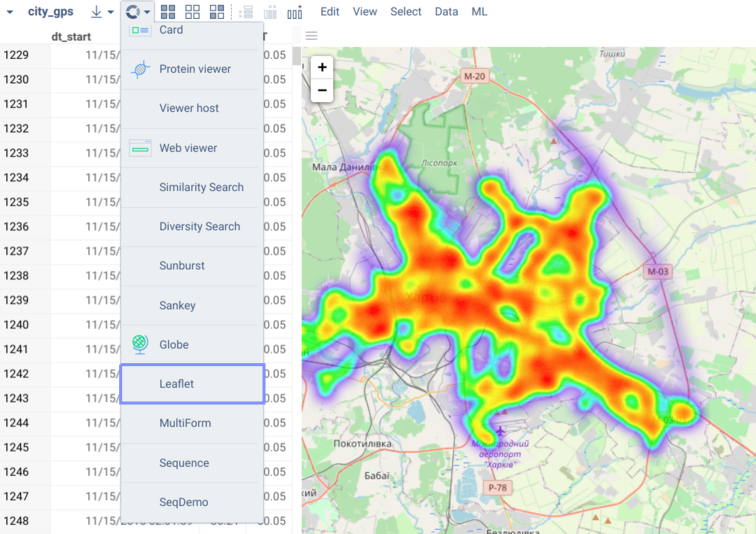

<!-- TITLE: Develop Custom Viewers -->
<!-- SUBTITLE: -->

# Custom Viewers

## Development

There are two major alternatives for developing viewers on Datagrok. The first one is JavaScript-based development, which lets you create interactive viewers via [Datagrok JavaScript API](../js-api.md). The second option would be utilizing visualizations available for popular programming languages, such as Python, R, or Julia. This implementation uses [scripting](../scripting.md) internally, so the code runs on the server, which slightly affects interactivity. Nonetheless, both options are applicable and support the essential functionality, such as data filtering and selection.

Typically, development starts with [package](../develop.md#packages) creation. Packages are convenient units for distributing content within the platform. Using them you can extend Datagrok with your widgets, applications, plugins, and more. Besides, scripting viewers must be part of a package in order to run their code in a separate environment.

### JavaScript-Based Viewers

Let's create an `Awesome` viewer for your package. This can be done in two simple steps. First, we need to define a subclass of `JsViewer` in a separate file:

```javascript
export class AwesomeViewer extends DG.JsViewer {
    /* AwesomeViewer contents */
}
```

The naming convention assumes that you would add a `Viewer` postfix for such a class. Once this class is added, you can refer to it in the main JavaScript file of your package: 

```javascript
import { AwesomeViewer } from './awesome-viewer.js'

//name: Awesome
//description: Creates an awesome viewer
//tags: viewer
//output: viewer result
export function awesome() {
    return new AwesomeViewer();
}
```

The annotated function above [registers](#registering-viewers) our viewer and makes it available on the platform.

Now we will start adding new functionality to this template. If you have [datagrok-tools](https://www.npmjs.com/package/datagrok-tools) installed and want to follow along, you can obtain the `Awesome` viewer code used for illustration with these commands:

```
grok create AwesomePackage
grok add viewer AwesomeViewer
grok publish --rebuild
```

In case you are new to package development workflow, [this article](../develop.md) will get you started. The code provided here can be found in our [JavaScript API Samples](https://public.datagrok.ai/js/samples/functions/custom-viewers/viewers) as well.

Finally, if you would like to explore the methods discussed in the article on your own, jump right to our [JavaScript API documentation](https://datagrok.ai/js-api/JsViewer).

#### Properties

First and foremost, let's take a look at how we can define properties of a viewer. They will include all the parameters you want users to be able to tweak from the UI in the [property panel](../../overview/navigation.md#properties), be it data to display, color scheme, or some numeric values.

```javascript
class AwesomeViewer extends DG.JsViewer {

    constructor() {
        super();

        // Register properties and define fields initialized to properties' default values
        this.question = this.string('question', 'life');
        this.answer = this.int('answer', 42);

        // Properties that represent columns should be strings with the 'ColumnName' postfix
        this.valueColumnName = this.string('valueColumnName', null);
        this.registerCleanup(ui.tools.handleResize(this.root, (w, h) => this.render()));
    }

}
```

In the class `constructor`, you can create properties of the following data types:

  * integer number `this.int(propertyName[, defaultValue])`
  * floating point number `this.float(propertyName[, defaultValue])`
  * string `this.string(propertyName[, defaultValue])`
  * string array `this.stringList(propertyName[, defaultValue])`
  * boolean value `this.bool(propertyName[, defaultValue])`
  * datetime `this.dateTime(propertyName[, defaultValue])`

Follow the naming conventions for JavaScript variables (`lowerCamelCase` will do). Certainly, the names will be nicely displayed in the property panel: capitalized, with spaces between words (e.g., `property` becomes `Property` and `propertyName` becomes `Property Name`). But for them to appear so, pay attention to the names you use in your code. Consistency in naming also ensures that property values are updated correctly. When you set a value of a property, either as default or within the class body as a result of assignment, the specified value appears next to the corresponding property in UI. Then changing these values is up to users, and only correctly named properties are synchronized.

Properties are divided into two main groups depending on whether they are data-related or not. The first ones belong to the `Data` tab of the property panel, while the rest of them are placed under the `Misc` tab. Add the `ColumnName` postfix to the property name to indicate that it is a data property, otherwise, it will appear in `Misc`. Some properties, such as `stringList` and `dateTime`, can only be used to represent columns and require the `ColumnName` postfix. 

The properties of a viewer are updated automatically, however, the exact behavior can be adjusted or completely overridden in the `onPropertyChanged` method:

```javascript
class AwesomeViewer extends DG.JsViewer {
    constructor {...}

    // Override to handle property changes
    onPropertyChanged(property) {
        grok.shell.info(`${property.name}: ${property.get(this)}`);
    }
}
```

#### Events

Datagrok makes working with browser events easy. For a start, you can make viewers more interactive by showing custom tooltips. Their content may be of any kind (see an [example](https://dev.datagrok.ai/js/samples/ui/tooltips/tooltips)). For instance, there are [special tooltips](https://dev.datagrok.ai/js/samples/ui/tooltips/row-group-tooltips) for elements that represent multiple rows in a dataframe. With them, users will immediately see the rows that match pre-defined criteria and will be able to select them on click (pay attention to the `handleClick` function in the [example](https://dev.datagrok.ai/js/samples/ui/tooltips/row-group-tooltips)). Plus, other open viewers will highlight the elements that represent the respective row group as you move the mouse pointer over the current viewer (you don't need to configure anything, read more about Datagrok's efficient visualizations [here](../../visualize/viewers.md)). This also works the other way around: you can show only a selected portion of the data in your viewer. To do that, you need to know which rows the user selected so that you can narrow the data set for rendering accordingly. And this is fairly simple: the method `dataFrame.filter.getSelectedIndexes()` gives you exactly the data you need.

### Scripting Viewers

## Registering Viewers

Tagging scripts or functions as `viewers` registers them within the platform. Registering a viewer makes it available in the top menu and enables common viewer operations, such as cloning, docking, embedding, and switching to full screen mode. This also means that users can persist this viewer as part of a [project](../../overview/project.md).



## Examples

You can find more inspiring examples in our [public repository](https://github.com/datagrok-ai/public):

  * JavaScript-based viewers:
    * [Leaflet](https://github.com/datagrok-ai/public/tree/master/packages/Leaflet): integrates with the [Leaflet](https://leafletjs.com/) library to build interactive maps
    * [Sunburst](https://github.com/datagrok-ai/public/tree/master/packages/Sunburst): uses the [D3](https://d3js.org/) library for a sunburst chart
    * [Viewers](https://github.com/datagrok-ai/public/tree/master/packages/Viewers): showcases creating JavaScript viewers using various visualization libraries
  * Scripting viewers (R, Python, Julia):
    * [ChaRPy](https://github.com/datagrok-ai/public/tree/master/packages/ChaRPy): translates a Datagrok viewer to Python and R code using scripting viewers for the respective programming languages
    * [JuliaScripts](https://github.com/datagrok-ai/public/tree/master/packages/JuliaScripts): demonstrates the scripting functionality for Julia
    * [PythonScripts](https://github.com/datagrok-ai/public/tree/master/packages/PythonScripts): contains Python scripts for a number of applications, ranging from plotting to computer vision
    * [RScripts](https://github.com/datagrok-ai/public/tree/master/packages/RScripts): offers a variety of R visualizations

    Most of these scripts are also available by the `viewers` tag in the script browser: [https://public.datagrok.ai/scripts?q=%23viewers](https://public.datagrok.ai/scripts?q=%23viewers).

## Videos

<iframe width="560" height="315" src="https://www.youtube.com/embed/JaJgxtHAb98?start=202" frameborder="0" allow="accelerometer; autoplay; clipboard-write; encrypted-media; gyroscope; picture-in-picture" allowfullscreen></iframe>

See also:

  * [Datagrok JavaScript API](../js-api.md)
  * [JavaScript API Samples](https://public.datagrok.ai/js/samples/functions/custom-viewers/viewers)
  * [JavaScript Development](../develop.md)
  * [Viewers](https://datagrok.ai/help/visualize/viewers)
  * [Custom Viewers](https://datagrok.ai/help/develop/js-api#custom-viewers)
  * [Scripting Viewers](https://datagrok.ai/help/visualize/viewers/scripting-viewer)
