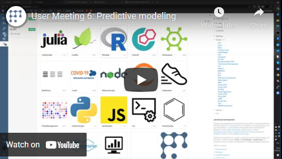

<!-- TITLE: Develop custom viewers -->
<!-- SUBTITLE: -->

# Custom viewers

Developers can extend Datagrok with special visual components bound to data, which are called
[viewers](../../visualize/viewers.md). There are two ways to develop viewers on Datagrok. The first
one is JavaScript-based development, which lets you create interactive viewers
via [Datagrok JavaScript API](../js-api.md). The second option uses visualizations available for popular
programming languages, such as Python, R, or Julia. This implementation uses
[scripting](../../compute/scripting.md) internally, so the code runs on the server, which makes it less
interactive. Both options support data filtering and selection.

Typically, development starts with [package](../develop.md#packages) creation. Packages are convenient units for
distributing content within the platform. Using them you can extend Datagrok with your widgets, applications, plugins,
and more. Besides, scripting viewers must be part of a package in order to run their code in a separate environment.

Table of contents

* [JavaScript-Based Viewers](#javascript-based-viewers)
  * [External Dependencies](#external-dependencies)
  * [Properties](#properties)
  * [Preparing Data](#preparing-data)
  * [Rendering](#rendering)
  * [Events](#events)
* [Scripting Viewers](#scripting-viewers)
* [Registering Viewers](#registering-viewers)
* [Examples](#examples)

## Javascript-based viewers

Let's create an `Awesome` viewer for your package. This can be done in two simple steps. First, we need to define a
subclass of `JsViewer` in a separate file:

```javascript
export class AwesomeViewer extends DG.JsViewer {
  /* AwesomeViewer contents */
}
```

The naming convention assumes that you would add a `Viewer` postfix for such a class. Once this class is added, you can
refer to it in the main JavaScript file of your package:

```javascript
import {AwesomeViewer} from './awesome-viewer.js'

//name: AwesomeViewer
//description: Creates an awesome viewer
//tags: viewer
//output: viewer result
export function awesome() {
  return new AwesomeViewer();
}
```

The annotated function above [registers](#registering-viewers) our viewer and makes it available on the platform.

Now we will start adding new functionality to this template. If you have
[datagrok-tools](https://www.npmjs.com/package/datagrok-tools) installed and want to follow along, you can obtain the
starter code with these commands:

```js
grok create AwesomePackage --js
grok add viewer AwesomeViewer
```

In case you are new to package development workflow, [this article](../develop.md) will get you started. Also, visit our
JavaScript API Samples, there you can run
this [code snippet](https://public.datagrok.ai/js/samples/functions/custom-viewers/viewers) to get a simple working
example right away and see how it functions within the platform. Finally, if you would like to explore the methods
discussed in the article on your own, jump right to
our [JavaScript API documentation](https://datagrok.ai/js-api/classes/dg.JsViewer).

### External dependencies

Just like regular `npm` packages, Datagrok packages may have dependencies. Typically you would list them in
your [package.json](../develop.md#package.json) file and get them locally via `npm install`. For instance, we will use a
JavaScript library called [D3](https://d3js.org/) to create a bar chart. In this case, the `dependencies` field will
look as follows:

```json
"dependencies": {
"datagrok-api": "latest",
"d3": "^6.2.0"
}
```

Some libraries, such as [datagrok-api](https://www.npmjs.com/package/datagrok-api), are marked as external modules in a
package's [webpack configuration](../develop.md#webpack.config.js). This means that they will not be included in a
bundle file of your package. The platform provides them in its environment, so if you use such a library, it will be
taken from there.

### Filter, selection, and highlighting

For a viewer to be fully interactive, it has to synchronize with the dataframe's filter, selection, highlighting,
current and mouse-over rows. The simplest way to do that is to subscribe to dataframe events, and re-render
the scene when anything changes.

When a viewer is closed, we no longer want to receive events from the associated dataframe. This is achieved
by adding the subscription object to the `subs` field. The `detach` method (that is called automatically when
the viewer is closed) unsubscribes from them.

```javascript
  onTableAttached() {
    this.init();

  // Stream subscriptions
    this.subs.push(DG.debounce(this.dataFrame.selection.onChanged, 50).subscribe((_) => this.render()));
    this.subs.push(DG.debounce(this.dataFrame.filter.onChanged, 50).subscribe((_) => this.render()));
    this.subs.push(DG.debounce(ui.onSizeChanged(this.root), 50).subscribe((_) => this.render(false)));
  }
```

### Properties

Viewer properties include all the parameters you want users to edit via
the [property panel](../../datagrok/navigation.md#properties). They get persisted with the viewer layout.

In this case, we want to set a couple of properties for our bar chart:

```javascript
import {axisBottom, axisLeft, scaleBand, scaleLinear, select} from 'd3';

export class AwesomeViewer extends DG.JsViewer {
  constructor() {
    super();

    // Register properties and define fields initialized to properties' default values
    // Properties that represent columns should end with the 'ColumnName' postfix
    this.splitColumnName = this.string('splitColumnName', 'site');
    this.valueColumnName = this.int('valueColumnName', 'age');

    // Provide a list of acceptable values in the field `choices`
    this.valueAggrType = this.string('valueAggrType', 'avg', { choices: ['avg', 'count', 'sum'] });
    this.color = this.string('color', 'steelblue', { choices: ['darkcyan', 'seagreen', 'steelblue'] });
    this.initialized = false;
  }
}
```

In the class `constructor`, you can create properties of the following data types:

* integer number `this.int(propertyName[, defaultValue, options])`
* floating point number `this.float(propertyName[, defaultValue, options])`
* string `this.string(propertyName[, defaultValue, options])`
* string array `this.stringList(propertyName[, defaultValue, options])`
* boolean value `this.bool(propertyName[, defaultValue, options])`
* datetime `this.dateTime(propertyName[, defaultValue, options])`

Follow the naming conventions for JavaScript variables (`lowerCamelCase` will do). Certainly, the names will be nicely
displayed in the property panel: capitalized, with spaces between words (e.g.,
`property` becomes `Property` and `propertyName` becomes `Property Name`). But for them to appear so, pay attention to
the names you use in your code. Consistency in naming also ensures that property values are updated correctly. When you
set a value of a property, either as default or within the class body as a result of assignment, the specified value
appears next to the corresponding property in UI. Then changing these values is up to users, and only correctly named
properties are synchronized.

Properties are divided into several main groups depending on their nature. Each group has a separate tab at the property
panel. Here is a complete list of these groups and formal criteria determining whether a property belongs to one of
them:

* `Data`: data-related properties have the `ColumnName` postfix
* `Colors`: properties changing a color of visualization end with `color`
* `Axes`: settings controlling the axes contain the word `axis`
* `Legend`: properties modifying a legend start with the `legend` prefix
* `Margins`: properties belonging to this group have `margin` in their name
* `Markers`: properties containing `marker` appear in this tab
* `Description`: properties should be named `title` or `description`
* `Misc`: the rest of properties are placed under this tab

Some properties, such as `stringList` and `dateTime`, can only be used to represent columns and, therefore, require
the `ColumnName` postfix. Let's proceed to our example. After defining the properties, we specify additional chart
settings, which will not appear in the property panel, and initialize the viewer. The next step is to retrieve data for
our visualization. This is typically done in the `onTableAttached` method where you can test if a viewer is applicable
to the currently open table, select the most relevant columns, and so on. However, as we already provided the default
column names, we use this method only to subscribe to events modifying the displayed data (selection and filtering) and
events that have impact on the visualization's size.

```javascript
export class AwesomeViewer extends DG.JsViewer {
  constructor() {...}

  // Additional chart settings
  init() {
    this.margin = { top: 10, right: 30, bottom: 30, left: 90 };
    this.xScale = scaleLinear();
    this.yScale = scaleBand();
    this.data = [];
    this.initialized = true;
  }

  // Stream subscriptions
  onTableAttached() {
    this.init();

    this.subs.push(DG.debounce(this.dataFrame.selection.onChanged, 50).subscribe((_) => this.render()));
    this.subs.push(DG.debounce(this.dataFrame.filter.onChanged, 50).subscribe((_) => this.render()));
    this.subs.push(DG.debounce(ui.onSizeChanged(this.root), 50).subscribe((_) => this.render(false)));

    this.render();
  }

  // Cancel subscriptions when the viewer is detached
  detach() {
    this.subs.forEach(sub => sub.unsubscribe());
  }
}
```

The properties of a viewer are updated automatically, however, the exact behavior can be adjusted or completely
overridden in the `onPropertyChanged` method. For example, the following code will show a message for users that choose
a non-categorical, or rather non-string, column:

```javascript
class AwesomeViewer extends DG.JsViewer {
  constructor {...}
  init {...}
  onTableAttached {...}
  detach {...}

  // Override to handle property changes
  onPropertyChanged(property) {
    super.onPropertyChanged(property);
    if (this.initialized) {
      if (property.name === 'splitColumnName' &&
          this.dataFrame.getCol(this.splitColumnName).type !== property.propertyType) {
        grok.shell.info('Wrong property type');
        return;
      }
      this.render();
    }
  }
}
```

### Preparing data

When rendering a visualization, it is important to draw a distinction between cases when the underlying data changes and
when it does not (e.g., resizing). To deal with this, it is common to introduce a parameter representing this state to
the rendering method, or even split it into two separate methods. In our example, we follow the first approach and (re)
compute the data unless stated otherwise:

```javascript
class AwesomeViewer extends DG.JsViewer {
  constructor {...}
  init {...}
  onTableAttached {...}
  detach {...}
  onPropertyChanged(property) {...}

  render(computeData = true) {
    if (computeData) {
      // Empty the data array
      this.data.length = 0;

      // Apply aggregation solely to filtered rows
      this.aggregatedTable = this.dataFrame
        .groupBy([this.splitColumnName])
        .whereRowMask(this.dataFrame.filter)
        .add(this.valueAggrType, this.valueColumnName, 'result')
        .aggregate();

      // Prepare datum objects for further processing
      this.splitCol = this.aggregatedTable.getCol(this.splitColumnName);
      this.valueCol = this.aggregatedTable.getCol('result');
      for (let i = 0; i < this.aggregatedTable.rowCount; i++) {
        this.data.push({
          category: this.splitCol.get(i),
          value: this.valueCol.get(i),
        });
      }
    }
  }
}
```

Sometimes it is better to double-check if the given data can possibly be rendered, just as with the
`onTableAttached` method, however, here we skip this step for simplicity.

The methods used for value aggregation and iteration over the dataframe deserve a subject of their own, so do examine
these code snippets to gain a better understanding:
[aggregation](https://public.datagrok.ai/js/samples/data-frame/aggregation)
, [comparative performance](https://public.datagrok.ai/js/samples/data-frame/performance) of different approaches to
iteration. Apart from that, data preparation largely depends on a particular JavaScript library you are working with, so
we will leave this to your discretion.

### Rendering

The chosen library determines not only the form in which data should be presented, but also, to a much greater extent,
how it will be drawn. Since we promised an awesome bar chart and its centerpiece is rendering, let's quickly see what it
might look like:

```javascript
class AwesomeViewer extends DG.JsViewer {
  constructor {...}
  init {...}
  onTableAttached {...}
  detach {...}
  onPropertyChanged(property) {...}

  render(computeData = true) {
    if (computeData) {...}

    // Get width and height to adjust the viewer's size
    let width = this.root.parentElement.clientWidth;
    let height = this.root.parentElement.clientHeight;
    let innerWidth = width - this.margin.left - this.margin.right;
    let innerHeight = height - this.margin.top - this.margin.bottom;

    // Clear the root element and append a new `svg` to it
    $(this.root).empty();
    let svg = select(this.root).append("svg")
      .attr("width", width)
      .attr("height", height);
    let g = svg.append("g").attr("transform", `translate(${this.margin.left}, ${this.margin.top})`);

    // Set the scales for X and Y axes
    this.xScale
      .domain([0, this.valueCol.max])
      .range([0, innerWidth])
      .nice();
    this.yScale
      .domain(this.data.map(d => d.category))
      .range([0, innerHeight])
      .paddingInner(0.1);

    // Add the X and Y axes
    let yAxis = g.append("g").call(axisLeft(this.yScale));
    yAxis.selectAll(".domain, .tick line").remove();

    let xAxis = g.append("g").call(axisBottom(this.xScale).tickSize(-innerHeight))
      .attr("transform", `translate(0, ${innerHeight})`);
    xAxis.selectAll(".tick line").attr("stroke", "#d4d4d4");
    xAxis.select(".domain").remove();

    // Create bars
    let bars = g.append("g").selectAll("rect")
      .data(this.data)
      .join("rect")
        .attr("y", d => this.yScale(d.category))
        .attr("width", d => this.xScale(d.value))
        .attr("height", this.yScale.bandwidth())
        .attr("fill", this.color);
  }
}
```

With this admittedly large piece of code, our viewer is almost complete, all that remains is to add one final touch to
it.

### Events

Datagrok makes working with browser events easy. For a start, you can make viewers more interactive by showing custom
tooltips. Their content may be of any kind (see an
[example](https://dev.datagrok.ai/js/samples/ui/tooltips/tooltips)). For instance, there are
[special tooltips](https://dev.datagrok.ai/js/samples/ui/tooltips/row-group-tooltips) for elements that represent
multiple rows in a dataframe. Let's add them to our bars:

```javascript
class AwesomeViewer extends DG.JsViewer {
  constructor {...}
  init {...}
  onTableAttached {...}
  detach {...}
  onPropertyChanged(property) {...}

  render(computeData = true) {
    // {...}

    // Add event handlers
    bars
      .on('mouseover', (event, d) => ui.tooltip.showRowGroup(this.dataFrame, i => {
        return d.category === this.dataFrame.getCol(this.splitColumnName).get(i);
      }, event.x, event.y))
      .on('mouseout', () => ui.tooltip.hide())
      .on('mousedown', (event, d) => {
        this.dataFrame.selection.handleClick(i => {
          return d.category === this.dataFrame.getCol(this.splitColumnName).get(i);
        }, event);
      });
  }
}
```

With these tooltips, users will immediately see the rows that match predefined criteria, e.g. rows containing the
corresponding category, and will be able to select them on click (pay attention to the `handleClick` function in the
example). Plus, other open viewers will highlight the elements that represent the respective row group as you move the
mouse pointer over the current viewer (you don't need to configure anything, read more about Datagrok's efficient
visualizations
[here](../../visualize/viewers.md)). This also works the other way around: you can show a selected portion of the data
in your viewer. To do that, you need to know which rows the user selected so that you can narrow the data set for
rendering accordingly. And this is fairly simple: the method
`dataFrame.filter.getSelectedIndexes()` gives you exactly the data you need.

Simple as that! Let's add a function to `package.js` to invoke our viewer on test data:

```javascript
//name: showChart
export function showChart() {
  grok.shell.addTableView(grok.data.demo.demog()).addViewer('AwesomeViewer');
}
```

Now run `AwesomePackage:showChart()` and explore all the features our viewer has, and customize it further if you like.

## Scripting viewers

People keen on creating visualizations in popular data science languages can bring this functionality to the platform in
a form of scripting viewers. To illustrate that, let's redesign the bar chart written in JavaScript in the previous
steps. Make a new folder in your package and name it `scripts`. Then add a new file with `.py` extension to it and paste
the following script:

```python
# name: Bar chart
# language: python
# tags: demo, viewers
# input: dataframe df
# input: column splitColumnName {type: categorical}
# input: column valueColumnName {type: numerical}
# input: string valueAggrType = mean {choices: ["mean", "count", "sum"]}
# input: string color = steelblue {choices: ["darkcyan", "seagreen", "steelblue"]}
# output: graphics

import matplotlib.pyplot as plt

df.groupby([splitColumnName])
.agg({valueColumnName: valueAggrType})
.plot.barh(color=color, legend=False)

plt.ylabel(splitColumnName)
plt.xlabel(valueColumnName)
plt.show()
```

This is how a scripting viewer might look in Python. As with regular [scripts](../../compute/scripting.md), we start by
annotating parameters in the header. The `viewers` tag implies that this script generates a visualization and can be
used for search in [Script Browser](https://public.datagrok.ai/scripts?q=%23viewers). Then come the input parameters
similar to the ones we provided in the JavaScript viewer's [properties](#properties). Notice that the names follow the
same convention with `camelCase` and the `ColumnName` suffix. This has to do with their appearance in the property
panel. In this respect, scripting viewers have an interesting feature — the platform provides a set of properties in
addition to the defined ones:

* `Refresh on Filter` binds the visualization with the standard filters (true by default)
* `Title` places a caption on top
* `Description` adds a text where one can give more details
* `Description Position`: left, right, top, bottom, center
* `Description Visibility Mode`: auto, always, never

In terms of annotation, there are certain syntax constructs worthy of note:

* default values are set via assignment `string color = steelblue`
* column properties have a type selector (indicating the type will guarantee a sane initial value and tailor the
  contents of the drop-down list to match the type). Supported types include
  *numerical, categorical, dateTime*
* for string properties, `{choices: ["mean", "count", "sum"]}` lists possible options

This kind of annotation is typical for scripts, so refer to the [dedicated article](../../compute/scripting.md)
for further explanation. The last parameter to mention is the output: scripting viewers must return
`graphics` object. To see the produced bar chart, modify the `showChart` function, publish your package and
run `AwesomePackage:showChart()` from the console:

```javascript
//name: showChart
export async function showChart() {
  grok.shell.addTableView(grok.data.demo.demog());
  await grok.functions.call('CmdScriptingViewerPythonBarChart');
}
```

Now let's invoke the viewer from the interface. Add the dataset we are working on to the header parameters:

```python
# Sample: demog.csv
```

Scripts with specified sample files have an extra `Star` icon in the top menu, which finds and opens these files.
Proceed to the [Script Browser](https://public.datagrok.ai/scripts?q=%23viewers) and find your chart there. Now if you
open the script and hit the icon (or use any other open table instead), the code can be executed on the data. Tweak the
input parameters in a dialog, if you like, and run your script. As a result, you will see a table view with your bar
chart pinned to the right.

## Registering viewers

Tagging scripts or functions as `viewers` registers them within the platform. Registering a viewer makes it available in
the top menu and enables common viewer operations, such as cloning, docking, embedding, and switching to full screen
mode. This also means that users can persist this viewer as part of a [project](../../datagrok/project.md).


From a developer's point of view, there are two ways to register a viewer. Here is the one we have seen earlier:

```js
import {AwesomeViewer} from './awesome-viewer.js'

//name: AwesomeViewer
//description: Creates an awesome viewer
//tags: viewer
//meta.icon: images/icon.svg
//output: viewer result
export function awesome() {
  return new AwesomeViewer();
}
```

The above way is typically preferred. The optional parameter `meta.icon`
accepts a path to a viewer icon file in the package.

There is also a less common form to register a viewer:

```js
grok.shell.registerViewer('AwesomeViewer', 'Creates an awesome viewer', () => new AwesomeViewer());
```

The `registerViewer` method performs dynamic registration at runtime. Check out this
[example](https://public.datagrok.ai/js/samples/scripts/functions/custom-viewers) to see it in action. This way works
from a package, but is rarely used there. Call `registerViewer` in cases where you need to get a registered viewer
instance synchronously within your package code. The regular version with function annotation returns a viewer
asynchronously on the client, as the containing package should be loaded first. Read more on these
nuances [here](manipulate-viewers.md). If you need to register a viewer with the second method, here is an example of
doing it in a package:

```js
import {AwesomeViewer} from './awesome-viewer.js'

//tags: autostart
export function initFunctionPackage() {
  grok.shell.registerViewer('AwesomeViewer', 'Creates an awesome viewer', () => new AwesomeViewer());
}
```

The [`autostart`](../function-roles.md#autostart) function prompts the package to initialize, which is why a
viewer can be obtained synchronously.

## Examples

You can find more inspiring examples in our [public repository](https://github.com/datagrok-ai/public):

* JavaScript-based viewers:
  * [Charts](https://github.com/datagrok-ai/public/tree/master/packages/Charts): constructs graphs of various types
      using the [Echarts](https://echarts.apache.org) framework
  * [Leaflet](https://github.com/datagrok-ai/public/tree/master/packages/Leaflet): integrates with
      the [Leaflet](https://leafletjs.com/) library to build interactive maps
  * [Viewers](https://github.com/datagrok-ai/public/tree/master/packages/Viewers): showcases creating JavaScript
      viewers using various visualization libraries
* Scripting viewers (R, Python, Julia):
  * [ChaRPy](https://github.com/datagrok-ai/public/tree/master/packages/ChaRPy): translates a Datagrok viewer to
      Python and R code using scripting viewers for the respective programming languages
  * [DemoScripts]: demonstrates the scripting functionality, including visualizations, for Python, R, and Julia

  Most of these scripts are also available by the `viewers` tag in the script
  browser: [https://public.datagrok.ai/scripts?q=%23viewers](https://public.datagrok.ai/scripts?q=%23viewers)
  .

## Videos

[](https://www.youtube.com/watch?v=JaJgxtHAb98&t=202s)

See also:

* [Datagrok JavaScript API](../js-api.md)
* [JS API Samples: custom viewers](https://public.datagrok.ai/js/samples/functions/custom-viewers/viewers)
* [JS API Samples: viewers](https://public.datagrok.ai/js/samples/ui/viewers/create-viewers)
* [JavaScript development](../develop.md)
* [Viewers](../../visualize/viewers.md)
* [Scripting viewers](../../visualize/viewers/scripting-viewer.md)

[DemoScripts]: https://github.com/datagrok-ai/public/blob/master/packages/Demo/projects/scripts/
