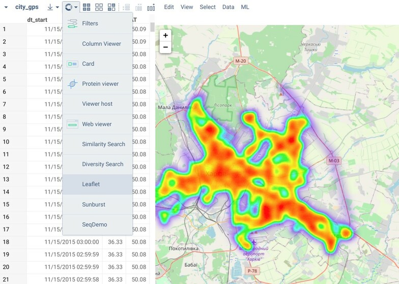

<!-- TITLE: Develop Custom Viewers -->
<!-- SUBTITLE: -->

# Custom Viewers

## Development

There are two major alternatives for developing viewers on Datagrok. The first one is JavaScript-based development, which lets you create interactive viewers via [Datagrok JavaScript API](../js-api.md). The second option would be utilizing visualizations available for popular programming languages, such as Python, R, or Julia. This implementation uses [scripting](../scripting.md) internally, so the code runs on the server, which slightly affects interactivity. Nonetheless, both options are applicable and support the essential functionality, such as data filtering and selection.

Typically, development starts with [package](../develop.md#packages) creation. Packages are convenient units for distributing content within the platform. Using them you can extend Datagrok with your widgets, applications, plugins, and more. Besides, scripting viewers must be part of a package in order to run their code in a separate environment.

### JavaScript-Based Viewers

Let's create an `Awesome` viewer for your package. This can be done in two simple steps. First, we need to define a subclass of `JsViewer` in a separate file:

```javascript
export class AwesomeViewer extends DG.JsViewer {
    /* AwesomeViewer contents */
}
```

The naming convention assumes that you would add a `Viewer` postfix for such a class. Once this class is added, you can refer to it in the main JavaScript file of your package: 

```javascript
import { AwesomeViewer } from './awesome-viewer.js'

//name: Awesome
//description: Creates an awesome viewer
//tags: viewer
//output: viewer result
export function awesome() {
    return new AwesomeViewer();
}
```

The annotated function above registers our viewer and makes it available on the platform.

### Scripting Viewers

## Registering Viewers

Tagging scripts or functions as `viewers` registers them within the platform. Registering a viewer makes it available via menu, etc.



## Examples

You can find more inspiring examples in our [public repository](https://github.com/datagrok-ai/public):

  * JavaScript-based viewers:
    * [Leaflet](https://github.com/datagrok-ai/public/tree/master/packages/Leaflet)
    * [Sunburst](https://github.com/datagrok-ai/public/tree/master/packages/Sunburst)
    * [Viewers](https://github.com/datagrok-ai/public/tree/master/packages/Viewers)
  * Scripting viewers (R, Python, Julia):
    * [ChaRPy](https://github.com/datagrok-ai/public/tree/master/packages/ChaRPy): translates a Datagrok viewer to Python and R code using scripting viewers for the respective programming languages
    * [JuliaScripts](https://github.com/datagrok-ai/public/tree/master/packages/JuliaScripts): demonstrates the scripting functionality for Julia
    * [PythonScripts](https://github.com/datagrok-ai/public/tree/master/packages/PythonScripts): contains Python scripts for a number of applications, ranging from plotting to computer vision
    * [RScripts](https://github.com/datagrok-ai/public/tree/master/packages/RScripts): offers a variety of R visualizations

    Most of these scripts are also available by the `viewers` tag in the script browser: [https://public.datagrok.ai/scripts?q=%23viewers](https://public.datagrok.ai/scripts?q=%23viewers).

## Videos

<iframe width="560" height="315" src="https://www.youtube.com/embed/JaJgxtHAb98?start=202" frameborder="0" allow="accelerometer; autoplay; clipboard-write; encrypted-media; gyroscope; picture-in-picture" allowfullscreen></iframe>

See also:

  * [Datagrok JavaScript API](../js-api.md)
  * [JavaScript API Samples](https://public.datagrok.ai/js/samples/functions/custom-viewers/viewers)
  * [JavaScript Development](../develop.md)
  * [Viewers](https://datagrok.ai/help/visualize/viewers)
  * [Custom Viewers](https://datagrok.ai/help/develop/js-api#custom-viewers)
  * [Scripting Viewers](https://datagrok.ai/help/visualize/viewers/scripting-viewer)
