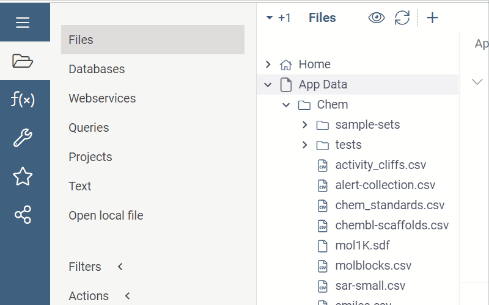

This document explains how to create a package that is capable of running docker containers on the Datagrok instance.

## Overview

Datagrok enables users to incorporate a custom Docker container into their package and leverage it throughout the package's lifecycle. Users have the flexibility to use a custom image or an image from Docker Hub. When a custom image is used, Datagrok takes care of building and running it automatically.

Once a user publishes a package that includes a Docker image, Datagrok adds the image to the build queue and builds it. Additionally, Datagrok creates a Docker container instance that can be accessed via HTTP(s) using the Datagrok JS-API. Users can monitor the status of both images and containers in the Manage -> Docker view, which is useful for checking status or troubleshooting.

This system is cloud-agnostic and works with local instances using Docker Compose or AWS. The only requirement is that the grok-spawner container must be running in the same environment. Users can access the container via HTTP, but only one EXPOSE $PORT is allowed in the image.

## 1. Create a dockerfile

Before we start, get familiar with
[docker docs](https://docs.docker.com/get-started/02_our_app/),
 which are related to the process of application containerizing.

Now, let's create a folder `dockerfiles`. You should put there a Dockerfile with
the commands that are needed to build a docker image and run the container.
Follow all the best practices for writing dockerfiles in order to make them
simple, small and efficient.

Example of such
 [Dockerfile](https://github.com/datagrok-ai/public/blob/master/packages/PepSeA/dockerfiles/Dockerfile)
 is located in PepSeA package.

## 2. Implement the function to get a response

Add code that is responsible for making a request to the container:

```js
async function requestAlignedObjects(id: string, body: PepseaBodyUnit[], method: string,
  gapOpen: number | null, gapExtend: number | null): Promise<PepseaRepsonse> {
  const params = {
    method: 'POST',
    headers: {'Accept': 'application/json', 'Content-Type': 'application/json'},
    body: JSON.stringify(body),
  };
  const path = `/align?method=${method}&gap_open=${gapOpen}&gap_extend=${gapExtend}`;
  const response = await grok.dapi.docker.dockerContainers.request(id, path, params);
  return JSON.parse(response ?? '{}');
}
```

To make a request `grok.dapi.dockerfiles.request` is used. You should specify
the `id` in order to make the request to the right container, `path`
and `params` of the request. To get `id` do:

```js
const dockerfileId = (await grok.dapi.docker.dockerContainers.filter('pepsea').first()).id;
```

That's it!

## 3. Build and publish

Run webpack and [publish](../develop.md#publishing) your package to one of the
 Datagrok instances:

```shell
webpack
grok publish dev
```

The return code should be `0` to indicate a successful deployment.

## 4. Test

Now go to Datagrok and open `Manage -> Dockerfiles`. You should see the created
container in the list. In order to run it, right click on the container and
choose the `Run` option. Here is how it looks:



See also:
- [Packages](../develop.md#packages)
- [Connecting to database inside package Docker container](access-data-docker.md)