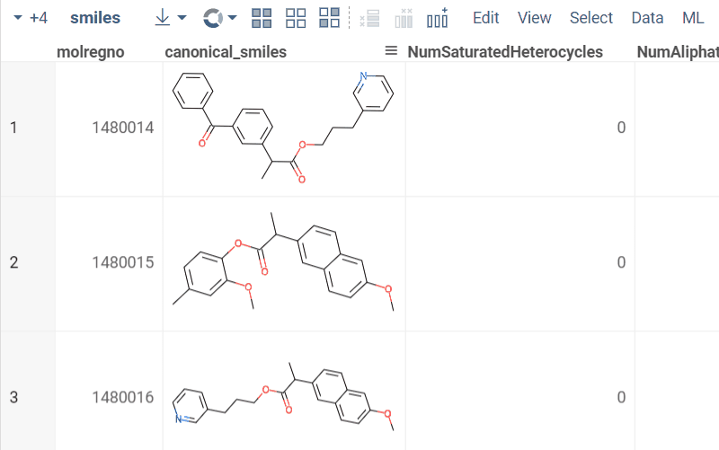

Part of Datagrok's functionality is built for easy file management. File exporters, along
with [file viewers](create-custom-file-viewers.md), provide an example of such features. A file exporter is a function
used for loading data from the platform. Once registered, it appears at the file's "
export" menu:



To write an exporter function, declare a `static` method on your `PackageFunctions` class and decorate it with
`@grok.decorators.fileExporter`. The `description` is required — `grok check` fails the package if it's missing — and is
used as the menu entry, e.g., `As ${fileExtension}`. Unlike file viewers, exporters don't need an extension-specific
tag; you start with an open table, modify it, and let the user download the converted version. Use
`DG.Utils.download(filename, content, contentType?)` to trigger the download — it wraps `Blob` + `URL.createObjectURL`
and works correctly for binary payloads (Parquet, Feather, XLSX), unlike the older `data:` URI form which silently
corrupts non-text content beyond ~2 MB in most browsers. Let's have a look at a function from the
[Chem](https://github.com/datagrok-ai/public/blob/master/packages/Chem/src/package.ts) package that exports a dataframe
in a special file format for chemical data:

```typescript
@grok.decorators.fileExporter({description: 'As SDF...'})
static saveAsSdf(): void {
  const table = grok.shell.t;
  const structureColumn = table.columns.bySemType('Molecule');
  if (structureColumn == null)
    return;

  let result = '';

  for (let i = 0; i < table.rowCount; i++) {
    try {
      const mol = OCL.Molecule.fromSmiles(structureColumn.get(i));
      result += `\n${mol.toMolfile()}\n`;

      for (const col of table.columns)
        if (col !== structureColumn)
          result += `>  <${col.name}>\n${col.get(i)}\n\n`;

      result += '$$$$';
    } catch (error) {
      console.error(error);
    }
  }

  DG.Utils.download(`${table.name}.sdf`, result);
}
```

In this function, we obtain the currently open table with `grok.shell.t`, build the output format, and hand it to
`DG.Utils.download` along with the filename. Note that we don't return anything from the exporter. After the package is
published, the build emits the matching header annotation into `package.g.ts` and the registered function gets attached
to the file export menu at the platform's startup.

See also:

* [JavaScript development](../../develop.md)
* [How to develop custom file viewers](create-custom-file-viewers.md)
