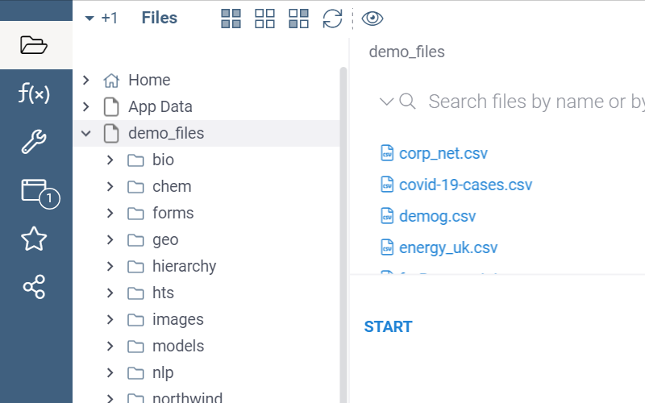

To provide custom folder content preview, register a function with the `folderViewer` role that takes two
parameters `folder` and `files`, inspects them and returns a widget if a custom preview could be provided, or
`undefined` otherwise.

The following function adds a 'START' button if one of the files in that folder is named "dm.csv" (the SDTM
Demographics domain file):

```typescript
export class PackageFunctions {
  @grok.decorators.folderViewer({
    'name': 'clinicalCaseFolderLauncher',
  })
  static async clinicalCaseFolderLauncher(
    folder: DG.FileInfo,
    files: DG.FileInfo[]): Promise<DG.Widget | undefined> {
    if (files.some((f) => f.fileName.toLowerCase() === 'dm.csv')) {
      return DG.Widget.fromRoot(ui.div([
        ui.button('START', () => grok.shell.info('Folder contains SDTM data')),
      ]));
    }
  }
}
```

This is what you would see when you open a folder that contains "dm.csv":



See also

* [File handlers](file-handlers.md)
* [File exporters](file-exporters.md)
