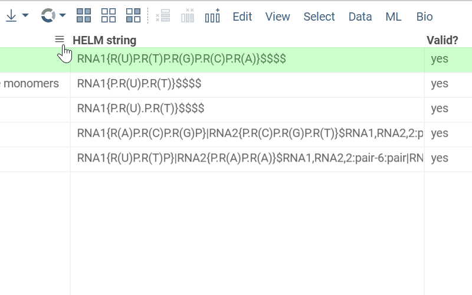

Developers can extend Datagrok with column tooltips. This is done by declaring a
static method on the package's `PackageFunctions` class, decorated with
`@grok.decorators.func({meta: {role: 'tooltip'}})`. The method takes a column
with the desired `semType` (declared via `@grok.decorators.param`) and returns
a [DG.Widget](https://datagrok.ai/api/js/dg/classes/Widget). The matching
header-comment form in `package.g.ts` is generated automatically — do not
hand-write it.

The following example defines a tooltip for a column with `semType: Macromolecule`.
The widget is built from the column's own dataframe (`col.dataFrame`), not from
`grok.shell.tv.dataFrame` — the tooltipped column may belong to a different
table than the currently active view.

```typescript
export class PackageFunctions {
  @grok.decorators.func({meta: {role: 'tooltip'}})
  static async sequenceTooltip(
    @grok.decorators.param({options: {semType: 'Macromolecule'}}) col: DG.Column,
  ): Promise<DG.Widget> {
    return await col.dataFrame.plot.fromType('WebLogo', {sequenceColumnName: col.name}) as unknown as DG.Widget;
  }
}
```

Once a package containing that function is published, the platform will automatically create the corresponding tooltip
for the designated column. Here is how it looks:


