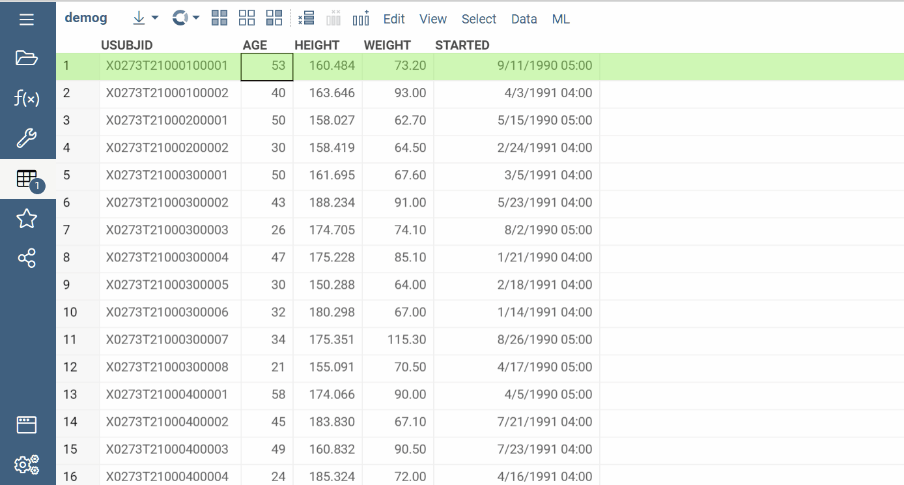

Datagrok provides an opportunity to use custom visualization for cells in data
[grid/table](../../../visualize/viewers/grid.md). This could be done by defining a function annotated with special
comments. It should take no args, return an instance of class derived from DG.GridCellRenderer, and have at least
one role `cellRenderer`. This is it!

The following example defines a cell renderer for summary column visualized as bar chart. This is real code from the
["PowerGrid" public package](https://github.com/datagrok-ai/public/blob/master/packages/PowerGrid/src/package.ts).

```typescript
@grok.decorators.cellRenderer({
  cellType: 'piechart',
  virtual: true,
})
export class PieChartCellRenderer extends DG.GridCellRenderer {
  /* PieChartCellRenderer contents */
}
```

This is the recommended form: the class decorator shipped by `datagrok-tools` emits the required package
function on your behalf. There is no need to add anything other than the class itself. When you run the
`build` script for your package, the webpack plugin called `FuncGeneratorPlugin` will add a special
`package.g.ts` file to your project. Note that it is not on the ignore list, so you are supposed to commit
this file.

:::tip

If you prefer to keep renderers in your `PackageFunctions` class, use the function decorator instead:

```ts
@grok.decorators.func({
  meta: {
    cellType: 'piechart',
    gridChart: 'true',
    virtual: 'true',
    role: 'cellRenderer'
  },
  tags: ['cellRenderer'],
  name: 'Pie Chart',
  outputs: [{type: 'grid_cell_renderer', name: 'result'}]
})
static piechartCellRenderer() {
  return new PieChartCellRenderer();
}
```

The codegen emits the matching header-form wrapper into `package.g.ts`:

```ts
//name: Pie Chart
//tags: cellRenderer
//output: grid_cell_renderer result
//meta.cellType: piechart
//meta.gridChart: true
//meta.virtual: true
//meta.role: cellRenderer
export function piechartCellRenderer() {
  return PackageFunctions.piechartCellRenderer();
}
```

:::

Renderer class derived from `DG.GridCellRender` must implement `name` and `cellType` properties, the main drawing
method `render`, and optional `renderSettings` methods allowing to build UI HTML Element for renderer settings.
An example is
available ["PowerGrid" public package](https://github.com/datagrok-ai/public/blob/master/packages/PowerGrid/src/sparklines/piechart.ts)
.

Once a package containing that function is published, the platform will automatically create the corresponding
renderer when a user creates a summary column of the specified type. Here is how it looks:



See also:

* [Customize a grid](customize-grid.md)
* [JavaScript development](../../develop.md)
