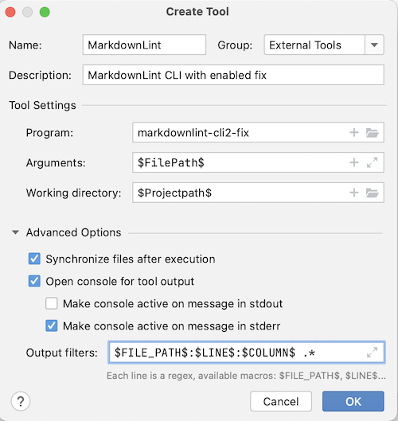

```mdx-code-block
import Tabs from '@theme/Tabs';
import TabItem from '@theme/TabItem';
```

All Datagrok knowledge base is collected on [Help wiki pages](https://datagrok.ai/help). The source code is located in
the help directory in the [public repository](https://github.com/datagrok-ai/public/tree/master/help). Any commit to the
help directory will trigger help pages GitHub Actions workflow.

See also:

* [Writing Docs: Writing style](../../collaborate/writing-docs/writing-style.md)
* [Writing Docs: Word list](../../collaborate/writing-docs/word-list.md)
* [Writing Docs: Content types](../../collaborate/writing-docs/content-types.md)
* [Writing Docs: Single source of truth](../../collaborate/writing-docs/single-source-of-truth.md)

## GitHub Actions Docusaurus workflow

[GitHub Actions Docusaurus workflow](https://github.com/datagrok-ai/public/actions/workflows/docusaurus.yaml) includes:

* Lint checks using [markdownlint](https://github.com/DavidAnson/markdownlint-cli2) linter.
* If the checks are finished successfully, GitHub will convert the markdown files to HTML
  using [Docusaurus](https://docusaurus.io/)
  * The result HTML help pages are also available as GitHub Actions artifact: `docusaurus`
* Then [Hyperlink](https://github.com/untitaker/hyperlink) checks the result HTML files.
* If the checks are finished successfully and the changes are in the master branch,  GitHub Actions will deploy the documentation to the server.
  * 'Deploy to server' step contains detailed information about changes that are made on the server.
* Finally, GitHub Actions performs Typesense DocSearch Scrape to update indexes for search in the wiki

If any error occurs during checks, the deployment to the server will be canceled. Check for errors in the GitHub Actions log or in GitHub Actions run summary.

More information about flow can be found on Docusaurus Help tab in [public repository CI/CD flows](../admin/releases/ci-flow.mdx#public-repository-cicd-flows)

### Trigger GitHub Actions manually

If an error occurred for the action triggered by the commit, it is possible to trigger the action manually.

1. Use [Docusaurus workflow](https://github.com/datagrok-ai/public/actions/workflows/docusaurus.yaml)
2. Press `run workflow`. Choose the target branch. Then `Run workflow`. Note that deployment to the server is executed for the master branch only.
3. Check that the GitHub Actions workflow finished successfully.

## Run docusaurus locally

[Docusaurus](https://docusaurus.io/) is an optimized site generator. Docusaurus
is a project for building, deploying, and maintaining open source project
websites easily.

### Requirements

1. Install Node JS [v18.12.x](https://nodejs.org/dist/v18.12.0/)
2. Upgrade npm to `v9.x.x`:

    ```shell
    npm install -g npm@9.x.x
    ```

### Local setup

1. Open the terminal and change the current directory to the directory with docusaurus code:

    ```shell
    cd docusaurus
    ```

2. Install package dependencies:

    ```shell
    npm install
    ```

3. As we use docusaurus to generate the API documentation, you need to repeat these installation steps in the `js-api` folder:

   ```mdx-code-block
   <Tabs>
   <TabItem value="win" label="Windows">
   ```

    ```cmd
    cd ..\js-api
    npm install
    ```

   ```mdx-code-block
   </TabItem>
   <TabItem value="bash" label="Linux/MacOS" default>
   ```

    ```shell
    cd ../js-api
    npm install
    ```

   ```mdx-code-block
   </TabItem>
   </Tabs>
   ```

4. To run docusaurus locally and test the changes, run the following command:

   ```mdx-code-block
   <Tabs>
   <TabItem value="win" label="Windows">
   ```

    ```cmd
    cd ..\docusaurus
    npm run start
    ```

   ```mdx-code-block
   </TabItem>
   <TabItem value="bash" label="Linux/MacOS" default>
   ```

    ```shell
    cd ../docusaurus
    npm run start
    ```

   ```mdx-code-block
   </TabItem>
   </Tabs>
   ```

    It will start the server and recompile the client
    on every change you make. If the command does not work use `docusaurus start`.

5. Docusaurus will be available at [http://localhost:3000](http://localhost:3000). If you don't see your changes immediately, reload the page.
6. When you think the development is over and you want to commit the code, run the following command to check that the project builds without errors. Note that the build step will take some time.

    ```shell
    npm run build
    ```

   If the command does not work use `docusaurus build`.

7. Now you can commit and push your changes to the repository.

## Run linter locally

### Markdown linter

To lint and flag style issues in markdown files we use [markdownlint](https://github.com/DavidAnson/markdownlint).

```mdx-code-block
<Tabs>
<TabItem value="vscode" label="VSCode" default>
```

1. Install [markdownlint-cli2](https://github.com/DavidAnson/markdownlint-cli2#install)

   ```bash
   npm install markdownlint-cli2 markdownlint-cli2-formatter-summarize --global
   ```

2. [Install](https://github.com/DavidAnson/vscode-markdownlint#install) Markdownlint [VSCode plugin](https://marketplace.visualstudio.com/items?itemName=DavidAnson.vscode-markdownlint)

3. [Configure autofix for issues](https://github.com/DavidAnson/vscode-markdownlint#fix)
4. Show markdownlint warnings using shortcut: `Ctrl+Shift+M`/`Ctrl+Shift+M`/`⇧⌘M`

```mdx-code-block
</TabItem>
<TabItem value="idea" label="JetBrains IDE">
```

1. Install [markdownlint-cli2](https://github.com/DavidAnson/markdownlint-cli2#install)

   ```bash
   npm install markdownlint-cli2 markdownlint-cli2-formatter-summarize --global
   ```

2. Add MarkdownLint as [External Tool](https://www.jetbrains.com/help/idea/configuring-third-party-tools.html#local-ext-tools). `Preferences > Tools > External Tools > + (Add)`
   1. Name: `MarkdownLint`
   2. Description: `MarkdownLint CLI with enabled fix`
   3. Program: `markdownlint-cli2-fix`
   4. Arguments: `$FilePath$`
   5. Working Directory: `$Projectpath$`
   6. Output filters: `$FILE_PATH$:$LINE$:$COLUMN$ .*`
   7. Enable `Make console active on message in stderr`

   

3. Now, to run MarkdownLint on the current file, you can click `Tools > External Tools > MarkdownLint`.

4. _(Optional)_ To run MarkdownLint easier you can [add an icon to the toolbar](https://www.jetbrains.com/help/idea/customize-actions-menus-and-toolbars.html#customize-menus-and-toolbars). `Preferences > Appearance & Behavior > Menus and Toolbars > Main Toolbar > Toolbar Run Actions > + > Add Action... > External Tools > External Tools > MarkdownLint > OK`. Now, you can run Markdownlint from toolbar using icon.

5. _(Optional)_ To run MarkdownLint easier you can [add a shortcut](https://www.jetbrains.com/help/idea/configuring-keyboard-and-mouse-shortcuts.html). `Preferences > Keymap > External Tools > MarkdownLint > Right click > Add Keyboard Shortcut > Set the shortcut you like, for example, Ctrl+Shift+M/⌘⇧M`. Now, you can run Markdownlint using shortcut.

```mdx-code-block
</TabItem>
<TabItem value="cli" label="CLI">
```

1. Install [markdownlint-cli2](https://github.com/DavidAnson/markdownlint-cli2#install)

   ```bash
   npm install markdownlint-cli2 markdownlint-cli2-formatter-summarize --global
   ```

2. Run MarkdownLint using the following command

   ```bash
   markdownlint-cli2-fix "help/**/*.{md,mdx}"
   ```

```mdx-code-block
</TabItem>
<TabItem value="branch" label="Docker">
```

1. Pull the Docker image

   ```bash
   docker pull davidanson/markdownlint-cli2:v0.6.0
   ```

2. Run MarkdownLint using Docker

   ```mdx-code-block
   <Tabs>
   <TabItem value="win" label="Windows">
   ```

   ```cmd
   docker run -v %cd%:/workdir --entrypoint="markdownlint-cli2-fix" davidanson/markdownlint-cli2:v0.6.0 "help/**/*.{md,mdx}"
   ```

   ```mdx-code-block
   </TabItem>
   <TabItem value="bash" label="Linux/MacOS" default>
   ```

   ```bash
   docker run -v "$(pwd):/workdir" --entrypoint="markdownlint-cli2-fix" davidanson/markdownlint-cli2:v0.6.0 "help/**/*.{md,mdx}"
   ```

   ```mdx-code-block
   </TabItem>
   </Tabs>
   ```

```mdx-code-block
</TabItem>
</Tabs>
```

### Links and anchors check

Internal links and anchors are checked after the help package convert to HTML. To test it locally wou should convert markdown to HTML using [Docusaurus](https://docusaurus.io/) and then check all links using [hyperlink](https://github.com/untitaker/hyperlink).

```mdx-code-block
<Tabs>
<TabItem value="cli" label="CLI" default>
```

   ```mdx-code-block
   <Tabs>
   <TabItem value="win" label="Windows">
   ```

   ```cmd
   cd docusaurus
   npm install
   npm run build

   npm install @untitaker/hyperlink --global
   hyperlink --check-anchors build --sources ..\help
   ```

   ```mdx-code-block
   </TabItem>
   <TabItem value="bash" label="Linux/MacOS" default>
   ```

   ```bash
   cd docusaurus
   npm install
   npm run build

   npm install @untitaker/hyperlink --global
   hyperlink --check-anchors build/ --sources ../help/
   ```

   ```mdx-code-block
   </TabItem>
   </Tabs>
   ```

```mdx-code-block
</TabItem>
</Tabs>
```
