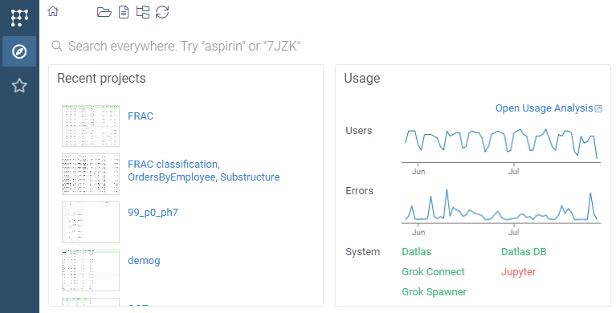

When you start Datagrok, the [Home page](../../datagrok/navigation/views/browse.md#home-page)
opens with a number of widgets, typically for quick access.
Here we see two of them, "Recent projects" and "Usage":



You can develop custom widgets. To do that, write a function
that would return `widget` and mark it with the `dashboard` tag. It can reside either 
in a package, or in a stand-alone script. Here is the real example of the 
"Recent projects" widget from the 
[PowerPack plugin](https://github.com/datagrok-ai/public/blob/2e76a30ca11764c269c9e24654eace8e8ca4cf8b/packages/PowerPack/src/package.ts#L44):
```js
//output: widget result
//tags: dashboard
export function recentProjectsWidget(): DG.Widget {
  return new RecentProjectsWidget();
}


```

And this is [how the implementation might look](https://github.com/datagrok-ai/public/blob/2e76a30ca11764c269c9e24654eace8e8ca4cf8b/packages/PowerPack/src/widgets/recent-projects-widget.ts#L5) 

```js
import * as grok from 'datagrok-api/grok';
import * as DG from "datagrok-api/dg";
import * as ui from "datagrok-api/ui";

          
export class RecentProjectsWidget extends DG.Widget {
  caption: string;
  order: string;

  constructor() {
    super(ui.panel());
    this.caption = super.addProperty('caption', DG.TYPE.STRING, 'Recent projects');
    this.order = super.addProperty('order', DG.TYPE.STRING, '1');
    this.getProjects();
    // ... more code below...
  }
}
```

See also: 
* Community forum: ["Apply widget to home page"](https://community.datagrok.ai/t/apply-widget-to-home-page)