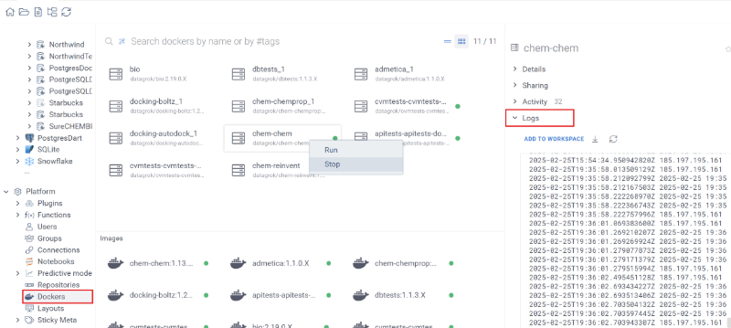

This document explains how to create a package that is capable of running docker containers on the Datagrok instance.

## Overview

You can add Docker container to your plugin, and use it from the plugin UI. 
It can use a custom image or an image from Docker Hub. 
When a custom image is used, Datagrok takes care of building and running it automatically.

Once a user publishes a package that includes a Docker image, Datagrok adds the image to the build queue and builds it. 
Additionally, Datagrok creates a Docker container instance that can be accessed via HTTP(s) using the Datagrok JS-API. 
You can monitor the status of both images and containers in the Manage -> Docker view, which is useful for checking 
status or troubleshooting.

This system is cloud-agnostic and works with local instances using Docker Compose or AWS. 
The only requirement is that the grok-spawner container must be running in the same environment. 
You can access the container via HTTP, but only one EXPOSE $PORT is allowed in the image.

Below is an example of how to build, deploy, and use the docker container from the plugin.

## How it works

`grok publish` builds the image on your workstation, pushes it to the Datagrok registry, and
uploads the package ZIP. On the server side, Datagrok's `grok_spawner` validates the image
and — when a user starts the container — deploys it on the configured orchestrator (Docker,
Docker Swarm, AWS ECS, or Kubernetes). Plugin code reaches the running container through
[`grok.dapi.docker.dockerContainers.fetchProxy`](#31-http-request); the container is never
exposed to the network directly.

The image and the container are tracked as separate entities with their own state machines:

```
DockerImage:      PENDING_VALIDATION ─► VALIDATING ─► READY
                                                    └► ERROR

DockerContainer:  PENDING_START ─► STARTING ─► STARTED ─► PENDING_STOP ─► STOPPED
                                            └► ERROR
```

A container with `shutdown_timeout` set is moved to `SYSTEM_STOPPED` automatically after
idling, and is re-started by the next call to `fetchProxy`.

For the full architecture — registry proxy, JWT auth, orchestrator backends, state machine
timing, and the admin-side configuration each deployment path needs — see
[Docker containers (under the hood)](../../under-the-hood/docker-containers.md). For how
plugin containers fit into the broader platform, see
[Infrastructure](../../under-the-hood/infrastructure.md); for deployment paths see
[Deployment](../../../deploy/deploy.md).

## 1. Create a dockerfile

Before we start, get familiar with
[docker docs](https://docs.docker.com/get-started/02_our_app/),
 which are related to the process of application containerizing.

Now, let's create a folder `dockerfiles`. You should put there a Dockerfile with
the commands that are needed to build a docker image and run the container.
Follow all the best practices for writing dockerfiles to make them
simple, small, and efficient.

Example of such
 [Dockerfile](https://github.com/datagrok-ai/public/blob/master/packages/Admetica/dockerfiles/Dockerfile)
 is located in Admetica package.

## 2. Container configuration

Each container can be configured using a `container.json` file, which must be placed in the same directory 
as the `Dockerfile`. This file defines resource allocation and container behavior.

### Example `container.json`

```json
{
  "cpu": 1.5,
  "gpu": 1,
  "memory": 2048,
  "on_demand": true,
  "shutdown_timeout": 60,
  "storage": 25,
  "env": {
    "CONN": "#{x.Package:Entity}",
    "LOGIN": "login"
  }
}
```

### Configuration properties

| Option               | Type    | Default | Description                                                      |
|----------------------|---------|---------|------------------------------------------------------------------|
| **cpu**              | Double  | 0.25    | Number of CPU cores allocated to the container.                  |
| **gpu**              | Integer | 0       | Number of GPU devices that should be reserved.                   |
| **memory**           | Integer | 512     | Amount of RAM allocated in megabytes.                            |
| **on_demand**        | Boolean | false   | If `true`, the container starts only when a request is received. |
| **shutdown_timeout** | Integer | null    | Time in minutes after which the container shuts down if idle.    |
| **storage**          | Integer | 21      | Allocated storage size in gigabytes.                             |
| **shm_size**         | Integer | 64      | Shared memory size in megabytes.                                 |
| **env**              | Object  |         | Environment variables for the container.                         |

### Usage

1. Place `container.json` in the same directory as the `Dockerfile`.
2. Modify resource limits as needed before publishing the package.

Pass any environment variables to the container using env parameter.
Use `#{x.Package:Entity}` expression to pass JSON-serialized entity from the package or any other namespace, for example: `#{x.MolTrack:Moltrack}` means Moltrack entity from Moltrack package.
Please note, credentials for the connection are passed only within the same package. You can't get credentials from a connection that does not belong to your package.

For more details, refer to the example [container.json](https://github.com/datagrok-ai/public/blob/master/packages/Admetica/dockerfiles/container.json) 
that is located in the `Admetica` plugin.

>Note: Creating the configuration file is optional. If it is not provided, default values will be used.

## 3. Implement the function to get a response

Make sure that the application inside the Docker container has an embedded HTTP server that handles requests and the 
listening port is [exposed](https://docs.docker.com/reference/dockerfile/#expose) in the Dockerfile.

### 3.1. Http request

Add code that is responsible for making a request to the container:

```js
async function requestAlignedObjects(id: string, body: PepseaBodyUnit[], method: string,
  gapOpen: number | null, gapExtend: number | null): Promise<PepseaRepsonse> {
  const params = {
    method: 'POST',
    headers: {'Accept': 'application/json', 'Content-Type': 'application/json'},
    body: JSON.stringify(body),
  };
  const path = `/align?method=${method}&gap_open=${gapOpen}&gap_extend=${gapExtend}`;
  const response: Response = await grok.dapi.docker.dockerContainers.fetchProxy(id, path, params);
  return response.json();
}
```

Use `grok.dapi.dockerfiles.fetchProxy` for HTTPS requests. You should specify the `id` in order to make the request
to the right container, `path` and `params` of the request. The method logic is fully aligned
with the [JavaScript Fetch API](https://developer.mozilla.org/en-US/docs/Web/API/Fetch_API) and `params` is [RequestInit](https://developer.mozilla.org/en-US/docs/Web/API/RequestInit) object type.

To get `id` do:

```js
const dockerfileId = (await grok.dapi.docker.dockerContainers.filter('pepsea').first()).id;
```

### 3.2. WebSocket connection

To make a WebSocket connection to a Docker container, use the `grok.dapi.docker.dockerContainers.webSocketProxy` method. 
Specify the container `id` and `path`. You can also provide an optional `timeout`. 
The `webSocketProxy` function returns a [WebSocket](https://developer.mozilla.org/en-US/docs/Web/API/WebSocket) when the connection is ready.

#### Example

```js
const ws: WebSocket = await grok.dapi.docker.dockerContainers.webSocketProxy(container.id, '/ws');
ws.send('Hell World!');

const onMessage = (event: MessageEvent) => {
 const message = event.data;
 console.log(message);
};

ws.addEventListener("message", onMessage);

setTimeout(() => ws.close(), 3000);
```

## 4. Configure the registry in grok config

`grok publish` builds the image locally and, when a registry is configured for the target
server, tags the image as `<registry>/datagrok/<package>-<container>:<version>` and pushes
it before uploading the package ZIP. Without a registry the image is built but stays on
your workstation, and `grok publish` prints:

```
No registry configured. Image tagged locally only. Run `grok config --registry` to configure.
```

Registries are stored per-server in `~/.grok/config.yaml` alongside the URL and developer
key. The full shape is:

```yaml
default: 'dev'
servers:
  dev:
    url: 'https://dev.datagrok.ai/api'
    key: 'your-dev-key'
    registry: 'registry.dev.datagrok.ai'
  public:
    url: 'https://public.datagrok.ai/api'
    key: 'your-public-key'
    registry: 'registry.datagrok.ai'
  localhost:
    url: 'http://localhost:8080/api'
    key: 'admin'
    # no registry — images stay local for the host Docker daemon
```

The `registry` field is the hostname only — no scheme, no path. The convention is
`registry.<datagrok-host>`, served by `grok_registry_proxy`. For localhost stands the
registry is normally empty (the spawner reads images from the host Docker daemon).

### Set the registry interactively

`grok config --registry` walks every server already in the file and asks for its
registry, pre-filling `registry.<hostname-from-url>` as the default:

```shell
grok config --registry
# > Docker registry for dev: (registry.dev.datagrok.ai)
# > Docker registry for public: (registry.datagrok.ai)
```

Press ENTER to accept the default, type a different hostname, or leave blank to clear
the field.

### Add a server with a registry non-interactively

Use `grok config add` to script the setup. `--registry` with no value falls back to the
hostname-derived default; passing a value sets it explicitly:

```shell
# Use the default registry.<hostname>
grok config add --alias dev \
  --server https://dev.datagrok.ai/api \
  --key your-dev-key -k your-dev-key \
  --registry

# Override the registry hostname
grok config add --alias dev \
  --server https://dev.datagrok.ai/api \
  --key your-dev-key -k your-dev-key \
  --registry registry.dev.example.com
```

### How `grok publish` uses the registry

When a registry is set on the target server, `grok publish`:

1. Runs `docker login <registry> -u any -p <devKey>` — the dev key is the password. The
   registry proxy validates it against the Datagrok server and returns a short-lived JWT,
   so no credentials are stored on your workstation.
2. Builds the image with `--platform linux/amd64` (cross-built for the server
   architecture) and tags it `<registry>/datagrok/<package>-<container>:<version>`.
3. Pushes the tagged image to `<registry>`. The registry proxy forwards it to the
   backing registry (ECR, Docker Hub, or self-hosted) using Datagrok's credentials.
4. Uploads the package ZIP. The server picks up the new image via the spawner's
   validation loop.

If the registry hostname matches `localhost` or an IP address, `grok publish` skips the
`--platform linux/amd64` flag so the image is built for the local Docker daemon. Use
this for single-machine Compose stands where the developer and the server share a
Docker host.

For the registry side of this picture (what `grok_registry_proxy` does, how to host
your own registry, and how images are validated server-side), see
[Docker containers (under the hood)](../../under-the-hood/docker-containers.md#how-images-get-to-the-registry).

## 5. Build and publish

Run webpack and [publish](../../develop.md#publishing) your package to one of the
 Datagrok instances:

```shell
webpack
grok publish dev
```

The return code should be `0` to indicate a successful deployment.

## 6. Managing docker containers and images

You can check available Docker containers and images using **Browse**. Go to Datagrok and open `Platform -> Dockers`.  
The opened view has two sections: Docker Containers (top) and Docker Images (bottom). Each section contains cards 
that correspond to a container or image. From this view, you can check the container and image status, 
which is reflected with a colored dot inside the card:

- **Green dot**: The container or image is running or ready.
- **Red dot**: An error has occurred.
- **Blinking grey dot**: The container or image is in a pending state (either starting, stopping or rebuilding).
- **No dot** (only for Docker container cards): The container is stopped.

You can check container logs or image build logs from the **Property pane**. To see them, click on the desired card, 
open the Property pane, and select **Logs** (for containers) or **Build logs** (for images).



> Note: You can start or stop a container, rebuild an image, or download the full context by right-clicking
> the corresponding card.

See also:
- [Docker containers (under the hood)](../../under-the-hood/docker-containers.md) — architecture, registry, and admin-side setup
- [Packages](../../develop.md#packages)
- [Connecting to database inside package Docker container](../db/access-data.md)
- [Python functions](python-functions.md)
- [Deployment](../../../deploy/deploy.md)