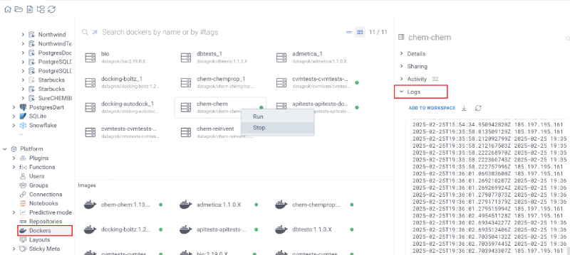

This document explains how to create a package that is capable of running docker containers on the Datagrok instance.

## Overview

You can add Docker container to your plugin, and use it from the plugin UI. 
It can be  use a custom image or an image from Docker Hub. 
When a custom image is used, Datagrok takes care of building and running it automatically.

Once a user publishes a package that includes a Docker image, Datagrok adds the image to the build queue and builds it. 
Additionally, Datagrok creates a Docker container instance that can be accessed via HTTP(s) using the Datagrok JS-API. 
You can monitor the status of both images and containers in the Manage -> Docker view, which is useful for checking 
status or troubleshooting.

This system is cloud-agnostic and works with local instances using Docker Compose or AWS. 
The only requirement is that the grok-spawner container must be running in the same environment. 
You can access the container via HTTP, but only one EXPOSE $PORT is allowed in the image.

Below is an example of how to build, deploy, and use the docker container from the plugin. 

## 1. Create a dockerfile

Before we start, get familiar with
[docker docs](https://docs.docker.com/get-started/02_our_app/),
 which are related to the process of application containerizing.

Now, let's create a folder `dockerfiles`. You should put there a Dockerfile with
the commands that are needed to build a docker image and run the container.
Follow all the best practices for writing dockerfiles in order to make them
simple, small and efficient.

Example of such
 [Dockerfile](https://github.com/datagrok-ai/public/blob/master/packages/Admetica/dockerfiles/Dockerfile)
 is located in Admetica package.

## 2. Container Configuration

Each container can be configured using a `container.json` file, which must be placed in the same directory 
as the `Dockerfile`. This file defines resource allocation and container behavior.

### Example `container.json`

```json
{
  "cpu": 1.5,
  "gpu": 1,
  "memory": 2048,
  "on_demand": true,
  "shutdown_timeout": 60,
  "storage": 25
}
```

### Configuration Properties

| Option               | Type    | Default | Description                                                      |
|----------------------|---------|---------|------------------------------------------------------------------|
| **cpu**              | Double  | 0.25    | Number of CPU cores allocated to the container.                  |
| **gpu**              | Integer | 0       | Number of GPU devices that should be reserved.                   |
| **memory**           | Integer | 512     | Amount of RAM allocated in megabytes.                            |
| **on_demand**        | Boolean | false   | If `true`, the container starts only when a request is received. |
| **shutdown_timeout** | Integer | null    | Time in minutes after which the container shuts down if idle.    |
 | **storage**          | Integer | 21      | Allocated storage size in gigabytes.                             |
| **shm_size**         | Integer | 64      | Shared memory size in megabytes.                                 |

### Usage

1. Place `container.json` in the same directory as the `Dockerfile`.
2. Modify resource limits as needed before publishing the package.

For more details, refer to the example [container.json](https://github.com/datagrok-ai/public/blob/master/packages/Admetica/dockerfiles/container.json) 
that is located in the `Admetica` plugin.

>Note: Creating the configuration file is optional. If it is not provided, default values will be used.

## 3. Implement the function to get a response

Make sure that application inside Docker container has embedded HTTP server that handles requests and the 
listening port is [exposed](https://docs.docker.com/reference/dockerfile/#expose) in Dockerfile.

### 3.1. Http request

Add code that is responsible for making a request to the container:

```js
async function requestAlignedObjects(id: string, body: PepseaBodyUnit[], method: string,
  gapOpen: number | null, gapExtend: number | null): Promise<PepseaRepsonse> {
  const params = {
    method: 'POST',
    headers: {'Accept': 'application/json', 'Content-Type': 'application/json'},
    body: JSON.stringify(body),
  };
  const path = `/align?method=${method}&gap_open=${gapOpen}&gap_extend=${gapExtend}`;
  const response: Response = await grok.dapi.docker.dockerContainers.fetchProxy(id, path, params);
  return response.json();
}
```

Use `grok.dapi.dockerfiles.fetchProxy` for HTTPS requests. You should specify the `id` in order to make the request
to the right container, `path` and `params` of the request. The method logic it totally aligned
with [JavaScript Fetch API](https://developer.mozilla.org/en-US/docs/Web/API/Fetch_API) and `params` is [RequestInit](https://developer.mozilla.org/en-US/docs/Web/API/RequestInit) object type.

To get `id` do:

```js
const dockerfileId = (await grok.dapi.docker.dockerContainers.filter('pepsea').first()).id;
```

### 3.2. WebSocket connection

To make WebSocket connection to Docker container, use `grok.dapi.docker.dockerContainers.webSocketProxy` method. 
You should specify the `id` of container and `path`. You can also provide optional `timeout`. 
Function `webSocketProxy` returns [WebSocket](https://developer.mozilla.org/en-US/docs/Web/API/WebSocket) when connection is ready.

#### Example

```js
const ws: WebSocket = await grok.dapi.docker.dockerContainers.webSocketProxy(container.id, '/ws');
ws.send('Hell World!');

const onMessage = (event: MessageEvent) => {
 const message = event.data;
 console.log(message);
};

ws.addEventListener("message", onMessage);

setTimeout(() => ws.close(), 3000);
```

## 4. Build and publish

Run webpack and [publish](../../develop.md#publishing) your package to one of the
 Datagrok instances:

```shell
webpack
grok publish dev
```

The return code should be `0` to indicate a successful deployment.

## 5. Managing Docker Containers and Images

You can check available Docker containers and images using **Browse**. Go to Datagrok and open `Platform -> Dockers`.  
The opened view has two sections: Docker Containers (top) and Docker Images (bottom). Each section contains cards 
that correspond to a container or image. From this view, you can check the container and image status, 
which is reflected with a colored dot inside the card:

- **Green dot**: The container or image is running or ready.
- **Red dot**: An error has occurred.
- **Blinking grey dot**: The container or image is in a pending state (either starting, stopping or rebuilding).
- **No dot** (only for Docker container cards): The container is stopped.

You can check container logs or image build logs from the **Property pane**. To see them, click on the desired card, 
open the Property pane, and select **Logs** (for containers) or **Build logs** (for images).



> Note: You can start or stop a container, rebuild an image, or download the full context by right-clicking
> the corresponding card.

See also:
- [Packages](../../develop.md#packages)
- [Connecting to database inside package Docker container](../db/access-data.md)