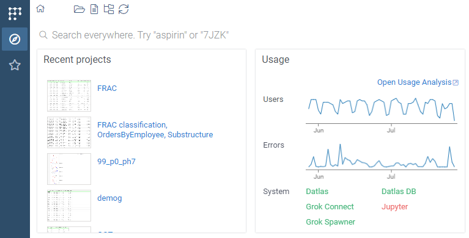

When you start Datagrok, the [Home page](../../../datagrok/navigation/views/browse.md#home-page)
opens with a number of widgets, typically for quick access.
Here we see two of them, "Recent projects" and "Usage":



You can develop custom widgets. To do that, declare a `static` method on your
package's `PackageFunctions` class that returns a `DG.Widget` and decorate it
with `@grok.decorators.dashboard({...})`. Here is the real example of the
"Community" widget from the
[PowerPack plugin](https://github.com/datagrok-ai/public/blob/master/packages/PowerPack/src/package.ts):

```ts
@grok.decorators.dashboard({
  order: '6',
  name: 'Community',
})
static communityWidget(): DG.Widget {
  return new CommunityWidget();
}
```

And this is [how the implementation might look](https://github.com/datagrok-ai/public/blob/master/packages/PowerPack/src/widgets/community-widget.ts):

```ts
import * as grok from 'datagrok-api/grok';
import * as DG from 'datagrok-api/dg';
import * as ui from 'datagrok-api/ui';


export class CommunityWidget extends DG.Widget {
  caption: string;

  constructor() {
    super(ui.panel([], 'welcome-community-widget'));
    // ... fetch data and append to this.root ...
    this.caption = super.addProperty('caption', DG.TYPE.STRING, 'Community');
  }
}
```

The decorator generates the corresponding `package.g.ts` entry (with the
`//output: widget result` and `//meta.role: dashboard` headers) at build time,
so you don't need to write the bare-function/header form by hand.

See also: 
* Community forum: ["Apply widget to home page"](https://community.datagrok.ai/t/apply-widget-to-home-page)