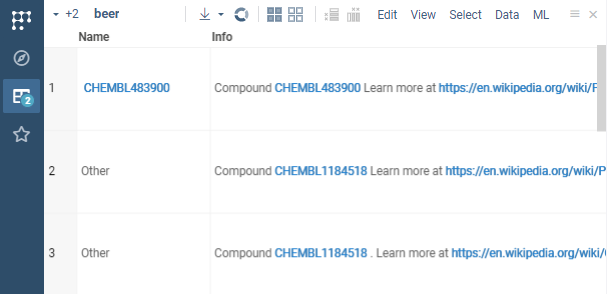

Datagrok allows you to easily register identifier patterns, attach handlers to them and detect them in text everywhere on the platform. For example, you can register a pattern for CHEMBL identifiers (`CHEMBL` followed by numbers), attach a handler to it that queries the database for the compound and retrieves its structure to display it in the tooltip or context panel.

To register an identifier pattern, you need to modify the `package.json` file of your package (you can use existing or [create a new package](./create-package.md) ) by adding your semantic type metadata with corresponding pattern regex.

```json

{
  "name": "@datagrok/chembl",
  ... package data
  "meta": {
    "semanticTypes": [
      {
        "semType": "CHEMBL_ID",
        "description": "Compound id in the CHEMBL database",
        "parsers": [{
          "regexp": "CHEMBL\\d+"
        }]
      }
    ]
  }
}

```

After you registered the pattern in your package and deployed it, Datagrok will identify it in text anywhere on the platform and highlight it.



Now you can register and attach the handler to the semantic type (`CHEMBL_ID` defined in `package.json`) to for example retrieve the compound structure from the database. 

Create a class that extends `DG.ObjectHandler` and implement the following methods:

```typescript
export class ChemblIdHandler extends DG.ObjectHandler {
  get type(): string {return 'CHEMBL_ID';} // must return a semtype

  isApplicable(x: any): boolean {// gets called for each object to check if it's applicable to this handler
    return x instanceof DG.SemanticValue && x.semType == 'CHEMBL_ID';
  }

  renderInnerCard(x: any) {// inner function for querying the database and rendering the card
    const id = (x as SemanticValue).value;
    return ui.divV([
      ui.h3(id),
      ui.wait(async () =>
        ui.bind(x, grok.chem.drawMolecule(await grok.functions.call('Chembl:chemblIdToSmiles', {id: id})))),
    ], {style: {width: '220px', height: '150px'}});
  }
  // gets called when object is coming 'Search everywhere' search and renders card for it
  renderCard(x: any) { 
    return ui.card(this.renderInnerCard(x));
  }
  // gets called when object is hovered and renders tooltip for it
  renderTooltip(x: any, context?: any): HTMLElement { 
    return this.renderInnerCard(x);
  }
    
  // gets called when object is clicked and renders properties for it in context panel
  renderProperties(x: any, context?: any): HTMLElement { 
    return ui.panels.infoPanel(x).root; // retrieves property panels that are associated with the given semtype
  }
}

```

Then you need to register the handler in the `package.ts` file of your package, specifically in the function that autostarts the package:

```typescript
//tags: init, autostart
export function init() {
  //Register handlers
  DG.ObjectHandler.register(new ChemblIdHandler());
}
```

After deploying the package, Datagrok will use the handler to query the database and display the compound structure in the tooltip or context panel when you hover over or click on the CHEMBL identifier.


It also allows you to search for the CHEMBL identifier in the `Search Everywhere` bar and Datagrok will show the compound structure in the search results.

