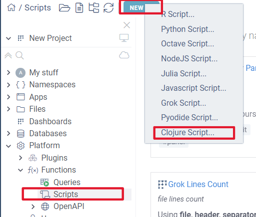

If the Datagrok platform does not support a scripting language you are familiar with, you can create a custom script handler within your [package](../../develop/how-to/create-package). 
The Datagrok platform is designed to seamlessly register these custom implementations, making them accessible to other users.

Here’s a step-by-step guide on how to register custom script handler in the package:

## 1. Define Your Function

Start by defining your function that should accept [FuncCall](../../datagrok/concepts/functions/function-call) object.
This function should execute the call and set the corresponding output parameters. The implementation details are up to you. 
You may choose to use [WebAssembly](https://webassembly.org/) solutions or execute code in a [Docker container](../packages/docker-containers.md).

```typescript
export async function myCustomScriptHandler(call: DG.FuncCall): Promise<void> {
    // implement handler
}
```

## 2. Add Annotations

Annotations are multi-line comments placed above the function declaration. They provide metadata about the function, allowing the Datagrok platform to recognize and utilize them appropriately.
There are four mandatory annotations that must be present to register a function as a script handler:

* `tags: scriptHandler` - marks the function as a script handler, so the Datagrok platform will attempt to register it.
* `meta.scriptHandler.language` - defines language name.
* `meta.scriptHandler.extensions` - defines file extensions separated by commas that are supported by this handler. For instance, `py` for Python, `js` for JavaScript.
* `input: funccall scriptCall` - defines input. Handler should have only one input parameter of type `funccall`.

There are other optional annotations as well:
* `meta.scriptHandler.templateScript` - defines template code that will be added to all [newly created scripts](../../../compute/scripting/getting-started.md#create-a-script).
* `meta.scriptHandler.codeEditorMode` - defines code editor mode. Datagrok uses [CodeMirror](https://codemirror.net/) to display and edit scripts in UI. You can get the list of available modes [here](https://codemirror.net/5/mode/).
* `meta.icon` - defines path to the icon inside the [package files](../../develop/how-to/work-with-package-files). This icon will be used in UI for all scripts created with the language of your handler.
* `meta.scriptHandler.vectorizationFunction` - defines function in the form of `<namespace>:<function name>` that will perform vectorization of DG.Script. This function should accept DG.Script and return string with vectorized code.

Let's say we want to register handler for [Clojure](https://clojure.org/) language. The function could be annotated as follows:

```typescript
//tags: scriptHandler
//meta.scriptHandler.language: clojure
//meta.scriptHandler.extensions: clj,cljs,cljr 
//meta.scriptHandler.commentStart: ;
export async function clojureScriptHandler(call: DG.FuncCall): Promise<void> {
    // implement handler
}
```

## 3. Publish package

[Publish package](../../develop/how-to/publish-packages) and that's it! After that you will see language of your script handler in the list of available options when [creating new script](../../../compute/scripting/getting-started.md#create-a-script).
Platform will be able to recognize scripts that have a `language` annotation corresponding to your handler and will be able to run them using your script handler.


