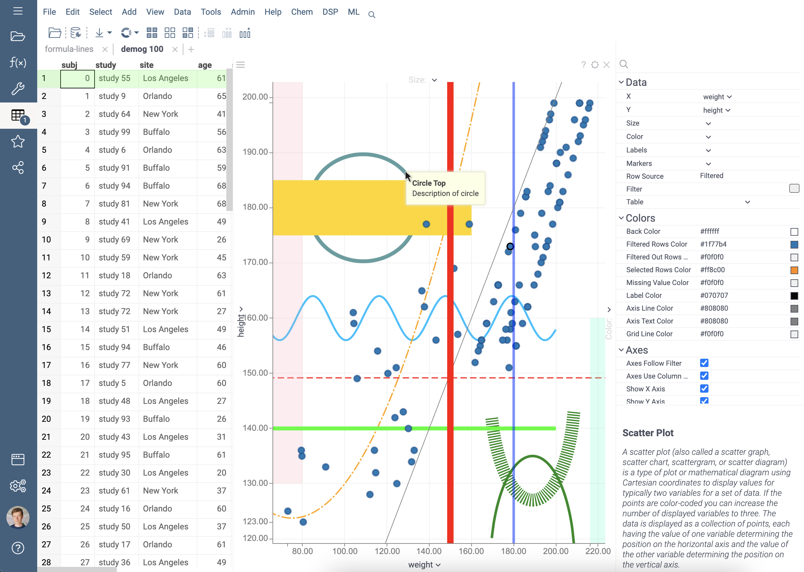

<!-- TITLE: Show formula lines -->

# How to show formula lines

Dataframe and viewer can contain information about lines and bands.

These figures are used by some viewers to draw additional lines on the charts. These can be reference lines,
highlighting different areas of the chart and data, etc.



Lines information is stored in a special storage in a dataframe or viewer. The viewer automatically reads storages when
it connects to the dataframe.

You can create and modify information about lines and bands by changing the `.formula-lines`
dataframe tag or by changing the `formulaLines` property of the viewer. The content of these storages is a JSON string.

There is a more convenient ways to create and modify lines. The examples use a viewer, but the dataframe has all the same methods:

- `viewer.meta.formulaLines.addLine(itemParams)` - creates item with type line
- `viewer.meta.formulaLines.addBand(itemParams)` - creates item with type band
- `viewer.meta.formulaLines.add(itemParams)` - creates item, the line type (line or band) set up in the item params
- `viewer.meta.formulaLines.addAll(itemParamList)` - creates multiple items at once
- `viewer.meta.formulaLines.items` - returns the list of the all items
- `viewer.meta.formulaLines.updateAt(index, itemParams)` - update the item at the index position with the new params
- `viewer.meta.formulaLines.removeAt(index)` - removes the item at the index position
- `viewer.meta.formulaLines.removeWhere(predicate)` - removes items that satisfy the condition
- `viewer.meta.formulaLines.clear()` - removes all items

To completely remove lines from dataframe or viewer use method `dataframe.meta.formulaLines.clear()`
or `viewer.meta.formulaLines.clear()`.

Lines saved in the dataframe will be displayed on all viewers in the same way. Lines saved in the viewer are displayed
only in this viewer and do not affect other viewers.

An example of creating and displaying a line in this way:

```javascript
let demog = grok.data.demo.demog(100);

// Add line to dataframe:
demog.meta.formulaLines.addLine({
  title: 'Parabola',
  formula: '${height} = 180 + 0.01 * ${weight} * ${weight} - 1.5 * ${weight}',
  zIndex: -30,
  color: "#FFA500",
  width: 2,
  visible: true,
});

// Add band to dataframe:
demog.meta.formulaLines.addBand({
  formula: '${height} in(150, 180)',
  column2: 'age'
});

// Add another line to dataframe.
// This is a generalized method for adding lines.
// To use it, you must specify the line type in the parameter list:
demog.meta.formulaLines.add({
  type: 'line'  // "line" or "band"
  formula: '${height} = ${weight}',
});

// Add a list of lines to dataframe:
let item1 = { type: 'line', formula: '${height} = 200' };
let item2 = { type: 'band', formula: '${age} > 18', column2: 'sex' };
demog.meta.formulaLines.addAll([item1, item2]);

// Remove all lines:
demog.meta.formulaLines.clear();

let view = grok.shell.addTableView(demog);

let plot = view.scatterPlot({
  x: 'weight',
  y: 'height',
  showDataframeFormulaLines: true,    // Hide or show all lines stored in the dataframe.
  showViewerFormulaLines: true        // Hide or show all lines stored in the viewer.
});

// Add line to viewer:
plot.meta.formulaLines.addLine({
  formula: '${weight} = 150',
  color: "#ff0000",
  width: 10
});

```

A similar methods is used to create bands - `dataframe.meta.formulaLines.addBand()`
or `viewer.meta.formulaLines.addBand()`. Most of the parameters for lines and bands are the same. But there are also some
parameters that are specific for lines and bands. See them in the description of the parameters for lines and bands.

More examples of creating lines and bands can be
found [here](https://public.datagrok.ai/js/samples/data-frame/metadata/formula-lines).

## Line parameters

Method to create a line: `dataframe.meta.formulaLines.addLine(parameters)`
or `viewer.meta.formulaLines.addLine(parameters)`

Only one parameter ("formula") is required. All other parameters have their default values.

| Parameter     | Type    | Example                       | Default                                   | Description                                                                                                                                                                                                                                                                                                                                                                                                                        |
|---------------|---------|-------------------------------|-------------------------------------------|------------------------------------------------------------------------------------------------------------------------------------------------------------------------------------------------------------------------------------------------------------------------------------------------------------------------------------------------------------------------------------------------------------------------------------|
| `title`       | string  | 'Reference line'              | Empty string                              | Short name of the line used when displaying the tooltip.                                                                                                                                                                                                                                                                                                                                                                           |
| `description` | string  | 'Normal distribution of data' | Empty string                              | Detailed description of the line used when displaying the tooltip.                                                                                                                                                                                                                                                                                                                                                                 |
| `formula`     | string  | '${height} = 2.2 * ${weight}' | Required parameter that must be specified | Formula for line. There should be one column to the left of the "=". And any formula using the second column on the right side. The formula uses syntax and formulas similar to the [Add New Column](../../transform/add-new-column.md) form.                                                                                                                                                                                      |
| `color`       | string  | '#FF0000'                     | '#838383' (dark gray color)               | Line color in HEX format.                                                                                                                                                                                                                                                                                                                                                                                                          |
| `zIndex`      | integer | 25                            | 100                                       | The "depth" of the line along the Z axis. The higher the number - the higher the line is located, overlapping other lines with a lower zIndex value. The viewer's chart itself has zIndex = 0. Values less than zero lead to the placement of lines under the chart. Values greater than zero cause lines to be placed on top of the chart. Lines with the same depth value are displayed in the order in which they were created. |
| `opacity`     | float   | 70                            | 100                                       | Opacity is a number in the range [0..100], where 0 is completely invisible, 100 is completely opaque.                                                                                                                                                                                                                                                                                                                              |
| `visible`     | boolean | false                         | true                                      | Indicates whether a line is displayed or hidden.                                                                                                                                                                                                                                                                                                                                                                                   |
| `min`         | float   | 50                            | No minimum limit                          | Line boundaries along the value axis. In this example, the line will be drawn for a "Weight" greater than 50 kg.                                                                                                                                                                                                                                                                                                                   |
| `max`         | float   | 300                           | No maximum limit                          | Line boundaries along the value axis. In this example, the line will be drawn for a "Weight" less than 300 kg.                                                                                                                                                                                                                                                                                                                     |
| `width`       | float   | 3                             | 1                                         | Line width in pixels.                                                                                                                                                                                                                                                                                                                                                                                                              |
| `spline`      | float   | 0.5                           | 0.9                                       | Smoothness of curve line in range [0..1], where 0 - no smoothing, 1 - max smoothing.                                                                                                                                                                                                                                                                                                                                               |
| `style`       | string  | 'dashed'                      | 'solid'                                   | Line style. Possible styles: 'solid', 'dotted', 'dashed', 'longdash', 'dotdash'.                                                                                                                                                                                                                                                                                                                                                   |

## Band parameters

Method to create a band: `dataframe.meta.formulaLines.addBand(parameters)`
or `viewer.meta.formulaLines.addBand(parameters)`

Only 2 parameters ("formula" and "column2") are required. All other parameters have their default values.

| Parameter     | Type    | Example                 | Default                                   | Description                                                                                                                                                                                                                                                                                                                                                                                                                                            |
|---------------|---------|-------------------------|-------------------------------------------|--------------------------------------------------------------------------------------------------------------------------------------------------------------------------------------------------------------------------------------------------------------------------------------------------------------------------------------------------------------------------------------------------------------------------------------------------------|
| `title`       | string  | 'Clipping range'        | Empty string                              | Short name of the band used when displaying the tooltip.                                                                                                                                                                                                                                                                                                                                                                                               |
| `description` | string  | 'Ignored range of data' | Empty string                              | Detailed description of the band used when displaying the tooltip.                                                                                                                                                                                                                                                                                                                                                                                     |
| `formula`     | string  | '${height} > 170'       | Required parameter that must be specified | Band boundary formula. The formula can contain expressions of the form: "${colName} < 200", "${colName} > avg", "${colName} in(18, 60)", "${colName} in(q1, q3)", etc. The numbers are specified in the units of the column (in this case in centimeters).                                                                                                                                                                                                                                          |
| `color`       | string  | '#00FF00'               | '#F0F0F0' (light gray color)              | Band color in HEX format.                                                                                                                                                                                                                                                                                                                                                                                                                              |
| `zIndex`      | integer | -10                     | 100                                       | The "depth" of the band along the Z axis. The higher the number - the higher the band is located, overlapping other lines and bands with a lower zIndex value. The viewer's chart itself has zIndex = 0. Values less than zero lead to the placement of lines and bands under the chart. Values greater than zero cause bands to be placed on top of the chart. Lines with the same depth value are displayed in the order in which they were created. |
| `opacity`     | float   | 70                      | 100                                       | Opacity is a number in the range [0..100], where 0 is completely invisible, 100 is completely opaque.                                                                                                                                                                                                                                                                                                                                                  |
| `visible`     | boolean | false                   | true                                      | Indicates whether a band is displayed or hidden.                                                                                                                                                                                                                                                                                                                                                                                                       |
| `min`         | float   | 50                      | No minimum limit                          | Band boundaries along the value axis. In this example, the band will be drawn for a "Weight" greater than 50 kg.                                                                                                                                                                                                                                                                                                                                       |
| `max`         | float   | 300                     | No maximum limit                          | Band boundaries along the value axis. In this example, the band will be drawn for a "Weight" less than 300 kg.                                                                                                                                                                                                                                                                                                                                         |
| `column2`     | string  | 'weight'                | Required parameter that must be specified | Second column for which the band will be drawn.                                                                                                                                                                                                                                                                                                                                                                                                        |

See also:

- [Examples of using formula lines](https://public.datagrok.ai/js/samples/data-frame/metadata/formula-lines)
- [Adding new columns](../../transform/add-new-column.md)
- [Math functions](../../transform/functions/math-functions.md)
- [Operators](../../transform/functions/operators.md)
- [Constants](../../transform/functions/constants.md)
- [Statistical functions](../../transform/functions/stats-functions.md)
- [Conversion functions](../../transform/functions/conversion-functions.md)
- [Date and time functions](../../transform/functions/datetime-functions.md)
- [Text functions](../../transform/functions/text-functions.md)
