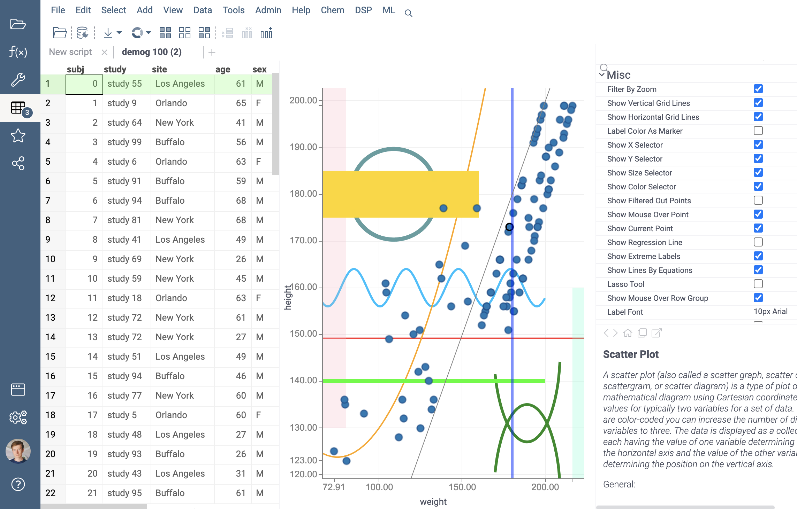

<!-- TITLE: Show lines on viewers -->

# How to show lines on viewers

A dataframe can contain information about lines and bands.

These figures are used by some viewers to draw additional lines on the charts. These can be reference lines, highlighting different areas of the chart and data, etc.



Shapes information is stored in a special dataframe tag `.shapes`. The viewer automatically reads this tag when it connects to the dataframe.

You can create and modify information about lines and bands by changing the `.shapes` dataframe tag. The content of the tag is a JSON string.

There is a more convenient way to create lines - method `dataframe.meta.addLine()`.

An example of creating and displaying a line in this way:

```javascript
let demog = grok.data.demo.demog(100);

demog.meta.addLine({
  title: 'Parabola',
  equation: '${height} = 180 + 0.01 * ${weight} * ${weight} - 1.5 * ${weight}',
  zindex: -30,
  color: "#FFA500",
  width: 2,
  visible: true,
});

let view = grok.shell.addTableView(demog);

let plot = view.scatterPlot({
  x: 'weight',
  y: 'height',
  showLinesByEquations: true    // This option allows to hide or show all lines and bands at once.
});
```

A similar method is used to create bands - `dataframe.meta.addBand()`. Most of the parameters for lines and bands are the same. But there are also some parameters that are specific for lines and bands. See them in the description of the parameters for lines and bands.

More examples of creating lines and bands can be found [here](https://dev.datagrok.ai/js/samples/data-frame/metadata/shapes).

## Line parameters

Method to create a line: `dataframe.meta.addLine(parameters)`

Only one parameter ("equation") is required. All other parameters have their default values.

| Parameter       | Type       | Example              | Default              | Description                                                          |
|-----------------|------------|-------------------------------|-------------------------------|----------------------------------------------------------------------|
| `title`           | string     | 'Reference line'              | Empty string              | Short name of the line used when displaying the tooltip.             |
| `description`     | string     | 'Normal distribution of data' | Empty string | Detailed description of the line used when displaying the tooltip.   |
| `equation`        | string     | '${height} = 2.2 * ${weight}' | Required parameter that must be specified | Equation for line. There should be one column to the left of the "=". And any formula using the second column on the right side. The equation uses syntax and formulas similar to the [Add New Column](../../transform/add-new-column.md) form.   |
| `color`           | string     | '#FF0000'                     | '#838383' (dark gray color)         | Line color in HEX format.   |
| `zindex`          | integer    | 25                            | 100                            | The "depth" of the line along the Z axis. The higher the number - the higher the line is located, overlapping other lines with a lower zindex value. The viewer's chart itself has zindex = 0. Values less than zero lead to the placement of lines under the chart. Values greater than zero cause lines to be placed on top of the chart. Lines with the same depth value are displayed in the order in which they were created.   |
| `opacity`           | float     | 0.7                     | 1.0                     | Opacity is a number in the range [0..1], where 0 is completely invisible, 1 is completely opaque.   |
| `visible`           | boolean     | false                     | true                     | Indicates whether a line is displayed or hidden.   |
| `min`           | float     | 50                     | No minimum limit                     | Line boundaries along the value axis. In this example, the line will be drawn for a "Weight" greater than 50 kg.   |
| `max`           | float     | 300                     | No maximum limit                      | Line boundaries along the value axis. In this example, the line will be drawn for a "Weight" less than 300 kg.   |
| `width`           | float     | 3                     | 1                     | Line width in pixels.   |
| `spline`           | float     | 0.5                     | 0.9                     | Smoothness of curve line in range [0..1], where 0 - no smoothing, 1 - max smoothing.   |

## Band parameters

Method to create a band: `dataframe.meta.addBand(parameters)`

Only 3 parameters ("equation", "column" and "column2") are required. All other parameters have their default values.

| Parameter       | Type       | Example              | Default              | Description                                                          |
|-----------------|------------|-------------------------------|-------------------------------|----------------------------------------------------------------------|
| `title`           | string     | 'Clipping range'              | Empty string              | Short name of the band used when displaying the tooltip.             |
| `description`     | string     | 'Ignored range of data'                | Empty string | Detailed description of the band used when displaying the tooltip.   |
| `equation`        | string     | '< 40' | Required parameter that must be specified | Band boundary formula. The formula can contain expressions of the form: "< 200", "> 50", "in(18, 60)", "in(q1, q3)", etc. The numbers are specified in the units of the column (in this case in centimeters).    |
| `color`           | string     | '#00FF00'                     | '#F0F0F0' (light gray color)         | Band color in HEX format.   |
| `zindex`          | integer    | -10                            | 100                            | The "depth" of the band along the Z axis. The higher the number - the higher the band is located, overlapping other lines and bands with a lower zindex value. The viewer's chart itself has zindex = 0. Values less than zero lead to the placement of lines and bands under the chart. Values greater than zero cause bands to be placed on top of the chart. Lines with the same depth value are displayed in the order in which they were created.   |
| `opacity`           | float     | 0.7                     | 1.0                     | Opacity is a number in the range [0..1], where 0 is completely invisible, 1 is completely opaque.   |
| `visible`           | boolean     | false                     | true                     | Indicates whether a band is displayed or hidden.   |
| `min`           | float     | 50                     | No minimum limit                     | Band boundaries along the value axis. In this example, the band will be drawn for a "Weight" greater than 50 kg.   |
| `max`           | float     | 300                     | No maximum limit                      | Band boundaries along the value axis. In this example, the band will be drawn for a "Weight" less than 300 kg.   |
| `column`           | string     | ${weight}                     | Required parameter that must be specified                     | Column for which the band is set. In this example, the equation means that ${weight} < 40. |
| `column2`           | string     | ${height}                     | Required parameter that must be specified                     | Second column for which the band will be drawn.   |

See also:

* [Adding new columns](help/transform/add-new-column)
* [Math functions](https://datagrok.ai/help/transform/functions/math-functions)
* [Operators](https://datagrok.ai/help/transform/functions/operators)
* [Constants](help/transform/functions/constants)
* [Statistical functions](https://datagrok.ai/help/transform/functions/stats-functions)
* [Conversion functions](https://datagrok.ai/help/transform/functions/conversion-functions)
* [Date and time functions](https://datagrok.ai/help/transform/functions/datetime-functions)
* [Text functions](https://datagrok.ai/help/transform/functions/text-functions)
