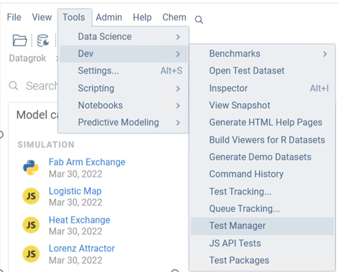
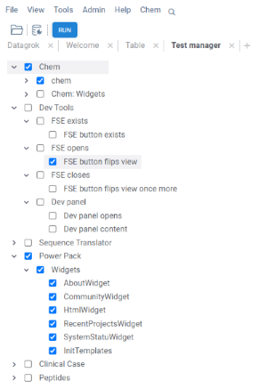
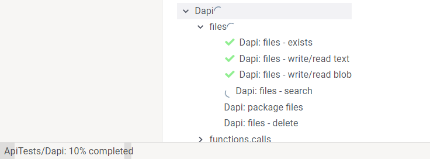
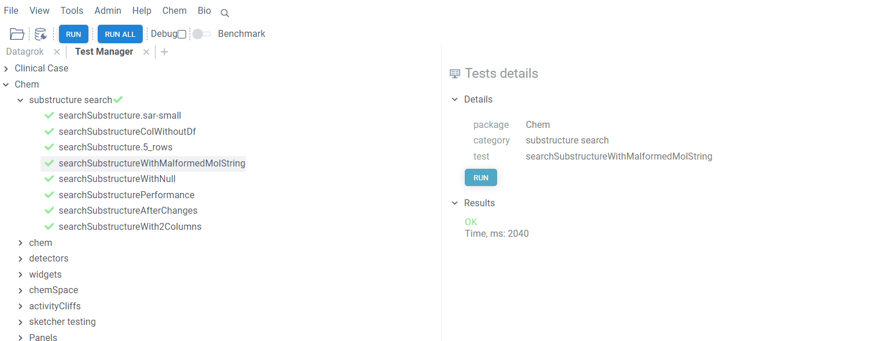

<!-- TITLE: Test packages -->

# Package testing

Testing is an essential part of development process. You should ensure that your
product works properly at each stage of it's lifecycle. For instance, when
developing a new version of a package you should perform regression testing and
confirm that new changes haven't affected previous functionality. Each package
should include a bunch of unit tests responsible for either UI or logic
underneath. And Datagrok provides various capabilities and tools to conveniently
run those tests any time during development.

## Local testing

To test packages locally before publishing you can use the Jest framework.

1) set environment variables:
    * HOST - for host to publish and test package, for example 'localhost'
    * TARGET_PACKAGE - `friendlyName` for the package from `package.json`
2) [Run Datagrok instance locally](../admin/docker-compose.md)
3) [Configure grok tool](set-up-environment.md#configuration) with localhost
   credentials.
4) [Publish the package to the HOST](publish-packages.md#private-packages),
   which was set on the first step.

   ```shell
   grok publish <HOST>
   ```

5) Run tests for the package

   ```shell
   npm test
   ```

6) The results are available in the command-line output or the
   `test-report.html` file.

## Tests after a change in a public package

It is always a good practice to test the changes before publishing the package.

All public packages in the [repository](../../collaborate/public-repository.md)
are tested using GitHub Actions on every commit. For every changed package
GitHub creates a new separate instance of Datagrok from the latest Datagrok
docker image. Then, it publishes a new version of the package to this instance.
And then, the tests are executed on it.

The results are available in the actions artifacts: `test-<PACKAGE NAME>-<DOCKER
IMAGE SHA>-<COMMIT SHA>.html`

### Trigger GitHub Actions manually

If an error occurred for the action triggered by the commit, it is possible to
trigger the action manually.

1) Use [Packages
   workflow](https://github.com/datagrok-ai/public/actions/workflows/packages.yml)
2) Press `run workflow` and set packages list to test separated with spaces, for
   example: `Demo Tutorials`. Choose the target branch. Then `Run workflow`.
   Note that publish to the NPM registry is executed for the master branch only.
3) Check that the GitHub Actions workflow finished successfully
4) The results are available in the actions artifacts: `test-<PACKAGE
   NAME>-<DOCKER IMAGE SHA>-<COMMIT SHA>.html`

The same steps can be applied for [Libraries
workflow](https://github.com/datagrok-ai/public/actions/workflows/libraries.yaml)
, [datagrok-tools
package](https://github.com/datagrok-ai/public/actions/workflows/tools.yml) and
[datagrok-api
package](https://github.com/datagrok-ai/public/actions/workflows/js-api.yml)

## Test manager

'Test manager' is a tool within the Datagrok platform that provides a convenient
interface to select and run package unit tests with further results exploration.
'Test manager' itself is a part of the DevTools package.

To start 'Test manager' go to top menu Tools -> Dev -> Test manager



Application starts showing a list of all packages containing unit tests. Inside each package, tests
are divided by category. Categories support multiple nesting (subcategories should be divided by `:`). 
To select a test or a category, click on it, or use keyboard.



### Running tests

There are multiple ways you can run tests:

- by right clicking on package, category, or test and selecting `Run` from context menu
- by selecting package, category, or test and pushing `Enter`
- by selecting package, category, or test and pushing `Run` on a ribbon panel
- by selecting package, category, or test and pushing `Run` on a property panel
- individual tests can be run by double click
- you can run all tests at once using `Run all` button on the ribbon
- package, category, or test can be run by putting the corresponding url into address bar of the browser. The format is the following `your_server_name/apps/DevTools/TestManager/package_name/category_name/test_name`
 Progress icon is shown opposite to active test/category/package, it will end up in result icon after completion. In case at least one test fails within category or package the fail icon will be shown.


Progress bar on the bottom of the page shows the percentage of completed
tests.



### Reviewing results

Information about test results is available via tooltip or in the property panel. Selected test, category, or package to explore results.
In case category/package contain multiple tests results are shown as a grid which can be added to workspace for further exploration.


