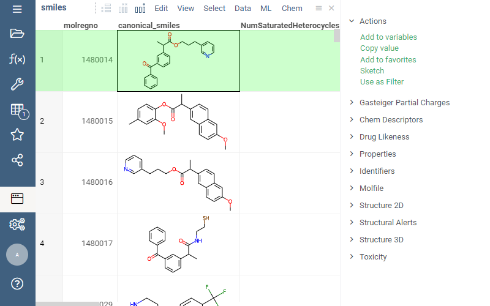

To register a context-specific action that would get offered to a user when right-clicking
on the item or expanding the **Actions** pane, add the following tags to the function:

* `meta.action`: Text to be shown
* `input`: Has to be exactly one input, annotated with `semType`.

The following example registers a **Use as filter** action for molecules:

```js
//name: Use as filter
//description: Adds this structure as a substructure filter
//meta.action: Use as filter
//input: semantic_value value { semType: Molecule }
export function useAsSubstructureFilter(value: DG.SemanticValue): void {
  let tv = grok.shell.tv;
  let molCol = value.cell.column;
  tv.getFiltersGroup({createDefaultFilters: false}).updateOrAdd({
    type: DG.FILTER_TYPE.SUBSTRUCTURE,
    column: molCol.name,
    columnName: molCol.name,
    molBlock: molToMolblock(value.value, getRdKitModule())
  }, false);
}
```

This is the end result (note the **Use as Filter** action in the right panel):



See also:

* [Datagrok JavaScript development](../../develop.md)
* [Test packages](../tests/test-packages.md)
