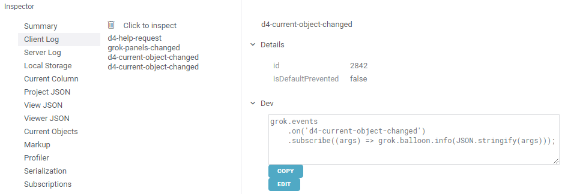

<!-- TITLE: JavaScript API -->
<!-- SUBTITLE: -->

# JavaScript API

[Grok JS API](js-api.md) allows to control all aspects of the Datagrok platform. The API
can be used from either ad-hoc scripts (`Tools | Scripting | JavaScript`), 
or from [packages](develop.md#packages). 

This document covers the following areas:
* [Data manipulation](#data-manipulation)
* [Views](#views)
* [Pre-defined viewers](#pre-defined-viewers)
* [Custom viewers](#custom-viewers)
* [Registering functions](#registering-functions)

## Data manipulation

Use [DataFrame](/js-api/DataFrame.html), [Column](/js-api/Column.html), [ColumnList](/js-api/ColumnList.html), 
and [Row](/js-api/Row.html) classes for table manipulation.

```javascript
demog = grok.testData('demog', 5000);
demog.cols.remove('sex');
foo = demog.cols.addNew('foo', 'int');
demog.rows.removeAt(1, 3);
demog.rows.insertAt(2, 2);
demog.rows.addNew(['Spiderman', 'studyX', 'NYC', 32, 'Spider', 'Net', new Date(2020), 180, 80, 666]);
demog.rows.addNew().subj = 'Iron Man';

// alternative ways of setting values
foo.set(1, 777);
demog.set('age', 1, 44);
``` 

Each [DataFrame](/js-api/DataFrame.html) is associated with two [bitsets](/js-api/BitSet.html): selection and filter.

## Views

Control [views](../overview/navigation.md) via the following methods:

```javascript
grok.shell.addTableView(table);
```

Dock an arbitrary visual element in a platform:

```javascript
let e = document.createElement('DIV');
e.innerText = 'This element has been created in JavaScript';
grok.shell.dockElement(e, 'JS', 'left', 0.5);
```

## Pre-defined viewers

[Viewers](../visualize/viewers.md) are very important components of the Datagrok platform. Grok API 
exposes functionality for manipulating pre-defined viewers 
(such as [scatter plot](../visualize/viewers/scatter-plot.md) or [histogram](../visualize/viewers/histogram.md)), as
well as for developing custom viewers.

Add a new viewer and set up its properties:

```javascript
view = grok.addTableView(grok.testData('demog', 5000));
hist = view.addViewer('histogram');
hist.options({'valueColumnName': 'weight'});
```

## Custom viewers

Extend [JsViewer](/js-api/JsViewer.html) class to develop viewers that become first-class citizens in 
the Grok platform. Once a viewer is registered, you can do the following:

* Add viewer using `Add | JsDemoViewer`, or from the toolbar 'viewers' popup
* Persist viewer as part of the project
* Common viewer operations under the "Viewer" popup menu, such as cloning, embedding, etc

The following code defines a new viewer by subclassing JsViewer. The viewer listens to changes
of filter and selection in the attached table, and updates numbers of filtered/selected rows accordingly.

```javascript
class JsDemoViewer extends DG.JsViewer {
    onFrameAttached() {
        subs.push(this.dataFrame.selection.onChanged.subscribe((_) => this.render()));
        subs.push(this.dataFrame.filter.onChanged.subscribe((_) => this.render()));

        this.render();
    }

    render() {
        this.root.innerHTML =
            `${this.dataFrame.toString()}<br>
            Selected: ${this.dataFrame.selection.trueCount}<br>
            Filtered: ${this.dataFrame.filter.trueCount}`;
    }
}

grok.shell.registerViewer('JsDemoViewer', 'JavaScript-based viewer', () => new JsDemoViewer());
```

## Registering functions

Pretty much anything in Grok is a [function](../overview/functions/function.md), it is a concept that
connects together [scripts](../compute/scripting.md) written in different languages, predictive models, statistical
functions, query transformations, data flows, and many other features.

The following code registers a "jsConcat" function that becomes a first-class
citizen in the platform (i.e., it can be used from console, gets registered
in help, there could be an optional audit trail associated with the invocations, etc)

```javascript
grok.functions.register({
    signature: 'String jsConcat(int foo, int bar)',
    run: (foo, bar) => `${foo}_${bar}`});
```

Internally, JavaScript-based application are also functions that are annotated accordingly.


## Custom file handlers

If custom file format support is required, just add function to [application](app.md) with 
"file-handler" tag in Grok. Input can be string or list of bytes, output is list of 
[tables](../overview/table.md). Extensions are specified in "meta.ext" option and separated with comma. 

```js
//input: string content
//output: list tables
//tags: file-handler
//meta.ext: fasta
function fastaFileHandler(content) {
    // ... processing files ...
    return tables;
}
```

## Events

We are exposing events coming out of the platform as a stream via the 
[Rx.JS](rxjs.dev) library that makes it easy to compose asynchronous or callback-based code.
The API makes easy to subscribe to either global, or instance-related events:

```javascript
   // global event when user changes the current project
   grok.events.onCurrentProjectChanged.subscribe(_ => 
       grok.shell.info(`Current project changed: ${grok.shell.project.name}`));

   // subscribing to DataFrame events
   demog = grok.data.testData('demog', 5000);
   demog.onValuesChanged.subscribe((_) => grok.shell.info('values changed'));
``` 

Event-related code snippets:
* [Global events](https://public.datagrok.ai/js/samples/events/global-events)
* [DataFrame events](https://public.datagrok.ai/js/samples/data-frame/events)

To figure out what events are coming out of the platform, use the Inspector tool.
Open it (Alt+I), go to the "Client Log" tab, and perform the action that you want
to intercept. In the panel, you will see one or more of the events, click on them
to inspect event parameters. To simplify the development process, we also generate
JavaScript code for handling this particular event, copy-paste it from the
property panel into your code if needed. 




See also:
* [JavaScript development](develop.md) 