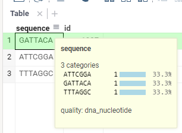
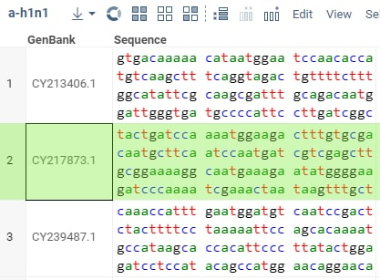

These programming exercises are designed to help developers get proficient with the Datagrok platform. The exercises are
organized as progressive steps, with tasks of increasing complexity built on top of the previously completed steps.

During this course, we will be building support for handling DNA nucleotide sequences. Let that not scare you, think of
them as regular strings that can only contain characters `G`, `A`, `C`, and `T` (and now you know the origins of the
"Gattaca" movie name) and the 'fasta: ' prefix to avoid conflicts. We will start with writing standalone functions, then automatically recognizing nucleotide
sequences in the imported data, and then going all the way to custom visualizations, relational databases querying,
predictive models, integration with the external utilities, data augmentation, and custom applications.

## Table of contents

* [Setting up the environment](#setting-up-the-environment)
* [Semantic types](#exercise-1-semantic-types)
* [Scripting and functions](#exercise-2-scripting-and-functions)
  * [Scripting with server functions](#scripting-with-server-functions)
  * [Modifying dataframes with scripts](#modifying-dataframes-with-scripts)
  * [Scripting with client functions](#scripting-with-client-functions)
* [Composing functions](#exercise-3-composing-functions)
* [Querying databases](#exercise-4-querying-databases)
* [Reading files](#exercise-5-reading-files)
* [Creating a scripting viewer](#exercise-6-creating-a-scripting-viewer)
* [Transforming dataframes](#exercise-7-transforming-dataframes)
* [Custom cell renderers](#exercise-8-custom-cell-renderers)
<!-- * [Accessing Web services with OpenAPI](#exercise-7-accessing-web-services-with-openapi) -->
* [Creating an info panel with a REST web service](#exercise-9-creating-an-info-panel-with-a-rest-web-service)
* [Enhancing Datagrok with dialog-based functions](#exercise-10-enhancing-datagrok-with-dialog-based-functions)

<!---
* Creating an application
* Accessing Web services in JavaScript with REST
* Creating a custom JavaScript viewer
* Optimizing a custom cell renderer with a cache
* Extending Datagrok with info panels
* Customize packages with properties
* Persisting user sessions and tables
* Using WebAssembly with Datagrok functions
* Webpack packages with WebAssembly
* Using Web Workers for background computations
--->

## Setting up the environment

*Prerequisites:* basic TypeScript or JavaScript knowledge.

*Useful links:*

* [Datagrok tools](https://www.npmjs.com/package/datagrok-tools)
* [Naming conventions](../../develop/develop.md#naming-conventions)

1. Install the necessary tools (Node.js, npm, webpack, datagrok-tools) following
   [these instructions](../../develop/dev-process/set-up-environment.md)
2. Create a branch from master at [GitHub](https://github.com/datagrok-ai/public/branches) or using your IDE; Use your
   credentials as a name of the branch
3. Get a dev key for [Dev Server](https://dev.datagrok.ai) (you will work with this server) and add it by running `grok
   config`. Open [https://dev.datagrok.ai/u](https://dev.datagrok.ai/u), click on `Developer key`, copy the `grok`
   command and execute it to add the key to your config
4. Create a default package in your branch [called](../../develop/develop.md#naming-conventions) `<yourFirstName>-sequence` using
   datagrok-tools: `grok create <yourFirstName>-sequence` with specifying the `--ts` option to create a package with
   TypeScript configuration (if you are new to TypeScript, you can specify the `--js` option); Note that detectors.js
   file should be in JavaScript anyway. Also you can add `--eslint` option to add eslint checker feature to the package
5. Run `npm install` to link the dependencies mentioned in `package.json` file of your package
6. Upload it to the server: run `webpack` and `grok publish dev` (see other options
   [here](../../develop/develop.md#publishing-modes))
7. Launch the platform and run the package's `info()` function using different methods:

* via the [Functions](https://dev.datagrok.ai/functions?q=info) view
* via the [Packages](https://dev.datagrok.ai/packages?) menu (find your package, click on it and run `info()` from the
  `Functions` pane in the context panel on the left)
* via the [console](../../datagrok/navigation/panels/panels.md#console): press `~` key anywhere inside Datagrok, the Console will appear
  to the right; execute `<loginName>Sequence:info()` there. The identifier used as package name (before ':') will be
  obtained by transformation kebab style of folder name to camel style, or can be specified directly with attribute
  `friendlyName` in `package.json` file.

As a result of the function execution you should see an info notification with url of package's webRoot.

## Exercise 1: Semantic types

*Prerequisites:* basic TypeScript or JavaScript knowledge.

Details: [Parameter annotation](../../datagrok/concepts/functions/func-params-annotation.md),
[How to define semantic type detectors](../how-to/define-semantic-type-detectors.md),
[How to add an info panel](../how-to/add-info-panel.md).

You will learn: how to write semantic type detectors, how to develop context-specific data augmentation.

1. Create a `complement` function in `src/package.ts` which takes a nucleotide string and returns its complement:

    ```javascript
    //name: complement
    //input: string nucleotides
    //output: string result
    export function complement(nucleotides): /*type*/ {
        // your code goes here
    }
    ```

   Note that comments on the top of the function declaration are crucial for running it on the platform. They determine
   the function name, the input and output types. 
   
   Essentially, change each character to the complementary one: `A <=> T`, `G <=> C`. Run it and check whether everything works fine.

2. Now, let's specify that this function is meant to accept not any string, but nucleotides only, and to return a
   nucleotide string as well. In order to do that, let's annotate both input and output parameters with the
   `dna_nucleotide` semantic type:

    ```javascript
    //input: string nucleotides {semType: dna_nucleotide}
    //output: string result {semType: dna_nucleotide}
   ```

   At this point, `dna_nucleotide` string does not have any meaning, but we will connect the dots later.

3. <a name="detectors"></a> Define a `detectNucleotides` semantic type detector function as part of the special
   `detectors.js` file.

    ```javascript
   class <yourFirstName>SequencePackageDetectors extends DG.Package {

     //tags: semTypeDetector
     //input: column col
     //output: string semType
     detectNucleotides(col) {
         // your code goes here
     }
   }
   ```

   It should check whether a column is a string column, and whether each string represents a nucleotide. If condition is
   met, it should return `"dna_nucleotide"` string.

   For best performance, don't iterate over all column values, instead iterate
   [on `column.categories`](../advanced/data-frame.md#work-with-categories). Full Datagrok Column type API could be found [here](https://datagrok.ai/js-api/dg/classes/Column).

4. Upload your package to `dev.datagrok.ai` using `grok publish dev` command. When everything is done correctly, the
   `detectors.js` file will get loaded by the platform automatically, and the `detectNucleotides` function will be
   executed against every column in a newly added table.

5. Reload the `dev.datagrok.ai` page to use updated version of your package.

6. Test your implementation by opening the following CSV or TXT file (or go to `📁 (Data) | Text`
   and paste it there). Make sure you click on DONE (this will trigger semantic types detection):

   ```
   sequence, id
   fasta: GATTACA, 1997
   fasta: ATTCGGA, 1984
   fasta: TTTAGGC, 2021
   ```

   Hover over the `sequence` column header after the data is imported — if everything is done correctly, you will see
   `quality: dna_nucleotide` in the bottom of the tooltip:

   

   Alternatively, you can find this information if you click on the column and expand the 'Details' pane in the property
   panel on the right.
7. Now let's put the result of the previously created `complement` function into an
   [info panel](../how-to/add-info-panel.md): Create function `complementWidget` and add special comments block to
   allow Datagrok system recognize it and upload properly (see an example [here](../how-to/add-info-panel.md#functions)).

   ```javascript
    //name: complementWidget
    //tags: panel, widgets
    //input: string nucleotides {semType: dna_nucleotide}
    //output: widget result
    //condition: true
   ```

   The `panel` and `widgets` tags and output type `widget` allows Datagrok to determine how the result of
   `complementWidget` function will appear in the system. Listed above block of comments will instruct the platform to
   use the `complementWidget` function for providing additional information for string values of the `dna_nucleotide`
   semantic type. To test it, simply open our test file, click on any cell in the `sequence` column, and find the
   `complementWidget` property in the panel on the right as it is shown on screenshot:
   

## Exercise 2: Scripting and functions

### Scripting with server functions

*Prerequisites:* basic Python knowledge.

*Details:* [Scripting](../../compute/scripting/scripting.mdx), [Dev Meeting 1 | First-class functions][015]

*You will learn:* how to create and invoke Datagrok scripts in data science languages like R and Python.

In this exercise, we will count occurrences of a given subsequence in a nucleotide sequence, using Python.

1. Open Datagrok and navigate to `Functions | Scripts | Actions | New Python Script`.
2. Observe a default script created for you. All script attributes are specified in the beginning in comments. There we
   have the script name, language, one input value of type `dataframe`, and one output value of type `int`. The script
   simply computes number of cells in the dataframe. [Dataframe](../../develop/how-to/build-an-app.md) is a high-performance, easy
   to use tabular structure with strongly-typed columns of different types (supported types are: `string`, `bool`, `int`
   , `bigint`, `double`, `qnum` and `datetime`). In this exercise, we only see a dataframe as is in the default script;
   there is another exercise to learn manipulating dataframes in JavaScript.
3. Run the script to get a hint for creating an input file. An attribute `#sample: cars.csv` is responsible for it. To
   open a default input file `cars`, click the `Star` icon in the top menu.
4. Run the script again and proceed to the Datagrok's console. As in Quake, it's available by pressing a `~` button
   anywhere inside Datagrok. In the console, you would see the script execution result. Just one line above the result
   you could see the console's command to execute the script. Enter it again to the console to get the same result (but
   in console you should specify script with namespace prefix as `<yourLogin>:<script_name>`).
5. Let's modify the script to solve the task of counting sequence occurrences. Add a new preamble: (use any
   `#description` you like):

    ```python
    # name: CountSubsequencePython
    # language: python
    # input: string sequence
    # input: string subsequence
    # output: int count
    ```

   In the body, implement a Python function counting all occurrences of a given `subsequence` in a `sequence`. Return a
   `count` the same way as in the default script from p. 2.

6. Run the script function, provide input values in the dialog and get to the console to see the result. Now run the
   script function again through the console completely, passing different arguments values:
   `<yourLogin>:CountSubsequencePython('ATGATC', 'A')`. You can find your login inside the profile page between name and
   email (under avatar), or in the profile URL: `https://dev.datagrok.ai/u/<yourLogin>/summary`.
7. Let's apply `CountSubsequencePython` to the input dataframe using Datagrok UI. Open a table — say, let's go for
   `sars-cov-2.csv`. Navigate to `Data | Files` and open `Demo Files / bio / sars-cov-2.csv`. Navigate to a menu item
   `Edit | Add New Column...` and click it. Type in your expression using the function you've just previously created:
    Observe how the `Preview Result Columns` change while you
   are modifying the expression. There, notice a namespace `<yourLogin>` as part of a qualified function name
   `<yourLogin>:<functionName>`, `JDoe:CountSubsequencePython` in this case. Namespaces are used through Datagrok very
   commonly. In general, there shall be no case where you would call a function without specifying a namespace. Datagrok
   namespaces originate from the names of packages, projects, and users, and always qualify a resource name, be it a
   package, a function, a connection or a query. Now hit "Ok" and have the new column inserted to the dataframe.

<!-- TODO: Update the dialog -->

### Modifying dataframes with scripts

*Prerequisites:* basic Python knowledge.

*You will learn:* how to manipulate tables, which we usually call dataframes, using a server scripting language, expand
dataframes with newly computed values, and modify the dataframes.

In the previous exercise we learnt a fast method to apply a function to a table and produce a new column in it. Another
means to introduce new columns to the dataframes is to programmatically manipulate dataframes right in scripts. Let's
repeat what we've achieved in the last point of the previous exercise, now with more scripting.

1. Let's create a different kind of our `CountSubsequencePython` function, now called `CountSubsequencePythonDataframe`.
   While the original function could only operate on a single row, the new function shall operate on the entire
   dataframe. To start with, the function's Datagrok signature should look as follows:

    ```python
    # name: CountSubsequencePythonDataframe
    # language: python
    # input: dataframe sequences
    # input: column columnName
    # input: string subsequence = "acc"
    # output: dataframe result {action:join(sequences)}
    ```

   This function takes as an input a dataframe with a column containing nucleotide sequences, named as a value of
   `columnName`, a nucleotide subsequence `subsequence` being sought, and outputs an input dataframe with a new column
   *appended* to it, containing numbers of subsequence occurrences in the nucleotide sequences. Say, for a table on the
   left the following table on the right should be produced for a subsequence `acc` being sought:

    <table>
    <tr><td>

   | GenBank    | ID                |
   |------------|-------------------|
   | MT079845.1 | fasta: ctacaagaga |
   | MT079851.1 | fasta: attaaaggtt |
   | MT326187.1 | fasta: gttctctaaa |

    </td><td>

   | GenBank    | ID                | N(acc) |
   |------------|-------------------|--------|
   | MT079845.1 | fasta: ctaccagaga | 1      |
   | MT079851.1 | fasta: attaaaggtt | 0      |
   | MT326187.1 | fasta: gttctctacc | 1      |

    </td></tr>
    </table>

2. Implement a function `CountSubsequencePythonDataframe`. Assume the `result` is a Python dataframe with just this one
   column `columnName`. After the `result` column is computed and returned from the server to the client, based on the
   `join` instruction, `result` will be  *appended* to the existing input dataframe `sequences`. As this is performed
   purely on the client, we save the bandwidth without needing to return a copy of a dataframe which we already passed
   to the server.

    * Use Pandas dataframes as `pd` to access the input dataframe and create an output dataframe
    * You don't need to import `pandas`, Datagrok does this automatically: to each Python script it adds a preamble with
      most popular imports (`os`, `io`, `json`, `pandas as pd`, `requests` , `datetime`, `timedelta`)
    * Note that the column `columnName` is just a string with a column name passed to a script, not an actual column
      content

3. Run the function with a "Play" button on top of the function window. The dialog will prompt you to select a
   dataframe. Navigate to a "Data" view (first button on the left sidebar) and open a file with nucleotide sequences
   (say, `Demo Files / bio / sars-cov-2.csv` available at public.datagrok.ai). Go back to the `Run Function` dialog to
   select the opened dataframe.

4. Now choose a column with nucleotide sequences from the dropdown. Notice how the list of columns is automatically
   formed for the selected dataframe. Finally, run the function to get the resulting dataframe.

5. As for modifying the dataframes in general, just consider removing the `{action:join}` option and do whatever is
   needed to the output dataframe `result` before the end line of the script. This will return exactly the `result`
   dataframe after all modifications.

6. Consider that the function may have several outputs. In case you return two dataframes, both will appear in the
   Datagrok interface. There's also a special syntax in Datagrok JS API to call functions which return several
   parameters, we'll review this in one of the following exercises.

### Scripting with client functions

*Prerequisites:* basic JavaScript knowledge.

*You will learn:* how to create and invoke Datagrok JavaScript scripts.

1. Go to `Functions | Scripts` and hit `New JavaScript Script`.
2. Implement the function `CountSubsequenceJS` in JavaScript, which does the same as
   [`CountSubsequencePython`](#scripting-with-server-functions). Follow the same conventions on the parameters in the
   comments block and returning a result via a variable.
3. Run `CountSubsequenceJS` using the `Play` button; using the console. From same console, run `CountSubsequencePython`
   yet again. You can notice that both Python and JS versions of our function, implemented as scripts, are homogeneous
   functions in Datagrok. It's also possible to call them in a uniform fashion [using our JavaScript API](../../compute/scripting/getting-started.md#run-the-script).
4. Don't forget to save these two scripts. We would re-use parts of them in the following exercises.

The difference between the two scripts is that the first, `CountSubsequencePython`, runs on our server by a
[compute virtual machine](../under-the-hood/infrastructure.md#compute-components), whereas the second, `CountSubsequenceJS`, runs
directly in the browser. To run `CountSubsequencePython`, Datagrok passes the script arguments over the network and
fetches back the result to the browser.

## Exercise 3: Composing functions

*Prerequisites:* basic Python and TypeScript/JavaScript knowledge.

*You will learn*: how to invoke functions via [JS API](../packages/js-api.md), find functions by their metadata, and compose
functions.

1. Create a folder called `scripts` under your package root. Find the script `CountSubsequencePython` created for the
   [Scripting exercise](#exercise-2-scripting-and-functions) and add it to this folder.
1. Publish your package and try calling your script from the console:

   ```sh
   <PackageName>:CountSubsequencePython("fasta: gttctctacc", "acc")
   ```

   :::note
   If you already have scripts with the same names saved on the platform, those from the package will have a
   suffix `_1` (this can be checked in `Links...` in the script details in the context panel).
   :::

   To provide scripts as part of a package, use the `scripts` folder. This is one of special directories reserved for
   specific package content (learn more about [package structure](../develop.md#package-structure)).

1. Now let's try calling a script via JS API. Add a new function to `src/package.ts`. It should call your Python script
   with specified arguments and return the result of the following expression:

   ```ts
   grok.functions.call(`${packageName}:${scriptName}`, { params });
   ```

   This expression can be used to call any function (including commands you see in the platform console, scripts,
   queries, functions from external packages, and so on). The first argument is a fully-qualified function name (in your
   case, a namespace corresponds to a package name); the next argument is an object with parameters (make sure that they
   correspond to the input names in the script annotation, e.g., `{ sequence: 'fasta: gttctctacc', subsequence: 'acc' }`). You
   can also control the progress indicator during the call (see the API reference for
   [call](https://datagrok.ai/js-api/dg/classes/Functions#call)).

   :::tip
   You can generate such wrapper functions for your scripts and queries by calling the `grok api` command in your
   package directory (see [datagrok-tools docs](https://github.com/datagrok-ai/public/tree/master/tools#commands)).
   <details>
   <summary> Example </summary>
   <div>

   ```ts
   export async function countSubsequencePython(sequence: string, subsequence: string): Promise<number> {
     return await grok.functions.call('ExercisesPackage:CountSubsequencePython', { sequence, subsequence });
   }
   ```

   </div>
   </details>
   :::
1. Read instructions for [package testing](../../develop/how-to/add-package-tests.md#testing-functions) and add several tests
   to the `CountSubsequencePython` script annotation. Publish you package and check that tests run successfully in
   the [Test Manager](../../develop/how-to/test-packages.md#test-manager), or by calling the `test` function of your package.

   :::note
   Annotation tests have a limitation on the number of output parameters in the script. To test a script with multiple
   outputs, get it via `DG.Func.find` and use the `getParamValue` method to obtain each output parameter by its name
   from the function call (refer to the [Scripting](../../compute/scripting/getting-started.md#run-the-script) article for details).
   :::

1. We can use API methods to take the `CountSubsequencePythonDataframe` script one step further. First, let's give a
   proper name to a new column. Create a wrapping function for `CountSubsequenceTableAugment` in `src/package.ts`:

   ```ts
   //name: CountSubsequenceTableAugment
   //input: dataframe sequences
   //input: column columnName
   //input: string subsequence = "acc"
   export async function countSubsequenceTableAugment(sequences: DG.DataFrame, columnName: DG.Column, subsequence: string): Promise<void> {
      const df = await grok.functions.call('ExercisesPackage:CountSubsequencePythonDataframe', { sequences, columnName, subsequence });
      const countCol = df.columns.byIndex(0);
      countCol.name = `N(${subsequence})`;
      sequences.columns.insert(countCol);
   }
   ```

   :::note
   The `{action:join}` option is no longer necessary in the output parameter of the script as we augment the
   original dataframe in the above function. However, you can try to achieve the same effect in the script
   (see the implementation below for self-check).
   <details>
   <summary> Python implementation </summary>
   <div>

   ```python
   #language: python
   #input: dataframe sequences
   #input: column columnName
   #input: string subsequence = "acc"
   #output: dataframe result {action:join(sequences)}
   result = pd.DataFrame()
   result[f'N({subsequence})'] = sequences[columnName].apply(lambda x: x.count(subsequence))
   ```

   </div>
   </details>
   :::

1. Publish your package and prepare a visual layout before running the script. Navigate to `Data | Files` and open
   `Demo Files / bio / sars-cov-2.csv`. Run the script and check that a new column appears in the grid.

## Exercise 4: Querying databases

*Prerequisites:* basic SQL knowledge

*Details:* [Connecting to Databases](https://www.youtube.com/watch?v=dKrCk38A1m8&t=1048s),
[How to Access Data](../../develop/how-to/access-data)

*Note:* Editing an existing data query requires the respective access permission. You might need to request one.

In this exercise, we will work with a `northwind` PostgreSQL database (in case the name sounds familiar, this is a demo
database that Microsoft often uses for showcasing its technology). The database is already deployed and is accessible
from our server.

1. Navigate to the `Data | Databases | PostgreSQL | northwind | Schemas | public | orders` table
2. Make this table current by left-clicking on it, and explore its context panel on the right. The `Content` pane should
   be showing first 50 rows of that table.
3. Right-click on the table, and choose `New SQL Query...`
4. Execute the query and make sure it returns results.
5. Modify the query to accept a `country` parameter, and return the sum of freights for the specified country, grouped
   by `customerid`:

   ```sql
   --input: string country
   select customerid, sum(freight)
   from public.orders
   where shipcountry = @country
   group by customerid
   ```

6. Run the query, enter one of the countries in the input box (such as `USA`, without quotation marks or apostrophes).
   Run it the second time, notice that previously entered parameters could be quickly reused by clicking on the watch
   icon in the left bottom corner of the dialog window.
7. Rename this query from your name to `ordersByCountry`, and save it.
8. Try different ways to execute it:

    * Right-click on `Data | Databases | PostgreSQL | northwind | ordersByCountry`, select `Run` from the context menu,
      enter the country name, and run it
    * Click on `Data | Databases | PostgreSQL | northwind | ordersByCountry`, expand the `Run` pane on the right, enter
      the
      country name and run it
    * Open console by pressing `~` key, see the results of the previous invocations. Copy-paste the corresponding
      command and run it from the console.

9. Now, let's add this query to our package. Create a connection by running `grok add connection <yourFirstName>`, then,
   as instructed [here](../../develop/how-to/access-data#creating-queries), update credentials, create the '.sql' file under the `queries` folder, and
   paste our query there. Give it a name by adding the `--name: ordersByCountry` line on top of it.
10. Deploy the package, launch the platform, find the query in the package, and run it.
11. Create a JavaScript function (in `src/package.js`) that has no parameters and returns a dataframe with the results
    of the `ordersByCountry('USA')` call:

    ```javascript
    //name: getOrders
    //output: dataframe df
    export async function getOrders() {
      return await grok.data.query(`${packageName}:${queryName}`, { country: 'USA'});
    }
    ```

    There is another way to pass a country name to the query: you can provide a default value for the input parameter
    (see examples in the article [Parameterized Queries](../../access/databases/databases.md#parameterized-queries)).

## Exercise 5: Reading files

*Prerequisites:* basic TypeScript/JavaScript knowledge

*Details:* [How to access data](../../develop/how-to/access-data),
[How to work with package files](../../develop/how-to/work-with-package-files.md)

*You will learn*: different ways to read files programmatically

1. In previous exercises, we opened the test file `Demo Files > bio > sars-cov-2.csv` from the UI. Let's now write a
   function that opens a file by its path programmatically. Firstly, add this to your package:

   ```ts
   //input: string filepath
   //output: dataframe df
   export async function openTable(filepath: string): Promise<DG.DataFrame> {
   }
   ```

   There are several methods you can use to open a table. For demo files, the simplest way is
   [grok.data.getDemoTable](https://datagrok.ai/js-api/dg/classes/Data#getdemotable). For files outside of the
   `Demo:Files` [file share](../../access/files/files.md), you can use
   [grok.data.files.openTable](https://datagrok.ai/js-api/dg/classes/Files#opentable), or execute a command
   `OpenServerFile` via [grok.functions.eval](https://datagrok.ai/js-api/dg/classes/Functions#eval) (to see how it
   works, open a file from the UI and find the last console command, it will look similar to
   `OpenServerFile("Demo:Files/bio/sars-cov-2.csv")`).
   
   Assume that the inputs will be demo files only. Make sure to open a table view using `grok.shell.addTableView(df)`
   before you return the dataframe from your function.

1. Publish your package and test the function with the following inputs:

   ```ts
   openTable("bio/sars-cov-2.csv");
   openTable("geo/earthquakes.csv");
   openTable("demog.csv");
   ```

   <details>
   <summary> Function implementation </summary>
   <div>

   ```ts
   //input: string filepath
   //output: dataframe df
   export async function openTable1(filepath: string): Promise<DG.DataFrame> {
      const df = await grok.data.getDemoTable(filepath);
      grok.shell.addTableView(df);
      return df;
   }
   //input: string filepath
   //output: dataframe df
   export async function openTable2(filepath: string): Promise<DG.DataFrame> {
      const df = await grok.data.files.openTable(`System:/${filepath}`);
      grok.shell.addTableView(df);
      return df;
   }

   //input: string filepath
   //output: dataframe df
   export async function openTable3(filepath: string): Promise<DG.DataFrame> {
      const df = (await (grok.functions.eval(`OpenServerFile("System:DemoFiles/${filepath}")`)))[0];
      grok.shell.addTableView(df);
      return df;
   }
   ```

   </div>
   </details>

1. Now let's see how to load external files by URL. Run a code snippet:
   [stock-prices](https://public.datagrok.ai/js/samples/data-access/external/stock-prices). We will see another application of  the
   `grok.data.loadTable` method in one of the next steps.
1. Create a folder `files` in your package. Download the [demographics dataset](https://public.datagrok.ai/f/System.DemoFiles/demog.csv) and [cars dataset](https://public.datagrok.ai/f/System.DemoFiles/cars.csv). Add these files to the new folder. Also, put several files
   with another extension there, e.g. [aspirin mol file](https://public.datagrok.ai/files/system.demofiles/chem/mol/aspirin.mol).
1. Write a function that works with files distributed with your package. It should add all *tables* from the `files`
   folder to the workspace:

   ```ts
   //name: Add Tables
   export async function addTables(): Promise<void> {
      // Recursively list package files
      const files = await _package.files.list('', true);

      // Filter files by extension
      const csvFiles = files.filter((f) => f.extension === 'csv');

      // Load every table and add a view for it
      for (const file of csvFiles) {
         const df = await _package.files.readCsv(file.path);
         grok.shell.addTableView(df);
         // Alternative ways to read a table are:
         // const df = await grok.data.loadTable(`${_package.webRoot}${file.path}`);
         // const df = await grok.data.files.openTable(`System:AppData/${_package.name}/${file.fileName}`);
      }
   }
   ```

1. Publish your package. Find your files in the files browser: open `Data > Files > App Data > <PackageName>`. Don't
   open the files from the UI, though. Call the `addTables` function in order to test your code. This is how you can work
   with package files in your applications.

## Exercise 6: Creating a scripting viewer

*Prerequisites:* basic Python knowledge, [matplotlib](https://matplotlib.org/) or a similar library

*Details:* [Scripting](../../compute/scripting) , [Scripting Viewer](../../visualize/viewers/scripting-viewer),
[Creating a scripting viewer (video)](https://www.youtube.com/embed/jHRpOnhBAz4).

*Amino acids counting task.* In this exercise, we'd use a Python script to generate a histogram (a distribution plot)
for amino acids occurring in a column of nucleotide sequences. Amino acids are simply triples of nucleotides from which
the nucleotide DNA sequence is made of. These are also called triplets, or codon-codes. As there are 4 letters `G`, `A`,
`T`, `C`, there are 4 to power 3 protein amino acids: `GTA`, `AGC`, `TTT`, and so forth.

We don't know at which starting point each nucleotide sequence was cut: it could either be a junction of two triplets,
or one-third or two-third of a triplet. Therefore, we'd count in our statistics for all three possible cuts, starting
the reading frame off at offsets 0, 1, and 2 from the beginning of the nucleotide sequence.

Say, we are given a sequence `fasta: TTTAATTACAGACCTGAA`. We start to count triplets *without overlap* from an offset 0 first,
getting: `TTT`, `AAT`, `TAC`, `...`, `GAA`. Then we move to the offset 1, getting: `TTA`, `...`, `CTG`. Lastly, we move
to the offset 2 and get: `TAA`, `...`, `TGA`. In the histogram we'd count for all these triplets.

First, let's explore how scripting viewer works.

1. Open a `demog` demo file with demographic data. It is located at `Data | Files | Demo Files | demog.csv`.
   `Data` corresponds to the first button from the top of the Datagrok sidebar. Make sure the table view with the data
   appears.
1. Activate the top menu from the sidebar, using a `Windows | Menu` switch. 3. In this menu, hit `Add | Scripting
Viewers | Add Scripting Viewer`.
1. See that the viewer appeared on the right, telling though it is "Unable to plot with current settings".
1. Proceed to the viewer properties by hitting on the gear icon in the viewer's title.
1. Make sure the chosen values for "Data" are `HEIGHT` for `X`, `WEIGHT` for `Y`, and `AGE` for `Color`. After checking
   this you should see a nice scatter plot for `WEIGHT` and `HEIGHT` with the color corresponding to `AGE`:
   
1. In the context panel, proceed to modify the value of the "Script" field by clicking on a "..." icon in the text
   field.
1. Enter the next code to the script editor:
 
   ```ts
   #name: Scatter Plot
   #language: python
   #tags: demo, viewers
   #input: dataframe t
   #input: column xColumnName {type: numerical}
   #input: column yColumnName {type: numerical}
   #input: column colorColumnName {type: numerical}
   #output: graphics

   import numpy as np
   import matplotlib.pyplot as plt

   color = t[colorColumnName].values 
   cmap = plt.cm.Spectral
   norm = plt.Normalize(vmin = min(color), vmax = max(color))

   plt.scatter(t[[xColumnName]],t[[yColumnName]], color = cmap(norm(color)), alpha=0.5)
   plt.xlabel(xColumnName)
   plt.ylabel(yColumnName)

   plt.show() 
   ```

1. The Python code you see is what renders the scatter plot form p.6 on the Datagrok server. Let's walkthrough this
   code.
    * The script takes as inputs the original dataframe and the three columns. Remember form p.6 there were selectors
      for `X`, `Y`, and `Color` in the context panel. In fact, these three property names are declared with the notation
      `<propertyName>ColumnName` in the names of the three `#input` columns.
    * The script produces an `#output` of type `graphics`. It is important the graphics appear in the end of the Python
      script. This is exactly what happens with the `plt.show()` in the last line of the script.

1. Modify the name of `colorColumnName` to a `temperatureColumnName`, hit `Apply` in the bottom of the window, and check
   what happens to the `Color` field in the context panel.
1. Add another input parameter to the script with a name `Title`. Hit `Apply` and check what appears in the property
    panel.
1. Add another input column to the script with a name `SEX`. Hit `Apply` and check what appears in the context panel.
1. Now there's all you need to create a Python scripting viewer for our amino acid histogram task. Open a demo file
    with nucleotide sequences. It is located at `Data | Files | Demo Files | bio | sars-cov-2.csv`. `Data` corresponds
    to the first button from the top on the Datagrok sidebar.
1. In the top menu you've activated at p.2, hit `Add | Scripting Viewers | New Scripting Viewer`.
1. Follow what you've learned in the points 1 to 11 to create a scripting viewer taking a column of strings, expecting
    to have nucleotide sequences in them, and plotting a [Matplotlib's histogram][016] with all amino acid triplets
    occurred within all of these sequences. As you may notice, `numpy` and `matplotlib` are already available for your
    Python scripting in Datagrok. Reuse them to finish this exercise.

## Exercise 7: Transforming dataframes

*Prerequisites:* exercises ["Setting up the environment"](#setting-up-the-environment),
["Semantic types"](#exercise-1-semantic-types).

*You will learn:* how to apply test-driven development (TDD), how to join and union dataframes using the knowledge of semantic types, and display the result.

1. Make sure the [prerequisites](#setting-up-the-environment) are prepared on your machine, including the package called
   `<yourFirstName>-sequence` Assure the package carries a relevant semantic type detector from the exercise
   ["Semantic Types"](#exercise-1-semantic-types).
2. Your task will be to implement a `fuzzyJoin` function which takes two dataframes `df1` and `df2`, and does the following:

   * takes a first column in `df1` which has a semantic type of `dna_nucleotide`, let's say it is `col1`
   * takes a first column in `df2` which has a semantic type of `dna_nucleotide`, let's say it is `col2`
   * creates a dataframe `df` out of `df1` and `df2` in the following way:
      * the content of `df2` goes after `df1`, and all columns of `df1` and `df2` are preserved — this is a UNION
        operation for dataframes, as in SQL; use the dataframe's
        [`.append`](https://public.datagrok.ai/js/samples/data-frame/append) method
      * a new column `Counts` appears in `df`, which contains:
         * for each row `R` from `df1`, `R.counts` is a number of matches of all the subsequences in `R.col1` of length
           `N` in *all* the sequences of `col2`
         * symmetrically, same for each row from `df2` — consider this as a fuzzy, programmatic JOIN of the two
           dataframes; use[`df.columns.addNew`](https://public.datagrok.ai/js/samples/data-frame/modification/manipulate)
           , [`col.set(i, value)`](https://public.datagrok.ai/js/samples/data-frame/advanced/data-frames-in-columns) on a
           newly created column
   * displays `df` with [`grok.shell.addTableView`](https://public.datagrok.ai/js/samples/data-frame/test-tables)

   To make this, you will first need to write a test for the function ([Test packages](https://datagrok.ai/help/develop/how-to/test-packages)).
   Create a new file `fuzzy-join-test.ts` in the `tests` folder of your package. Write a test that creates two dataframes
   with the columns with dna_nucleotide semantic type, appends the dataframes and calculates the `Counts` column. The test
   should check the existence of the appended columns and the `Counts` column, as well as its values. After the test is written,
   run it to make sure it fails.

3. Add a function to the package as follows:

   ```javascript
   //name: fuzzyJoin
   //input: dataframe df1
   //input: dataframe df2
   //input: int N 
   //output: dataframe result
   ...
   ```

4. Implement the `fuzzyJoin` function.

5. Deploy the package with `webpack` and `grok publish dev`. Unlike with the first exercise, where the package was built
   on the Datagrok server, in this one we locally build the package before sending it. In addition, webpack output helps
   find some syntactic errors in JavaScript.
6. Launch the platform and run the test to check if you implemented the function correctly. If the test fails, fix the
   function and run the test again until it passes.
7. After the test passes, open the two files from `"Demo files"`: `sars-cov-2.csv` and `a-h1n1.csv`, and run the
   package's `fuzzyJoin` function using one of the methods you've learned. The result for N=3 should look similar to:

   .

If the result is not the same as expected, fix the test so it reflects the correct behavior. After that, fix the implementation
of the `fuzzyJoin` function and run the test again. Repeat this process until the test passes.
8. Read more about joining dataframes through the case reviewed at our
   [Community Forum](https://community.datagrok.ai/t/table-to-table-augmentation/493/4), and with
   [a sample](https://public.datagrok.ai/js/samples/data-frame/join-link/join-tables).

<!--- TODO: add linked dataframes demo here --->

## Exercise 8: Custom cell renderers

*You will learn:* render cells by semantic types.

*Prerequisites:* exercises ["Setting up the environment"](#setting-up-the-environment),
["Semantic types"](#exercise-1-semantic-types).

1. Navigate into the folder with your `<yourFirstName>-sequence` package created in
   ["Setting up the environment"](#setting-up-the-environment).
2. Let's add a custom cell renderer for a *nucleotide sequence box* to represent our sequences in different colors. We
   need to use monospace font and render each nucleotide (`A`, `G`, `C`, `T`) in a different color using on of the
   popular conventions, following [this link](https://www.biostars.org/p/171056/).
3. Add a class to `src/package.ts` for the new cell renderer:

    * Datagrok [grid](../../visualize/viewers/grid) is rendered through an [HTML5
      Canvas](https://en.wikipedia.org/wiki/Canvas_element). The grid's canvas is `g.canvas`. Iterate through the
      resulting lines and bring them to a `g.canvas` in the `render` method with `g.canvas.getContext('2d').fillText`;
      learn more about HTML Canvas if it's new for you

    ```typescript
    export class NucleotideBoxCellRenderer extends DG.GridCellRenderer {
      get name() { return 'Nucleotide cell renderer';}
      get cellType() {return 'dna_nucleotide';}
      render(g: CanvasRenderingContext2D, x: number, y: number, w: number, h: number,
        gridCell: DG.GridCell, cellStyle: DG.GridCellStyle) {
        let seq = gridCell.cell.value;
        let ctx = g.canvas.getContext('2d');
        ctx.font = '11px courier';
        // ...
        for (let i = 0; i < gridCell.cell.value.length; i++)
          ctx.fillText(/* ... */);
      }
    }
    ```

4. Add the below to `src/package.ts` to make the new cell renderer part of the package:

   ```typescript
    //name: nucleotideBoxCellRenderer
    //tags: cellRenderer
    //meta.cellType: dna_nucleotide
    //output: grid_cell_renderer result
    export function nucleotideBoxCellRenderer() {
      return new NucleotideBoxCellRenderer();
    }
    ```

5. Deploy the package as usual with `grok publish dev`. In [Datagrok](https://public.datagrok.ai), navigate to a file
   with nucleotide sequences from `"Demo files"`, such as `sars-cov-2.csv`. Verify you get the desired result, it should
   look similar to this:  Change the "Sequence"
   column width and rows heights with a mouse to see how sequence looks.

<!-- Fix the OpenAPI problems to make the exercise 7 doable

## Exercise 7: Accessing web services with OpenAPI

*Details:* [OpenAPI access](../../access/open-api.md)

Web services often provide their API specs in an [OpenAPI (Swagger)](../../access/open-api.md) format in a JSON or a
yaml file. Because OpenAPI spec file is standardized, the API may now be directly loaded and later queried. Datagrok
provides for connecting to API data sources and fetching API querying results as dataframes. In this lesson we will
connect to the [European Nucleotide Archive (ENA)](https://www.ebi.ac.uk/ena/) and fetch some nucleotide data regarding
coronavirus.

1. Obtain a ENA's Swagger JSON file for the [ENA Browser](https://www.ebi.ac.uk/ena/browser),
   following [this link](https://www.ebi.ac.uk/ena/browser/api/v2/api-docs). It usually takes you some effort to reach
   the JSON Swagger at the API Browser link. The rule of thumb there is to use the browser's "Network" tab in the
   Developers Console (available by F12), and identify there a resource called "
   api-docs". Usually, when there's an [API Navigator][018], there's also a JSON Swagger. It's also possible to
   understand the API through its [Swagger API tester][019]. Follow recommendations [here][020]. In particular, modify
   the connection's `Name` to `ENA`, `Url` to
   `https://www.ebi.ac.uk/ena/browser/api/`. Save this file to a desktop with a name, say, `ENA.json`.
2. Load the Swagger into Datarok by drag-and-dropping it into the platform window.
3. Check the connection is valid with the `Test` button, and hit `Ok` to save the edit.
4. In the expanded view of the `ENA` connection, locate `Perform a text search and download data in XML format`
   and hit `Run` or double-click it.
5. Enter the parameter values: set `Query` to `coronavirus`, `Result` to `assembly`. Hit `Ok`. As a result, you'd find a
   table, which was prepared from the received XML file by Datagrok.
6. Close the table, locate the saved query in the list and run it.
7. Bring the connection to the package:

    * Put the Swagger file in a `swaggers` folder of the package. Make sure the swagger contains the correct `basePath`
      and `host`, in some Swaggers it isn't always the case.
    * Add the following function to `package.js`:

    ```
    //name: testENASwagger
    export async function testENASwagger() {
      let data = await grok.data.query('<yourFirstName>sequence:PerformATextSearchAndDownloadDataInXMLFormat',
        {'query': 'coronavirus', 'result': 'assembly'});
      grok.shell.addTableView(data);
    }
    ```

    * Note how the Swagger's query name translates into a package query name.
    * You can obtain this query name with the Datagrok UI. Click on the query of interest,
      `"Perform a text search and download data in XML format"` in our case, and find a `Links...`
      section. Click it and copy a function's name from the URI.
    * Deploy the package and make sure `testENASwagger` function works in Datagrok.

We provide a handful of demo Swaggers, check their source JSON files [here][021] and see in action in Datagrok at
the [`Web Services`](https://public.datagrok.ai/webservices) section of the Datagrok UI.

-->

## Exercise 9: Creating an info panel with a REST web service

We will use the ENA REST API to output sequences and associated data in the info panel, based on the ENA sequence ID
contained in a currently selected grid cell.

1. Searching through [the ENA archive](https://www.ebi.ac.uk/ena/browser/text-search?query=coronavirus), you may notice
   the sequences' IDs have a format of `[A-Z]{2}[0-9]{6}` (two capital letters + six digits). Go to the
   [detectors file](#exercise-1-semantic-types) of your package and add a detector which recognizes a string of this
   form and sets a proper semantic type to column:

   ```javascript
   //tags: semTypeDetector
   //input: column col
   //output: string semType
   detectENAID(col) {
     // returns semType 'EnaID', if name is of the form [A-Z]{2}[0-9]{6}
   }
   ```

2. Use [`fetchProxy`](../../develop/how-to/access-data#rest-endpoints) to get a sequence for the potential corresponding ENA ID in
   fasta format. For example, this GET fetches the sequence for the `ID=AA046425`:
   [`https://www.ebi.ac.uk/ena/browser/api/fasta/AA046425`](https://www.ebi.ac.uk/ena/browser/api/fasta/AA046425) Use
   the following structure for the into panel function in your `src/package.ts`:

   ```typescript
    //name: ENA Sequence
    //tags: panel, widgets
    //input: string cellText {semType: EnaID}
    //output: widget result
    //condition: true
    export async function enaSequence(cellText: string) {
      const url = `https://www.ebi.ac.uk/ena/browser/api/fasta/${cellText}`;
      const fasta = await (await grok.dapi.fetchProxy(url)).text();
      return new DG.Widget(ui.box(
        // ... the widget controls are composed here
      ));
    }
   ```

   Incorporate a
   [`textInput`](https://github.com/datagrok-ai/public/blob/master/packages/ApiSamples/scripts/ui/components/accordion.js)
   control to display a sequence in a scrollable fashion. Add a caption to that text area to display an ENA's name for
   this sequence, which also comes in the fasta file. Use a
   [`splitV`](https://datagrok.ai/js-api/ui/functions/splitV)
   control to nicely locate the caption at the top and the text area at the bottom.

`fetchProxy` mimics the regular `fetch` method of ECMAScript, but solves a
[CORS](https://developer.mozilla.org/en-US/docs/Web/HTTP/CORS) limitation of JavaScript. In this panel, you'd query the
external domain from your web page, whereas CORS prevents you from querying anything outside a reach of your web page's
domain. Thus Datagrok provides a proxy facility in the neat `fetchProxy` wrapper.

## Exercise 10: Enhancing Datagrok with dialog-based functions

In the previous exercises we've learned how the Datagrok function inputs are offered in a dialog window automatically
once you run the function. In this exercise we find how to expand these dialogs with the behavior beyond simple
arguments-to-inputs mapping.

So, in some previous exercises we've used the files `a-h1n1.csv` and `sars-cov-2.csv` which we prepared in advance.
These files contain ENA sequence ID along with the first 60 letters of the sequence by ID. Let's construct a
dialog-based function which forms such files automatically by a given search input. The search topic may be
`coronavirus`, `influenza` etc.

1. This `GET` query performs a text search in the EMBL database, returning a `limit` first results (`10` in this case):
   `https://www.ebi.ac.uk/ena/browser/api/embl/textsearch?result=sequence&query=coronavirus&limit=10` By the way, you
   could discover this API endpoint via a Swagger API navigator [at this link][018]. Let's assume the result we want is
   always of type `sequence`. Create a function `_fetchENASequence` which takes as parameters a `query` ad a `limit` and
   returns a dataframe with two string columns `ID` and `Sequence`. Use this structure for dataframe construction:

   ```typescript
    df = DG.DataFrame.fromColumns([
      DG.Column.fromList(DG.COLUMN_TYPE.STRING, 'ID', [ /* a list of IDs you've parsed from a ENA output */ ]),
      DG.Column.fromList(DG.COLUMN_TYPE.STRING, 'Sequence', [ /* corresponding list of sequences */ ])
    ]);
    ```

   The output from `ebi.ac.uk` is a raw text, and you need to parse it to get the desired pieces. Trim the sequence so
   that isn't longer than 60 characters. Use your previous knowledge about [`fetchProxy`][022] to do the `GET` query.

2. Make a function `formENADataTable` which constructs a dialog giving the user a two-step process for constructing a
   dataframe with ENA sequence data in it.

    * First, the user can type in the query (`coronavirus` is the default setting) and see the first 10 results in the
      grid right in this window after clicking the "Search" button. Consider this as a preview before the actual
      dataframe is produced.
    * Second, when the user is happy with what's in the preview, he/she proceeds to the "Ok" button to get the actual
      dataframe with the ENA data on the screen in the Datagrok's grid view. This table shall consist of the number of
      rows the user chooses (`100` set as a default).

    Here is the code scaffold for the `formENADataTable` function:

    ```typescript
    let grid = DG.Viewer.grid(df);
    let limitInput = ui.input.int('How many rows: ', {value: 100});
    let queryInput = ui.input.string('Query: ', {value: 'coronavirus'});
    let button = ui.button('Preview');
    ui.dialog('Create sequences table')
      .add(ui.splitV([
        ui.splitH([
          ui.span([queryInput.root]),
          button
        ]),
        ui.div([grid]),
        ui.div([limitInput])
      ]))
      .onOK(() => {
        /* Handle table creation */
        // Display the resulting table
        grok.shell.addTableView(df);
      })
      .show();
    ```

    Re-use twice the `_fetchENASequence` function you've prepared previously.

3. In this first version we fetched `60` characters for a sequence. Add a new text field called `Sequence length` to let
   the user specify this trim length, set it `60` as a default.

4. Make your function set a proper [semantic type](#exercise-1-semantic-types) for the `Sequence` column.

5. (*) You may notice the sequences you get in this order are not too different. Add more diversity to these tables. For
   example, you can use the `offset` parameter of the `GET` query.

<!---
Search for a keyword to form a table with limits
https://www.ebi.ac.uk/ena/browser/api/

## Persisting user sessions and tables

Saving the search parameters

## Creating an application

A simple keyword search in the ENA database (with navigation)
--->

[015]: https://youtu.be/p7_qOU_IzLM?t=724 "Dev Meeting 1: Getting Started – First-class functions"

[016]: https://matplotlib.org/api/_as_gen/matplotlib.pyplot.hist.html "Matplotlib Histogram"

[017]:
    https://medium.com/@priyanjit.dey/text-wrapping-and-ellipsis-overflow-a-platform-independent-solution-30fb737ff609
    "Text Wrapping and Ellipsis"

[018]: https://www.ebi.ac.uk/ena/browser/api "ENA API Navigator"

<!--- TODO: Verify 019 --->

[019]: https://www.ebi.ac.uk/ena/browser/api "Swagger API Tester"

[020]: ../../access/open-api#troubleshooting "OpenAPI connections troubleshooting"

[021]: https://github.com/datagrok-ai/public/tree/master/packages/Swaggers/swaggers "Datagrok Swaggers samples"

[022]: #exercise-9-creating-an-info-panel-with-a-rest-web-service "Creating an info panel with a REST web service"
