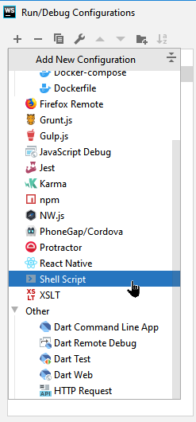
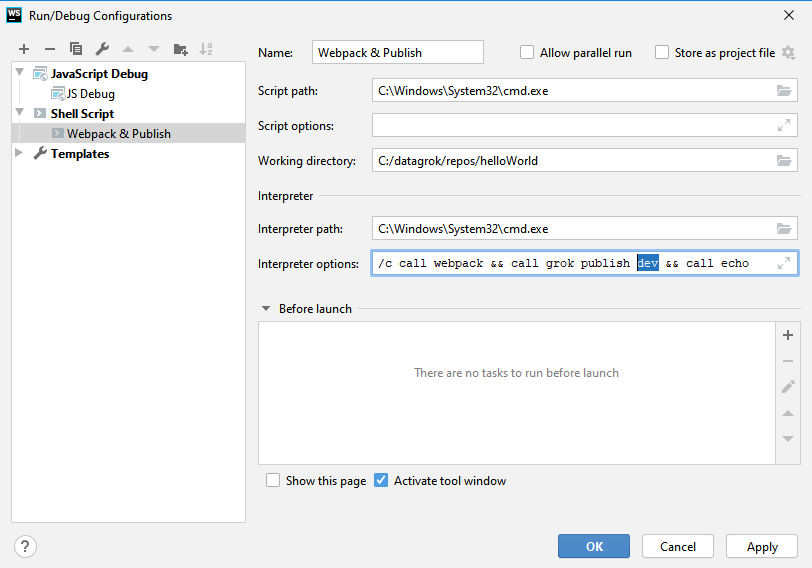
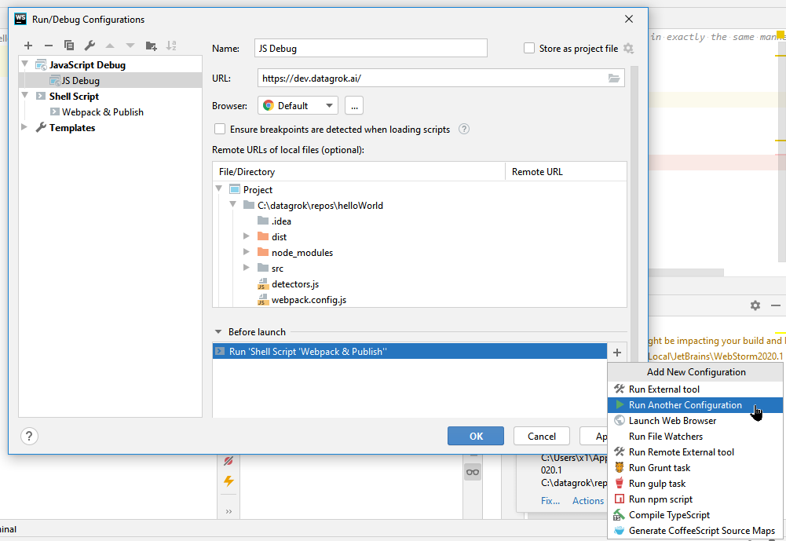

<!-- TITLE: Debugging -->
<!-- ORDER: 3 -->

# Debugging

This document discusses debugging of your packages for Datagrok in two popular IDEs &mdash; [Visual Studio Code] and
[JetBrains WebStorm].

## Debugging with visual studio code

To configure VS Code for Datagrok development when creating a package, run `grok create` with the `--ide=vscode` flag:

```shell
grok create MyDatagrokPackage --ide=vscode
```

> **IMPORTANT**: The `--ide` flag only works on Windows. `grok` doesn't create the VS Code configuration on Linux or
> macOS. If you're using Linux or macOS, create a [VS Code configuration manually].

The `grok` command creates a `.vscode/launch.json` and `.vscode/tasks.json` files with some useful configurations. To
later change `public` to `dev` or other Datagrok instance, simply identify `public` in these two files and replace them
to a desired instance alias, such as `dev`.

You can now run the Datagrok instance with your package in the debugging mode using `F5`. After you hit `F5`, Datagrok
CLI will build your package using `webpack`, deploy it to the [configured Datagrok instance], and then run the Chrome
browser in debug mode for VS Code. This special Chrome instance is _separate_ from the default Chrome in your OS.

The first time you run debugging, you need to enter your Datagrok credentials into Chrome. After you entered them, close
Chrome and restart debugging with `F5` again to actually hit breakpoints. As these credentials will be saved by this
debugging version of Chrome for every package separately, you need to re-enter them for each new package at its first
time of debugging.

**See more**: [Debugging with VS Code video]

## Debugging with JetBrains ides

### Debugging with a shell script

To configure debugging with a shell script on WebStorm:

1. Select **Run** > **Edit Configurations...**.


2. In the **Run/Debug Configurations** dialog, select `+`, and then select **Shell Script**.



3. Add a name for your configuration, and then add the `/c call webpack && grok publish dev && call echo` script.



This script publishes your package to the development server. To publish the package to the public server or run the
package locally in a Docker container, configure additional scripts.

### JavaScript debug configuration

To configure JS Debug on WebStorm:

1. Select **Run** > **Edit Configurations...**.


2. In the **Run/Debug Configurations** dialog, select `+`, and then select **JS Debug**.

3. Add a configuration name, and then add the previously created shell script in the **Before launch** section.



## Troubleshooting

Sometimes JavaScript debugging from the WebStorm IDE becomes impossible after it initially worked. This is
a [known issue in WebStorm]. To fix this issue, remove these two files and restart the IDE:

* `%USERPROFILE%\AppData\Roaming\JetBrains\WebStorm2020.1\options\web-browsers.xml`
* `%USERPROFILE%\AppData\Roaming\JetBrains\WebStorm2020.1\options\other.xml`

Additional information:

* Debugging JavaScript in WebStorm: [video 1], [video 2]
* [IntelliJ IDEA JavaScript debugging]

## Source-based packages

Deploying a source-based package locates it to the Datagrok host URI (such as `https://dev.datagrok.ai`) under
`api > packages/published/flies > <PACKAGE_NAME>/<VERSION>/_/<DIGIT>`, where you'd set breakpoints.

## Troubleshooting debugging

1. Make sure that the webpack configurations are set properly:

* `devtool`: `'inline-source-map'`
* `mode`: `development`

2. Make sure the required plugins and debuggers for Chrome are installed in your IDE.

## What's next?

* [Package function types](./_package-function-types.md)

[Visual Studio Code]: https://code.visualstudio.com

[JetBrains WebStorm]: https://www.jetbrains.com/webstorm/

[VS Code configuration manually]: https://code.visualstudio.com/docs/editor/debugging

[debugging with VS Code video]: https://youtu.be/zVVmlRorpjg?list=PLIRnAn2pMh3kvsE5apYXqX0I9bk257_eY&t=871

[known issue in WebStorm]: https://intellij-support.jetbrains.com/hc/en-us/community/posts/360009567459-Webstorm-2020-2-1-Remote-Debugging-do-not-work

[known issue]: https://youtrack.jetbrains.com/issue/IDEA-229467

[JetBrains IDE Support plugin is no longer required]: https://intellij-support.jetbrains.com/hc/en-us/community/posts/360010507240-where-is-JETBRAINS-IDE-SUPPORT-chrome-extension-it-cant-be-found-anywhere-now-on-the-internet

[video 1]: https://www.youtube.com/watch?v=Qcqnmle6Wu8

[video 2]: https://www.youtube.com/watch?v=YNNDMpoGV0w

[IntelliJ IDEA JavaScript debugging]: https://www.jetbrains.com/help/idea/debugging-javascript-in-chrome.html