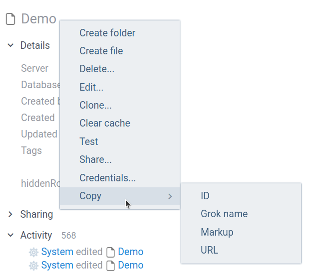

Datagrok REST API allows external integrations with the platform. It supports operations on files, tables and dashboards. These allow creation of powerful Datagrok dashboards right from code, that produces data.

There is also a [Python library](https://github.com/datagrok-ai/public/tree/master/python-api) that simplifies work with REST API.

## Configuration

To interact with Datagrok REST API, you need to include an API key in the request headers. The API key must be prefixed with "Bearer ". It results in the following header:

```
Authorization: Bearer YOUR_API_KEY
```

API key can be accessed from the user profile under **API Key** link. User profile is located under profile picture in left side panel.


For API Url use Datagrok's URL followed by `/api`: For example, for `public.datagrok.ai` the required Url will be `https://public.datagrok.ai/api`.


## Files
Datagrok files are stored under connectors. File is identified by it's path. Accessing connectors is described [here](#identifiers).

**Endpoints**
* `GET /public/v1/files/{connector}/{path}` – Download a file from a specified connector by its path.
* `POST /public/v1/files/{connector}/{path}` – Upload a file to a specified connector under a given path. If file already exists, replace it's content. 

## Tables
Datagrok Rest API supports managing tables, including downloading and uploading tables. Table identifiers are described [here](#identifiers).

**Endpoints**
* `GET /public/v1/tables/{table}` – Download a table from Datagrok in CSV format.
* `POST /public/v1/tables/{table}` – Upload a table to Datagrok. If table already exists, replace it's data. If table name specifies project, add uploaded table to a project.

## Dashboards
This section includes endpoints to manage [dashboards](../../datagrok/concepts/project/dashboard) in Datagrok, such as creating dashboards and sharing them with specific groups. To learn more about identifiers of dashboards and tables, refer to [this section](#identifiers).

**Endpoints**
* `POST /public/v1/dashboards/{name}/{table_ids}` – Create a new dashboard containing specified tables. Supports upload of [project layout](../how-to/layouts.md#project-layouts) in the request body.
* `GET /public/v1/dashboards/{id}/shares{?groups,access}` – Share access to a dashboard with specified groups or users by their names.

## Functions
Datagrok Rest API allows you to invoke function calls within Datagrok with specified parameters.

**Endpoints**

* `POST /public/v1/{name}/call` – Invoke a function with specified parameters, passed in a JSON body. 

## Identifiers

Datagrok's Rest API identifies [entities](../../datagrok/concepts/objects.md) either by their ID or by Grok name. Both of this parameters are accessible from right click menu.


:::warning

Grok name uses colons (:) as a separator character. Rest API uses periods (.). Before doing requests, verify that colons are replaced by periods. Python client does this automatically.

:::




## See also
* [Python client](https://github.com/datagrok-ai/public/tree/master/python-api)
* [OpenAPI specification](https://public.datagrok.ai/api/public/api.yaml)
* [View layout](../how-to/layouts.md)
* [Upload data](../how-to/upload-data.md)