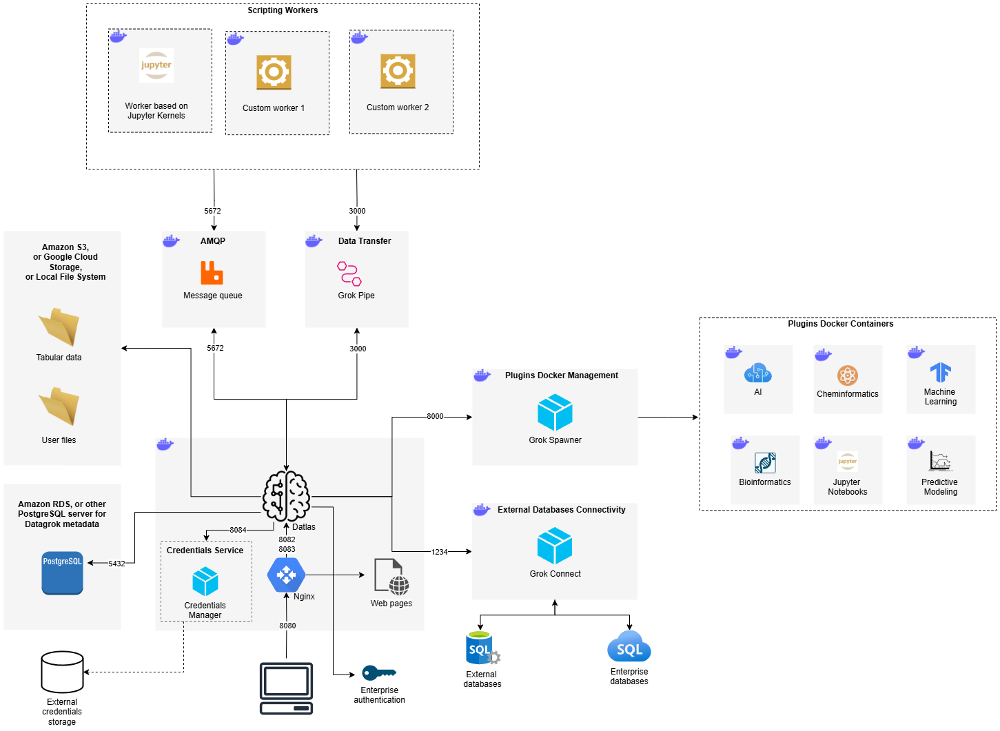

## Datagrok Platform Infrastructure Overview

The Datagrok platform consists of multiple interconnected services that support data analysis, scripting, plugin management, 
and external integrations. The infrastructure includes the following key components:

### 1. Core Components
- **Datlas (Main Web Server)**: The central brain of the Datagrok platform, responsible for managing user interactions, processing requests, and orchestrating services.
- [**Nginx (Reverse Proxy)**](https://www.nginx.com/): Routes incoming web traffic to the server, allowing multiple instances of Datlas to run.
- [**PostgreSQL**](https://www.postgresql.org/): Stores platform metadata, including user accounts, projects, and configurations.
- **[S3](https://docs.aws.amazon.com/AmazonS3/latest/userguide/Welcome.html)/[Google Cloud Storage](https://cloud.google.com/storage/docs)/Local Storage**: Stores user files and tabular data used for analysis.

---

### 2. Authentication & Credential Management
- **Credentials Service**: Manages secure storage and retrieval of user credentials or credentials to external data sources.
- **External Credentials Storage**: A separate service that securely stores enterprise authentication credentials.

---

### 3. External Database Connectivity
- [**Grok Connect**](../../access/access.md#data-connection): A dedicated in-house service for integrating with external databases (PostgreSQL, Oracle, MySQL, MSSQL, etc.).

---

### 4. Scripting and Computation
- **AMQP**: Handles the queuing of script execution requests. [RabbitMQ](https://www.rabbitmq.com/docs) is typically used, but can be replaced with any message queue that implements AMQP protocol.
- **Scripting Workers**: A set of workers that process user scripts:
  - [**Jupyter Kernel-Based Worker**](https://docs.jupyter.org/en/stable/projects/kernels.html): Executes Python, R, Julia, Octave, and Node.js scripts.
  - **Custom Workers**: Additional computation engines with specialized capabilities that can be created on client requests.
- **Grok Pipe (Data Transfer Service)**: In-house service that handles binary data exchange between Datlas and Jupyter workers.

---

### 5. Plugin & Docker Container Management
- **Grok Spawner**: Manages the deployment of Docker Containers that are delivered within [Datagrok Plugins](../packages/extensions).
- **Plugin Docker Containers**: There are various specialized containers for AI, Bioinformatics, Machine Learning, Cheminformatics and Jupyter Notebooks that are supplied within Datagrok Plugins.

---

## Resources

There are different requirements for every component. In general:

* Core Components require 2 vCPU and 4 GB RAM.
  * For the active usage of Datagrok we would recommend: 4 vCPU and 8 GB RAM
* Additional components require at least 4 vCPU and 8 GB RAM.
  * For the active usage of Datagrok we would recommend: 8 vCPU and 32 GB RAM

## Deployment

Datagrok is a web application, which means no deployment is required per user once the server is set up. 
All subsequent administration tasks can be performed via the web interface.

Enterprises typically prefer on-premise deployment for several reasons, including enhanced security, 
easier access to internal data, and integration with enterprise [authentication](../../govern/access-control/access-control.md#authentication) methods. Datagrok supports this approach with minimal effort. 
For more information, refer to the [Enterprise Evaluation FAQ](../../datagrok/solutions/enterprise/enterprise-evaluation-faq.md).

Datagrok runs as a set of [Docker containers](https://hub.docker.com/u/datagrok), which can be installed on any platform, including (but not limited to) a bare-metal machine,
an on-premise virtual machine, or a virtual machine in a cloud provider (e.g., [AWS EC2](https://aws.amazon.com/ec2/)). It can also be deployed on an on-premise Kubernetes 
cluster or a managed Kubernetes service such as [AWS EKS](https://aws.amazon.com/eks/), as well as on container services provided by cloud platforms, such as [AWS ECS](https://aws.amazon.com/ecs/).

Datagrok supports any PostgreSQL-compatible database out-of-the-box, including cloud-hosted PostgreSQL solutions like AWS RDS. 
We recommend using scalable and highly reliable database solutions and avoiding single-instance setups to prevent loss of internal Datagrok data, 
such as created users and connections. User data will not be affected in the event of a Datagrok database failure.

For persistent file storage, Datagrok supports local file systems, network shares, or cloud solutions such as [AWS S3](https://aws.amazon.com/s3/) or [Google Cloud Storage](https://cloud.google.com/storage). 
Again, we recommend using scalable and reliable storage solutions and avoiding local file system setups to prevent loss of internal Datagrok data, 
including projects and settings. User data will remain unaffected in the event of storage loss.

For deployment instructions, refer to the guide: [How to deploy Datagrok?](../../deploy/deploy.md)

## Scalability

All Docker containers are based on Ubuntu 20.04 and include the latest available software. Datagrok can be deployed in any cloud environment or on a physical or virtual machine. 
The platform is highly scalable using container orchestration tools like [Amazon ECS](https://aws.amazon.com/ecs/) or [Kubernetes](https://kubernetes.io/).
We provide full support to ensure the application runs reliably under concurrent user load.

## Useful links

* [Deployment](../../deploy/deploy.md)
* [Configuration](../../deploy/configuration.md)
* [Continuous integration](continuous-integration.png)
* [Versioning policy](../dev-process/versioning-policy.md)
* [Try Datagrok locally](../../deploy/docker-compose/docker-compose.md)
