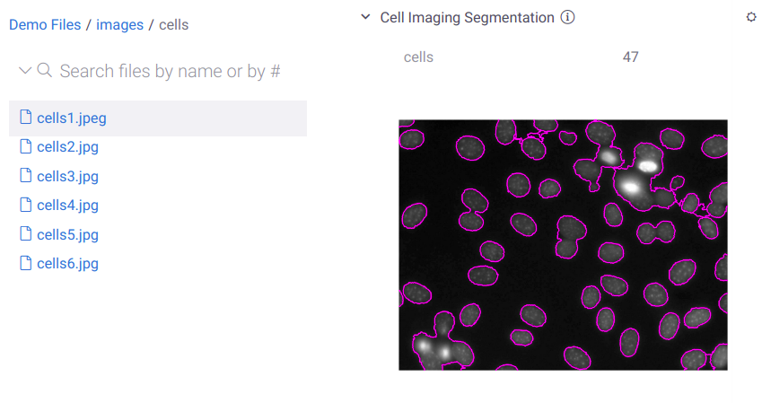

<!-- TITLE: Info panels -->
<!-- SUBTITLE: -->

# Info panels

Info panels provide additional information about the current context (which can be a table, a column, or pretty much any
other [object](../overview/objects.md)). Info panels are meant to be easily developed by the users of the platform, and
shared with other users. You can use all features of the Datagrok platform, such as scripting, data querying and
transformation pipeline, user-defined functions, markup, viewers, predictive models.

Info panels could be developed in any language supported by the platform.


*Cell Imaging Segmentation Info Panel*

## What gets shown and when?

There are thousands (OK slight exaggeration :) of info panels currently available in the Datagrok platform, and
certainly we do not want to overwhelm users by showing all of them to everyone. To solve this issue, we designed a
powerful, easy-to-use mechanism that allows us to show panels exactly to the people that need it, when they need it. In
order for the panel to be shown, the following conditions have to be satisfied:

* user condition
* dataset condition
* context condition
* user preferences

Whenever the current object changes, conditions of all registered info panels are evaluated against the current user,
dataset, context, and user preferences. Condition is a GrokScript, and therefore any functions and operators can be used
there.

### User condition

It is possible to restrict access to the particular class of info panels based on the [user](../govern/user.md)
attributes, including user's roles, groups he belongs to, or other attributes. This condition can be either specified
right in the script, or set externally in the [global permissions](../govern/global-permissions.md)

To specify the condition in the script, use the 'user' variable in the following way:

```
# condition: user.name == "john doe" || user.name == "jack smith"
# condition: user.hasrole("chemist")
# condition: user.inteam("high-throuput screening")
```

### Dataset condition

Certain info panels only make sense when applied to data that was retrieved from a particular data source.

To specify the condition in the script, use the 'table' variable in the following way:

```
# condition: table.gettag("database") == "northwind"
```

### Context condition

Info panels always accept strictly one parameter. It can be a column, a table, a table cell, or any
other [object](../overview/objects.md). A condition might perform checks against that object by using the parameter
name ("x" in the example below):

```
#input: column x
#condition: x.isnumerical && x.name == "f3" && x.stats.missingvaluecount > 0
```

### User preferences

Finally, a user has the ability to turn a particular panel off and not show it anymore. To do that, click on the '
settings' icon on the panel header, and select "Do not show anymore". To manage suppressed panels, open Tools | Settings
| Info Panels.

## Examples

### Retrieving more details

A common concept in applications is master-detail view - i.e., when current record changes, additional details are
dynamically retrieved and visualized in a different pane. Perhaps the most famous example is your favorite email client,
where you would click on a subject in order for the content to appear in another pane. Typically, implementing such a
feature would require coding - but this can be done in a minute using the Datagrok platform.

### Using predefined visualizations

Oftentimes, it is beneficial to show users an interactive plot, pre-customized based on the structure of the table that
is currently open.

See the following info panel (viewer-scatter.grok) in action by opening (project:demog). It creates
a [Scatter Plot](../visualize/viewers/scatter-plot.md), sets the axes to the predefined columns, and adds a regression
line.

```
#name: Scatter plot
#description: Panel that contains an interactive Scatter plot
#language: grok
#tags: panel
#input: dataframe table
#condition: table.name == "demog" && table.columns.containsAll(["height", "weight", "age", "sex"])
#output: viewer plot

plot = table.ScatterPlot("height", "weight", "age", "sex")
plot.showRegressionLine = true
```

### Digital signal processing

Depending on the nature of the data, our platform makes assumptions regarding the ways users would want to analyze it.
For instance, whenever a scientist working in the digital signal processing domain opens a dataset that contains digital
signals, it is likely that they would want to easily see certain features from the frequency domain
(common actions would be analyzing results of the Fourier transform, doing an auto-correlation, or checking out
spectrogram or scalogram). Typically, when such a need arises, the scientist would fire up Matlab, load that dataset,
then either write a script or use Matlab's DSP toolbox (along the way, they would need to enter metadata that is often
not included in the dataset, such as sampling rate).

Within the Datagrok platform, a simple info panel can be developed that would understand when the data is a digital
signal, perform all of the above-mentioned operations in the background (utilizing the metadata stored within the
dataset), and push the results to the user. The result of the script below is a "Spectrogram" panel that would get shown
in the property panel on the right when user clicks on a column with the digital signal.

See the following info panel (spectrogram-panel.grok) in action by opening (project:eeg)

```
#name: Spectrogram info panel
#description: Panel that contains graphics produced by the R script
#language: grok
#tags: panel,dsp
#input: column signal {type:numerical}
#output: graphics pic
#condition: "F3" == signal.name

pic = Spectrogram("eeg", signal, 256.0, 1024, 0.1, true)
```

### Actions

In addition to providing additional information (such as data, graphics, interactive viewers, etc), it is also possible
to add commands that would do something with the current context. For instance, you might want to send an email to a
user, or update a record in the database.

```
#name: Transaction review panel
#description: Actions available for the credit card transaction
#language: grok
#tags: panel
#input: row activity
#output: string actions {action: markup}
#condition: activity.table.name = "credit card transactions"

actions = "#{button("Flag as suspicious", "http.Post(myserver, row.transactionId)")}"
```

### Predicting molecule solubility

The following panel calculates different molecular properties of a given chemical structure. It appears whenever user
clicks on a structure.

`#{x.ChemScripts:SolubilityPrediction}`

```
#name: Solubility prediction
#description: Predicts solubility by molecule descriptors ("Ipc", "MolWt", "NumValenceElectrons", "MolLogP", "LabuteASA", "TPSA", "HeavyAtomCount", "NumhAcceptors", "NumHDonors", "NumRotatableBonds", "RingCount")
#language: grok
#tags: panel, prediction, chem
#condition: smiles.semtype == "Molecule"
#input: dataframe table
#input: column smiles {semtype: Molecule} [Column with molecules, in smiles format]
#output: dataframe predictions {action: join(table)}
featureNames = ["TPSA", "Ipc", "NumHAcceptors", "NumHDonors", "LabuteASA", "RingCount", "MolWt", "NumValenceElectrons", "HeavyAtomCount", "MolLogP", "NumRotatableBonds"]
ChemDescriptors(table, smiles, featureNames)
MissingValuesImputation(table, featureNames, featureNames, 5)
ApplyModel(Demo:PredictSolubility, table, showProgress=false)
predictions = ExtractColumns(table, ["outcome"])
```

### Example: predicting yearly sales of a franchise store

Info panel scripts can use all features of the Datagrok platform, including predictive modeling capabilities. The
following script would do the following behind the scenes when user clicks on a row that contains store address:

* convert address to to demographic statistics (~50 features such as median income, age, etc)
* using extracted statistics, predict yearly sales of a franchise store if it opens at that address

```
#name: Predicted sales
#description: Predicting yearly sales of the franchise store by using previously trained predictive model
#language: grok
#tags: panel
#sample: stores.csv
#input: cell address
#output: double predictedsales
#condition: cell.table.name == "stores" && cell.column.name == "address"

//todo Vasiliy: implement
statistics = AddressToStatistics()
predictedSales = PredictSalesByStatistics(statistics)
```

See also:

* [Data augmentation](data-augmentation.md)
* [Scripting](../compute/scripting.md)
* [Semantic types](semantic-types.md)
* [Cheminformatics: info panels](../domains/chem/cheminformatics.md#info-panels)
