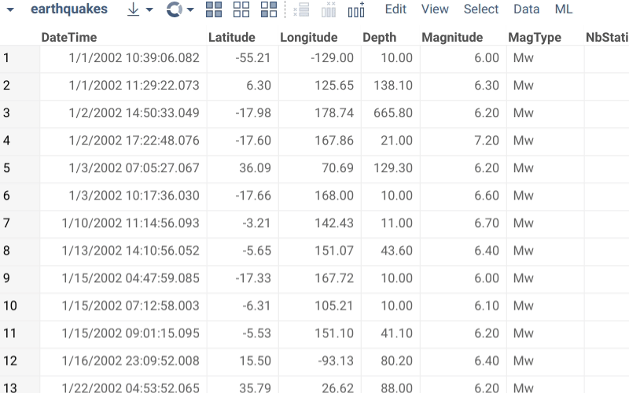

<!-- TITLE: Semantic types -->

# Data types vs semantic types

Unlike Excel, table columns in Datagrok are strongly-typed, meaning all cells are of one of the predefined data
types (`string`, `int`, `bigint`, `qnum`, `double`, `datetime`, `bool`). In addition to that, a column might also have
semantic type associated with it. Semantic type identifies the meaning of the data. For instance, a column could be of
the data type "string", but the semantic type would be "country".

Semantic types are used in several ways:

* **Rendering.** It is possible to define a custom renderer defined for the semantic type. For instance, in
  the `#{x.Demo:Smiles}` project strings with the semantic type "molecule" get rendered as chemical structures.
* **Viewers.** Some viewers, such as Map, use semantic type to determine whether a viewer can be visualized against
  specific datasets, as well as for the initial choice of columns to visualize.
* **Functions.** Function parameters could be annotated with the semantic type. This is used for automatic suggestions
  of applicable functions.
* **Predictive models.** Just like functions, semantic type annotations are used to determine whether or not a model is
  applicable to the dataset.

A column can have only one semantic type. It is stored in the [column tags](tags.md#quality) and can be either detected
automatically by semantic type detectors or set manually.

## Manually setting semantic types

Open column properties (click on a column and press F2, or right-click and select Properties), see '
Semantics' field.

## Automatic semantic type detection

Out of the box, the following semantic types are automatically detected based on the content:

* Molecule
* IP Address
* Area Code
* Zip Code
* Phone Number
* Email
* Latitude
* Longitude
* Country name (notations: common, cca2, cca3, cioc)
* US State (notations: common, abbreviated)
* US County
* US City
* Stock ticker

## Custom semantic types

Datagrok has been designed to be as extensible as possible, so naturally it is possible to define your own custom
semantic types, along with the type auto-detection functions, renderers, comparers, and so on. To do that, check
out [this article](../develop/how-to/define-semantic-type-detectors.md)
.

See also:

* [Metadata](metadata.md)
* [JavaScript development](../develop/develop.md)
* [How to define semantic type detectors](../develop/how-to/define-semantic-type-detectors.md)
