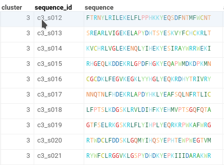
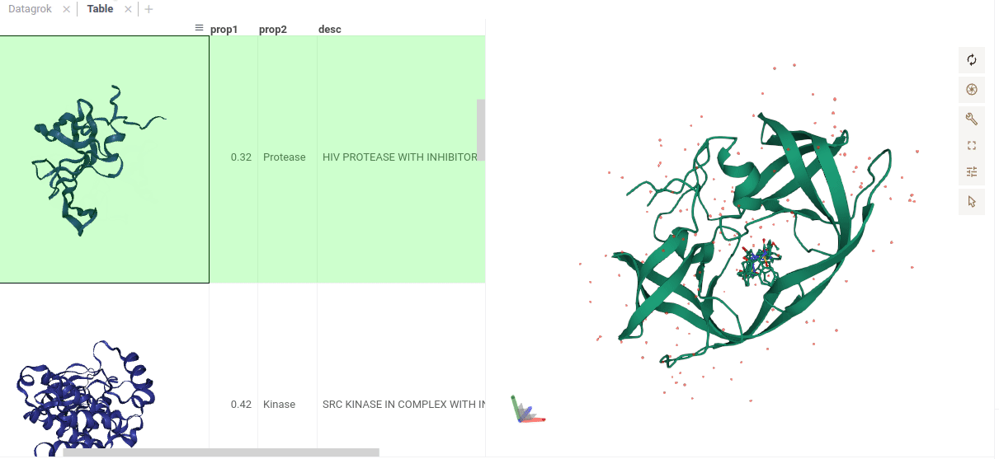
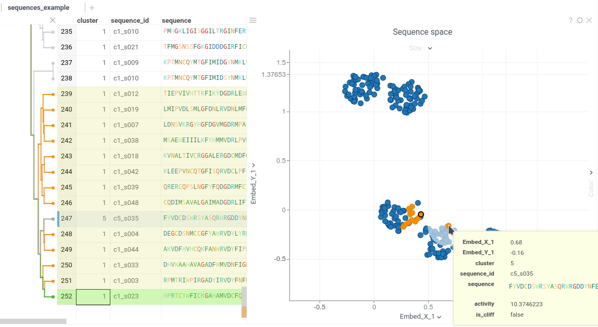

Bioinformatics (see also the [Wikipedia](https://en.wikipedia.org/wiki/Bioinformatics) article)
is the application of computer and information science methods to understand biological data,
especially when the data sets are large and complex.

Here are some areas where bioinformatics plays a vital role:

* New generation clinical diagnostics
* Personalized predictive medicine
* Analysis of cancer mutations and repurposing of existing anti-cancer drugs
* Assessment of the biological activity of natural biomolecules, particularly antimicrobial and anti-cancer compounds
* Designing new biomolecules with specific target activities
* High-throughput analysis of biological images
* Extracting insights and data mining from scientific publications

These are just a few examples, and there are many more applications of bioinformatics.

## Datagrok, the Swiss Army knife for data, has blades for bioinformatics

Datagrok provides a full-scale bioinformatics data interpretation in a wide range of applications,
particularly in analyzing the relationship
between macromolecules sequence and activity (**SAR analysis**).

With Datagrok for Bioinformatics,
we are also expanding our capabilities to **polymer design**.
Our molecular toolkit used across our applications
allows to work efficiently with macromolecules
both on the macro (sequence) level
and atomic level that could fit cheminformatics purposes.

## Macromolecules data format support

Datagrok can ingest data in multiple file formats (such as fasta or csv)
and multiple notations for natural and modified macromolecules,
aligned and non-aligned forms, nucleotide and amino acid sequences.
We support all widely used notation systems for molecular representations,
and process them in a unified way.

Datagrok has a convenient feature that automatically detects the data format
and offers custom loaders for various biological data formats:

* FASTA (DNA/RNA/protein)
* Delimiter-separated FASTA
* [HELM](https://en.wikipedia.org/wiki/Hierarchical_editing_language_for_macromolecules)
  (universal macromolecule sequence notation)
* [PDB](https://en.wikipedia.org/wiki/Protein_Data_Bank_(file_format)) (3D conformations)

This functionality is not limited to specific file types.
Datagrok identifies columns that contain sequence data within any dataframe,
while preserving their initial notation.

Datagrok allows you to convert sequences between different
notations as well.

## Custom data rendering

Datagrok provides custom rendering directly in the dataframe for each supported sequence notation.

### Natural biopolymers in FASTA-like notation

Peptide sequences are displayed with color highlighting based on amino acid properties.
DNA sequences are colored to represent different nucleotides.

### Natural and non-natural polymers in HELM notation

HELM structures are displayed with colors corresponding to each monomer.
If you have loaded a monomer library for HELM structures
(you can do this by opening the column properties,
accessed by left-clicking on the column header, and selecting "Manage libraries"),
you gain access to previewing macromolecules
with full support of circular and branching structures.

### 3D structures

For PDB structures, Datagrok generates graphical previews directly within the dataframe cells.
You can click on a cell to open a separate 3D viewer,
which allows you to rotate, zoom, and change the color scheme.

Also you can open individual PDB files together with small molecules
(for example to explore docking results) using
[standalone NGL viewer](../../visualize/viewers/ngl.md).

### Trees

[Newick trees](https://en.wikipedia.org/wiki/Newick_format) are parsed
and represented as a dataframe containing nodes and distances.

<!--- TODO:
This part of functionality was describes a while ago and haven't been tested by me, 
so for now it's hidden

### Sequence alignments
When a file containing aligned sequences is imported, 
Datagrok splits the aligned data into an alignment table by MSA
positions (see the illustration below) 
and performs composition analysis in a barchart on the top of this table. 
It visualizes multiple sequence alignments with long monomer identifiers.

The composition barchart is interactive, 
the corresponding rows could be selected by clicking on the segment. 
The rows are also highlighted in other open visualizations (such as scatter plots) 
when you hover over the bar. 
This enables interactive data exploration, 
including on-the-fly statistical analysis of differences in measured values (activity)
associated with sequences.

For identifiers that do not fit in a cell, an ellipsis is shown.

Sequence alignment visualization allows for manually modifying the alignment in the case when automatic alignment result
is not satisfactory. The composition analysis plot changes interactively, providing a quick indication of how good the
alignment is.

-->

## Data editing

Datagrok offers custom data editing capabilities directly within the dataframe for certain data types:

* For DNA, RNA, and protein sequences in FASTA-like format, you can edit the sequences.
* For HELM notation if you have loaded the HELM monomer library,
  you can add or remove monomers and modifying connections.
  The editor supports circular and branching structures.

## Data filtering

When working with a sequence column, you can specify a subsequence
and filter the dataframe to display only sequences that contain this specified subsequence.

The filtering is performed based on a 100% exact match of the subsequence.
Datagrok does not currently support subsequence filtering with mismatches.

## Macromolecule-specific viewers and actions

Specially for analyzing macromolecules,
Datagrok provides a range of specialized viewers and analysis tools,
as well as  number of tools and applications specifically for polymer modalities.
You can find most of them in the **Bio** section of the main menu.

In addition, out of the box Datagrok provides a comprehensive
[machine learning toolkit](../../learn/data-science.md) for
clustering, dimensionality reduction techniques, imputation, PCA/PLS, etc.
Some of these tools could be directly applied
to the polymer modalities (for instance, by mapping monomers to features)
and used for analyzing structure-property,
structure-activity, and sequence-activity relationships.

### Multiple Sequence Alignment (MSA)

The [Multiple Sequence Alignment](https://en.wikipedia.org/wiki/Multiple_sequence_alignment)
(MSA) feature allows you to create alignments of biological sequences.
This action generates a new column containing the aligned sequences.
MSA works for macromolecules in both FASTA and HELM formats.

If your data has already been clustered, Datagrok provides an option to specify a "cluster" column
to align sequences only within the same cluster.

For DNA, RNA, and natural peptides, Datagrok utilizes
[KAlign](https://github.com/TimoLassmann/kalign) to perform the alignment.
It is an open-source tool under GNU GPL, so it can be modified
to work with custom substitution matrices for
sequences.

For non-natural sequences Datagrok uses
[PepSeA](https://github.com/Merck/PepSeA) for alignment purposes.
It allows for alignment of multiple linear peptide sequences in HELM notation, with lengths up
to 256 non-natural amino acids. _PepSeA_ uses a substitution matrix calculated with Rapid Overlay of Chemical Structures
Similarities Across ChEMBL 28 HELM Monomers.

### Compositional analysis

Allows you to generate a "weblogo" representation, also known as a
[sequence logo](https://en.wikipedia.org/wiki/Sequence_logo).
This visual representation illustrates the letter composition for each position in a sequence.

Typically, a sequence logo is created from a set of aligned sequences
and helps to identify patterns and variations within the sequences.
For example, it is commonly used to visualize protein-binding sites in DNA or functional motives in proteins.

WebLogo dynamically reflects the sequence sets filtering and allows the
user to select a subsequence by choosing the residue at a specified position. The tooltip displays the number of
sequences with a specific monomer at a particular position

<!---

Have not been tested by me

Another way to perform the composition analysis for MSA data is to use composition Bar charts as any plot in the
Datagrok reflects all user actions as filtering and selection.

-->

### Similarity and diversity search

**Similarity search** creates
a linked dataframe displaying the most similar sequences to a selected sequence from the initial table.
You have the flexibility to adjust the number of sequences displayed and set a similarity cutoff
in the dataframe properties.

**Diversity search** creates a new dataframe containing the most diverse sequences within a given dataframe.

### Sequence space

The **Sequence Space** feature in Datagrok is a powerful tool for investigating
sequence similarity and diversity.
This is a complex analysis including several steps:

* Calculating sequence similarity
* Performing [dimensionality reduction](https://en.wikipedia.org/wiki/Dimensionality_reduction)
to transformation sequence similarity into 2D space,
* Visualizing the results on a scatter plot

As a result, the sequences are projected to
2D space closer if they correspond to similar structures, and farther otherwise.

To launch the analysis from the top menu, select _Bio | Sequence space_
and specify the column that contains the sequences of interest.

Sequence Space supports various metrics for measuring sequence similarity,
such as Tanimoto and Sokal, and offers two methods of dimensionality reduction: UMAP and t-SNE.

By using Sequence Space, you can uncover clusters of similar sequences,
facilitating the identification of groups with shared characteristics.

It is mostly used to separate the groups of sequences with common motifs
like different variants of complementarity-determining regions (CDRs) for antibodies

### Hierarchical clustering

Hierarchical clustering provides you another way
to explore the sequence similarity in a dataset.
To run it, choose the _ML -> Hierarchical clustering_ from the main menu,
and select sequence column as a feature. The Datagrok calculates the hierarchy of sequences and displays it
together with the dataframe.

To display sequence trees,
DataGrok has its own viewer “Dendrogram”, specially designed for fast tree rendering.
It is fully integrated with other Datagrok viewers
and dynamically reflects the sequence selection or filtering.

### Activity Cliffs

The Activity Cliffs tool is an enhanced version of Sequence Space,
specifically designed for Sequence-Activity Relationship (SAR) analysis.
It finds pairs of sequences where small changes in the sequence yield significant changes in activity
or any other numerical property.
By leveraging the Activity Cliffs tool,
you can gain insights into the relationship
between sequence variations and their impact on activity,
aiding in the achieving desired biological activities.

To run Activity Cliffs,
select _Main Menu -> Bio -> SAR -> Activity Cliffs..._. You need a dataframe that contains peptide/DNA sequences
along with numerical data representing the associated activity.
For example, you can use sequences of short peptides with measured antimicrobial effects
or DNA sequences with measured affinity to a specific protein.

Similarity cutoff and similarity metric
are configurable. As in _Sequence space_, you can select from different dimensionality reduction algorithms.

When you run Activity Cliffs,
it initially performs the same clustering and visualization as Sequence Space.
Next, it analyzes the activities and identifies "cliffs":
sequence pairs where a small change in the sequence leads to a significant change in activity.

After scatter plot is generated,
a link with the number of the identified activity cliffs appears in the top right
corner.

Click on this link to open a dialog with the list of cliffs.
Then, click on a particular pair to zoom in to it
on a scatter plot. Hover a line to see the details on the corresponding sequences and activities.

Marker color corresponds to activity, marker size and line opacity correspond to the SALI parameter (similarity/activity
difference relation).

### Peptides SAR

The ["Peptides"](https://www.youtube.com/watch?v=HNSMSf2ZYsI&ab_channel=Datagrok) plugin
is a variant of macromolecule SAR analysis. Upon launching, the UI switches to a
fit-for purpose peptide analysis mode for efficient exploration of the peptide space,
allowing the following:

* Interactively filter the dataset based on the monomer, position, or any other attribute
* Analyze differences in activity distribution for groups of peptides
* On-the-fly calculation of statistical significance of differences of
* value distributions between groups
* Analyze the peptide space (UMAP based on distance, color-coded by activity)
* Automatically identify most potent monomer/positions

We are developing tools that account for the steric and surface features of macromolecules,
calculations to support the
knowledge on their properties, homology, toxicity.

See [Peptides plugin](https://public.datagrok.ai/apps/Peptides) in action.

### Atomic-Level structures from sequences

Since atomic-level structure is available for each monomer and macromolecule, all the cheminformatics features of
Datagrok can be used. Namely: similarity search for chemical structures,
chemical substructure filtering, structure curation.
For details, see the [Cheminformatics](../chem/cheminformatics.md)
section of Datagrok documentation.

We have developed an algorithm to generate the atomic structure of the sequences
based on a specific monomer library or from natural monomers.
You can easily run this feature for any sequence data using the Bio package and accessing it from the top menu.

Datagrok has two options of reproducing the structure:

1. Direct generation from HELM using HelmWebEditor, resulting in the unordered molecule graph.
2. For linear sequences, the linear form (see the illustration below)
   of molecules is reproduced. This is useful for
   better visual inspection of sequence and duplex comparison.

This approach could be used for any given case of HELM notation
in order to get a visually appropriate form of monomers
in cycles etc. Structure at atomic level could be saved in available notations.

## Scripting and bioinformatics libraries integration

Datagrok offers you unlimited capabilities for extending its functionality
through custom scripts, plugins, and packages,

You can effortlessly develop Python or R script
that leverages the data and parameters from Datagrok, and
performs advanced calculations and analyses using powerful bioinformatics libraries
like [Biopython](https://biopython.org/) or
[ScanPy](https://scanpy.readthedocs.io/en/stable/).
The script can then return the results back to Datagrok
for further exploration and visualization.

Datagrok ensures seamless data transfer between your scripts and internal data structures.
It provides automatic creation of a user interface (UX) for input data,
allowing you to conveniently interact with your scripts and adjust parameters as needed.
Datagrok facilitates exporting data in specific
views and offers various other features to enhance your scripting experience.

For detailed information on how to leverage scripting in Datagrok,
please refer to the
[Datagrok scripting](../../compute/scripting-for-non-developers.mdx) section.
It provides comprehensive insights into utilizing scripting capabilities
even for non-developers, empowering you to extend and customize Datagrok
according to your specific needs.

<!---
### Predictive models

In addition to the [built-in predictive modeling capabilities](../../learn/predictive-modeling.md) (including
cheminformatics-specific ones, such as chemprop), it is easy to connect to external predictive models that are deployed
as web services. Two big pharmaceutical companies have already done that.

The integration could be done in a several ways:

* Automatic ingestion of the [OpenAPI/Swagger](../../access/open-api.md) service definition
* Developing a wrapper [function](../../compute/compute.md) in JavaScript, Python, R, or Matlab

Once a model is converted to a Datagrok function, there are multiple ways to expose it to users:

* Develop a Datagrok application that would orchestrate everything (such as the “sketch-to-predict” interactive app)
* Leverage Datagrok’s [data augmentation](../../discover/data-augmentation.md). For instance, in this case, a user will
  see the predictions when he clicks on a cell containing the macromolecule (similarly to
  how [predictions and information panels for small molecules](../../discover/data-augmentation.md#info-panels)

See also: [Scientific computing in Datagrok](https://github.com/datagrok-ai/public/blob/master/help/compute/compute.md)

-->