<!-- TITLE: Macromolecules -->

# Datagrok for Macromolecules

## Datagrok, the Swiss Army knife for data gets a new blade for macromolecules

Datagrok is a platform of choice for analyzing assay data in a few big pharma companies and in several smaller biotech
companies. Datagrok natively supports cheminformatics and bioinformatics, with an extensive toolset supporting SAR
analisys for small molecules and antibodies.

With Datagrok for Macromolecules, we are expanding our capabilities to **polymer design** and **sequence-activity
relationship** analysis. Our molecular toolkit used across our applications allows to work efficiently with
macromolecules both on the macro (sequence) level and going all the way down to atoms if necessary.

### Aligning peptide and nucleotide sequences containing non-natural amino acids or modified nucleotides

Datagrok provides well-known algorithms for pairwise alignment as part of the Bio package: Smith-Waterman and
Needleman-Wunsch. For multiple-sequence alignment, Datagrok uses the “kalign” that relies on Wu-Manber string-matching
algorithm. It is an open-source tool under GNU GPL, so it can be modified to work with custom substitution matrices for
sequences of the custom alphabet. For maximum performance and scalability, these algorithms can run either in user’s
browser, or server-side.

#### Multiple Sequence Alignment

We are planning to utilize "PepSea" tool for analyzing peptide and nucleotide sequences containing non-natural amino
acids or modified nucleotides. It allows for alignment of multiple peptide sequences in HELM notation, with lengths up
to 256 non-natural amino acids. "PepSea" uses a substitution matrix calculated with Rapid Overlay of Chemical Structures
Similarities Across ChEMBL 28 HELM Monomers (779). PepSea can be used as an in-house web service.

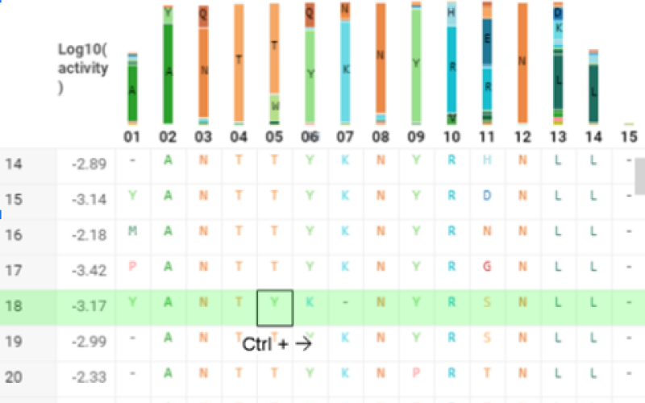

Now MSA analysis is implemented using the `kalign` tool, which is ideally suited for sequences containing only natural
monomers. Sequences of a particular column can be analyzed using MSA algorithm available at the top menu. Aligned
sequences can be inspected for base composition at the position of MSA result.

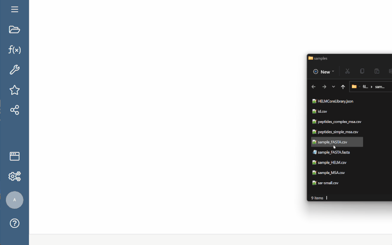

#### Splitting to monomers

Splitting to monomers allows splitting aligned sequences in separate monomers.

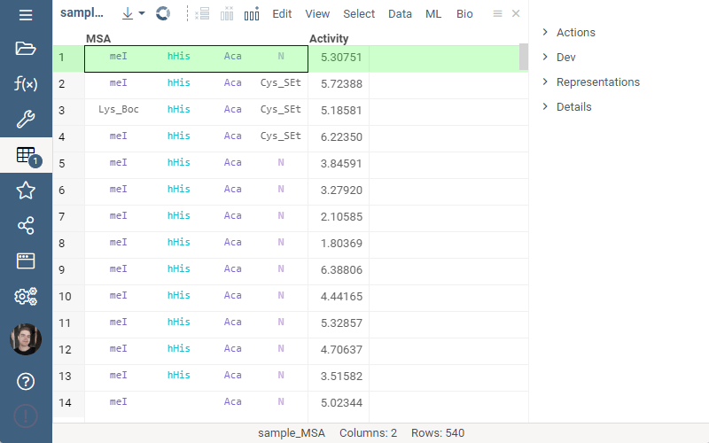

#### Visualizing sequence alignments

When a file containing sequences is imported, Datagrok splits the aligned data into an alignment table by MSA
positions (see the illustration below) and performs composition analysis in a barchart on the top of this table. It
visualizes multiple sequence alignments with long monomer identifiers.

The composition barchart is interactive, the corresponding rows could be selected by clicking on the segment. The rows
are also highlighted in other open visualizations (such as scatter plots) when you hover over the bar. This enables
interactive data exploration, including on-the-fly statistical analysis of differences in measured values (activity)
associated with sequences.

For identifiers that do not fit in a cell, an ellipsis is shown.

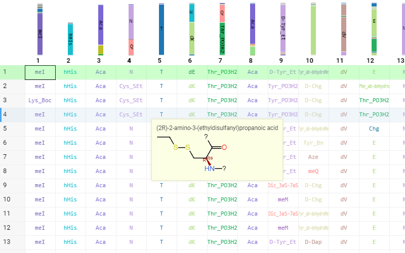

Sequence alignment visualization allows for manually modifying the alignment in the case when automatic alignment result
is not satisfactory. The composition analysis plot changes interactively, providing a quick indication of how good the
alignment is.

### Utilizing HELM for description, management and visualization of biopolymers, including those with non-natural amino acids or modified nucleotides

Datagrok can ingest data in multiple file formats (such as fasta or csv) and multiple notations for natural and modified
molecules, aligned and non-aligned forms, nucleotide and amino acid sequences. We support all widely used notation
systems for molecular representations, and process them in a unified way. The sequences are automatically detected and
classified, while preserving their initial notation. There are many notations used to store biological sequences, such
as traditional FASTA (one symbol per monomer), as well as more complex notations with separators. Another approach is
to write long monomer name to FASTA with square brackets. Datagrok allows you to convert sequences between different
notations as well.

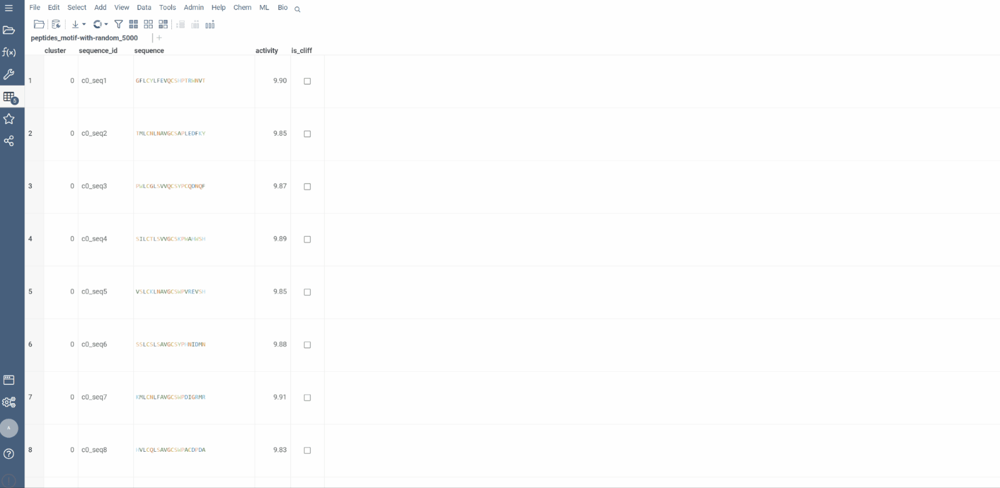

HELM perfectly fits the requirements for this kind of unification. If a dataframe contains any sequence data, it will be
recognized and annotated appropriately.

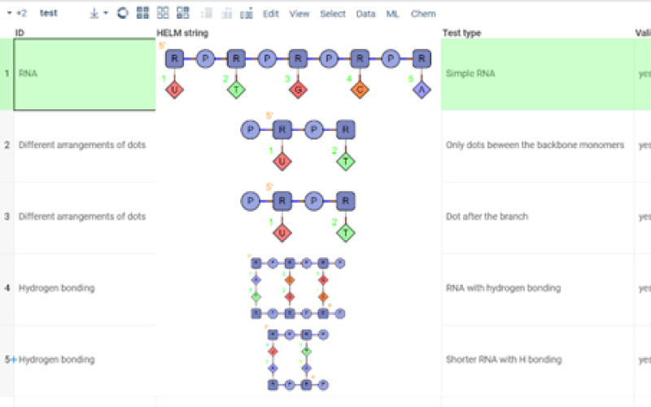

Automatic conversion to HELM from other notations occurs when needed. You can get a HELM plot for each sequence, with
all the monomers included in a graph, even if the original notation was not HELM. Datagrok HELM package lets you ingest,
auto-detect, visualize, and edit HELM.

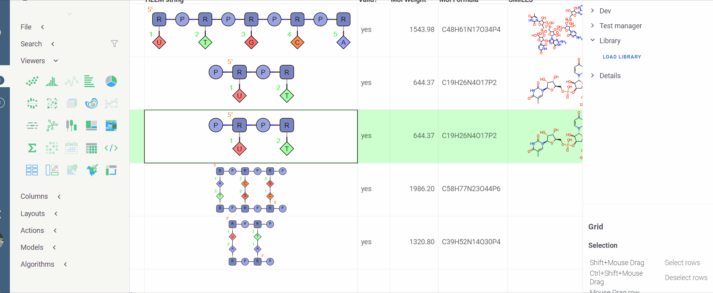

In addition to the HELM core monomer library included with the package, Datagrok supports custom monomer libraries. If
necessary, it could be combined with privileges (might be important in the enterprise context), letting you specify
which groups of people have access to which libraries.

The system could be integrated with a custom monomer library service if needed.

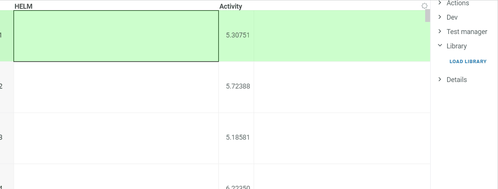

### Atomic-Level structures from sequences

We have developed an algorithm to generate the atomic structure of the sequences based on a specific monomer library or
from natural monomers. Datagrok has two options of reproducing the structure:

1. Direct generation from HELM using HelmWebEditor, resulting in the unordered molecule graph.
2. For linear sequences, the linear form (see the illustration below) of molecules is reproduced. This is useful for
   better visual inspection of sequence and duplex comparison.

This approach could be used for any given case of HELM notation in order to get a visually appropriate form of monomers
in cycles etc. Structure at atomic level could be saved in available notations.

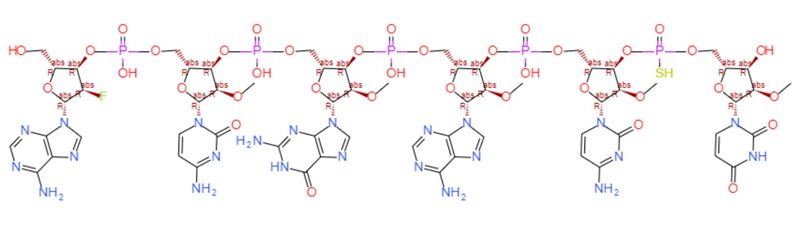

You can easily run this feature for any sequence data using the Bio package and accessing it from the top menu.

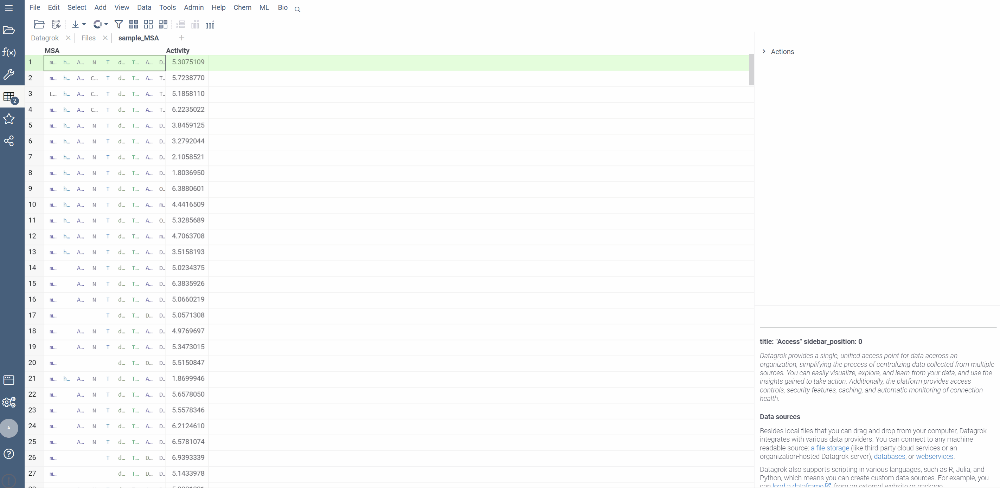

### Displaying and analyzing polymer structures and SAR data at the monomer and atomic level

Since atomic-level structure is available for each monomer and macromolecule, all the cheminformatics features of
Datagrok can be used. Namely: similarity search, substructure filtering, structure curation for structural data,
activity cliffs analysis for pairs of structures and SAR data.

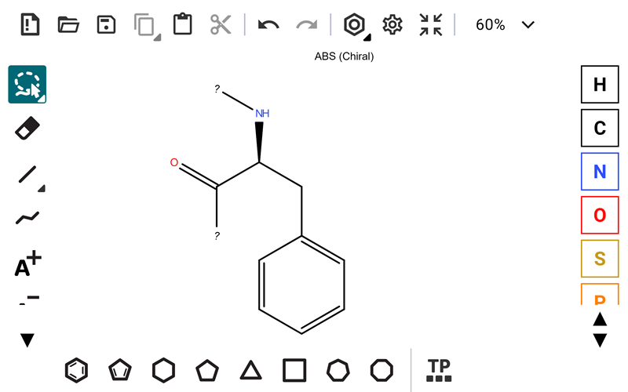

For analyzing polymer structures at the monomer level, Datagrok provides a set of tools and approaches (such as WebLogo
plots, interactive sequence-aware spreadsheet, etc), as well as applications that are built for specific modality, such
as [Peptides](peptides.md).

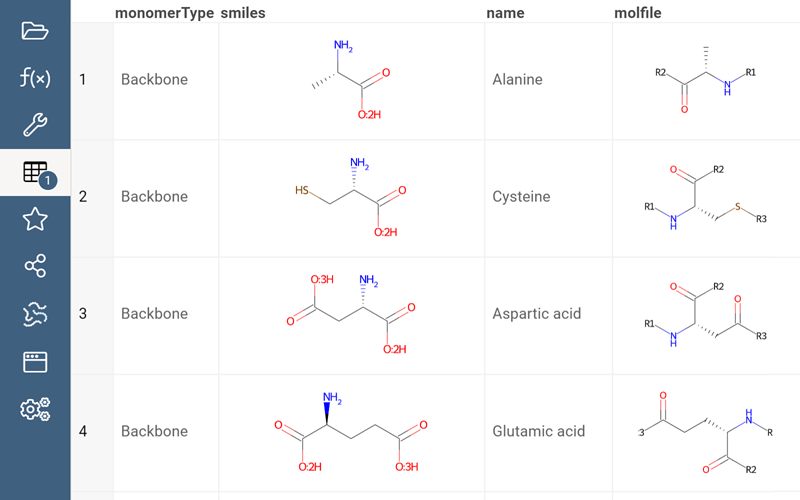

### Sequence Analysis and Analytics

#### Composition analysis

MSA results can be visualized with the Logo Plot. It dynamically reflects the sequence sets filtering and allows the
user to select a subsequence by choosing the residue at a specified position. The tooltip displays the number of
sequences with a specific monomer at a particular position

Another way to perform the composition analysis for MSA data is to use composition Bar charts as any plot in the
Datagrok reflects all user actions as filtering and selection.

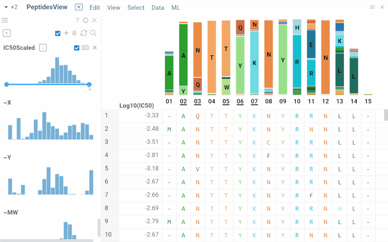

#### Sequence space

Datagrok allows visualizing multidimensional sequence space using a dimensionality reduction approach. Several
distance-based dimensionality reduction algorithms are available, such as UMAP or t-SNE. The sequences are projected to
2D space closer if they correspond to similar structures, and farther otherwise. The tool for analyzing molecule
collections is called 'Sequence space' and exists in the Bio package.

To launch the analysis from the top menu, select *Bio | Sequence space*.

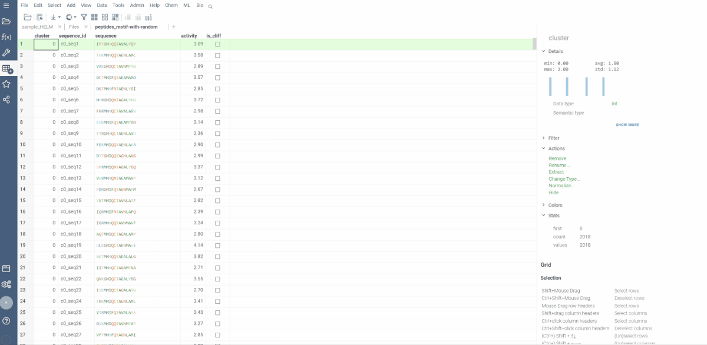

#### Sequence activity cliffs

Activity cliffs tool finds pairs of sequences where small changes in the sequence yield significant changes in activity
or any other numerical property. open the tool from a top menu by selecting . Similarity cutoff and similarity metric
are configurable. As in *Sequence space*, you can select from different dimensionality reduction algorithms.

To launch the analysis from the top menu, select *Bio | Sequence Activity Cliffs*.

After scatter plot is generated, a link with the number of the identified activity cliffs appears in the top right
corner. Click on this link to open a dialog with the list of cliffs. Then, click on a particular pair to zoom in to it
on a scatter plot. Hover a line to see the details on the corresponding sequences and activities.

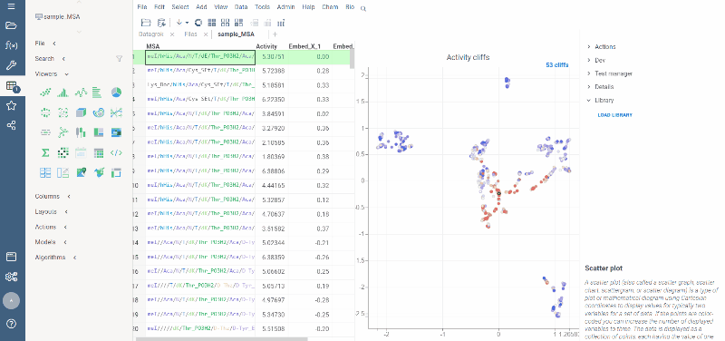

Ctrl+click on the line to select the corresponding sequences.

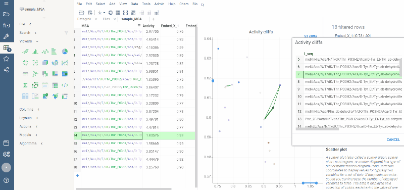

Marker color corresponds to activity, marker size and line opacity correspond to the SALI parameter (similarity/activity
difference relation).

### Quantitative sequence-based activity relationship analyses to enable design and optimization of polymer modalities

Out of the box, Datagrok provides a comprehensive [machine learning toolkit](../../learn/data-science.md) for
clustering, dimensionality reduction techniques, imputation, PCA/PLS, etc. Some of these tools could be directly applied
to the polymer modalities (for instance, by mapping monomers to features) and used for analyzing structure-property,
structure-activity, and sequence-activity relationships. Also, a number of tools have already been developed
specifically for polymer modalities.

One of such tools is the ["Peptides"](https://www.youtube.com/watch?v=HNSMSf2ZYsI&ab_channel=Datagrok) plugin. When a
user opens a dataset with sequences that resemble peptides, the platform recognizes it, renders the sequences in a
specific way in the spreadsheet, and suggests launching an analysis of the dataset. Upon launching, the UI switches to a
fit-for purpose peptide analysis mode for efficient exploration of the peptide space, allowing the following:

* Interactively filter the dataset based on the monomer, position, or any other attribute
* Analyze differences in activity distribution for groups of peptides
* On-the-fly calculation of statistical significance of differences of value distributions between groups
* Analyze the peptide space (UMAP based on distance, color-coded by activity)
* Automatically identify most potent monomer/positions

We are developing tools that account for the steric and surface features of macromolecules, calculations to support the
knowledge on their properties, homology, toxicity.

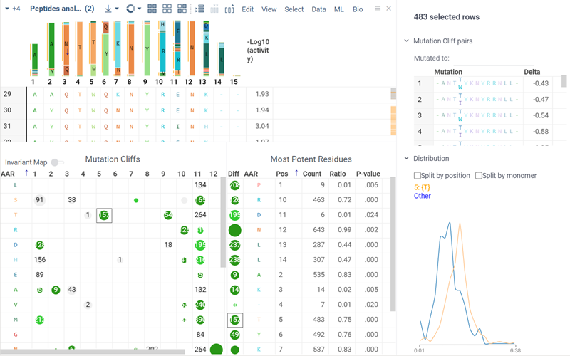

See [Peptides plugin](https://public.datagrok.ai/apps/Peptides) in action

### Predictive models

In addition to the [built-in predictive modeling capabilities](../../learn/predictive-modeling.md) (including
cheminformatics-specific ones, such as chemprop), it is easy to connect to external predictive models that are deployed
as web services. Two big pharmaceutical companies have already done that.

The integration could be done in a several ways:

* Automatic ingestion of the [OpenAPI/Swagger](../../access/open-api.md) service definition
* Developing a wrapper [function](../../compute/compute.md) in JavaScript, Python, R, or Matlab

Once a model is converted to a Datagrok function, there are multiple ways to expose it to users:

* Develop a Datagrok application that would orchestrate everything (such as the “sketch-to-predict” interactive app)
* Leverage Datagrok’s [data augmentation](../../discover/data-augmentation.md). For instance, in this case, a user will
  see the predictions when he clicks on a cell containing the macromolecule (similarly to
  how [predictions and information panels for small molecules](../../discover/data-augmentation.md#info-panels)

See also: [Scientific computing in Datagrok](https://github.com/datagrok-ai/public/blob/master/help/compute/compute.md)

### Connectivity

For data retrieval, Datagrok offers high-performance, manageable [connectors](../../access/data-connection.md) to all
popular relational databases. The built-in spreadsheet is designed
for [interactive analysis](../../visualize/viewers.md) of vast amounts of scientific data. The system could be extended
with plugins that provide support for cheminformatics/bioinformatics, or for custom cell renderers for molecules,
sequences, or dose-response curves.

See the [joint Datagrok/Novartis demo](https://vimeo.com/548606688/f2dd6e5c0a) for more details and a real-world use
case (the second part describes Novartis’ system built on top of Datagrok).
