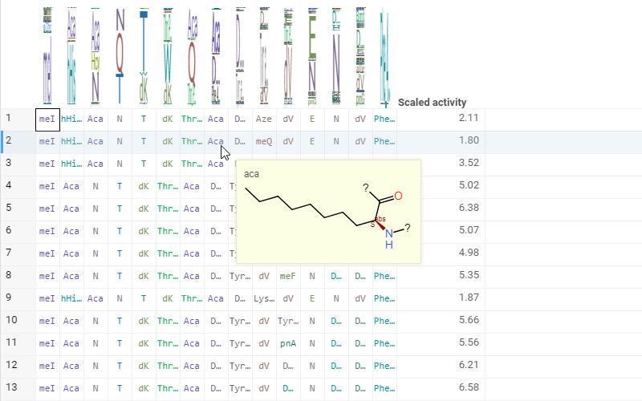
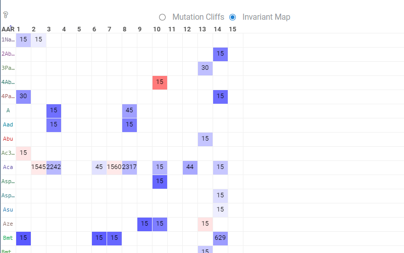
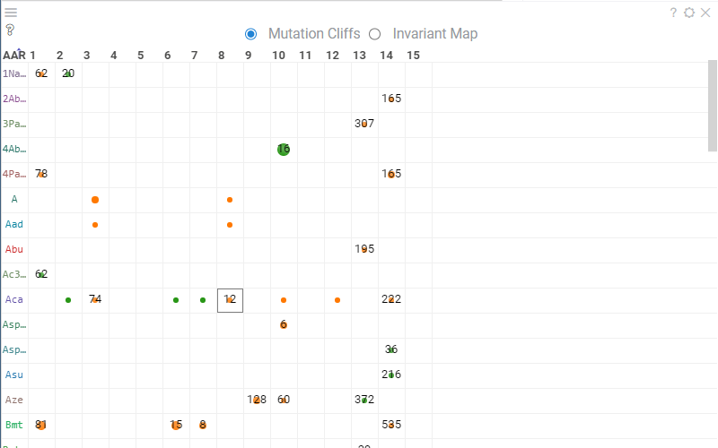

Datagrok enables performing SAR analysis with the Peptides package. "Peptides" is a Datagrok feature that aims to deal
with peptide sequences and associated activities. From the computational and analytical point of view, peptides are
considered as an intermediate case between small molecules and large proteins and thus the combination of different
analytical methods has to be used with adequate precautions.

Datagrok detects such sequences in a table provided so there is no need to run an application to use it. If such
sequence is detected it will be rendered in the way of amino acid residues classification highlighting
hydrophobic/hydrophilic regions:

Any dataset containing macromolecules and activities is plausible for SAR analysis. To prepare for the analysis, click Bio -> SAR -> Peptpides...
The dialog with analysis options will appear. In this dialog, you can preview the composition analysis of the chosen sequences rendered with WebLogo.
The other essential column for SAR analysis is the activity column. It's common to use a logarithm for SAR analysis, so you can set scaling for the activity. The distribution of the activity that will be used for analysis is shown next to the activity input.

Additionally, you can choose a clusters column to get additional insights from macromolecule clusters. Also, it is common to have multiple targets in a single dataset. In this case, you can set the target column.

Once the options are set, you can hit the OK button to start the analysis.

## Analysis View

Analysis view consists of 4 main parts: the table view containing sequences and activities, as well as composition analysis; the monomer-position viewer which can work in two modes: Mutation Cliffs and Invariant Map; the most potent residues viewer, which shows the most potent monomers for each position; logo summary table is shown in case you chose the clusters column, which describes the clusters with WebLogo, activity distribution and other useful statistics.

## Table view

The default table view contains a set of columns corresponding to the positions of sequences and a scaled activity column.

### Monomer structure rendering

The position columns contain monomers at that positions and render the monomers according to amino acid residues classification highlighting hydrophobic/hydrophilic regions. You can hover over any cell with a monomer and the tooltip with its structure will pop up. The structure for non-natural amino acid residues is provided with a monomer library. More about the monomer library can be found here.

### Composition analysis

Each of the positions columns has a composition analysis for that position, which shows the proportion of the monomers at the position. You can hover over any monomer in WebLogo to see the distribution of activities for sequences that contain the corresponding monomer at that position, compared to the activity distribution of the rest of the sequences, and additional metrics such as the number of sequences containing a given monomer at the given position, the mean difference between corresponding activity distributions and p-value.

You can click on the monomer to select the rows that contain a given monomer at a given position. Shift+click will deselect the currently selected monomer-position if clicked on a previously selected monomer-position, or add to the selection if clicked on a new monomer-position. The selected monomer-position will be highlighted in composition analysis in the table view header, in the monomer-position viewer and in the most potent residues viewer.

## Monomer-Position viewer

Monomer-Position viewer is a matrix-like table that contains positions as columns and monomers as rows. This viewer can function in two modes: Mutation Cliffs and Invariant Map. You can switch between the modes by choosing the corresponding radio button at the viewer header. Just like with composition analysis in the table view header, you can hover over any cell to see the tooltip with activity distribution and statistics and select the sequences containing monomer-position by clicking the cells in mutation cliffs mode, or filter the table view by clicking the cells in invariant map mode.

### Mutation Cliffs mode

Mutation Cliffs mode shows the significance of the monomer position regarding activity with circles. The circle size corresponds to the mean difference between the sequences containing monomer-position vs. rest. The color intensity represents the p-value. Some of the cells contain the number of mutation cliffs corresponding to that position. Here it means the number of sequence pairs, where the given monomer-position is mutated with any other monomer. Additional options such as the maximum number of mutations or the minimum activity difference between two sequences can be set in settings. More about it is covered under the [settings](#settings) section.

If you chose the target column for the analysis, you can modify the target for which the mutation cliffs are computed in viewer properties.

### Invariant Map mode

Invariant Map in each cell represents the number of sequences that contain a given monomer-position and can be used for dataset filtering. The background color corresponds to the aggregated value of some numeric column - by default, it is set to be the average of scaled activity for a given monomer-position. You can modify the column and the aggregation function in viewer properties under the Invariant Map section.

## Most Potent Residues viewer

Most Potent Residues viewer shows the most significant monomer for each position and its statistics. The most significant monomer here is the one that minimizes the p-value while maximizing the mean difference. Same as the monomer-position viewer and composition analysis in the table view header, you can hover over the mean difference column in the viewer to see the tooltip with statistics and click to select the monomer-position.

## Logo Summary Table viewer

Logo Summary Table viewer is a table that contains information about the cluster such as cluster name, number of members of the cluster, cluster WebLogo and activity distribution in comparison with the rest of the data, as well as useful cluster statistics such as p-value and mean difference.

You can set the WebLogo rendering mode and members ratio threshold in viewer properties. WebLogo rendering mode can be either full-height or entropy (default to entropy), more about WebLogo you can learn [here](https://github.com/datagrok-ai/public/tree/master/packages/Bio#web-logo). The member ratio threshold filters out the clusters that have a ratio of the number of members below the threshold, relative to the cluster with the most of the members, the value defaults to 0.3 (meaning clusters, that have less than 30% of the members, relative to the cluster with the highest amount of members).

Same as other viewers, you can hover over the Clusters column to see the tooltip with the distribution and statistics of that cluster and click to select the cluster.

## Interactivity

When selecting or filtering rows with any of the analysis viewers, the property panel gets updated according to the selection. There are three main sections in the property panel: actions, mutation cliff pairs and distribution.

### Actions

The Actions panel allows creating a new cluster, removing a custom cluster or creating a new view.
Choosing "New cluster", the new cluster will be created from the intersection of applied filtering and selection and added to the logo summary table. You can also delete a custom cluster by selecting the custom cluster and hitting "Remove cluster". The "New view" button will create a new view, containing only the rows that are in the intersection of applied filtering and selection, and add a Logo Summary Table specifically for that view.

### Mutation Cliffs pairs

The Mutation Cliffs pairs panel is the table with the sequence pairs, rendered as differences and activity differences of the sequence pair. You can input a monomer in the "Mutated to" field to filter the sequence pair, leaving only the ones, that contain the given monomer in the mutated sequence in any of the mutations.

### Distribution

The Distribution panel shows the distribution of the activities of selected sequences compared to the rest of the data and statistics such as the number of selected sequences, ratio, mean difference and p-value.

If you have multiple monomer-positions selected, you can split the panel by monomer or position which will result in separate distributions and statistics for each of the monomers or positions.

## Settings

Analysis settings can be found in the top menu by clicking the wrench icon. The settings contain four sections: general, viewers, mutation cliffs, and columns.

### General

In the General section, you can change the activity scaling method or enable bidirectional analysis. Bidirectional analysis will modify the coloring of circles monomer-position's mutation cliffs mode and most potent residues viewers. If the corresponding mean difference is negative, the circle will be colored orange, if positive it will be rendered green.

### Viewers

The Viewers section allows adding and removing additional viewers. Currently, Dendrogram is supported which performs hierarchical clustering on the sequences and creates a viewer. This viewer can also be used for selection.

### Mutation Cliffs

The Mutation Cliffs section allows setting maximum mutations and minimum activity delta parameters for Mutation Cliffs calculations. Maximum mutations are the maximum amount of different monomer-positions in the sequences. Sequences that have more mutations will not be considered. Minimum activity delta is the minimum difference in the activity that a pair of sequences should have to be considered.

### Columns

The Columns section lists all the numeric columns in the dataset, except activity, and allows to apply an aggregation function to them. Aggregated column values will be added to all the tooltips with statistics, as a Logo Summary Table column and in the Distribution panel.

## Analysis sharing

Datagrok allows saving any view as a project and sharing it with other users of the platform. Peptide analysis also supports saving and sharing. More about project saving and sharing you can find [here](../../datagrok/project.md).
