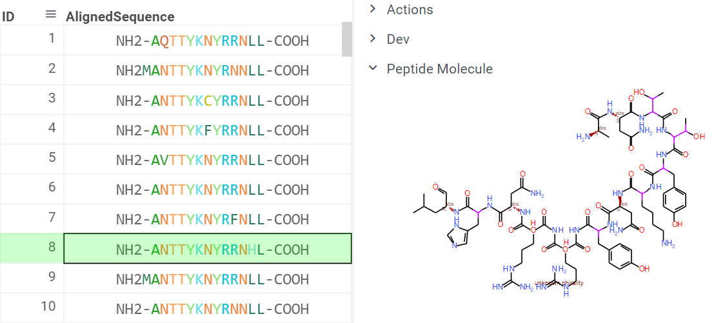
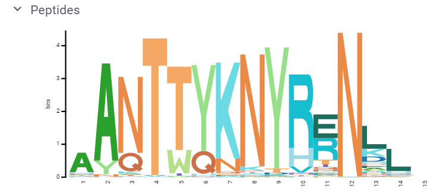
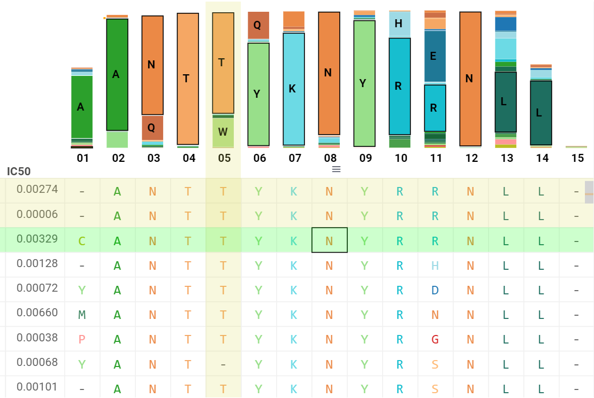

<!-- TITLE: Peptide sequences -->
<!-- SUBTITLE: -->

# Exploring peptides

"Peptides" is a Datagrok feature which aims to deal with peptide sequences and associated activities. From the
computational and analytical point of view peptides are considered as an intermediate case between small molecules and
large proteins and thus the combination of different analytical methods has to be used with adequate precautions.

Datagrok detects such sequences in a table provided so there is no need to run an application to use it. If such
sequence is detected it will be rendered in the way of amino acid residues classification highlighting
hydrophobic/hydrophilic regions and will generate a structure:

By clicking the column with peptide sequences the property panel will appear to provide options for the following
analysis. The composition analysis for the whole dataset is also present in property panel:

To perform sequence-activity analysis for the dataset choose the column with associated activities. In some cases, the
value of activity has to be transformed which could change drastically the analysis results. Log and -log
transformations are usually used for concentration activities. To facilitate the interpretation of analysis result the
sequences are replaced by alignment table:

The analysis results are presented as a table with residuals in the rows and positions in columns. Here the
pairs [position, monomer] could be investigated to yield in activity difference with the whole dataset. Points in the
results table show the mean difference in activity of subset with selected [position, monomer] and all other molecules.
This difference is shown as a size of the point. The color of point responds to significance level of such difference.
One may estimate this difference by comparing densities which are shown in property panel:

